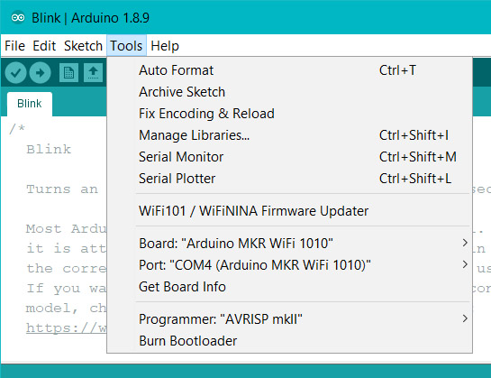
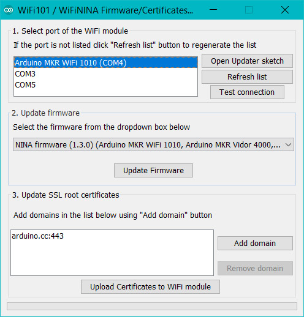
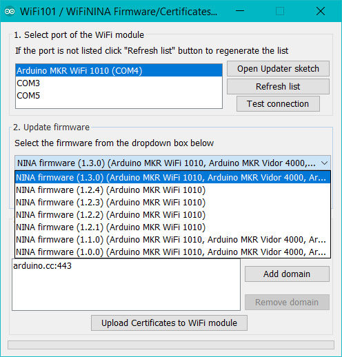
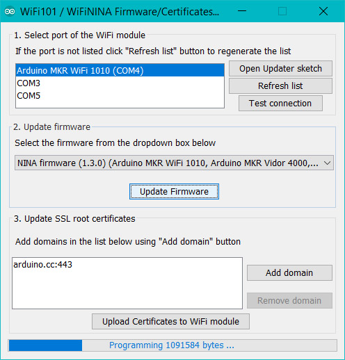
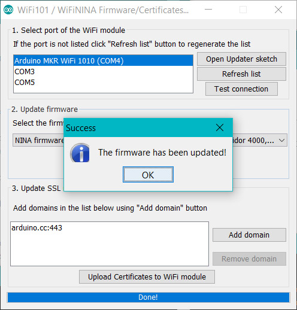
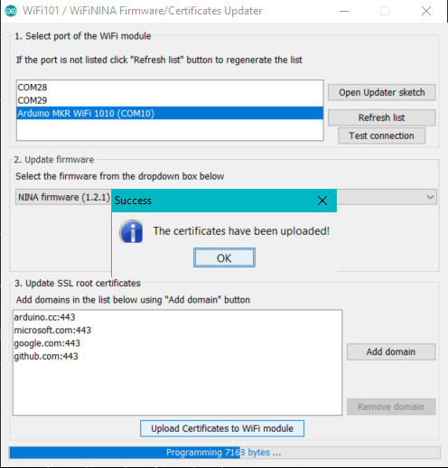

This tutorial will guide you in the process of updating the firmware or loading certificates on your board based on the u-blox NINA module.

If the [Check WiFiNINA Firmware Version](https://arduino.cc/en/Tutorial/CheckWiFiNINAFirmwareVersion) tells you that you may have issues because the firmware and library versions do not match, here is the solution to align them.

## Hardware required

- u-blox NINA module based board

## Circuit

The board should be connected to the USB port of the computer ready with Arduino Software (IDE) 1.6.10 or later.

## Firmware update procedure

To simplify the process, we have prepared a specific sketch - this *FirmwareUpdater* - that you must load on the host board and an easy to use plug-in available in Arduino Software (IDE) 1.6.10 onwards.

The "FirmwareUpdater" sketch is available in **Examples -> WiFiNINA -> Tools** or it can be opened directly from the Firmware Uploader plug-in that you find under Tools.

Click on the **Open Updater Sketch** button to load the sketch and upload it to the NINA based board you want to update.

Please select your board from the list in the top part of the interface; if the board is not present in the list, use the **refresh** button.

In the central part of the plug-in interface you find the list of available firmwares. You will see only the firmwares compatible with your board.

Press on the **Update Firmware** to initiate the process. The bottom bar will show you the progress of the whole procedure.

At the end of the update process, a pop up will confirm the successful update.

## Certificate uploading

With the same procedure, you may load root certificates on the WiFi module to access securely specific websites. Your board must be running the **FirmwareUpdater** sketch to work .The root certificates are issued by a limited number of certification authorities, but it is difficult to know which site is using which authority. To ease your life, we allow you to specify directly the URL to which you need to connect securely, leaving to us the task to download the root certificate.

The list you are building is not saved from one session to the next one. It might happen that a few websites share the same root certificate. You don't have to worry about this as we take care of it. The space available on your WiFi module to store the certificates is limited to around 10 certificates that, being issued by a limited number of authorities, should be more than enough for the average projects.

The procedure starts connecting your board to your computer and selecting it from the Tools menu of the Arduino Software (IDE). Load the FirmwareUpdater sketch from Examples -> WiFiNINA -> Tools on the board, launch the **Firmware Updater** and go to the third section of the interface.

There you find on the left an empty list and on the right the buttons to add or remove the URL from which you want to download the root certificates. The URL should be exactly the one to which you need to connect. Add all the websites' URLs needed and then proceed with the uploading process. Please remember that you erase all the existing certificates when you load a new set.
Press the ''Upload Certificates to WiFi module" and wait for the confirmation message.

## Conclusion

In this tutorial we have learned how to use the Firmware updater / Certificate uploader tool for Wi-Fi boards using the u-blox NINA module.