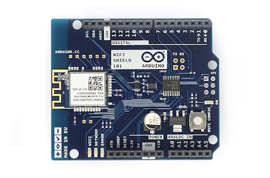
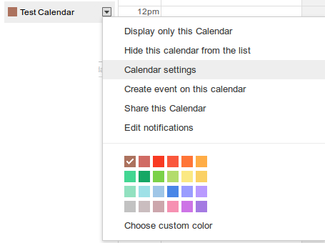
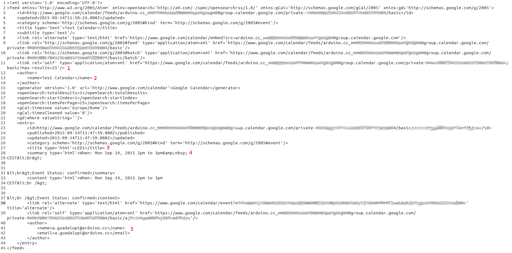

## Google Calendar Actions Planner

This example shows you how to make repeated HTTP requests using a WiFi shield 101.  It connects to  a given Google Calendar. The content of the page is downloaded and parsed in order to extract commands from the event title and planning actions to be executed at a given time.

This example is written for a network using WPA encryption. For  WEP or WPA, change the Wifi101.begin() call accordingly.

I this particular example if an event called **LED1** is added to the specified calendar, the built-in led on pin 13 will be on for the from-to time specified in the event.

## Hardware Required

- Arduino WiFi Shield 101

- Arduino Zero board

## Circuit

The circuit simply consist of an Arduino WiFi shield stacked in top of an Arduino  Zero Board.



## Code

First of all to have a working code you need to follow these steps:

### Create a Calendar

To create a Calendar account, go to [Google Calendar](https://www.google.com/calendar) and log in using your Google account email and password. (If you don't have a Google account, click the **Create an account now** link.)

### Find Your Calendar Feed URL

There are a variety of different URLs you can use to request feeds from a calendar, but the simplest feed URL to use is that of the calendar's read-only so-called **magic cookie** private feed, because that URL doesn't require authentication.

To find your calendar's **magic cookie** feed URL:

- In the list of calendars on the left side of the page, find the calendar you want to interact with. You can create a new calendar for this purpose if you want to.

- Click the arrow button to the right of the calendar. Select "Calendar settings" from the drop-down menu.



- Scroll down to the Private Address section. There are two buttons: select the XML button. The feed URL appears.


- Copy the URL. This is the URL of your calendar's read-only **magic cookie** private feed.

The feed URL has the following form:

[http://www.google.com/calendar/feeds/userID/private-magicCookie/basic](http://www.google.com/calendar/feeds/userID/private-magicCookie/basic)

- Copy and paste the part of the URL */calendar/feeds/userID/private-magicCookie/basic* in the **magicCookie variable** of the sketch.

### Connect to Your Wi-Fi Network

- Write in the **ssid variable** your network name.

- Write in the **pass variable** your network password.

### Write months name in your language

Please note that the calendar works downloading data in your language, so for the date parsing the name of the months must be written in your language in the variable months in the following way:

```arduino
String months[12] = {"jan", "feb", "mar", "apr", "may", "jun", "jul", "aug", "sep", "oct", "nov", "dec"}; // put the months name in your language here please
```

### XML Data Received

If you look at the data received using the magic cookie link (using for example [Postman](https://www.getpostman.com/) or a [cURL](http://curl.haxx.se/docs/manpage.html) command) you obtain something like:



From these data we can extract the following information:

- 1) At maximum 25 events will be showed. This is not a modifiable parameter. 25 events centred along the today date will be downloaded in any case both in the past and in the future;

- 2) The name of the downloaded calendar (not used in the code);

- 3) The name of the event: each event has as boundary the string `<title type='html'>` on its *left* and `</title>` on its *right*. These two strings are used in the event extraction parsing;

- 4) The time in which the event is valid: each event that **lasts a single day** has a boundary `<summary type='html'>` xxx:  on its *left* where xxx it's the word *When* in the language of the calendar and the string **&....** on its *right*. The character **:** and **&** are so used to extract the event duration;

- 5) The name of the event's author (not used in the code).

### Code Explanation

The sketch is based on the **Client Repeating** and **WiFiUdpNtpClient** example. In particular the http request is repeated with a repeating time specified by two variables:

- **int refreshTime** that specifies the time quantity.

- **char refreshType** that specifies if the refresh must be executed every refreshTime hours (*refreshType = 'h' *) or every refreshTime minutes (*refreshType = 'm' *);

For what concern the  **WiFiUdpNtpClient** example, it is used in order to get the UNIX epoch and using the **time.h** and **RTCZero** library, configure the built-in RTC in the Arduino Zero board.

**readLinuxEpochUsingNetworkTimeProtocol:**
This functions asks for the UNIX time and returns the obtained epoch.

**setRealTimeClock(uint32_t epoch):**
This function uses the parameter epoch to set the Arduino Zero's RTC. In order to set the **hours** in the right way the variable **const int GMT** must be set according to your time zone.

**checkCalendarRefresh(int howMany, char when):**
This functions polls the Arduino Zero's RTC and checks if it's time to make the http request needed to refresh the downloaded calendar information according to the parameters.

**extractEvents():**
This function is used to remove all the useless information from the downloaded XML content. Every time an event content is detected the function **interpretEvent(String event)** is called.

**interpretEvent(String event):**
This function is used **event title** and the **event duration**  in order to understand if the event is a command and if has to be executed calling the function **'extractHowLong(String whenFromTo, String command)**.

```arduino

/*

  Google Calendar Actions Planner

  This sketch connects to Gogole Calendar, makes a HTTP request and downloads the day events.Comparing the actual time with the one of the events actions can be programmed.

  using an Arduino Wifi shield 101 and Arduino Zero.

  created 08 Sept 2015

  by Arturo Guadalupi <a.guadalupi@arduino.cc>

  https://www.arduino.cc/en/Tutorial/GoogleCalendarWiFi101

  This code is in the public domain.

  Information about google APIs and hnow to make HTTP requests can be found at : http://www.udel.edu/CIS/software/dist/google/calendar/java.client/gdata/doc/calendar.html#Feeds

*/

#include <SPI.h>
#include <WiFi101.h>
#include <WiFiUdp.h>
#include <RTCZero.h>
#include <time.h>

// Create an rtc object

RTCZero rtc;

#include "arduino_secrets.h"
///////please enter your sensitive data in the Secret tab/arduino_secrets.h
char ssid[] = SECRET_SSID;        // your network SSID (name)
char pass[] = SECRET_PASS;    // your network password (use for WPA, or use as key for WEP)
int keyIndex = 0;            // your network key Index number (needed only for WEP)

int status = WL_IDLE_STATUS;

// Initialize the Wifi client library

WiFiClient client;

// server address:
char server[] = "www.google.com";

// google magic cookie: replace your calendar private address here
char magicCookie[] = "magicCookie";

// Used for NTP
unsigned int localPort = 2390;      // local port to listen for UDP packets

IPAddress timeServer(129, 6, 15, 28); // time.nist.gov NTP server

const int NTP_PACKET_SIZE = 48; // NTP time stamp is in the first 48 bytes of the message
byte packetBuffer[ NTP_PACKET_SIZE]; //buffer to hold incoming and outgoing packets

WiFiUDP Udp; // A UDP instance to let us send and receive packets over UDP

// Data used for time

const int refreshTime = 1;

String months[12] = {"jan", "feb", "mar", "apr", "may", "jun", "jul", "aug", "sep", "oct", "nov", "dec"}; // put the months name in your language here please

const char refreshType = 'm'; // refresh every refreshTime minutes
//const char refreshType = 'h'; // refresh every refreshTime hours

const int GMT = 2; //change this to adapt it to your time zone
int lastHours, lastMinutes, lastSeconds;

// Commands that can be interpreted*/
char cmd1[] = "LED1";

// string used for the commands parsing

String clientBufferString = "";

void setup() {

  // Initialize serial and wait for port to open:

  Serial.begin(115200);

  while (!Serial);// wait for serial port to connect. Needed for Leonardo only

  // check for the presence of the shield:

  if (WiFi.status() == WL_NO_SHIELD) {

    Serial.println("WiFi shield not present");

    // don't continue:

    while (true);

  }

  // attempt to connect to Wifi network:

  while ( status != WL_CONNECTED) {

    Serial.print("Attempting to connect to SSID: ");

    Serial.println(ssid);

    // Connect to WPA/WPA2 network. Change this line if using open or WEP network:

    status = WiFi.begin(ssid, pass);

    // wait 10 seconds for connection:

    delay(10000);

  }

  // you're connected now, so print out the status:

  printWifiStatus();

  rtc.begin(); // start the RTC in 24 hours mode

  unsigned long epoch = readLinuxEpochUsingNetworkTimeProtocol();

  setRealTimeClock(epoch);

  // print the current time reading values from the RTC

  printTime(rtc.getHours(), rtc.getMinutes(), rtc.getSeconds());

  // ask for data to google calendar

  httpRequest();
}

void loop() {

  int i = 0;

  bool start = false;

  clientBufferString = "";

  checkCalendarRefresh(refreshTime, refreshType);

  if (client.available())

  {

    while (client.available())

    {

      char c = client.read();

      if (c == '<') //useful data starts from '<'

        start = true;

      if (start && isPrintable(c)) // if useful data start and significant data is received

        clientBufferString += c;   // add it to the buffer

    }

    extractEvents();

  }
}

unsigned long readLinuxEpochUsingNetworkTimeProtocol()
{

  unsigned long epoch;

  Udp.begin(localPort);

  sendNTPpacket(timeServer); // send an NTP packet to a time server

  // wait to see if a reply is available

  delay(1000);

  if ( Udp.parsePacket() ) {

    Serial.println("NTP time received");

    // We've received a packet, read the data from it

    Udp.read(packetBuffer, NTP_PACKET_SIZE); // read the packet into the buffer

    //the timestamp starts at byte 40 of the received packet and is four bytes,

    // or two words, long. First, esxtract the two words:

    unsigned long highWord = word(packetBuffer[40], packetBuffer[41]);

    unsigned long lowWord = word(packetBuffer[42], packetBuffer[43]);

    // combine the four bytes (two words) into a long integer

    // this is NTP time (seconds since Jan 1 1900):

    unsigned long secsSince1900 = highWord << 16 | lowWord;

    // now convert NTP time into everyday time:

    // Unix time starts on Jan 1 1970. In seconds, that's 2208988800:

    const unsigned long seventyYears = 2208988800UL;

    // subtract seventy years:

    epoch = secsSince1900 - seventyYears;

  }

  Udp.stop();

  return epoch;
}

// this function computes the current date and time to set the RTC using the time.h library
void setRealTimeClock(uint32_t epoch)
{

  time_t rawtime;

  struct tm * timeinfo;

  rawtime = (time_t) epoch;

  timeinfo = localtime (&rawtime);

  Serial.println ("Current local time and date");

  Serial.print(asctime(timeinfo));

  rtc.setSeconds(timeinfo->tm_sec);

  rtc.setMinutes(timeinfo->tm_min);

  rtc.setHours((timeinfo->tm_hour) + GMT);

  rtc.setDay(timeinfo->tm_mday);

  rtc.setMonth((timeinfo->tm_mon) + 1); //tm_mon months since January - [ 0 to 11 ]

  rtc.setYear((timeinfo->tm_year) - 100); //tm_year years since 1900 and format is yy
}

// this function checks if the calendar has to be refreshed
void checkCalendarRefresh(int howMany, char when)
{

  if (when == 'h')

  {

    if (rtc.getHours() >= (lastHours + howMany))

      refresh();

  }

  else if (when == 'm')

  {

    if (rtc.getMinutes() >= (lastMinutes + howMany) || (lastMinutes + howMany >= 60))

    {

      refresh();

    }

    delay(1000);

    // print the current time

    printTime(rtc.getHours(), rtc.getMinutes(), rtc.getSeconds());

  }
}

// this function refreshes the calendar
void refresh()
{

  lastHours = rtc.getHours();

  lastMinutes = rtc.getMinutes();

  lastSeconds = rtc.getSeconds();

  printTime(lastHours, lastMinutes, lastSeconds);

  httpRequest();
}

/* this function makes a HTTP connection to the server: */
void httpRequest()
{

  // close any connection before send a new request.

  // This will free the socket on the WiFi shield

  client.stop();

  // if there's a successful connection:

  if (client.connect(server, 80)) {

    Serial.println("connecting...");

    // send the HTTP PUT request:

    client.print("GET ");

    client.print(magicCookie);

    client.println(" HTTP/1.0");

    client.println("Connection: close");

    client.println();

  }

  else {

    // if you couldn't make a connection:

    Serial.println("connection failed");

  }
}

// this function is used to parse the different events
void extractEvents()
{

  // first consider all the available events and trim them

  unsigned int index1 = clientBufferString.indexOf("<title type='html'>");

  unsigned index2 = clientBufferString.lastIndexOf(";");

  clientBufferString = clientBufferString.substring(index1, index2); //remove uneseful information

  int i = 1;

  while (clientBufferString != "")

  {

    index1 = clientBufferString.indexOf("<title type='html'>");

    if (i != 1) //if is not the first event remove other useless data

    {

      clientBufferString.remove(0, index1);

      index1 = clientBufferString.indexOf("<title type='html'>");

    }

    index2 = clientBufferString.indexOf("&");

    String event = clientBufferString.substring(index1, index2);

    if (event != "")

    {

      /*Serial.print("EVENT #");

        Serial.print(i);

        Serial.print(": ");

        Serial.println(event);*/ // uncomment to debug

      interpretEvent(event);

      i++;

    }

    clientBufferString.remove(0, event.length());

  }

  /*Serial.println("TOTAL # EVENTS:");

    Serial.println(i);*/ // uncomment to debug
}

// this function is used to interpret the commands in the event title
void interpretEvent(String event)
{

  int index1 = event.indexOf("<title type='html'>") + strlen("<title type='html'>");

  int index2 = event.indexOf("</title>");

  String title = event.substring(index1, index2);

  index2 = event.indexOf(":");// remove useless data

  event.remove(0, index2 + strlen(": ddd "));// for the next step: after the when there is ": ddd " where "ddd" indicate 3 letter of the day of the weeek

  Serial.println("Title:");

  Serial.println(title);

  Serial.println();

  Serial.println("When and from to:");

  Serial.println(event);

  Serial.println();

  extractHowLong(event, title);
}

// this function executes the command from to
void extractHowLong(String whenFromTo, String command)
{

  char duratio[whenFromTo.length()];

  sprintf(duratio, whenFromTo.c_str());

  int day, month, year, fromHours, fromMinutes, toHours, toMinutes;

  char monthString[4];

  sscanf(duratio, "%d %s %d %d:%d%*s%d:%d", &day, monthString, &year, &fromHours, &fromMinutes, &toHours, &toMinutes);

  month = monthToInt(monthString);

  //Serial.println(day);

  //Serial.println(monthString);

  //Serial.println(year);

  //Serial.println(fromHours);

  //Serial.println(fromMinutes);

  //Serial.println(toHours);

  //Serial.println(toMinutes); //uncomment to debug

  if (rtc.getYear() == year - 2000) // if the year is correct

  {

    /*Serial.print("Valid year: ");

      Serial.println(year - 2000);*/

    if (rtc.getMonth() == month) // if the month is correct

    {

      /*Serial.print("Valid month: ");

        Serial.println(year - 2000);*/

      if (rtc.getDay() == day) // if the day is correct

      {

        /*Serial.print("Valid day: ");

          Serial.println(day);*/

        if (((rtc.getHours() >= fromHours) && (rtc.getMinutes() >=  fromMinutes)) || ((toHours >= rtc.getHours()) && (toMinutes > rtc.getMinutes()))) // if the execution time is valid

        {

          decodeCommand(command, true);

        }

        else

        {

          decodeCommand(command, false);

        }

      }

    }

  }
}

// this function converts the month string in the corresponding number
int monthToInt(String month)
{

  for (int i = 0; i < 12; i++)

    if (month == months[i])

      return i + 1;
}

// this function dedoded the different commands
void decodeCommand(String command, bool validTime)
{

  if (command == cmd1)

  {

    Serial.println();

    Serial.print("Known command detected: ");

    Serial.println(cmd1);

    if (validTime)

    {

      Serial.println();

      Serial.println("Valid time");

      pinMode(13, OUTPUT);

      digitalWrite(13, HIGH);

      Serial.println();

    }

    else

    {

      Serial.println();

      Serial.println("Invalid time");

      pinMode(13, INPUT);

    }

  }
}

// this function prints the current time
void printTime(int hours, int minutes, int seconds)
{

  // print the hour, minute and second:

  Serial.print(rtc.getDay());

  Serial.print("/");

  Serial.print(rtc.getMonth());

  Serial.print("/");

  Serial.print(rtc.getYear());

  Serial.print(" ");

  Serial.print(hours); // print the hour

  Serial.print(':');

  if (minutes < 10 ) {

    // In the first 10 minutes of each hour, we'll want a leading '0'

    Serial.print('0');

  }

  Serial.print(minutes); // print the minute

  Serial.print(':');

  if (seconds < 10 ) {

    // In the first 10 seconds of each minute, we'll want a leading '0'

    Serial.print('0');

  }

  Serial.println(seconds); // print the second
}
// send an NTP request to the time server at the given address
unsigned long sendNTPpacket(IPAddress & address)
{

  //Serial.println("1");

  // set all bytes in the buffer to 0

  memset(packetBuffer, 0, NTP_PACKET_SIZE);

  // Initialize values needed to form NTP request

  // (see URL above for details on the packets)

  //Serial.println("2");

  packetBuffer[0] = 0b11100011;   // LI, Version, Mode

  packetBuffer[1] = 0;     // Stratum, or type of clock

  packetBuffer[2] = 6;     // Polling Interval

  packetBuffer[3] = 0xEC;  // Peer Clock Precision

  // 8 bytes of zero for Root Delay & Root Dispersion

  packetBuffer[12]  = 49;

  packetBuffer[13]  = 0x4E;

  packetBuffer[14]  = 49;

  packetBuffer[15]  = 52;

  //Serial.println("3");

  // all NTP fields have been given values, now

  // you can send a packet requesting a timestamp:

  Udp.beginPacket(address, 123); //NTP requests are to port 123

  Udp.write(packetBuffer, NTP_PACKET_SIZE);

  Udp.endPacket();
}

void printWifiStatus() {

  // print the SSID of the network you're attached to:

  Serial.print("SSID: ");

  Serial.println(WiFi.SSID());

  // print your WiFi shield's IP address:

  IPAddress ip = WiFi.localIP();

  Serial.print("IP Address: ");

  Serial.println(ip);

  // print the received signal strength:

  long rssi = WiFi.RSSI();

  Serial.print("signal strength (RSSI):");

  Serial.print(rssi);

  Serial.println(" dBm");
}
```

