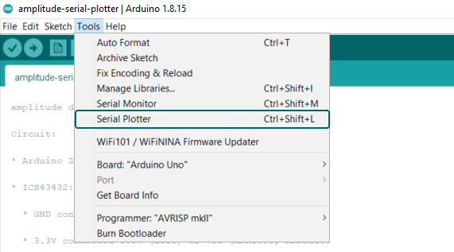
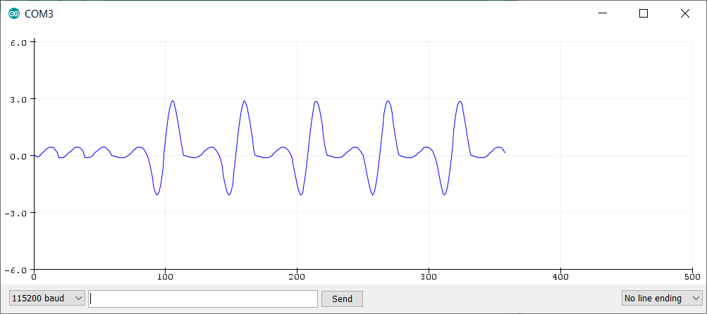

## Introduction
This example reads audio data from an Invensense's ICS43432I2S microphone breakout board, and prints out the amplitude to the Serial console. The Serial Plotter built into the Arduino IDE can be used to plot the audio amplitude data.

## Goals

- How to use and read audio data.
- How to use the Serial Plotter.

## Hardware & Software Needed

- [Arduino Zero](https://store.arduino.cc/arduino-zero), [MKRZero](https://store.arduino.cc/arduino-mkr-zero-i2s-bus-sd-for-sound-music-digital-audio-data?queryID=undefined)  or [MKR1000](https://store.arduino.cc/arduino-mkr1000-wifi-with-headers-mounted) Board

- Invensense's ICS43432I2S microphone
- Arduino IDE [offline](https://www.arduino.cc/en/main/software) (No Serial Plotter support for IDE 2 and Arduino editor).
- [ArduinoSound Library](https://www.arduino.cc/en/Reference/ArduinoSound)
- Jumper wires
- Breadboard


## Circuit


## How to Use the Serial Plotter
The Arduino Serial Plotter is a tool available in the Arduino IDE that takes incoming serial data and can visualize the data in a plot in real-time.

Make sure that your Arduino is connected to your computer via USB, then open the serial plotter by navigating to **Tools > Serial Plotter**





## Programming the Board


**1.** First, let's make sure we have correct the drivers installed. If we are using the Web Editor, we do not need to install anything. If we are using an offline editor, we need to install it manually. This can be done by navigating to **Tools > Board > Board Manager...**. Here we need to look for the **Arduino SAMD boards (32-bits ARM Cortex M0+)** and install it. 

**2.** Now, we need to install the libraries needed. Simply go to **Tools > Manage libraries...** and search for **ArduinoSound** and install it.


The sketch can be found in the snippet below. Upload the sketch to the board.


## Code

```arduino

/*

 This example reads audio data from an Invensense's ICS43432 I2S microphone

 breakout board, and prints out the amplitude to the Serial console. The

 Serial Plotter built into the Arduino IDE can be used to plot the audio

 amplitude data (Tools -> Serial Plotter)

 Circuit:

 * Arduino Zero, MKRZero or MKR1000 board

 * ICS43432:

   * GND connected GND

   * 3.3V connected 3.3V (Zero) or VCC (MKR1000, MKRZero)

   * WS connected to pin 0 (Zero) or pin 3 (MKR1000, MKRZero)

   * CLK connected to pin 1 (Zero) or pin 2 (MKR1000, MKRZero)

   * SD connected to pin 9 (Zero) or pin A6 (MKR1000, MKRZero)

 created 23 November 2016

 by Sandeep Mistry

 */

#include <ArduinoSound.h>

// create an amplitude analyzer to be used with the I2S input

AmplitudeAnalyzer amplitudeAnalyzer;

void setup() {

  // Open serial communications and wait for port to open:

  // A baud rate of 115200 is used instead of 9600 for a faster data rate

  // on non-native USB ports

  Serial.begin(115200);

  while (!Serial) {

    ; // wait for serial port to connect. Needed for native USB port only

  }

  // setup the I2S audio input for 44.1 kHz with 32-bits per sample

  if (!AudioInI2S.begin(44100, 32)) {

    Serial.println("Failed to initialize I2S input!");

    while (1); // do nothing

  }

  // configure the I2S input as the input for the amplitude analyzer

  if (!amplitudeAnalyzer.input(AudioInI2S)) {

    Serial.println("Failed to set amplitude analyzer input!");

    while (1); // do nothing

  }
}

void loop() {

  // check if a new analysis is available

  if (amplitudeAnalyzer.available()) {

    // read the new amplitude

    int amplitude = amplitudeAnalyzer.read();

    // print out the amplititude to the serial monitor

    Serial.println(amplitude);

  }
}
```
## Testing It Out

After you have uploaded the code, start to make some noise! You should now be able to observe the amplitude of your input on the Serial Plotter.



### Troubleshoot

If the code is not working, there are some common issues we can troubleshoot:

- The microphone is not wired correctly.
- You have not installed the correct drivers.
- You have not installed the [ArduinoSound Library](https://www.arduino.cc/en/Reference/ArduinoSound).

## Conclusion

In this example, we have learned how to use the Serial Plotter to visualize amplitude using the [ArduinoSound Library](https://www.arduino.cc/en/Reference/ArduinoSound) and a microphone. 