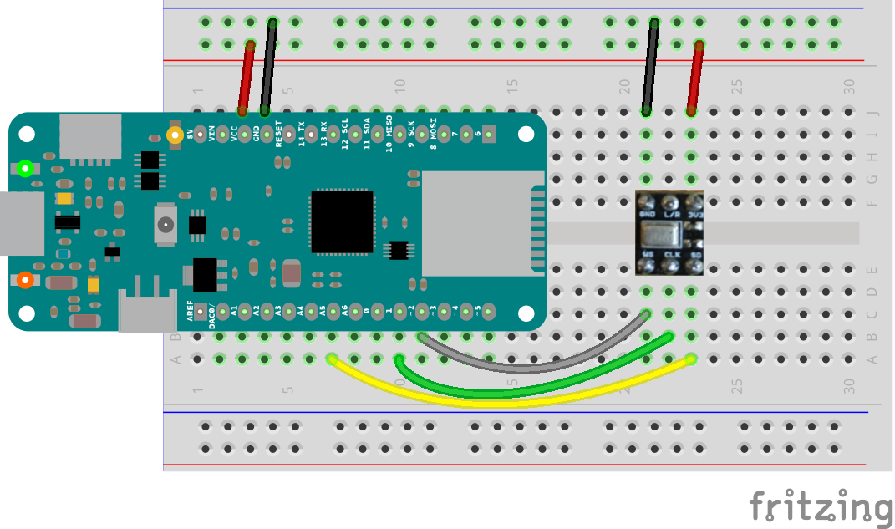

This example reads audio data from an Invensense ICS43432I2S microphone breakout board, and prints out the spectrum to the Serial console. The Serial Plotter built into the Arduino IDE can be used to plot the audio amplitude data (Serial Plotter Tools).

## Hardware Required

- [Arduino Zero](https://www.arduino.cc/en/Main/ArduinoBoardZero), [MKRZero](https://www.arduino.cc/en/Main/ArduinoBoardMKRZero)  or [MKR1000](https://www.arduino.cc/en/Main/ArduinoMKR1000) Board

- Invensense's ICS43432I2S microphone

## Circuit




## Code

```arduino

/*

 This example reads audio data from an Invensense's ICS43432 I2S microphone

 breakout board, and prints out the spectrum to the Serial console. The

 Serial Plotter built into the Arduino IDE can be used to plot the audio

 amplitude data (Tools -> Serial Plotter)

 Circuit:

 * Arduino Zero, MKRZero or MKR1000 board

 * ICS43432:

   * GND connected GND

   * 3.3V connected 3.3V (Zero) or VCC (MKR1000, MKRZero)

   * WS connected to pin 0 (Zero) or pin 3 (MKR1000, MKRZero)

   * CLK connected to pin 1 (Zero) or pin 2 (MKR1000, MKRZero)

   * SD connected to pin 9 (Zero) or pin A6 (MKR1000, MKRZero)

 created 21 November 2016

 by Sandeep Mistry

 */

#include <ArduinoSound.h>

// sample rate for the input

const int sampleRate = 8000;

// size of the FFT to compute

const int fftSize = 128;

// size of the spectrum output, half of FFT size

const int spectrumSize = fftSize / 2;

// array to store spectrum output
int spectrum[spectrumSize];

// create an FFT analyzer to be used with the I2S input

FFTAnalyzer fftAnalyzer(fftSize);

void setup() {
// Open serial communications and wait for port to open:

  // A baud rate of 115200 is used instead of 9600 for a faster data rate

  // on non-native USB ports

  Serial.begin(115200);

  while (!Serial) {

    ; // wait for serial port to connect. Needed for native USB port only

  }

  // setup the I2S audio input for the sample rate with 32-bits per sample

  if (!AudioInI2S.begin(sampleRate, 32)) {

    Serial.println("Failed to initialize I2S input!");

    while (1); // do nothing

  }

  // configure the I2S input as the input for the FFT analyzer

  if (!fftAnalyzer.input(AudioInI2S)) {

    Serial.println("Failed to set FFT analyzer input!");

    while (1); // do nothing

  }
}

void loop() {

  // check if a new analysis is available

  if (fftAnalyzer.available()) {

    // read the new spectrum

    fftAnalyzer.read(spectrum, spectrumSize);

    // print out the spectrum

    for (int i = 0; i < spectrumSize; i++) {

      Serial.print((i * sampleRate) / fftSize); // the starting frequency

      Serial.print("\t"); //

      Serial.println(spectrum[i]); // the spectrum value

    }

  }
}
```


*Last revision 2016/12/06 by AG*