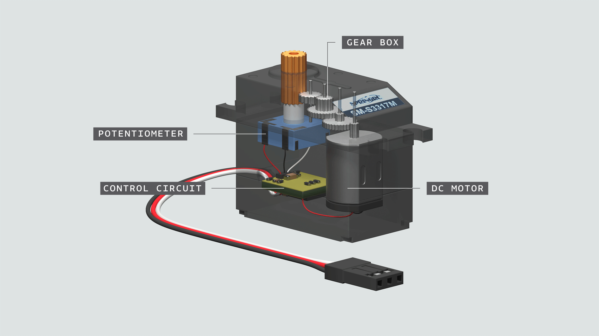
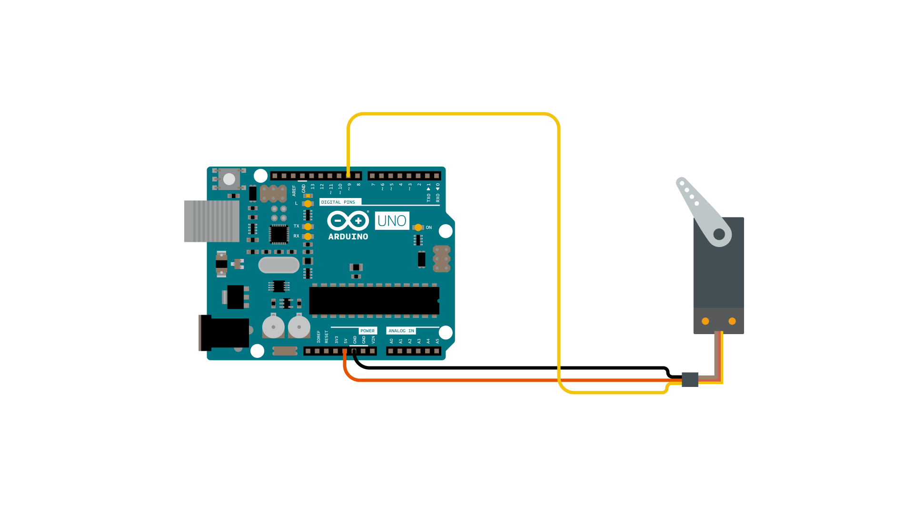
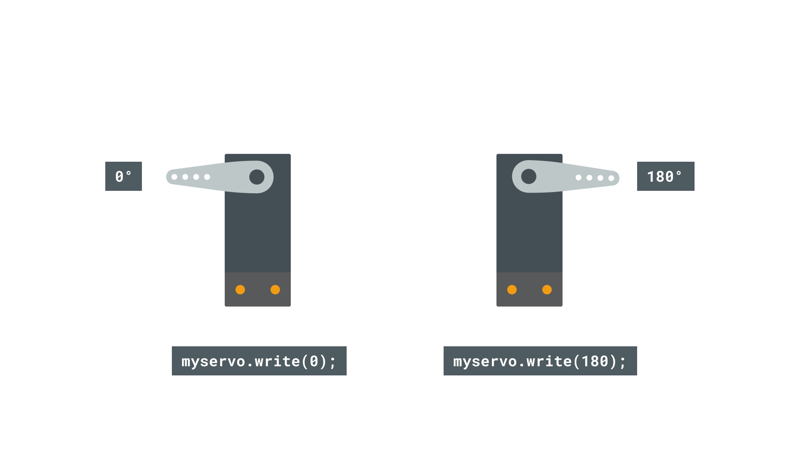

In this tutorial, we will learn how to control a **standard servo motor**, to go back and forth across 180 degrees, using a `for loop()`. This is done with the help of the [Servo](https://www.arduino.cc/reference/en/libraries/servo/) library, which is pre-installed library in the Arduino IDE (both offline and online versions).


>**Note:** This tutorial uses an Arduino UNO, but you can use **any official Arduino board**.

## Hardware and software required
- Arduino IDE ([online](https://create.arduino.cc/) or [offline](https://www.arduino.cc/en/main/software))
- Arduino UNO [(Link to store)](https://store.arduino.cc/arduino-uno-rev3)
- Servo motor 4.8V - 6V [(Link to store)](https://store.arduino.cc/feetech-mini-servo-motor-120-degrees-9g)

- Jumper wires.

## Standard servo motors

Standard servo motors are actuators that allow for precise control of position (angle). A typical characteristic is that the angle of the motor is 0 - 180 degrees. With other words, it can make one half of a rotation.

A standard servo motor, just as other motors, are essentially just a **DC motor**, but with some extra features:

- **Control circuit** for controlling the motor, e.g. setting the angle.
- **Gears** that transform speed into torque, which makes it capable of doing "heavy lifting" at a slower speed, as opposed to a regular DC motor that just spins very fast!
- **Potentiometer** that keeps track of its angle. This makes it possible for the servo to "know where it is".

Take a look at the image below to see how a Servo looks like inside:



### The different wires

Almost all servos come with a set of **3 wires.** These are **PWR, GND** and **Signal**. For a very simple circuit, all that is needed is to connect each of these two pins on the Arduino:

- **PWR (RED)** - connects to 5V on the Arduino.
- **GND (BLACK)** - connects to GND on the Arduino.
- **Signal (WHITE)** - connects to a digital pin on the Arduino (typically 9).

>**Note:** The color combination varies from servo to servo, but typically the red and black remains.

>**Note:** Depending on what Arduino you are using, the signal pin may vary.

## Circuit

Simply connect the standard servo motor to the Arduino, following the circuit below:




## Programming the board

To program the board, you will need to have installed the offline editor, or use the online editor. There's no need to install any external libraries.

Before we begin, let's take a look at some of the core functions in the program:

- `#include <Servo.h>` - includes the Servo library.
- `Servo myservo` - create a servo object.
- `myservo.attach(9)` - attach the servo to a pin.
- `myservo.write(pos)`  - write a value to the servo (0-180).

The code can be found by navigating to **File > Examples > Servo > Sweep**, or can be copied directly from below. Upload the program to the board.

```arduino
#include <Servo.h>

Servo myservo;  // create servo object to control a servo
// twelve servo objects can be created on most boards

int pos = 0;    // variable to store the servo position

void setup() {
  myservo.attach(9);  // attaches the servo on pin 9 to the servo object
}

void loop() {
  for (pos = 0; pos <= 180; pos += 1) { // goes from 0 degrees to 180 degrees
    // in steps of 1 degree
    myservo.write(pos);              // tell servo to go to position in variable 'pos'
    delay(15);                       // waits 15ms for the servo to reach the position
  }
  for (pos = 180; pos >= 0; pos -= 1) { // goes from 180 degrees to 0 degrees
    myservo.write(pos);              // tell servo to go to position in variable 'pos'
    delay(15);                       // waits 15ms for the servo to reach the position
  }
}

```

## Testing it out

After we have successfully uploaded the code to the board, the standard servo should now start moving from 0 - 180, and then start moving from 180 - 0. This is due to the two for loops in the program, which gradually increases the `pos` variable, which is written to the servo.



Congratulations! That was just a few easy steps to get started with standard servo motors. Now that you have this working, you can start exploring a lot of different cool projects that uses servo motors, and perhaps start making your very own robot!

## Conclusion

Congratulations! That was just a few easy steps to get started with standard servo motors. Now that you have this working, you can start exploring a lot of different cool projects that uses servo motors, and perhaps start making your very own robot!

Feel free to explore the [Servo](https://www.arduino.cc/reference/en/libraries/servo/) further.