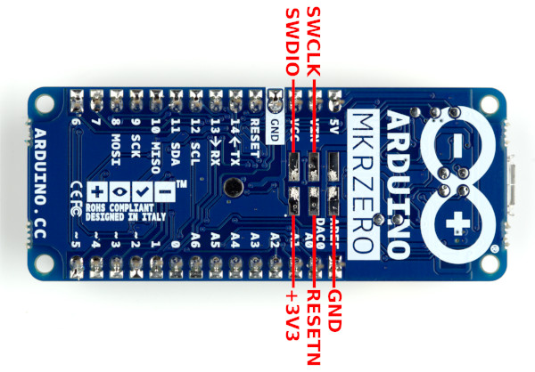
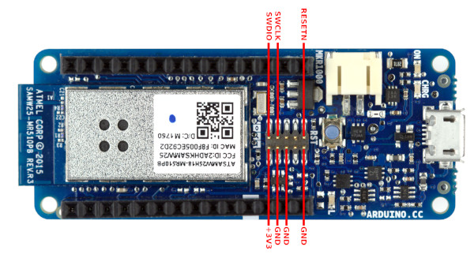
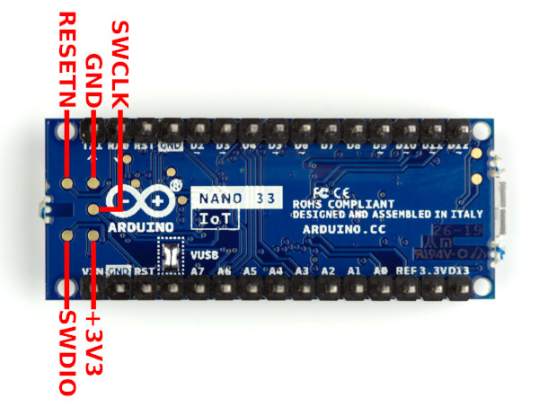

In this tutorial, we will learn how to burn the bootloader on boards that use the ATSAMD21G18 microcontroller using another Arduino board. The bootloader is a small piece of software that allows uploading sketches onto the Arduino board. It comes preprogrammed on the microcontrollers on Arduino boards. Whether the bootloader has been corrupted or intentionally has been removed, it can be restored by burning (also called, flashing or programming) a new bootloader to the board.

Below you will find two different approaches to burning the bootloader:
- [The first approach](#no-sd-card) does not require an SD card and should be used by users who want the easiest solution.

- [The second approach](#sd-card) uses an SD card and should be used when wanting to flash a different bootloader than the ones bundled with the "flash_MKR_bootloaders" sketch.

>**Note:** If you want to burn the bootloader on AVR boards such as an UNO, Mega, and classic Nano you can check out [these instructions](https://support.arduino.cc/hc/en-us/articles/4841602539164-Burn-the-bootloader-on-UNO-Mega-and-classic-Nano-using-another-Arduino).

## No SD card
### Requirements
- An extra SAMD-based Arduino board to use as the programmer. 
- A way to make connections to the SWD pins on your target Arduino board.

### Instructions
- Plug the USB cable of the Arduino board you will be using as a programmer into your computer.
- Select **Sketch > Include Library > Manage  Libraries…** from the Arduino IDE menu.
- Wait for the index updates to finish.
- In the "**Filter your search…**” field type ‘Adafruit® DAP library’.
- Press **Enter**.
- Click on “**Adafruit® DAP library by Adafruit®**”.
- Click the **Install** button.
- You may now get a dialog asking whether to install the library's dependencies. If so, click the "**Install All**" button.
- Wait for the installation to finish
- Close the **Library Manager**
- Select **File > Example > Adafruit® DAP Library > samd21 > flash_MKR_bootloaders** from the Arduino IDE menu. (despite the “MKR” in the sketch name, this also supports the **Nano 33 IoT**).
- Select your **programmer** Arduino board from the IDE’s **Tools > Board** menu.
- Select the port of the **programmer** Arduino board from the Arduino IDE’s Tools > Port menu.
- Select **Sketch > Upload** from the Arduino IDE menu.
- Unplug the **programmer** Arduino board from your computer.
- Connect the **programmer** Arduino board to the target Arduino board as follows:

    | Programmer  | Target      |
    | ----------- | ----------- |
    | VCC         | +3V3        |
    | 1           | SWDIO       |
    | 2           | SWCLK       |
    | GND         | GND         |
    | 0           | RESETN      |

    SWD pads on MKR boards other than MKR 1000:

    

    MKR1000 SWD header pinout:

    

    Nano 33 IoT SWD pads:

    

- Plug the USB cable of the **programmer** Arduino board into your computer.
- Select **Tools > Serial Monitor** from the Arduino IDE’s menu.
- Select "**No line ending**” from the dropdown menu near the bottom right corner of the **Serial Monitor** window.
- You should now see some instructions for using the sketch in the **Serial Monitor** output field. 

  This includes a menu of the boards supported by the sketch:

   ```
  [...]

   Select Arduino MKR board to erase and flash with bootloader:
   
   Z     -> Arduino Zero (6504 bytes)
   MZ    -> Arduino MKR Zero (6408 bytes)
   1000  -> Arduino MKR 1000 WIFI (6408 bytes)
   1010  -> Arduino MKR WIFI 1010 (7984 bytes)

   [...]
   ``` 
- Find your **target** Arduino board on the list and note the code written to the left of it.
- Type the code for the **target** Arduino board in the message field of the Serial Monitor.
- Press **Enter**
- The Serial Monitor Output field should now show the board you selected and the progress of flashing the bootloader to the **target** Arduino board.
- Wait for it to show “Done!”
- Unplug the **programmer** Arduino board from your computer.
- Disconnect the programmer Arduino board from the target Arduino board.

**Congratulations** you have now successfully burned the bootloader on your Arduino board and can go back to upload sketches like before.

## SD card
### Requirements
- An extra SAMD-based Arduino board to use as the programmer. 
- An SD slot. This could be built into your Arduino board (e.g., [MKR Zero](https://store.arduino.cc/products/arduino-mkr-zero-i2s-bus-sd-for-sound-music-digital-audio-data)), a shield (e.g., [MKR SD Proto](https://store.arduino.cc/products/mkr-sd-proto-shield)), or one of the common SD modules.
- An SD card that fits your SD slot.
- A way to connect the SD card to your computer.
- A way to make connections to the SWD pins on your target Arduino board.

For the [Nano 33 IoT](https://store.arduino.cc/products/arduino-nano-33-iot?_gl=1%2A80ta1j%2A_ga%2AMjEyMzQ2MjgwOC4xNjY1NjUyNTY3%2A_ga_NEXN8H46L5%2AMTY3MTYyNzMzMS4xNjEuMS4xNjcxNjMwNDIwLjAuMC4w) and the **MKR Boards** other than **MKR1000** ([tutorial](https://support.arduino.cc/hc/en-us/articles/360014905199-How-to-burn-the-bootloader-to-Arduino-MKR1000-using-a-programmer?queryID=ae55269235f9756d76c0b66bbb8ffa69)), we found it the easiest to use a 0.1" pitch 2x3 pogo adapter. You could also solder wires to the test points if you prefer. 

On the MKR boards other than the MKR1000, the SWD header is on the bottom of the board and is the footprint for a 0.1" pitch 2x3 SMD header. 

On the MKR1000, it is a 0.05" pitch 2x5 male header on the top of the board, which you will need an [adapter](https://www.adafruit.com/product/2743) and one [cable](https://www.adafruit.com/product/1675) for.

### Instructions
- Connect the SD card to your computer.
- Open [this link](https://github.com/arduino/ArduinoCore-samd/tree/master/bootloaders) in your browser.
- Click the folder that matches the name of your target board.
- Click the file that ends in `.bin`
- Click the **Download** button.
- Rename the downloaded file to `fw.bin`
- Move `fw.bin` to the SD card.
- Eject the SD card from your computer.
- Connect the Arduino board you will be using as a programmer to your computer via USB.
- Select **Sketch > Include Library > Manage Libraries...** from the Arduino IDE's menu.
- Wait for the index to finish.
- In the **"Filter your search..."** field, type "Adafruit® DAP library".
- Press **Enter**.
- Click on **"Adafruit® DAP library by Adafruit®"**.
- Click the **"Install"** button.
- You may now get a dialog asking whether to install the library's dependencies. If so, click the **"Install All**" button.
- Wait for the installation to finish.
- Close Library Manager.
- Select **File > Examples > Adafruit® DAP library > samd21 > flash_from_SD** from the Arduino IDE's menu.
- Change this line: `#define SD_CS 4` according to the Arduino pin connected to the SD CS pin. 

    If your board has a built-in SD slot (e.g., [MKR Zero](https://store.arduino.cc/products/arduino-mkr-zero-i2s-bus-sd-for-sound-music-digital-audio-data)), then you can change this line:

    `
    (!SD.begin(SD_CS)) {
    `

    to:

    `
    if (!SD.begin()) {
    `

- Select the programmer Arduino board from Arduino IDE's **Tools > Board** menu.
- Select the port of the programmer Arduino board from Arduino IDE's **Tools > Port** menu.
- Select **Sketch > Upload** from the Arduino IDE's menu.
- Wait for the upload to finish successfully.
- Unplug the **programmer** Arduino board from your computer.
- Plug the SD card into the SD slot connected to your Arduino board.
- Connect the **programmer** Arduino board to the target Arduino board as follows:

    | Programmer  | Target      |
    | ----------- | ----------- |
    | VCC         | +3V3        |
    | 12          | SWDIO       |
    | 11          | SWCLK       |
    | GND         | GND         |
    | 9           | RESETN      |

    SWD pads on MKR boards other than MKR 1000:

    

    MKR1000 SWD header pinout:

    

    Nano 33 IoT SWD pads:

    

- Plug the USB cable of the **programmer** Arduino board into your computer.
- Select **Tools > Serial Monitor** from the Arduino IDE's menu. You should now see the Serial Monitor output showing the **target** board detected, and the bootloader file flashed to it successfully.
- Unplug the **programmer** Arduino board from your computer.
- Disconnect the programmer Arduino board from the target Arduino board.

**Congratulations** you have now successfully burned the bootloader on your Arduino board and can go back to upload sketches like before.