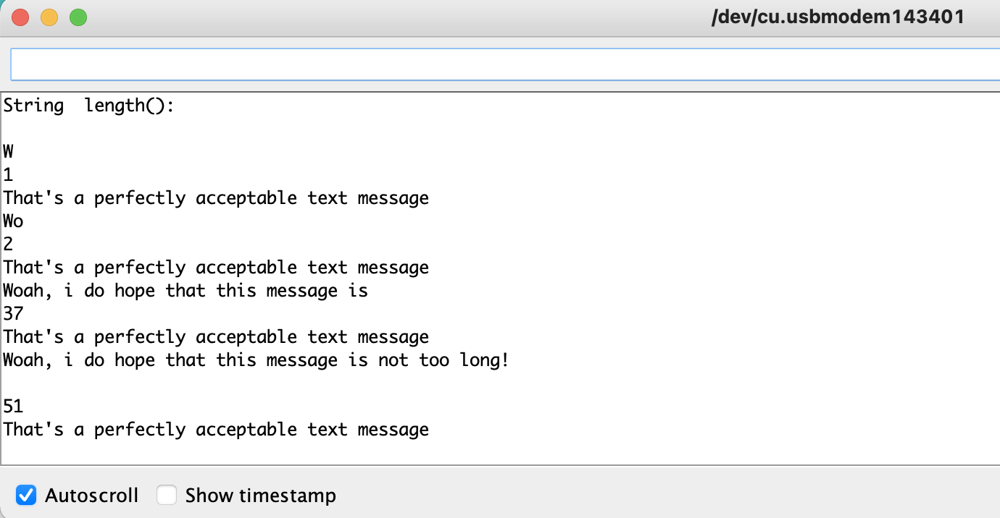

## Introduction
You can get the length of [Strings](https://www.arduino.cc/reference/en/language/variables/data-types/string/) using the `length()` command.  This example shows you how to use this command to reply to an input from the Arduino Software (IDE) serial monitor. If the input string is too long, the sketch will send a specific message to the user

## What You Will Learn

- Learn how to determine the length of strings.
- Write a program that restricts the length of strings from an input.
  
## Hardware & Software Needed

-  Arduino Microcontroller ([Link to store](https://store.arduino.cc/))
- Arduino IDE ([online](https://create.arduino.cc/) or [offline](https://www.arduino.cc/en/main/software)).

### Circuit

There is no circuit for this example, though your board must be connected to your computer via USB and the serial monitor window of the Arduino Software (IDE) should be open.


## Programming the Board

We will now get to the programming part of this tutorial. 

 Open the editor of your choice, and make sure you have your board installed. Select your board and port, and upload the sketch below.

If you need help setting up your environment, you can use our interactive getting started guide, found on the [hardware documentation page](https://docs.arduino.cc/).


## Code

The `length()`function returns the length of a String.  There are many occasions when you need this. For example,if you wanted to make sure a String was less than 140 characters, to fit it in a text message, you could do this:

```arduino

/*

  String length()

  Examples of how to use length() in a String.

  Open the Serial Monitor and start sending characters to see the results.

  created 1 Aug 2010

  by Tom Igoe

  This example code is in the public domain.

  http://www.arduino.cc/en/Tutorial/StringLengthTrim

*/

String txtMsg = "";                         // a string for incoming text
unsigned int lastStringLength = txtMsg.length();     // previous length of the String

void setup() {

  // Open serial communications and wait for port to open:

  Serial.begin(9600);

  while (!Serial) {

    ; // wait for serial port to connect. Needed for native USB port only

  }

  // send an intro:

  Serial.println("\n\nString  length():");

  Serial.println();
}

void loop() {

  // add any incoming characters to the String:

  while (Serial.available() > 0) {

    char inChar = Serial.read();

    txtMsg += inChar;

  }

  // print the message and a notice if it's changed:

  if (txtMsg.length() != lastStringLength) {

    Serial.println(txtMsg);

    Serial.println(txtMsg.length());

    // if the String's longer than 140 characters, complain:

    if (txtMsg.length() < 140) {

      Serial.println("That's a perfectly acceptable text message");

    } else {

      Serial.println("That's too long for a text message.");

    }

    // note the length for next time through the loop:

    lastStringLength = txtMsg.length();

  }
}
```
## Testing It Out
After you have uploaded the code from the example, open the serial monitor. You should be able to write inputs. Try experimenting with different message lengths to see how the program reacts. You can also adjust the length parameters in the code to your liking.



### Troubleshoot

If the code is not working, there are some common issues we can troubleshoot:

- You have not selected the right port and board. 
- Make sure that no `{}` brackets are missing.

## Conclusion

In this example, we tried out the `length()` function. Using this function, we created a program that lets you write messages to the serial monitor, and determine if the message is too long.