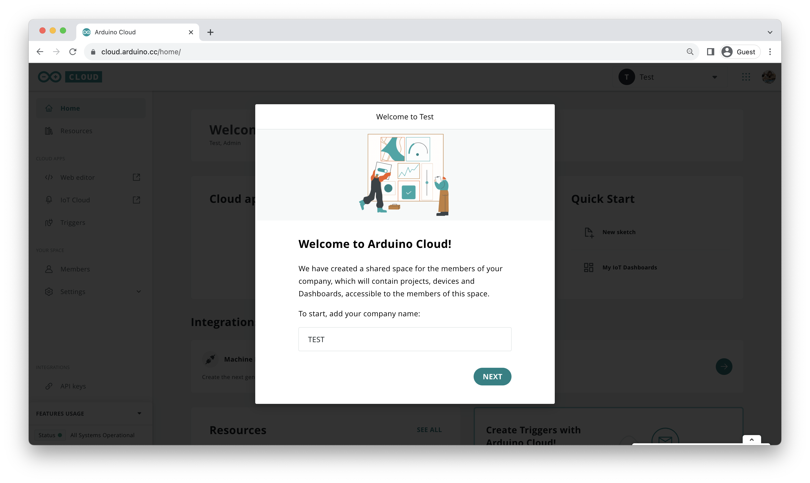
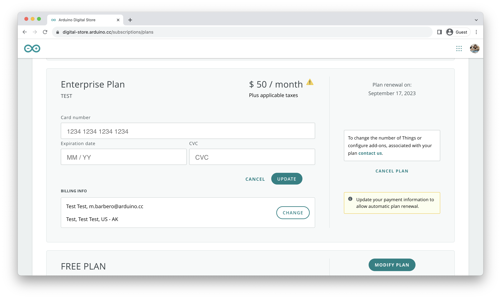

## Overview

In this tutorial, you will learn how to activate a trial-period subscription plan for the Arduino Cloud for Business.

We will guide you through leveraging this offer to optimize your projects using cutting-edge technology, facilitating secure and efficient management with the Arduino Cloud for Business.

## Software Requirements

- An [Arduino Cloud](https://cloud.arduino.cc/) account is required to be able to proceed with the steps provided in the following section. In case you do not have an account, you can create one for free inside [cloud.arduino.cc](https://cloud.arduino.cc/home/?get-started=true).

## Arduino Cloud for Business Voucher

The __Arduino Cloud for Business Voucher__ grants the holder a one-time redemption opportunity for a trial-period subscription plan to the Arduino Cloud for Business.

***The voucher must be redeemed within one year from the date of receipt. It is non-transferable and can only be used by the original recipient. The voucher is valid specifically for the software type specified on it.***

This tool will speed up the creation and management of your projects by using cutting-edge technology.

## Voucher Activation Code

To redeem, this voucher grants access to a single trial-period subscription plan to the Arduino Cloud for Business, facilitated through a unique code in the following format:

`C4BX83M-XXXXXXXXXX`

The `XXXXXXXXXX` field represents the actual code that needs to be used to redeem the one-time trial-period subscription plan to the Arduino Cloud for Business.

Once you have your unique code, follow the process below to redeem it and fully leverage the extensive benefits offered.

## Voucher Redemption Process

Navigate to the [Arduino Cloud](https://cloud.arduino.cc/) page and log in with your account using the `SIGN IN` button located in the top-right corner. In case you do not have an account, you can create one for free at [cloud.arduino.cc](https://cloud.arduino.cc/home/?get-started=true).

To redeem the voucher, once you are logged in with the desired account, go to `CLOUD`, click on the tab `PLANS` and locate the option `For Business` or just follow this [link](https://cloud.arduino.cc/plans#business). Click the `PURCHASE` button under the `Enterprise Base Plan` column to proceed.

You will be redirected to the `Plan details` page, where you can customize the plan by defining the billing frequency and the number of Things.

For this guide, the `Monthly` billing frequency is chosen, and the number of `Things` is set to `50`. You can adjust these details according to your preferences, and the discount will still apply. Clicking `Continue` will take you to the `Integrations` page. Feel free to choose any additional add-ons as you wish. **Please note that the present coupon does not cover the add-ons**. 

Once the add-on option is configured, proceed to the `Billing information` page.

The `Billing Information` page requires you to enter basic details before entering payment information. You will be asked to provide:

- Billing Type
- Billing Address
- Billing Contact

If you have previously registered billing information, you can update it if any changes have occurred. Once these details are confirmed, proceed to the `Payment` page, where you will enter payment information and have the opportunity to apply your voucher code.

To apply the unique voucher code, select the `USE COUPON` option, revealing a field where you can enter the provided unique voucher code. Upon application of the code, the `Purchase Summary` column will instantly reflect the changes.

It will validate your trial-period subscription plan to Arduino Cloud for Business. After completing this step, you can proceed to create dedicated company spaces.

You can verify the subscription status for the Arduino Cloud for Business under `MY PLANS` in the account image section or access it directly [here](https://digital-store.arduino.cc/subscriptions/plans) with your account logged in.

## Support

If you encounter any issues or have questions, we offer various support resources to help you find answers and solutions. In case of any issues with the redemption process, please contact us by filling out the form available [here](arduino.cc/en/contact-us/).