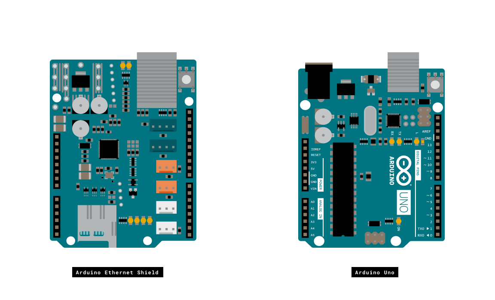
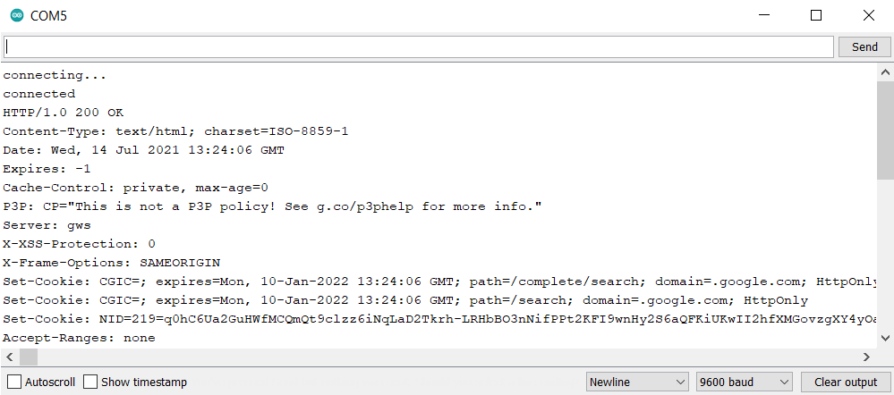

## Introduction

This example connects to a named server and makes a request using an Ethernet shield.  The sketch in the example illustrates how to connect using DHCP and DNS. 


## You Will Learn

- Connect to a server using the Arduino Ethernet Shield.
- Make a request that searches for "Arduino" on Google.
- Print incoming data on the Serial Monitor.


## Hardware & Software Needed

- [Arduino Ethernet Shield](https://store.arduino.cc/arduino-ethernet-shield-2)

- Shield-compatible Arduino board ([Arduino UNO](https://store.arduino.cc/arduino-uno-rev3) and [Mega](https://store.arduino.cc/arduino-mega-2560-rev3))
- Ethernet Cable
- Arduino IDE ([online](https://create.arduino.cc/) or [offline](https://www.arduino.cc/en/main/software)).
- [Ethernet Library](https://www.arduino.cc/en/Reference/Ethernet)

## Circuit

The Ethernet shield allows you to connect a WizNet Ethernet controller to the Arduino via the SPI bus. It uses pins 10, 11, 12, and 13 for the SPI connection to the WizNet.  Later models of the Ethernet shield also have an SD Card on board. Digital pin 4 is used to control the chip select pin on the SD card.

The shield should be connected to a network with an ethernet cable. You will need to change the network settings in the program to correspond to your network. Mount the Ethernet Shield to your Arduino Board.





## Programming the Board

Now we will get to the programming part of the tutorial.

We need to install the libraries needed. Simply go to **Tools > Manage libraries...** and search for **Ethernet Library** and install it.

Upload the sketch to the board.


## Code 

Before we start, lets take a look at some core functions of the program:

- `Client` - Client is the base class for all Ethernet client based calls. It is not called directly, but invoked whenever you use a function that relies on it.
  
- `EthernetClient()` - Creates a client which can connect to a specified internet IP address and port (defined in the `client.connect()` function).
- `client.connected()` - Whether or not the client is connected. Note that a client is considered connected if the connection has been closed but there is still unread data.
- DNS lookup happens when `client.connect(servername,port)` is called. `servername` is a URL string, like `"www.arduino.cc"`.

Upload the sketch below to your board:

```arduino
/*

  DNS and DHCP-based Web client

 This sketch connects to a website (http://www.google.com)

 using an Arduino Wiznet Ethernet shield.

 Circuit:

 * Ethernet shield attached to pins 10, 11, 12, 13

 created 18 Dec 2009

 by David A. Mellis

 modified 9 Apr 2012

 by Tom Igoe, based on work by Adrian McEwen

 */

#include <SPI.h>
#include <Ethernet.h>

// Enter a MAC address for your controller below.
// Newer Ethernet shields have a MAC address printed on a sticker on the shield
byte mac[] = {  0x00, 0xAA, 0xBB, 0xCC, 0xDE, 0x02 };
char serverName[] = "www.google.com";

// Initialize the Ethernet client library
// with the IP address and port of the server
// that you want to connect to (port 80 is default for HTTP):

EthernetClient client;

void setup() {

 // Open serial communications and wait for port to open:

  Serial.begin(9600);

   while (!Serial) {

    ; // wait for serial port to connect. Needed for Leonardo only

  }

  // start the Ethernet connection:

  if (Ethernet.begin(mac) == 0) {

    Serial.println("Failed to configure Ethernet using DHCP");

    // no point in carrying on, so do nothing forevermore:

    while(true);

  }

  // give the Ethernet shield a second to initialize:

  delay(1000);

  Serial.println("connecting...");

  // if you get a connection, report back via serial:

  if (client.connect(serverName, 80)) {

    Serial.println("connected");

    // Make a HTTP request:

    client.println("GET /search?q=arduino HTTP/1.0");

    client.println();

  }

  else {

    // if you didn't get a connection to the server:

    Serial.println("connection failed");

  }
}

void loop()
{

  // if there are incoming bytes available

  // from the server, read them and print them:

  if (client.available()) {

    char c = client.read();

    Serial.print(c);

  }

  // if the server's disconnected, stop the client:

  if (!client.connected()) {

    Serial.println();

    Serial.println("disconnecting.");

    client.stop();

    // do nothing forevermore:

    while(true);

  }
}
```

## Testing It Out
After you have uploaded the code to your board, open the Serial Monitor in your IDE. You should see this:


In the Serial Monitor we print the incoming bytes from the `client.println("GET /search?q=arduino HTTP/1.0");` function where we search for `arduino` on Google. We defined `char c` as `client.read();` and then print it. 

### Troubleshoot
If the code is not working, there are some common issues we can troubleshoot:

- You are using the incorrect mac address
- You have not installed the Ethernet Library

## Conclusion

In this tutorial we have used the Arduino Ethernet Shield to connect to Google and make a search request. The data from the search request is then printed to the Serial Monitor in the Arduino IDE. 