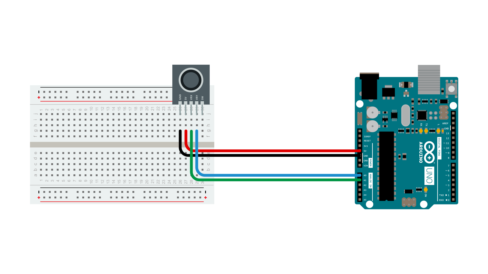

## Introduction
The typical joystick is nothing but two potentiometers that allow us to measure the movement of the stick in 2-D. Potentiometers are variable resistors and, in a way, they act as sensors providing us with a variable voltage depending on the rotation of the device around its shaft.

The kind of program that we need to monitor the joystick has to make a polling to two of the analog pins. We can send these values back to the computer, but then we face the classic problem that the transmission over the communication port has to be made with 8bit values, while our DAC (Digital to Analog Converter - that is measuring the values from the potentiometers in the joystick) has a resolution of 10bits. In other words this means that our sensors are characterized with a value between 0 and 1024.

The following code includes a method called treatValue() that is transforming the sensor's measurement into a value between 0 and 9 and sends it in ASCII back to the computer. This allows to easily send the information into e.g. Flash and parse it inside your own code.

Finally we make the LED blink with the values read from the sensors as a direct visual feedback of how we control the joystick.
## Hardware Required
- Arduino Board ([Link to store](https://store.arduino.cc/))
- Joystick


## Circuit



## Code
```arduino
/* Read Joystick
  * ------------
  *
  * Reads two analog pins that are supposed to be
  * connected to a joystick made of two potentiometers
  *
  * We send three bytes back to the comp: one header and two
  * with data as signed bytes, this will take the form:
  *     Jxy\r\n
  *
  * x and y are integers and sent in ASCII
  *
  * http://www.0j0.org | http://arduino.berlios.de
  * copyleft 2005 DojoDave for DojoCorp
  */

 int ledPin = 13;
 int joyPin1 = A0;                 // slider variable connected to analog pin 0
 int joyPin2 = A1;                 // slider variable connected to analog pin 1
 int value1 = 0;                  // variable to read the value from the analog pin 0
 int value2 = 0;                  // variable to read the value from the analog pin 1

 void setup() {
  pinMode(ledPin, OUTPUT);              // initializes digital pins 0 to 7 as outputs
  Serial.begin(9600);
 }

 int treatValue(int data) {
  return (data * 9 / 1024) + 48;
 }

 void loop() {
  // reads the value of the variable resistor
  value1 = analogRead(joyPin1);  
  // this small pause is needed between reading
  // analog pins, otherwise we get the same value twice
  delay(100);            
  // reads the value of the variable resistor
  value2 = analogRead(joyPin2);  

  digitalWrite(ledPin, HIGH);          
  delay(value1);
  digitalWrite(ledPin, LOW);
  delay(value2);
  Serial.print('J');
  Serial.print(treatValue(value1));
  Serial.println(treatValue(value2));
 }
 ```