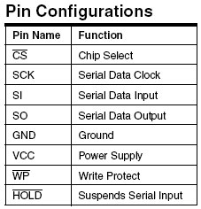
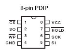
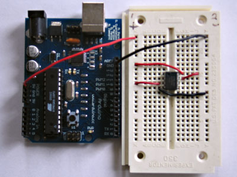
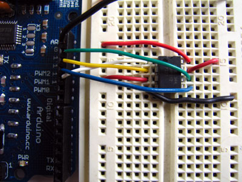

## Introduction

In this tutorial you will learn how to interface with an AT25HP512 Atmel serial EEPROM using the Serial Peripheral Interface (SPI) protocol. EEPROM chips such as this are very useful for data storage, and the steps we will cover for implementing SPI communication can be modified for use with most other SPI devices.  Note that the chip on the Arduino board contains an internal EEPROM, so follow this tutorial only if you need more space than it provides.

## Goals

- Learn about the SPI protocol
- Enable SPI communication between an EEPROM chip and the Arduino.

## Hardware & Software Needed

- AT25HP512 Serial EEPROM chip (or similar)
- Jumper wires
- Breadboard
- Arduino Microcontroller ([Link to store](https://store.arduino.cc/))
- Arduino IDE ([online](https://create.arduino.cc/) or [offline](https://www.arduino.cc/en/main/software)).

## Serial Peripheral Interface

Serial Peripheral Interface (SPI) is a synchronous serial data protocol used by Microcontrollers for communicating with one or more peripheral devices quickly over short distances. It can also be used for communication between two microcontrollers.

With an SPI connection there is always one Controller device (usually a microcontroller) which controls the peripheral devices. Typically there are three lines common to all the devices:

- Controller In, Peripheral Out (CIPO) - The Peripheral line for sending data to the Controller,

- Controller Out Peripheral In (COPI) - The Controller line for sending data to the Peripherals,

- Serial Clock (SCK) - The clock pulses which synchronize data transmission generated by the Controller, and

- Chip Select pin (CS)  - allocated on each device which the Controller can use to enable and disable specific devices and avoid false transmissions due to line noise.

***Controller/peripheral is formerly known as master/slave. Arduino no longer supports the use of this terminology. See the table below to understand the new terminology:***

| Master/Slave (OLD)         | Controller/Peripheral (NEW)          |
| -------------------------- | ------------------------------------ |
| Master In Slave Out (MISO) | Controller In, Peripheral Out (CIPO) |
| Master Out Slave In (MOSI) | Controller Out Peripheral In (COPI)  |
| Slave Select pin (SS)      | Chip Select Pin (CS)                 |


The difficult part about SPI is that the standard is loose and each device implements it a little differently. This means you have to pay special attention to the datasheet when writing your interface code. Generally speaking there are three modes of transmission numbered 0 - 3. These modes control whether data is shifted in and out on the rising or falling edge of the data clock signal, and whether the clock is idle when high or low.

All SPI settings are determined by the Arduino SPI Control Register (SPCR). A register is just a byte of microcontroller memory that can be read from or written to. Registers generally serve three purposes, control, data and  status.

Control registers code control settings for various microcontroller functionalities. Usually each bit in a control register effects a particular setting, such as speed or polarity.

Data registers simply hold bytes. For example, the SPI data register (SPDR) holds the byte which is about to be shifted out the MOSI line, and the data which has just been shifted in the MISO line.

Status registers change their state based on various microcontroller conditions. For example, the seventh bit of the SPI status register (SPSR) gets set to 1 when a value is shifted in or out of the SPI.

The SPI control register (SPCR) has 8 bits, each of which control a particular SPI setting.

```arduino
SPCR
| 7    | 6    | 5    | 4    | 3    | 2    | 1    | 0    |
| SPIE | SPE  | DORD | MSTR | CPOL | CPHA | SPR1 | SPR0 |

SPIE - Enables the SPI interrupt when 1

SPE - Enables the SPI when 1

DORD - Sends data least Significant Bit First when 1, most Significant Bit first when 0

MSTR - Sets the Arduino in controller mode when 1, peripheral mode when 0

CPOL - Sets the data clock to be idle when high if set to 1, idle when low if set to 0

CPHA - Samples data on the falling edge of the data clock when 1, rising edge when 0

SPR1 and SPR0 - Sets the SPI speed, 00 is fastest (4MHz) 11 is slowest (250KHz)
```

This means that to write code for a new SPI device you need to note several things and set the SPCR accordingly:

- Is data shifted in MSB or LSB first?

- Is the data clock idle when high or low?

- Are samples on the rising or falling edge of clock pulses?

- What speed is the SPI running at?

Once you have your SPI Control Register set correctly you just need to figure out how long you need to pause between instructions and you are ready to go. Now that you have a feel for how SPI works, let's take a look at the details of the EEPROM chip.

## Introduction to Serial EEPROM





The AT25HP512 is a 65,536 byte serial EEPROM. It supports SPI modes 0 and 3, runs at up to 10MHz at 5v and can run at slower speeds down to 1.8v. It's memory is organized as 512 pages of 128 bytes each. It can only be written 128 bytes at a time, but it can be read 1-128 bytes at a time. The device also offers various degerees of write protection and a hold pin, but we won't be covering those in this tutorial.

The device is enabled by pulling the Chip Select (CS) pin low. Instructions are sent as 8 bit operational codes (opcodes) and are shifted in on the rising edge of the data clock. It takes the EEPROM about 10 milliseconds to write a page (128 bytes) of data, so a 10ms pause should follow each EEPROM write routine.

### Prepare the Breadboard

Insert the AT25HP512 chip into the breadboard. Connect 5V power and ground from the breadboard to 5V power and ground from the microcontroller. Connect EEPROM pins 3, 7 and 8 to 5v and pin 4 to ground.




Connect EEPROM pin 1 to Arduino pin 10 (Chip Select - CS), EEPROM pin 2 to Arduino pin 12 (Controller In Peripheral Out - CIPO), EEPROM pin 5 to Arduino pin 11 (Controller Out Peripheral In - COPI), and EEPROM pin 6 to Arduino pin 13 (Serial Clock - SCK).




## Programming the Board

Now we will write the code to enable SPI communication between the EEPROM and the Arduino. In the setup routine this program fills 128 bytes, or one page of the EEPROM with data. In the main loop it reads that data back out, one byte at a time and prints that byte out the built in serial port. We will walk through the code in small sections.

The first step is setting up our pre-processor directives. Pre-processor directives are processed before the actual compilation begins. They start with a "#" and do not end with semi-colons.

We define the pins we will be using for our SPI connection, DATAOUT, DATAIN, SPICLOCK and CHIPSELECT. Then we define our opcodes for the EEPROM. Opcodes are control commands:

```arduino
#define DATAOUT 11//COPI
#define DATAIN  12//CIPO
#define SPICLOCK  13//sck
#define CHIPSELECT 10//cs

//opcodes
#define WREN  6
#define WRDI  4
#define RDSR  5
#define WRSR  1
#define READ  3
#define WRITE 2
```

Here we allocate the global variables we will be using later in the program. Note `char buffer [128];`. this is a 128 byte array we will be using to store the data for the EEPROM write:

```arduino
byte eeprom_output_data;
byte eeprom_input_data=0;
byte clr;
int address=0;
//data buffer
char buffer [128];
```

First we initialize our serial connection, set our input and output pin modes and set the CHIPSELECT line high to start. This deselects the device and avoids any false transmission messages due to line noise:

```arduino
void setup()
{

  Serial.begin(9600);

  pinMode(DATAOUT, OUTPUT);

  pinMode(DATAIN, INPUT);

  pinMode(SPICLOCK,OUTPUT);

  pinMode(CHIPSELECT,OUTPUT);

  digitalWrite(CHIPSELECT,HIGH); //disable device
```

Now we set the SPI Control register (SPCR) to the binary value 01010000. In the control register each bit sets a different functionality. The eighth bit disables the SPI interrupt, the seventh bit enables the SPI, the sixth bit chooses transmission with the most significant bit going first, the fifth bit puts the Arduino in Controller mode, the fourth bit sets the data clock idle when it is low, the third bit sets the SPI to sample data on the rising edge of the data clock, and the second and first bits set the speed of the SPI to system speed / 4 (the fastest).
After setting our control register up we read the SPI status register (SPSR) and data register (SPDR) in to the junk clr variable to clear out any spurious data from past runs:

```arduino
// SPCR = 01010000

  //interrupt disabled,spi enabled,msb 1st,controller,clk low when idle,

  //sample on leading edge of clk,system clock/4 rate (fastest)

  SPCR = (1<<SPE)|(1<<MSTR);

  clr=SPSR;

  clr=SPDR;

  delay(10);
```

Here we fill our data array with numbers and send a write enable instruction to the EEPROM. The EEPROM MUST be write enabled before every write instruction. To send the instruction we pull the CHIPSELECT line low, enabling the device, and then send the instruction using the spi_transfer function. Note that we use the WREN opcode we defined at the beginning of the program. Finally we pull the CHIPSELECT line high again to release it:

```arduino
//fill buffer with data

  fill_buffer();

  //fill eeprom w/ buffer

  digitalWrite(CHIPSELECT,LOW);

  spi_transfer(WREN); //write enable

  digitalWrite(CHIPSELECT,HIGH);
```

Now we pull the CHIPSELECT line low to select the device again after a brief delay. We send a WRITE instruction to tell the EEPROM we will be sending data to record into memory. We send the 16 bit address to begin writing at in two bytes, Most Significant Bit first. Next we send our 128 bytes of data from our buffer array, one byte after another without pause. Finally we set the CHIPSELECT pin high to release the device and pause to allow the EEPROM to write the data:

```arduino
delay(10);

  digitalWrite(CHIPSELECT,LOW);

  spi_transfer(WRITE); //write instruction

  address=0;

  spi_transfer((char)(address>>8));   //send MSByte address first

  spi_transfer((char)(address));      //send LSByte address

  //write 128 bytes

  for (int I=0;I<128;I++)

  {

    spi_transfer(buffer[I]); //write data byte

  }

  digitalWrite(CHIPSELECT,HIGH); //release chip

  //wait for eeprom to finish writing

  delay(3000);
```

We end the setup function by sending the word "hi" plus a line feed out the built in serial port for debugging purposes. This way if our data comes out looking funny later on we can tell it isn't just the serial port acting up:

```arduino
Serial.print('h');

  Serial.print('i');

  Serial.print('\n');//debug

  delay(1000);
}
```


The fill_buffer function simply fills our data array with numbers 0 - 127 for each index in the array. This function could easily be changed to fill the array with data relevant to your application:

```arduino
void fill_buffer()
{

  for (int I=0;I<128;I++)

  {

    buffer[I]=I;

  }
}
```

The spi_transfer function loads the output data into the data transmission register, thus starting the SPI transmission. It polls a bit to the SPI Status register (SPSR) to detect when the transmission is complete using a bit mask, SPIF. It then returns any data that has been shifted in to the data register by the EEPROM:

```arduino
char spi_transfer(volatile char data)
{

  SPDR = data;                    // Start the transmission

  while (!(SPSR & (1<<SPIF)))     // Wait for the end of the transmission

  {

  };

  return SPDR;                    // return the received byte
}
```

The read_eeprom function allows us to read data back out of the EEPROM. First we set the CHIPSELECT line low to enable the device. Then we transmit a READ instruction, followed by the 16-bit address we wish to read from, Most Significant Bit first. Next we send a dummy byte to the EEPROM for the purpose of shifting the data out. Finally we pull the CHIPSELECT line high again to release the device after reading one byte, and return the data. If we wanted to read multiple bytes at a time we could hold the CHIPSELECT line low while we repeated the `data = spi_transfer(0xFF);` up to 128 times for a full page of data:

```arduino
byte read_eeprom(int EEPROM_address)
{

  //READ EEPROM

  int data;

  digitalWrite(CHIPSELECT,LOW);

  spi_transfer(READ); //transmit read opcode

  spi_transfer((char)(EEPROM_address>>8));   //send MSByte address first

  spi_transfer((char)(EEPROM_address));      //send LSByte address

  data = spi_transfer(0xFF); //get data byte

  digitalWrite(CHIPSELECT,HIGH); //release chip, signal end transfer

  return data;
}
```

For easy copy and pasting the full program text of this tutorial is below:

```arduino
#define DATAOUT 11//MOSI
#define DATAIN  12//MISO
#define SPICLOCK  13//sck
#define CHIPSELECT 10//ss

//opcodes
#define WREN  6
#define WRDI  4
#define RDSR  5
#define WRSR  1
#define READ  3
#define WRITE 2

byte eeprom_output_data;
byte eeprom_input_data=0;
byte clr;
int address=0;
//data buffer
char buffer [128];

void fill_buffer()
{

  for (int I=0;I<128;I++)

  {

    buffer[I]=I;

  }
}

char spi_transfer(volatile char data)
{

  SPDR = data;                    // Start the transmission

  while (!(SPSR & (1<<SPIF)))     // Wait the end of the transmission

  {

  };

  return SPDR;                    // return the received byte
}

void setup()
{

  Serial.begin(9600);

  pinMode(DATAOUT, OUTPUT);

  pinMode(DATAIN, INPUT);

  pinMode(SPICLOCK,OUTPUT);

  pinMode(CHIPSELECT,OUTPUT);

  digitalWrite(CHIPSELECT,HIGH); //disable device

  // SPCR = 01010000

  //interrupt disabled,spi enabled,msb 1st,controller,clk low when idle,

  //sample on leading edge of clk,system clock/4 rate (fastest)

  SPCR = (1<<SPE)|(1<<MSTR);

  clr=SPSR;

  clr=SPDR;

  delay(10);

  //fill buffer with data

  fill_buffer();

  //fill eeprom w/ buffer

  digitalWrite(CHIPSELECT,LOW);

  spi_transfer(WREN); //write enable

  digitalWrite(CHIPSELECT,HIGH);

  delay(10);

  digitalWrite(CHIPSELECT,LOW);

  spi_transfer(WRITE); //write instruction

  address=0;

  spi_transfer((char)(address>>8));   //send MSByte address first

  spi_transfer((char)(address));      //send LSByte address

  //write 128 bytes

  for (int I=0;I<128;I++)

  {

    spi_transfer(buffer[I]); //write data byte

  }

  digitalWrite(CHIPSELECT,HIGH); //release chip

  //wait for eeprom to finish writing

  delay(3000);

  Serial.print('h');

  Serial.print('i');

  Serial.print('\n');//debug

  delay(1000);
}

byte read_eeprom(int EEPROM_address)
{

  //READ EEPROM

  int data;

  digitalWrite(CHIPSELECT,LOW);

  spi_transfer(READ); //transmit read opcode

  spi_transfer((char)(EEPROM_address>>8));   //send MSByte address first

  spi_transfer((char)(EEPROM_address));      //send LSByte address

  data = spi_transfer(0xFF); //get data byte

  digitalWrite(CHIPSELECT,HIGH); //release chip, signal end transfer

  return data;
}

void loop()
{

  eeprom_output_data = read_eeprom(address);

  Serial.print(eeprom_output_data,DEC);

  Serial.print('\n');

  address++;

  if (address == 128)

    address = 0;

  delay(500); //pause for readability
}
```

## Testing It Out

After you have assembled your circuit and uploaded the sketch in this tutorial, open the Serial Monitor in your IDE to see the EEPROM output data. Each time through the `loop()` we increment the EEPROM address to read. When the address increments to 128 we turn it back to 0 because we have only filled 128 addresses in the EEPROM with data.

### Troubleshoot

If the code is not working, there are some common issues we can troubleshoot:

- The wiring is incorrect.

- EEPROM chip is faulty

## Conclusion

In this example, we have learned about SPI, a synchronous serial data protocol used by Microcontrollers for communicating with one or more peripheral devices. We enabled SPI communication between an EEPROM chip and the Arduino. The program we made fills 128 bytes and reads that data back out, one byte at a time and prints that byte out on the Serial Monitor.

