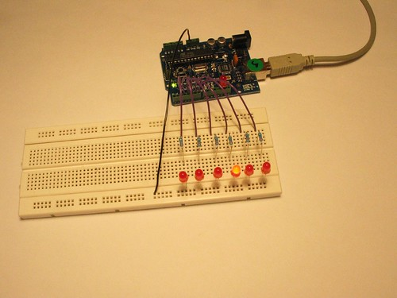

## Introduction 

We have named this example in memory to a TV-series from the 80's where the famous David Hasselhoff had an AI machine driving his Pontiac. The car had been augmented with plenty of LEDs in all possible sizes performing flashy effects.

Thus we decided that in order to learn more about sequential programming and good programming techniques for the I/O board, it would be interesting to use the Knight Rider as a metaphor.

This example makes use of 6 LEDs connected to the pins 2 - 7 on the board using 220 Ohm resistors. The first code example will make the LEDs blink in a sequence, one by one using only digitalWrite(pinNum,HIGH/LOW) and delay(time). The second example shows how to use a for(;;) construction to perform the very same thing, but in fewer lines. The third and last example concentrates in the visual effect of turning the LEDs on/off in a more softer way.

## Goals

The goal of this project is:

- To test out different sketches for the Knight Rider example.

## Hardware & Software Needed

- Arduino IDE ([online](https://create.arduino.cc/) or [offline](https://www.arduino.cc/en/main/software)).
- Any Arduino board ([link to store](https://store.arduino.cc/arduino/boards-modules))
- 6x generic LEDs
- 6x 220 ohm resistors
- Jumper wires
- Breadboard

## Circuit



## Programming the Board

We will now get to the programming part of this tutorial. 

**1.** Open the editor of your choice, and make sure you have your board installed. Select your board and port, and upload any of the three examples below.

If you need help setting up your environment, you can use our interactive getting started guide, found on the [hardware documentation page](https://docs.arduino.cc/).

### Knight Rider 1

```arduino
/* Knight Rider 1
* --------------
*
* Basically an extension of Blink_LED.
*
*
* (cleft) 2005 K3, Malmo University
* @author: David Cuartielles
* @hardware: David Cuartielles, Aaron Hallborg
*/
int pin2 = 2;
int pin3 = 3;
int pin4 = 4;
int pin5 = 5;
int pin6 = 6;
int pin7 = 7;
int timer = 100;
void setup(){
pinMode(pin2, OUTPUT);
pinMode(pin3, OUTPUT);
pinMode(pin4, OUTPUT);
pinMode(pin5, OUTPUT);
pinMode(pin6, OUTPUT);
pinMode(pin7, OUTPUT);
}
void loop() {
digitalWrite(pin2, HIGH);
delay(timer);
digitalWrite(pin2, LOW);
delay(timer);
digitalWrite(pin3, HIGH);
delay(timer);
digitalWrite(pin3, LOW);
delay(timer);
digitalWrite(pin4, HIGH);
delay(timer);
digitalWrite(pin4, LOW);
delay(timer);
digitalWrite(pin5, HIGH);
delay(timer);
digitalWrite(pin5, LOW);
delay(timer);
digitalWrite(pin6, HIGH);
delay(timer);
digitalWrite(pin6, LOW);
delay(timer);
digitalWrite(pin7, HIGH);
delay(timer);
digitalWrite(pin7, LOW);
delay(timer);
digitalWrite(pin6, HIGH);
delay(timer);
digitalWrite(pin6, LOW);
delay(timer);
digitalWrite(pin5, HIGH);
delay(timer);
digitalWrite(pin5, LOW);
delay(timer);
digitalWrite(pin4, HIGH);
delay(timer);
digitalWrite(pin4, LOW);
delay(timer);
digitalWrite(pin3, HIGH);
delay(timer);
digitalWrite(pin3, LOW);
delay(timer);
}
```

### Knight Rider 2

```arduino
/* Knight Rider 2
* --------------
*
* Reducing the amount of code using for(;;).
*
*
* (cleft) 2005 K3, Malmo University
* @author: David Cuartielles
* @hardware: David Cuartielles, Aaron Hallborg
*/
int pinArray[] = {2, 3, 4, 5, 6, 7};
int count = 0;
int timer = 100;
void setup(){
// we make all the declarations at once
for (count=0;count<6;count++) {
pinMode(pinArray[count], OUTPUT);
}
}
void loop() {
for (count=0;count<6;count++) {
digitalWrite(pinArray[count], HIGH);
delay(timer);
digitalWrite(pinArray[count], LOW);
delay(timer);
}
for (count=5;count>=0;count--) {
digitalWrite(pinArray[count], HIGH);
delay(timer);
digitalWrite(pinArray[count], LOW);
delay(timer);
}
}
```

### Knight Rider 3

```arduino
/* Knight Rider 3
* --------------
*
* This example concentrates on making the visuals fluid.
*
*
* (cleft) 2005 K3, Malmo University
* @author: David Cuartielles
* @hardware: David Cuartielles, Aaron Hallborg
*/
int pinArray[] = {2, 3, 4, 5, 6, 7};
int count = 0;
int timer = 30;
void setup(){
for (count=0;count<6;count++) {
pinMode(pinArray[count], OUTPUT);
}
}
void loop() {
for (count=0;count<5;count++) {
digitalWrite(pinArray[count], HIGH);
delay(timer);
digitalWrite(pinArray[count + 1], HIGH);
delay(timer);
digitalWrite(pinArray[count], LOW);
delay(timer*2);
}
for (count=5;count>0;count--) {
digitalWrite(pinArray[count], HIGH);
delay(timer);
digitalWrite(pinArray[count - 1], HIGH);
delay(timer);
digitalWrite(pinArray[count], LOW);
delay(timer*2);
}
}
```

## Testing It Out

After you have uploaded the code, the LEDs should now light up, one after the other. When it reaches the last LED, it will reverse, and go back to the start.

### Troubleshoot

If the code is not working, there are some common issues we can troubleshoot:

- LEDs / resistors are not wired correctly.
- You have not uploaded the sketch to the board.
- You have chosen the wrong pins for this configuration.

## Conclusion

In this example, we tested out different versions of the classic **Knight Rider** project. It is a cool light display that can be used for other types of projects. 