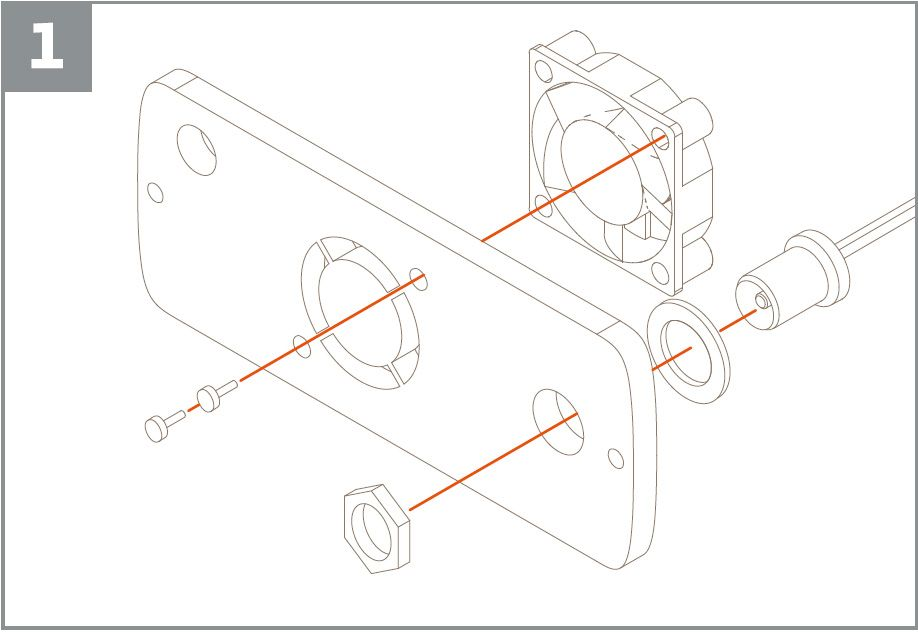
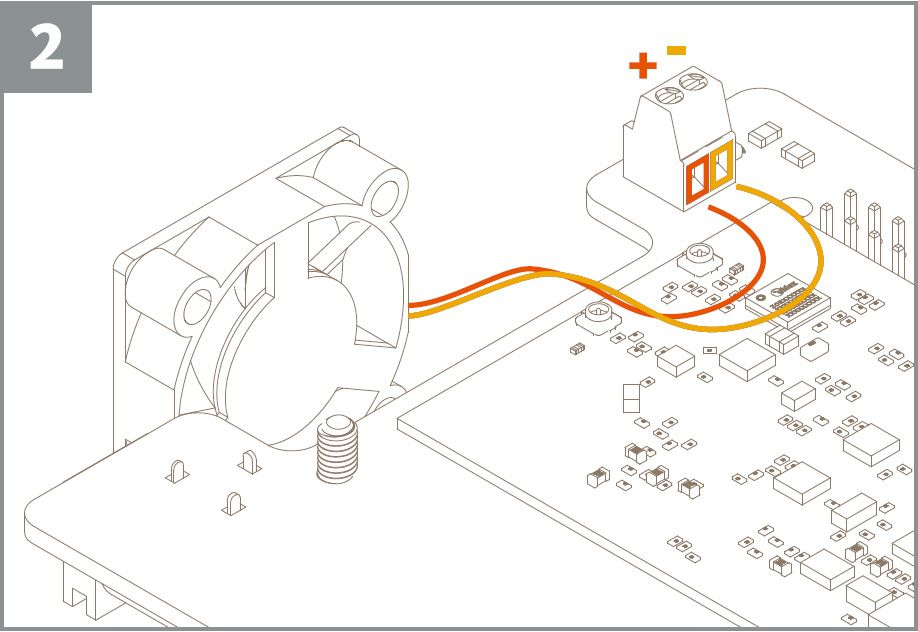
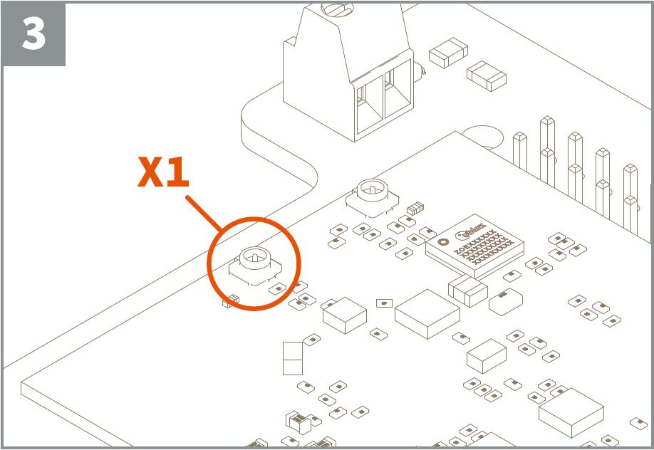
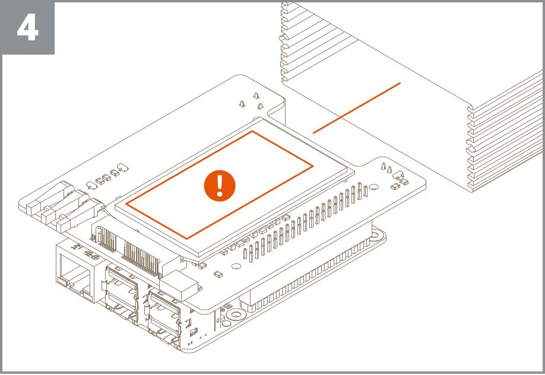
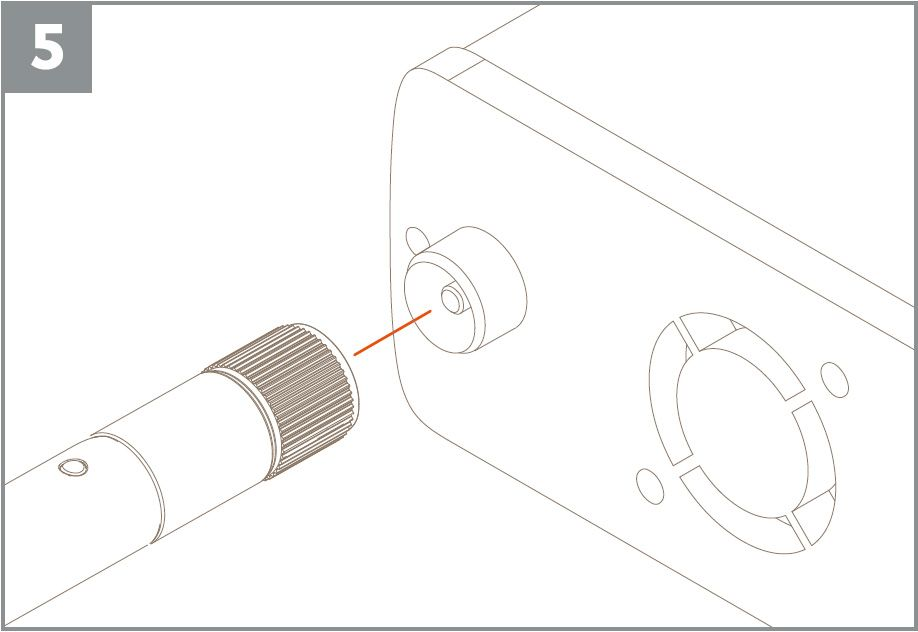
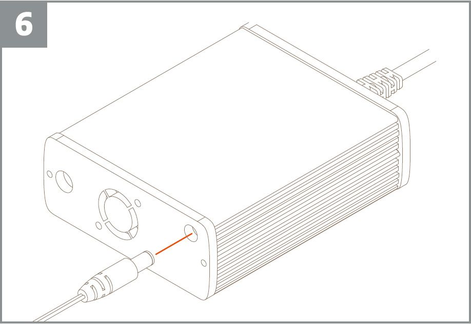

In this page we are going to give you all the information needed to assemble your Arduino Pro Gateway LoRa Connectivity Kit. We will guide you through the process needed to have a device fully assembled and ready to be configured on the software and network side as documented in the [Arduino Pro Gateway Setup](https://create.arduino.cc/getting-started/loragw/welcome).

## Hardware list

In the box you have several pieces and it is important to locate them all before you proceed.

- Aluminum enclosure
- Raspberry Pi 3 model B+
- Arduino Radio Module Adapter
- LoRa Radio module
- Fan
- Micro UFL to SMA Pigtail
- SMA Antenna
- MicroSD Card
- AC Power Adapter
- Ethernet Cable
- Nuts and bolts kit

## Preliminary operations

The LoRa Radio module has a label on top that contains some very important numbers. Take a picture of it or take note on paper of the codes because they will be used to register and activate your gateway. The components are sensitive to static electricity and we strongly suggest that you properly earth yourself before you touch them, keeping the grounding connection for all the assembly process.

## Assembly

Pick from the Nuts and Bolts kit the two screws necessary to fix the fan to the panel. Pick the Antenna connector (Micro UFL to SMA Pigtail) and secure it on the same panel of the fan, using the washer and the nut supplied. Everything should be as in picture 1.

Carefully pick the Raspberry Pi 3 model B+ and connect it to the Arduino Radio Module Adapter. The two matching connectors should be joined firmly and the four holes of the hex pillars should match with the ones on the Raspberry Pi 3 model B+. Use the supplied screws to secure the two boards together.

At this stage you may insert the MicroSD memory card - supplied with the OS preloaded and configured - in the slot of the Raspberry Pi 3 model B+ that it is positioned on the side opposite to the connectors. The card should get to the end of the slot with a “click”; to pull it out you should push it again and activate the spring that ejects it.

Now turn the ensemble to show the screw connector that is placed on the Arduino Radio Module Adapter and connect the fan wires as in picture 2.

With great care you now connect the SMA pigtail to the X1 connector highlighted in picture 3.

Everything is now ready to proceed in the assembly process into the Aluminum Enclosure. Please remember to take a picture or write down the code that is on the Radio Module as in picture 4.

The wires of the fan and of the pigtail require that you slot the boards from the USB and Ethernet into the enclosure. There are rails on both sides and you should ensure that the PCBs are properly sliding into these lateral rails.

You can check the alignment using the other panel supplied: when its holes match with the connectors everything is lined up properly. If the holes and the connectors don’t match, you need to slide out the boards and align them differently, until everything matches.

Use the supplied screws to fix both panels (fan and holes for USB and Ethernet) and enclose the boards sandwich firmly inside the aluminum box.

Now it is time to connect the external antenna to its connector, as in picture 5. Consider that the antenna needs to be positioned upright to have a proper signal coverage, so consider how you plan to fix the box (On a desk? On a wall?) and turn/bend it as explained.

Connect the Ethernet cable to your wired internet access.

Connect the Power Adapter to a plug that won’t be disconnected easily from the mains because any power interruption will require a reboot of the Arduino Pro Gateway LoRa Connectivity and may disrupt your LoRa network.

You should hear the fan and see some LEDs flashing inside. Everything is now ready to proceed to the [Arduino Pro Gateway Setup](https://create.arduino.cc/getting-started/loragw/welcome).