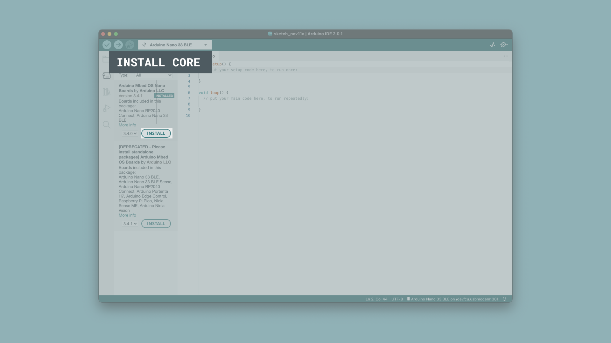

## Introduction

For some time you have been able to program selected Arduino boards using the OpenMV IDE and MicroPython. This gives you easy access to powerful technologies such as machine vision and machine learning.

With the release of the official MicroPython firmwares for the compatible Arduino boards, you have another option for programming your boards in MicroPython for when you don't need machine vision!

To run this firmware you can use the (experimental) Arduino Lab for MicroPython editor. This tutorial explains how to get started. To do this, you will need to flash a MicroPython firmware to your board that is specifically developed for each board.

## Goals

At the end of this guide you will have flashed a new firmware to your Arduino board, letting you connect to it with the Arduino Lab for MicroPython. 

## Requirements

To follow along with this article and get up and running with MicroPython on your board you are gonna require the following material:
- [An Arduino Nano 33 BLE](/hardware/nano-33-ble) / [Arduino Nano RP2040 Connect](/hardware/nano-rp2040-connect) / [Arduino Portenta H7](/hardware/portenta-h7)
- [Arduino IDE](https://www.arduino.cc/en/main/software)
- [Arduino Lab for MicroPython IDE](https://labs.arduino.cc/en/labs/micropython)
- [Firmware file](https://docs.arduino.cc/micropython/)

## Arduino Nano 33 BLE

The process for flashing the firmware on the Nano 33 BLE requires to first update the bootloader and SoftDevice. Once this is done you can flash the MicroPython firmware to your board.

### Installing the Core

Start by making sure that you have the respective core installed. Open the [Arduino IDE](https://www.arduino.cc/en/main/software) (not Arduino Lab for MicroPython) and navigate to the boards manager. Search for your board, and make sure you have the latest version of the core installed. More detailed information about this step can be found [here](/software/ide-v2/tutorials/ide-v2-board-manager).



This is not only needed to upload the next sketch, but you're also going to dive into the core files themselves to find a specific tool in an upcoming step.

### Update Bootloader

In the Nano 33 BLE core is an example sketch that you will use to update the bootloader and SoftDevice of your board. Go back to the Arduino IDE and navigate to `File > Examples > Nano33BLE_System > Nano33_updateBLandSoftDevice` and open the sketch.


Upload the sketch to your board. Beware! the bootloader is not updated just yet! Once the sketch is uploaded, you can interface with your board through the serial monitor to actually update the bootloader.

In the Serial monitor, you are asked to confirm that you want to update the bootloader. In the message text box in the top of the serial monitor, write a **"y"** and press enter to send it to your board. 

You can now watch as the bootloader update process progresses, **do not disconnect or reset your board during this process** or you could brick your board.

Once this bar completes, you will be prompted with another choice. This time it asks if you want to update the SoftDevice on your board. Repeat the process of sending a **"y"** to the board, and watch the progress of this too.

When this bar fills and the SoftDevice update completes, the board will restart, and you've successfully made it through the procedure. 

***Note: An important thing to do at this point which is easily forgotten is to close the serial monitor, we will need to use the serial port for other things very soon and if you leave the monitor open it will be busy and won't be able to receive any new interactions.***

### Downloading firmware

Now you will need to find the specific firmware that you need to flash to your board. You can find the available firmware on the [MicroPython page](/micropython). 

Download the `.bin` file that corresponds to the board you have. 

### Finding BOSSAC

In this step you will be diving into the core files you downloaded in the first step. This process will be different for you depending on if you're on a Windows or MacOS computer.

#### Windows

The file you will need to access can be found in 
```
C:\Users\{your-username}\AppData\Local\Arduino15\staging\packages\bossac-1.9.1-arduino2-windows.tar.gz\bossac-1.9.1-arduino2-windows.tar\bin\` 
```

and is named `bossac.exe`.

One you've found the file, extract it from the .tar archive and copy it somewhere else, your desktop for example. 

Open a command terminal and start typing in `start `, now drag and drop the bossac.exe file you've found into the terminal, and press enter.

If successful, another command terminal window should open in which you are able to execute the command that will flash your board with the MicroPython firmware.

Execute the following command, but replace the port with the name of the port where your board is connected, and the firmware file with the directory where you have placed the firmware you downloaded previously:

```
bossac -e -w --offset=0x16000 --port={port} -i -d -U -R {firmware}
```

Again, don't disconnect or power off your board during this part of the process, watch the progress of flashing the firmware to your board. Once complete, you're all set and you're ready to start programming the board in MicroPython.

Go to the Arduino Lab MicroPython IDE and press connect in the top left, choose the port, and you are now ready to program your Nano BLE Sense.

#### MacOS

The file you will need to access can be found in 
```
Users/{your-user}/Library/Arduino15/packages/arduino/tools/bossac/1.9.1-arduino2
```
 the file you are after is `bossac`

***Note: The `"Library"` directory is hidden, press `Shift + Command + . ` to reveal hidden directories.***

Open a terminal window and drag and drop the bossac file into the terminal window.

Now, you should be able to execute the command that will flash your board with the MicroPython firmware.

Execute the following command, but replace the port with the name of the port where your board is connected, and the firmware file with the directory where you have placed the firmware you downloaded previously:

```
bossac -e -w --offset=0x16000 --port={port} -i -d -U -R {firmware}
```

Again, don't disconnect or power off your board during this part of the process, watch the progress of flashing the firmware to your board. Once complete, you're all set and you're ready to start programming the board in MicroPython.

Go to the Arduino Lab MicroPython IDE and press connect in the top left, choose the port, and you are now ready to program your Nano BLE Sense.

## Arduino Nano RP2040 Connect

To program your Arduino Nano RP2040 board with MicroPython, follow the instructions just below. The Nano RP2040 is the easiest board to get started with MicroPython, as the installation requires no additional software tools for installation.

All you need to do is to:

1. Download the `.uf2` firmware file from the [MicroPython page](/micropython).
2. Connect the `REC` pin to ground to expose the boards file system to your computer, this is easier if you put the board in a breadboard.
3. Drag and drop the firmware file onto the boards flash storage which shows up as an external storage device on your computer, and you're done!

Go to the Arduino Lab MicroPython IDE and press connect in the top left, choose the port, and you are now ready to program your Nano RP2040 Connect.

## Arduino Portenta H7

To install MicroPython on the Portenta H7 you will need to install the corresponding core which in turn installs the required command line tool. Open Arduino IDE (not Arduino Lab for MicroPython) and navigate to the boards manager. Search for "Portenta H7", and make sure you have the latest version of the core installed.


This board can programmed via a DFU bootloader, using [dfu-util](http://dfu-util.sourceforge.net/). To enter the DFU bootloader, double tap the reset button on the board.

### Downloading firmware

Now you will need to find the specific firmware that you need to flash to your board. You can find the available firmware on the [MicroPython](https://docs.arduino.cc/micropython/) documentation site. The firmware is available as a `.dfu` file for the Portenta H7.

### Finding dfu-util

In this step you will be diving into the core files you downloaded in the first step. This process will be different for you depending on if you're on a Windows or MacOS computer.

#### Windows

The file you will need to access can be found in 
```     
C:\Users\{your username}\AppData\Local\Arduino15\staging\packages\dfu-util-0.10.0-arduino1-windows.tar.bz2\dfu-util-0.10.0-arduino1-windows.tar\windows\ 
```
and is named `dfu-util.exe`.

One you've found the file, extract it from the .tar archive and copy it somewhere else, your desktop for example. 

Open a command terminal and start typing in `start `, now drag and drop the dfu-util.exe file you've found into the terminal, and press enter.

If successful, another command terminal window should open in which you are able to execute the command that will flash your board with the MicroPython firmware.

Double tap the reset button on your board to put it in DFU mode, and execute the following command, but replace the path of the firmware file with the directory where you have placed the firmware you downloaded previously:

```
dfu-util -a 0 -d 0x2341:0x035b -D {firmware.dfu}
```

Again, don't disconnect or power off your board during this part of the process, watch the progress of flashing the firmware to your board.

You should now see **two** progress bars appear in one after the other. The first one is showing the progress of erasing the firmware that was previously on the board, and the second one is showing the progress of flashing the new firmware. 

Once complete, you're all set and you're ready to start programming the board in MicroPython.

Go to the Arduino Lab MicroPython IDE and press connect in the top left, choose the port, and code away!

#### MacOS

The file you will need to access can be found in 
```
Users/{your-user}/Library/Arduino15/packages/arduino/tools/dfu-util/0.10.0-arduino1/dfu-util
```
the file you are after is `dfu-util`

***Note: The `"Library"` directory is hidden, press `Shift + Command + . ` to reveal hidden directories.*** 

Open a terminal window and drag and drop the dfu-util file into the terminal window.

Now, you should be able to execute the command that will flash your board with the MicroPython firmware.

Double tap the reset button on your board to put it in DFU mode, and execute the following command, but replace the path of the firmware file with the directory where you have placed the firmware you downloaded previously:

```
dfu-util -a 0 -d 0x2341:0x035b -D {firmware.dfu}
```

Again, don't disconnect or power off your board during this part of the process, watch the progress of flashing the firmware to your board. 

You should now see **two** progress bars appear in one after the other. The first one is showing the progress of erasing the firmware that was previously on the board, and the second one is showing the progress of flashing the new firmware. 

Once complete, you're all set and you're ready to start programming the board in MicroPython.

Go to the Arduino Lab MicroPython IDE and press connect in the top left, choose the port, and code away!

### Flashing The Firmware

With the tool installed execute the following command `dfu-util -a 0 -d 0x2341:0x035b -D firmware.dfu`

## Conclusion

You have by now flashed your Arduino board with the firmware required to program it with the MicroPython language, which opens the door to many exciting projects! Have fun exploring the new possibilities of your Arduino board!
