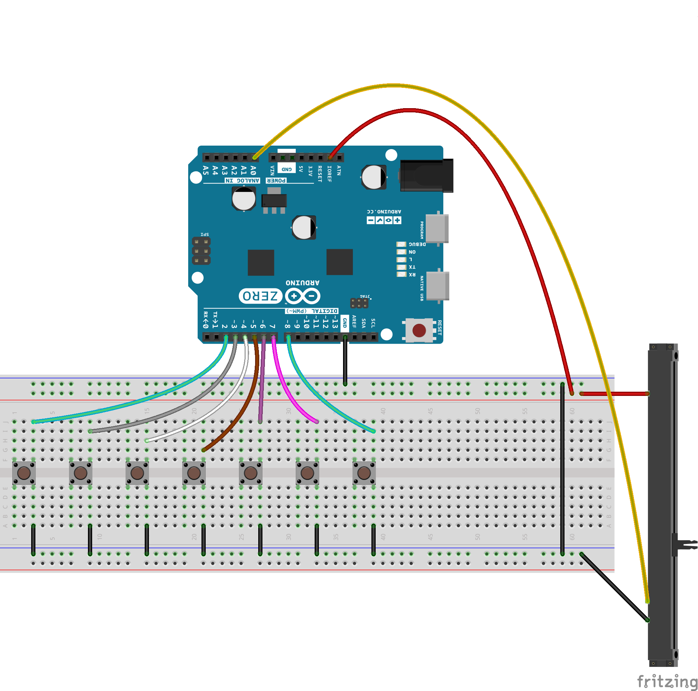
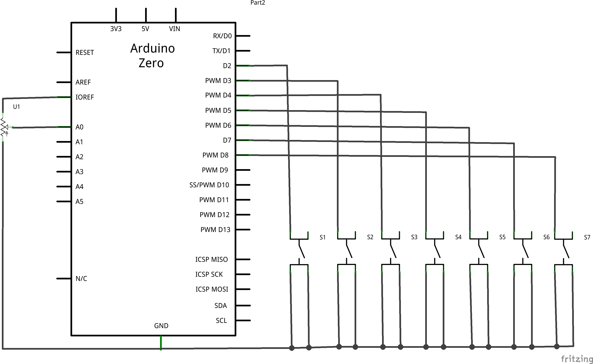

## Introduction
This tutorial shows how ho use the **Native USB port** of an Arduino Zero, Due or 101 board as a MIDI device using the  [Arduino MIDI USB library](https://github.com/arduino-libraries/MIDIUSB).

## Goals

- Learn how to create a MIDI device
- Control the velocity of a note with a linear potentiometer
- Use the Arduino to play notes on a virtual synthesizer


## Hardware & Software Needed

- Arduino Board with a Native USB port ([Zero](https://store.arduino.cc/arduino-zero), [Due](https://store.arduino.cc/arduino-due), [101](https://store.arduino.cc/arduino-101-619), [Micro](https://store.arduino.cc/arduino-micro), [Leonardo](https://store.arduino.cc/arduino-leonardo-with-headers))
- 7 tactile push-buttons Normally Open
- 10k Ω linear potentiometer
- Jumper wires
- Arduino IDE ([online](https://create.arduino.cc/) or [offline](https://www.arduino.cc/en/main/software)).
- [Arduino MIDI USB library](https://github.com/arduino-libraries/MIDIUSB)

### MIDI Sound Generation on Linux

If you use a Linux machine as the sound generating device, the test procedure described in the main page of the [library on Github](https://github.com/arduino-libraries/MIDIUSB) must be followed to make this example work in the right way. In particular it is necessary to load the correct drivers and soundbank as described in the first part of the explanation. Free soundbanks can be easily found on the web searching for **free soundbanks .sf2**

### MIDI Sound Generation on Windows

The Windows Operating System has a software synth that works with General Standard MIDI commands since the early versions. It needs to be used by the proper MIDI software so that it gets the MIDI messages. This may be achieved with a variety of applications that route, connect or generate the streams between OUT and IN devices.   The MIDI sound generator is therefore not directly driven by a MIDI device, like ours. As the routing software we suggest an open source application that allows us to route our MIDI OUT device to the MIDI IN of a software synth. [Virtual MIDI Piano Keyboard](http://vmpk.sourceforge.net/) allows us to properly configure the connections and it is also useful on OSX and Linux to manage the software sound generators.

Virtual MIDI Piano Keyboard is a MIDI events generator and receiver. It doesn't produce any sound by itself, but can be used to drive a MIDI synthesizer. It allows to use the computer's mouse and keyboard to play MIDI notes. Virtual MIDI Piano Keyboard can be also used to display the played MIDI notes from an instrument  MIDI OUT stream or MIDI file player.

The stream of notes and commands routed by VMPK may drive the built-in "Microsoft GS Wavetable Synth", but the soundbanks are not too cool. We suggest that you download and use this  [CoolSoft Virtual MIDI Synth](http://coolsoft.altervista.org/it/virtualmidisynth) that supports soundfonts and also sounds great.


### Circuit



### Schematic




## Programming the Board

**1.** First, let's make sure we have correct the drivers installed. If we are using the Web Editor, we do not need to install anything. If we are using an offline editor, we need to install it manually. This can be done by navigating to **Tools > Board > Board Manager...**. Here we need to look for the **Arduino SAM boards (32-bits ARM Cortex-M3)** or if you are using the Zero **Arduino SAMD boards (32-bits Arm® Cortex®-M0+)** and install it. 

**2.** Now, we need to install the libraries needed. Simply go to **Tools > Manage libraries...** and search for **MIDIUSB** and install it.


## Code

### MIDI Messages

In this example basically two MIDI messages are sent:

- noteOn message: to state which note must be played;

- noteOff message: to state which note previously played must be turned off;

The noteOff message is important because the MIDI protocol is event based and the pressure of a key triggers a sound generator that stays on with the specified note until another event is sent, as note off, signaling that the same key has been released and the generator should stop. Each noteOn requires a noteOff or a "all Notes Off" message.

### Note Velocity

In the prototype of the used functions, a parameter called **velocity** is present. This name can be interpreted as a false friend since it indicates how **loud** is the note and **not** for how long the note is on. This is part of MIDI specs. Some musical keyboards are velocity sensitive and use the speed of the note press as a measure of the loudness that the player wants to use for that note. A piano works in this way. The velocity parameter is controlled by means of the linear potentiometer attached to the A0 input.

In the code the various pitches associated to the notes are defined in a separate header files included at the very beginning of the sketch. We suggest to go the the [GitHub repository](https://github.com/arduino/tutorials/tree/master/ArduinoZeroMidi) to follow this example.

The keys and the linear potentiometer are associated to the pins by means of the following numeric constants.

```arduino
const uint8_t button1 = 2;

const uint8_t button2 = 3;

const uint8_t button3 = 4;

const uint8_t button4 = 5;

const uint8_t button5 = 6;

const uint8_t button6 = 7;

const uint8_t button7 = 8;

const int intensityPot = 0;  //A0 input
```

Please note that the intensityPot is defined equal to 0 because the define A0 is associated to the respective note in this particular example.

The notes to be played (from left to right in the breadboard related image) can be changed modifying the values of the following vector:

```arduino
const byte notePitches[NUM_BUTTONS] = {C3, D3, E3, F3, G3, A3, B3};
```

The function `void readButtons()` is used to make a mask of the buttons that has been pressed and so be able to play the associated notes by means of the function `void playNotes()`.

Here is the complete sketch:

```arduino

/*

   This examples shows how to make a simple seven keys MIDI keyboard with volume control

   Created: 4/10/2015

   Author: Arturo Guadalupi <a.guadalupi@arduino.cc>


   http://www.arduino.cc/en/Tutorial/MidiDevice

*/

#include "MIDIUSB.h"
#include "PitchToNote.h"
#define NUM_BUTTONS  7

const uint8_t button1 = 2;

const uint8_t button2 = 3;

const uint8_t button3 = 4;

const uint8_t button4 = 5;

const uint8_t button5 = 6;

const uint8_t button6 = 7;

const uint8_t button7 = 8;

const int intensityPot = 0;  //A0 input

const uint8_t buttons[NUM_BUTTONS] = {button1, button2, button3, button4, button5, button6, button7};

const byte notePitches[NUM_BUTTONS] = {C3, D3, E3, F3, G3, A3, B3};

uint8_t notesTime[NUM_BUTTONS];

uint8_t pressedButtons = 0x00;

uint8_t previousButtons = 0x00;

uint8_t intensity;

void setup() {

  for (int i = 0; i < NUM_BUTTONS; i++)

    pinMode(buttons[i], INPUT_PULLUP);
}

void loop() {

  readButtons();

  readIntensity();

  playNotes();
}

// First parameter is the event type (0x0B = control change).
// Second parameter is the event type, combined with the channel.
// Third parameter is the control number number (0-119).
// Fourth parameter is the control value (0-127).

void controlChange(byte channel, byte control, byte value) {

  midiEventPacket_t event = {0x0B, 0xB0 | channel, control, value};

  MidiUSB.sendMIDI(event);
}

void readButtons()
{

  for (int i = 0; i < NUM_BUTTONS; i++)

  {

    if (digitalRead(buttons[i]) == LOW)

    {

      bitWrite(pressedButtons, i, 1);

      delay(50);

    }

    else

      bitWrite(pressedButtons, i, 0);

  }
}

void readIntensity()
{

  int val = analogRead(intensityPot);

  intensity = (uint8_t) (map(val, 0, 1023, 0, 127));
}

void playNotes()
{

  for (int i = 0; i < NUM_BUTTONS; i++)

  {

    if (bitRead(pressedButtons, i) != bitRead(previousButtons, i))

    {

      if (bitRead(pressedButtons, i))

      {

        bitWrite(previousButtons, i , 1);

        noteOn(0, notePitches[i], intensity);

        MidiUSB.flush();

      }

      else

      {

        bitWrite(previousButtons, i , 0);

        noteOff(0, notePitches[i], 0);

        MidiUSB.flush();

      }

    }

  }
}

// First parameter is the event type (0x09 = note on, 0x08 = note off).
// Second parameter is note-on/note-off, combined with the channel.
// Channel can be anything between 0-15. Typically reported to the user as 1-16.
// Third parameter is the note number (48 = middle C).
// Fourth parameter is the velocity (64 = normal, 127 = fastest).

void noteOn(byte channel, byte pitch, byte velocity) {

  midiEventPacket_t noteOn = {0x09, 0x90 | channel, pitch, velocity};

  MidiUSB.sendMIDI(noteOn);
}

void noteOff(byte channel, byte pitch, byte velocity) {

  midiEventPacket_t noteOff = {0x08, 0x80 | channel, pitch, velocity};

  MidiUSB.sendMIDI(noteOff);
}
```

## Testing It Out

 After you upload the code to the board, set up your Windows machine like this:

- [Download](http://coolsoft.altervista.org/it/virtualmidisynth#download) and install CoolSoft Virtual MIDI Synth
- Launch Configure Virtual MIDI Synth
- In the MIDI mapper tab select **CoolSoftVirtualMIDISynth** as Windows Media Player Default Peripheral
- In the Options tab select your preferred Audio Output
- [Download](http://vmpk.sourceforge.net/#Download) and install Virtual Piano MIDI Keyboard
- Launch VPMK and click on Edit->MIDI connections
- In the MIDI In Driver list select Windows MM
- In the Input MIDI Connection list select Arduino Zero
- In the MIDI Out Driver list select FluidSynth
- Enjoy using your Arduino board to generate music on your computer!


### Troubleshoot

If the code is not working, there are some common issues we can troubleshoot:

- You have not configured **Coolsoft virtual MIDI synth** correctly
- You have not installed the correct libraries
- The wiring is incorrect

## Conclusion

In this example, we have learned how to create a MIDI device with an Arduino board that possesses a **Native USB** port along with software like **CoolSoftVirtualMIDISynth** and **Virtual Piano MIDI Keyboard**. It is an awesome way of generating music on your computer.