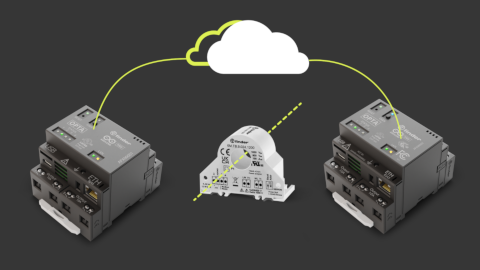

The Pro Industrial Automation and Lighting Kit is the perfect way to learn and create solutions focused on a micro PLC programming environment, industrial communication protocols and control applications.

- Develop experience in programming a micro PLC with IEC 61131-3 languages or Arduino C++ to realize a small industrial control system.
- Experience multiple communication features (Ethernet and WiFi) and get familiar with Fieldbus communications (Modbus RTU through RS485 and Modbus TCP through Ethernet).

## The Kit

The following items are included in the kit:

| Quantity |                  Element                  |       SKU        |
|:--------:|:-----------------------------------------:|:----------------:|
|    1     |            Arduino Opta RS485             |     AFX00001     |
|    1     |             Arduino Opta WiFi             |     AFX00002     |
|    1     | Single phase power analyzer AC/DC - 100 A | 6M.TB.9.024.1200 |
|    1     |      Switching Power Supply for Opta      | 78.12.1.230.2482 |
|    1     |   Cloud for business - 3 Months Voucher   |        -         |

Additionally, you may need the following accessories:

* USB-C® cable (x1)
* Solar panel with respective system (Controller, battery, and inverter) or similar power system
* RS-485 connection wire STP/UTP 24-18AWG (Unterminated) 100-130Ω rated (x3)
* RS-485 connection wire STP/UTP 22-16AWG (Terminated) 100-130Ω rated (x3)

## Getting Started with Your Kit

1. Get to [cloud.arduino.cc](https://cloud.arduino.cc/), sign in or Create an Arduino account. Rescue your Arduino Cloud 3 months voucher code using this [Procedure](https://docs.arduino.cc/tutorials/generic/cloud-business-voucher-redeem) and [Get Started](https://docs.arduino.cc/arduino-cloud/getting-started/arduino-cloud-for-business!)

2. Download [Arduino IDE](https://www.arduino.cc/en/software#future-version-of-the-arduino-ide) and follow the [Installation Procedure](https://docs.arduino.cc/software/ide-v2/tutorials/getting-started/ide-v2-downloading-and-installing) and [Get Started with it](https://docs.arduino.cc/software/ide-v2/tutorials/getting-started-ide-v2)

3. Download [Arduino PLC IDE](https://www.arduino.cc/en/software#arduino-plc-ide) and follow the [Installation Procedure](https://docs.arduino.cc/software/plc-ide/tutorials/plc-ide-setup-license) and [Get Started with it](https://docs.arduino.cc/software/plc-ide/tutorials/plc-programming-introduction)

4. Check the [Opta docs](https://docs.arduino.cc/hardware/opta) to retrieve the product resources. Carefully read the [datasheet](https://docs.arduino.cc/resources/datasheets/AFX00001-AFX00002-AFX00003-datasheet.pdf) and the [User Manual](https://docs.arduino.cc/tutorials/opta/user-manual). On [docs.arduino.cc](http://docs.arduino.cc) is also available the [Pinout](https://docs.arduino.cc/resources/pinouts/opta-full-pinout.pdf).

5. Start practicing the first examples included in the user manual, the IDE examples, and deep dive into the knowledge topics needed to exploit all the product’s features such as [Modbus Protocol](https://docs.arduino.cc/learn/communication/modbus) and the experiences proposed below.

## Experiences Proposed

If you want to learn more about the technologies of the kit, we propose the following experiences:

|                                                Experience                                                | Opta RS485 | Opta WiFi |
|:--------------------------------------------------------------------------------------------------------:|:----------:|:---------:|
| [Energy Management with Opta](https://docs.arduino.cc/tutorials/opta/energy-management-application-note) |    Yes     |    Yes    |
|   [Home Automation with Opta](https://docs.arduino.cc/tutorials/opta/home-automation-application-note)   |            |    Yes    |
|      [Tank Level Monitoring with Opta](https://docs.arduino.cc/tutorials/opta/tank-level-app-note)       |    Yes     |    Yes    |

The experiences marked with a `Yes` are the ones related to the product. Experiences marked with a `+` means that to follow the tutorial you must use all the products with the `+` symbol.

## Support

If you encounter any issues or have questions, we offer various support resources to help you find answers and solutions. In case of any issues with the redemption process, please contact us by filling out the form available [here](https://www.arduino.cc/en/contact-us/).