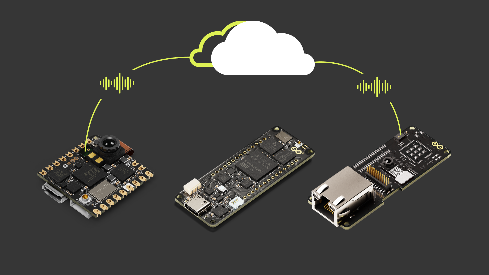

The Pro Edge AI/ML: Vision and Speech Kit is the perfect way to learn and create solutions focused on artificial intelligence using computer vision, speech recognition, and machine learning on the Edge:

- Practice with Edge AI tools to implement automation systems capable of image recognition and classification for object shape and position detection.
- Get familiar with Speech Recognition tools to realize voice-controlled applications, capable of being part of hands-free systems or out-of-reach equipment.
- Integrate all with remote control thanks to the Arduino Cloud, experiencing the Arduino C++ based programming easiness.

## The Kit

The following items are included in the kit:

| Quantity |                  Element                  |   SKU    |
| :------: | :---------------------------------------: | :------: |
|    1     |                Portenta H7                | ABX00042 |
|    1     | Portenta Vision Shield - Ethernet Variant | ASX00021 |
|    1     |               Nicla Vision                | ABX00051 |
|    1     |        Enclosure for Nicla Vision         | AKX00063 |
|    1     |   Cloud for business - 3 Months Voucher   |    -     |
|    2     | Arduino Speech Recognition Engine License | AVX00032 |

Additionally you may need the following accessories:

* Micro-USB cable (x1)
* USB-C® cable (x1)
* 3.7 V Li-Po battery to externally power the Nicla Vision

## Getting Started with Your Kit

1. Get to [https://cloud.arduino.cc/](https://cloud.arduino.cc/), sign in or Create an Arduino account. Rescue your Arduino Cloud 3 months voucher code using this [Procedure](https://docs.arduino.cc/tutorials/generic/cloud-business-voucher-redeem) and [Get Started with Arduino Cloud For Business](https://docs.arduino.cc/arduino-cloud/getting-started/arduino-cloud-for-business)!

2. Download the [Arduino IDE](https://www.arduino.cc/en/software#future-version-of-the-arduino-ide), follow the [Installation Procedure](https://docs.arduino.cc/software/ide-v2/tutorials/getting-started/ide-v2-downloading-and-installing) and [Get Started with it](https://docs.arduino.cc/software/ide-v2/tutorials/getting-started-ide-v2).

3. [Get started](https://docs.arduino.cc/tutorials/portenta-vision-shield/speech-recognition-engine) with your Speech Recognition Engine and redeem the voucher on the [License Activation platform](https://tool.cyberon.com.tw/ArduinoDSpotterAuth/CFMain.php).

4. Check the [Portenta H7 docs](https://docs.arduino.cc/hardware/portenta-h7) to retrieve the product resources. Carefully read the [datasheet](https://docs.arduino.cc/resources/datasheets/ABX00042-ABX00045-ABX00046-datasheet.pdf) and [Set it up](https://docs.arduino.cc/tutorials/portenta-h7/setting-up-portenta). On [docs.arduino.cc](http://docs.arduino.cc) the [Pinout](https://docs.arduino.cc/resources/pinouts/ABX00042-full-pinout.pdf) and the [Schematics](https://docs.arduino.cc/resources/schematics/ABX00042-schematics.pdf) are also available.

5. Check this video to see how to assemble your Nicla boards into their enclosures. This will facilitate the deployment of your solutions and improve their robustness and security.

    

      <video width="75%" controls="true">
      <source src="assets/vision-enclosure.mp4" type="video/mp4"/>
      </video>
    

6. Check the [Portenta Vision Shield docs](https://docs.arduino.cc/hardware/portenta-vision-shield) to retrieve the product resources. Carefully read the [datasheet](https://docs.arduino.cc/resources/datasheets/ASX00021-ASX00026-datasheet.pdf), [Set it up](https://docs.arduino.cc/tutorials/portenta-vision-shield/getting-started-camera) and check how to [use it with Arduino IDE](https://docs.arduino.cc/tutorials/portenta-vision-shield/ethernet-with-ide). On [docs.arduino.cc](http://docs.arduino.cc) the [Pinout](https://docs.arduino.cc/resources/pinouts/ASX00021-ASX00026-full-pinout.pdf) and the [Schematics](https://docs.arduino.cc/resources/schematics/ASX00026-schematics.pdf) are also available.

7. Check the [Nicla Vision docs](https://docs.arduino.cc/hardware/nicla-vision) to retrieve the product resources. Carefully read the [datasheet](https://docs.arduino.cc/resources/datasheets/ABX00051-datasheet.pdf). On [docs.arduino.cc](http://docs.arduino.cc) the [Pinout](https://docs.arduino.cc/resources/pinouts/ABX00051-full-pinout.pdf) and [Schematics](https://docs.arduino.cc/resources/schematics/ABX00051-schematics.pdf) are also available.

8. Start practicing the first examples included in the products user manuals, the IDE examples and the experiences proposed in the following section.

## Experiences Proposed

If you want to learn more about the technologies of the kit, we propose the following experiences:

|                                                                     Experience                                                                     | Portenta H7  | Portenta Vision Shield | Nicla Vision |
| :------------------------------------------------------------------------------------------------------------------------------------------------: | :-: | :-----------: | :----------: |
|                         [BLE Connectivity on Portenta H7](https://docs.arduino.cc/tutorials/portenta-h7/ble-connectivity)                          | Yes |               |              |
|                        [Creating GUIs with LVGL (V7)](https://docs.arduino.cc/tutorials/portenta-h7/creating-gui-with-lvgl)                        | Yes |               |              |
|                             [Dual Core Processing](https://docs.arduino.cc/tutorials/portenta-h7/dual-core-processing)                             | Yes |               |              |
|            [Creating a Flash-Optimized Key-Value Store](https://docs.arduino.cc/tutorials/portenta-h7/flash-optimized-key-value-store)             | Yes |               |              |
|          [Getting Started with OpenMV and MicroPython](https://docs.arduino.cc/tutorials/portenta-h7/getting-started-openmv-micropython)           | Yes |               |              |
|       [Using the Portenta Vision Shield - Ethernet with OpenMV](https://docs.arduino.cc/tutorials/portenta-vision-shield/ethernet-with-openmv)       |  +  |       +       |              |
|                        [Getting Started with Nicla Vision](https://docs.arduino.cc/tutorials/nicla-vision/getting-started)                         |     |               |     Yes      |
|           [Flashing MicroPython Firmware to your Arduino Board](https://docs.arduino.cc/tutorials/portenta-h7/micropython-installation)            | Yes |               |              |
|                  [Arduino Portenta H7 MicroPython Cheat Sheet](https://docs.arduino.cc/tutorials/portenta-h7/openmv-cheat-sheet)                   | Yes |               |              |
|            [Over-The-Air (OTA) Updates with the Arduino Portenta H7](https://docs.arduino.cc/tutorials/portenta-h7/over-the-air-update)            | Yes |               |              |
|                   [Reading and Writing Flash Memory](https://docs.arduino.cc/tutorials/portenta-h7/reading-writing-flash-memory)                   | Yes |               |              |
|                              [Secure Boot on Portenta H7](https://docs.arduino.cc/tutorials/portenta-h7/secure-boot)                               | Yes |               |              |
|        [Voice Commands With The Arduino Speech Recognition Engine](https://docs.arduino.cc/tutorials/portenta-h7/speech-recognition-engine)        |  +  |       +       |     Yes      |
|                     [Updating the Portenta Bootloader](https://docs.arduino.cc/tutorials/portenta-h7/updating-the-bootloader)                      | Yes |               |              |
|                                [Portenta H7 as a USB Host](https://docs.arduino.cc/tutorials/portenta-h7/usb-host)                                 | Yes |               |              |
|                       [Portenta H7 as a Wi-Fi Access Point](https://docs.arduino.cc/tutorials/portenta-h7/wifi-access-point)                       | Yes |               |              |
|                 [Blob Detection with Portenta and OpenMV](https://docs.arduino.cc/tutorials/portenta-vision-shield/blob-detection)                 |  +  |       +       |              |
|                            [Blob Detection with OpenMV](https://docs.arduino.cc/tutorials/nicla-vision/blob-detection)                             |     |               |     Yes      |
|          [Saving Bitmap Camera Images to the SD Card](https://docs.arduino.cc/tutorials/portenta-vision-shield/camera-to-bitmap-sd-card)           |  +  |       +       |              |
|          [Creating a Basic Face Filter With OpenMV](https://docs.arduino.cc/tutorials/portenta-vision-shield/creating-basic-face-filter)           |  +  |       +       |              |
| [Training a Custom Machine Learning Model for Portenta H7](https://docs.arduino.cc/tutorials/portenta-vision-shield/custom-machine-learning-model) |  +  |       +       |              |
|                   [Image Classification with Edge Impulse®](https://docs.arduino.cc/tutorials/nicla-vision/image-classification)                   |     |               |     Yes      |
|               [Reading Audio Samples With the Onboard Microphone](https://docs.arduino.cc/tutorials/nicla-vision/microphone-sensor)                | Yes |               |              |
|                       [Accessing IMU Data on Nicla Vision](https://docs.arduino.cc/tutorials/nicla-vision/nicla-vision-imu)                        | Yes |               |              |
|                     [Proximity Detection with Arduino Nicla Vision](https://docs.arduino.cc/tutorials/nicla-vision/proximity)                      | Yes |               |              |

The experiences marked with a `Yes` are the ones related to the product. Experiences marked with a `+` means that to follow the tutorial you must use all the products with the `+` symbol.

## Support

If you encounter any issues or have questions, we offer various support resources to help you find answers and solutions. In case of any issues with the redemption process, please contact us by filling out the form available [here](https://www.arduino.cc/en/contact-us/).
