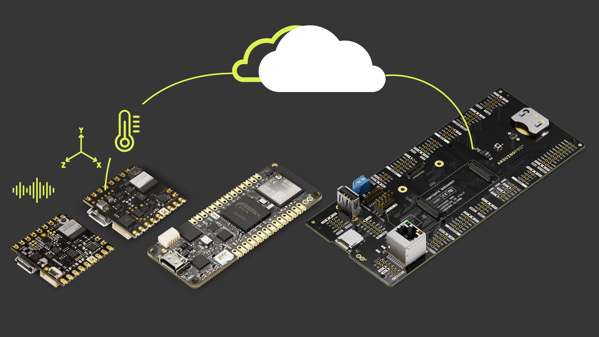

The Pro Smart Industry Predictive Maintenance Kit is the perfect way to learn and create solutions focused on artificial intelligence using sound recognition, environmental sensing, and machine learning on the Edge:

- Practice with Edge AI tools to implement automation systems capable of recognizing Voice Commands and sensing environmental data to trigger processes.
- Integrate all with remote control thanks to the Arduino Cloud, experiencing the Arduino C++ based programming easiness.

## The Kit

The following items are included in the kit:

| Quantity |                Element                |   SKU    |
|:--------:|:-------------------------------------:|:--------:|
|    1     |              Nicla Voice              | ABX00061 |
|    1     |            Nicla Sense ME             | ABX00050 |
|    1     |     Enclosure for Nicla Sense ME      | AKX00064 |
|    1     |       Enclosure for Nicla Voice       | AKX00065 |
|    1     |             Portenta C33              | ABX00074 |
|    1     |           Portenta Breakout           | ASX00031 |
|    1     | Cloud for business - 3 Months Voucher |    -     |

Additionally, you may need the following accessories:

* Micro-USB cable (x1)
* USB-C® cable (x1)
* 3.7 V Li-Po battery to externally power the Nicla boards (x2)
* DC brushless fan Model: LD3007MS (x1)
* 5 VDC wall power adapter (x1)
* Male headers to solder Nicla boards

## Getting Started with Your Kit

1. Get to [cloud.arduino.cc](https://cloud.arduino.cc/), sign in or Create an Arduino account. Rescue your Arduino IoT Cloud 3 months voucher code using this [Procedure](https://docs.arduino.cc/tutorials/generic/cloud-business-voucher-redeem) and [Get Started](https://docs.arduino.cc/arduino-cloud/getting-started/arduino-cloud-for-business) with Arduino Cloud For Business!

2. Download [Arduino IDE](https://www.arduino.cc/en/software#future-version-of-the-arduino-ide) and follow the [Installation Procedure](https://docs.arduino.cc/software/ide-v2/tutorials/getting-started/ide-v2-downloading-and-installing) and [Get Started with it](https://docs.arduino.cc/software/ide-v2/tutorials/getting-started-ide-v2)

3. Check the [Nicla Voice docs](https://docs.arduino.cc/hardware/nicla-voice) to retrieve the product resources. Carefully read the [datasheet](https://docs.arduino.cc/resources/datasheets/ABX00061-datasheet.pdf) and [User Manual](https://docs.arduino.cc/tutorials/nicla-voice/user-manual). On [docs.arduino.cc](http://docs.arduino.cc/) are also available the [Pinout](https://docs.arduino.cc/resources/pinouts/ABX00061-full-pinout.pdf) and [Schematics](https://docs.arduino.cc/resources/schematics/ABX00061-schematics.pdf)

4. Check the [Nicla Sense ME docs](https://docs.arduino.cc/hardware/nicla-sense-me) to retrieve the product resources. Carefully read the [datasheet](https://docs.arduino.cc/resources/datasheets/ABX00050-datasheet.pdf), consult the [Cheat Sheet](https://docs.arduino.cc/tutorials/nicla-sense-me/cheat-sheet) and [Set it up](https://docs.arduino.cc/software/ide-v1/tutorials/getting-started/cores/arduino-mbed_nicla). On [docs.arduino.cc](http://docs.arduino.cc/) are also available the [Pinout](https://docs.arduino.cc/resources/pinouts/ABX00050-full-pinout.pdf) and [Schematics](https://docs.arduino.cc/resources/schematics/ABX00050-schematics.pdf)

5. Check the [Portenta C33 docs](https://docs.arduino.cc/hardware/portenta-c33) to retrieve the product resources. Carefully read the [datasheet](https://docs.arduino.cc/resources/datasheets/ABX00074-datasheet.pdf) and [User Manual](https://docs.arduino.cc/tutorials/portenta-c33/user-manual). On [docs.arduino.cc](http://docs.arduino.cc/) are also available the [Pinout](https://docs.arduino.cc/resources/pinouts/ABX00074-full-pinout.pdf) and [Schematics](https://docs.arduino.cc/resources/schematics/ABX00074-schematics.pdf)

6. Check the [Portenta Breakout docs](https://docs.arduino.cc/hardware/portenta-breakout) to retrieve the product resources. Carefully read the [datasheet](https://docs.arduino.cc/resources/datasheets/ASX00031-datasheet.pdf) and the [Getting Started guide](https://docs.arduino.cc/tutorials/portenta-breakout/getting-started). On [docs.arduino.cc](http://docs.arduino.cc/) are also available the [Pinout](https://docs.arduino.cc/resources/pinouts/ASX00031-full-pinout.pdf) and [Schematics](https://docs.arduino.cc/resources/schematics/ASX00031-schematics.pdf)

7. Start practicing the first examples included in the user manual, the IDE examples and the experiences proposed below.

## Experiences Proposed

If you want to learn more about the technologies of the kit, we propose the following experiences:

|                                                            Experience                                                             | C33 | Nicla Voice | Nicla Sense ME |
|:---------------------------------------------------------------------------------------------------------------------------------:|:---:|:-----------:|:--------------:|
|    [Door Intruder Detector Using ML with the Nicla Voice](https://docs.arduino.cc/tutorials/nicla-voice/ei-intruder-detector)     |     |     Yes     |                |
|   [Audio Analysis with Machine Learning and the Nicla Voice](https://docs.arduino.cc/tutorials/nicla-voice/getting-started-ml)    |     |     Yes     |                |
| [Motion Detection with Nicla Voice and Machine Learning Tools](https://docs.arduino.cc/tutorials/nicla-voice/motion-detection-ml) |     |     Yes     |                |
|                [Sensors Readings on a Local Webserver](https://docs.arduino.cc/tutorials/nicla-sense-me/cli-tool)                 |     |             |      Yes       |
|   [Displaying on-Board Sensor Values on a WebBLE Dashboard](https://docs.arduino.cc/tutorials/nicla-sense-me/web-ble-dashboard)   |     |             |      Yes       |
|       [Energy Metering with the Portenta C33](https://docs.arduino.cc/tutorials/portenta-c33/energy-meter-application-note)       | Yes |             |                |

The experiences marked with a `Yes` are the ones related to the product. Experiences marked with a `+` means that the product can be used with the experience even when the tutorials are using another board or compatible product.

## Support

If you encounter any issues or have questions, we offer various support resources to help you find answers and solutions. In case of any issues with the redemption process, please contact us by filling out the form available [here](arduino.cc/en/contact-us/).