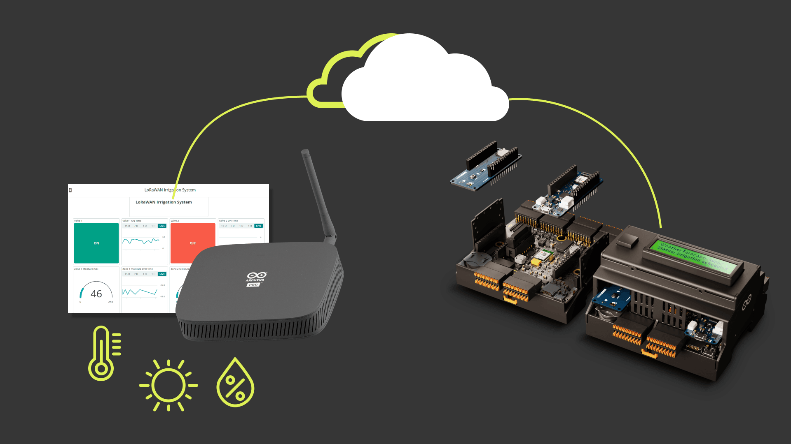

The Pro Smart Agriculture and Irrigation Kit is the perfect way to learn and create solutions focused on Smart Farming developments, low-energy wireless technologies, and remote monitoring with the Cloud.

- Connect sensors and drive actuators to automate your irrigation processes.
- Easily implement precision farming, monitoring real-time weather conditions, soil quality, crop’s growth, among other parameters and use Arduino Cloud to generate valuable analytics to support business processes at various levels, including plant growth, equipment efficiency, staff performance, and much more.
- Connect your devices through WisGate Edge Lite, to add LoRa® connectivity layer and extend the possibility of connecting it in open field. 

## The Kit

The following items are included in the kit:

| Quantity |                Element                |        SKU        |
|:--------:|:-------------------------------------:|:-----------------:|
|    1     |             Edge Control              |     AKX00034      |
|    1     |      Edge Control Enclosure Kit       |     AKX00031      |
|    1     |             MKR WAN 1310              |     ABX00029      |
|    1     |    Dipole Antenna for MKR WAN 1310    |      X000016      |
|    1     |             MKR WiFi 1010             |     ABX00023      |
|    1     |        WisGate Edge Lite US/EU        | TPX00100/TPX00098 |
|    4     |            Latching Valves            |         -         |
|    1     |          12 VDC power Supply          |         -         |
|    1     |    Adapter for 12 VDC power Supply    |         -         |
|    1     |           Water flow sensor           |         -         |
|    1     |           Watermark sensors           |     TPX00069      |
|    1     | Cloud for business - 3 Months Voucher |         -         |

Additionally, you may need the following accessories:

* Micro-USB cable (x1)
* Battery: 12 VDC 5 Ah acid lead
* Pipes, Elbows, Brackets, manual valves
* Electrical cabinet, DIN rail bar, electrical cables, cable glands
* Water Tank
* 18 V Solar Panel
* Differential pressure liquid level sensor submersible

## Getting Started with Your Kit

1. Get to [cloud.arduino.cc](https://cloud.arduino.cc/), sign in, or Create an Arduino account. Rescue your Arduino IoT Cloud 3 months voucher code using this [Procedure](https://docs.arduino.cc/tutorials/generic/cloud-business-voucher-redeem) and [Get Started](https://docs.arduino.cc/arduino-cloud/getting-started/arduino-cloud-for-business!)

2. Download [Arduino IDE](https://www.arduino.cc/en/software#future-version-of-the-arduino-ide) and follow the [Installation Procedure](https://docs.arduino.cc/software/ide-v2/tutorials/getting-started/ide-v2-downloading-and-installing) and [Get Started with it](https://docs.arduino.cc/software/ide-v2/tutorials/getting-started-ide-v2)

3. Check the [Edge Control docs](https://docs.arduino.cc/hardware/edge-control) and [Enclosure kit](https://docs.arduino.cc/hardware/enclosure-kit) to retrieve the product resources. Carefully read the [datasheet](https://docs.arduino.cc/resources/datasheets/AKX00034-rev-1-datasheet.pdf), and [get started](https://docs.arduino.cc/tutorials/edge-control/getting-started-edge-control) with the product and learn how to [assemble the enclosure](https://docs.arduino.cc/tutorials/enclosure-kit/assembly-instructions). On [docs.arduino.cc](http://docs.arduino.cc) are also available the [Pinout](https://docs.arduino.cc/resources/pinouts/AKX00034-full-pinout.pdf) and [Schematics](https://docs.arduino.cc/resources/schematics/AKX00044-schematics.pdf)

4. Check the [MKR WAN 1310 docs](https://docs.arduino.cc/hardware/mkr-wan-1310) and [MKR WiFi 1010](https://docs.arduino.cc/hardware/mkr-wifi-1010) for more info on the boards used with Edge Control.

5. Check the [WisGate Edge Lite 2 docs](https://docs.arduino.cc/hardware/wisgate-edge-lite-2), carefully read the [datasheet](https://docs.rakwireless.com/Product-Categories/WisGate/RAK7268/Datasheet/), and [get started](https://docs.arduino.cc/tutorials/wisgate-edge-lite-2/getting-started) with the product.

6. Practice the first examples included in the user manual, the IDE examples, and the experiences proposed below.

## Experiences Proposed

If you want to learn more about the technologies of the kit, we propose the following experiences:

|                                                             Experience                                                              | Edge Control | MKR WAN 1310 | MKR WiFi 1010 | WisGate |
|:-----------------------------------------------------------------------------------------------------------------------------------:|:------------:|:------------:|:-------------:|:-------:|
|      [Connecting and Controlling a Motorized Ball Valve](https://docs.arduino.cc/tutorials/edge-control/motorized-ball-valve)       |     Yes      |              |               |         |
| [Smart Farm Irrigation System Using Arduino® Edge Control](https://docs.arduino.cc/tutorials/edge-control/smart-irrigation-system)  |     Yes      |              |      Yes      |         |
| [LoRaWAN® Irrigation System Using Arduino® Edge Control](https://docs.arduino.cc/tutorials/edge-control/smart-irrigation-system-v2) |     Yes      |     Yes      |               |   Yes   |

The experiences marked with a `Yes` are the ones related to the product. Experiences marked with a `+` means that the product can be used with the experience even when the tutorials are using another board or compatible product.

## Support

If you encounter any issues or have questions, we offer various support resources to help you find answers and solutions. In case of any issues with the redemption process, please contact us by filling out the form available [here](arduino.cc/en/contact-us/).