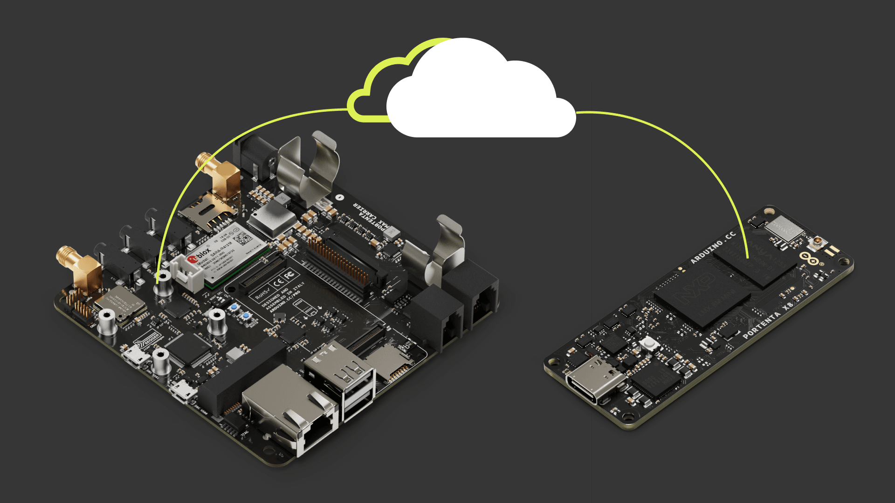

The Pro Smart Industry Prototyping Kit is the perfect way to learn and create solutions focused on industrial applications developed on Linux OS, LoRa® and cellular connectivity and leading industrial communication protocols like CAN Bus and RS-232/485.

- Try the Arduino's most advanced SOM experience with X8, a powerful, industrial-grade SOM with Linux OS preloaded onboard, capable of running device-independent software thanks to its modular container architecture.
- Experience the X8 Manager integration for Arduino Cloud, enabling secure OTA updates and Fleet management.
- Get all the X8 resources easily accessible and add the  LoRa® and Cat.M1 connectivity layer thanks to Portenta Max Carrier.

## The Kit

The following items are included in the kit:

| Quantity |                           Element                           |       SKU        |
|:--------:|:-----------------------------------------------------------:|:----------------:|
|    1     |                         Portenta X8                         |     ABX00049     |
|    1     |                    Portenta Max Carrier                     |     ABX00043     |
|    1     |  USB-C to HDMI multiport adapter with ethernet and USB hub  |     TPX00145     |
|    1     |                      Passive heat sink                      |    110991327     |
|    1     |                        LoRa® antenna                         | ANT-8/9-IPW1-SMA |
|    1     |                     LTE/Cat.M1 antenna                      |  ANT-5GW-SPS1-1  |
|    1     |                Power Supply for Max Carrier                 |     MP009249     |
|    1     | Cloud for business + Portenta X8 manager - 3 Months Voucher |        -         |

Additionally, you may need the following accessories:

* USB-C® cable (x1)
* Solar panel with respective system (Controller, battery, and inverter) or similar power system

## Getting Started with Your Kit

1. Get to [cloud.arduino.cc](https://cloud.arduino.cc/), sign in or Create an Arduino account. Rescue your Arduino IoT Cloud 3 months voucher code using this [Procedure](https://docs.arduino.cc/tutorials/generic/x8-manager-voucher-redeem) and [Get Started](https://docs.arduino.cc/arduino-cloud/getting-started/arduino-cloud-for-business) with Arduino Cloud For Business!

2. Download [Arduino IDE](https://www.arduino.cc/en/software#future-version-of-the-arduino-ide) and follow the [Installation Procedure](https://docs.arduino.cc/software/ide-v2/tutorials/getting-started/ide-v2-downloading-and-installing) and [Get Started with it](https://docs.arduino.cc/software/ide-v2/tutorials/getting-started-ide-v2).

3. Check the [Portenta X8 docs](https://docs.arduino.cc/hardware/portenta-x8) to retrieve the product resources. Carefully read the [datasheet](https://docs.arduino.cc/resources/datasheets/ABX00049-datasheet.pdf) and the [User Manual](https://docs.arduino.cc/tutorials/portenta-x8/user-manual). On [docs.arduino.cc](http://docs.arduino.cc) the [Pinout](https://docs.arduino.cc/resources/pinouts/ABX00049-full-pinout.pdf) and [Schematics](https://docs.arduino.cc/resources/schematics/ABX00049-schematics.pdf) are also available.

4. Check the [Portenta Max Carrier docs](https://docs.arduino.cc/hardware/portenta-max-carrier) to retrieve the product resources. Carefully read the [datasheet](https://docs.arduino.cc/resources/datasheets/ABX00043-datasheet.pdf) and the [Get Started](https://docs.arduino.cc/tutorials/portenta-max-carrier/getting-started) with it. On [docs.arduino.cc](http://docs.arduino.cc) the [Pinout](https://docs.arduino.cc/resources/pinouts/ABX00043-full-pinout.pdf) and [Schematics](https://docs.arduino.cc/resources/schematics/ABX00043-schematics.pdf) are also available.

5. Connect the products together and [get started](https://docs.arduino.cc/tutorials/portenta-max-carrier/x8-getting-started) with them. Practice the first examples included in the user manual, the IDE examples and the experiences proposed below.

## Experiences Proposed

If you want to learn more about the technologies of the kit, we propose the following experiences:

|                                                              Experience                                                               | X8  | Max Carrier |
|:-------------------------------------------------------------------------------------------------------------------------------------:|:---:|:-----------:|
| [Connecting the Portenta Max Carrier to The Things Network](https://docs.arduino.cc/tutorials/portenta-max-carrier/connecting-to-ttn) | Yes |     Yes     |
|                  [How to Use the Portenta X8 Manager](https://docs.arduino.cc/tutorials/portenta-x8/x8-fundamentals)                  | Yes |             |
|    [Uploading Sketches to the M4 Core on Arduino Portenta X8](https://docs.arduino.cc/tutorials/portenta-x8/uploading-sketches-m4)    | Yes |             |
| [Data Exchange Between Python® on Linux & Arduino Sketch](https://docs.arduino.cc/tutorials/portenta-x8/python-arduino-data-exchange) | Yes |             |
|           [Managing Containers with Docker on Portenta X8](https://docs.arduino.cc/tutorials/portenta-x8/docker-container)            | Yes |             |
|         [Using FoundriesFactory® Waves Fleet Management](https://docs.arduino.cc/tutorials/portenta-x8/waves-fleet-managment)         | Yes |             |
|         [Deploy a Custom Container with Portenta X8 Manager](https://docs.arduino.cc/tutorials/portenta-x8/custom-container)          | Yes |             |
|           [How To Build a Custom Image for Your Portenta X8](https://docs.arduino.cc/tutorials/portenta-x8/image-building)            | Yes |             |
|                     [How To Flash Your Portenta X8](https://docs.arduino.cc/tutorials/portenta-x8/image-flashing)                     | Yes |             |
|        [Data Logging with MQTT, Node-RED, InfluxDB and Grafana](https://docs.arduino.cc/tutorials/portenta-x8/datalogging-iot)        | Yes |             |
|                [Output WebGL Content on a Screen](https://docs.arduino.cc/tutorials/portenta-x8/display-output-webgl)                 | Yes |             |
|     [Multi-Protocol Gateway With Portenta X8 & Max Carrier](https://docs.arduino.cc/tutorials/portenta-x8/multi-protocol-gateway)     | Yes |     Yes     |
|      [Running WordPress & Database Containers on Portenta X8](https://docs.arduino.cc/tutorials/portenta-x8/wordpress-webserver)      | Yes |             |

The experiences marked with a `Yes` are the ones related to the product. Experiences marked with a `+` means that to follow the tutorial you must use all the products with the `+` symbol.

## Support

If you encounter any issues or have questions, we offer various support resources to help you find answers and solutions. In case of any issues with the redemption process, please contact us by filling out the form available [here](https://www.arduino.cc/en/contact-us/).