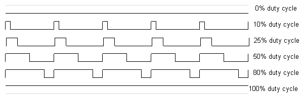
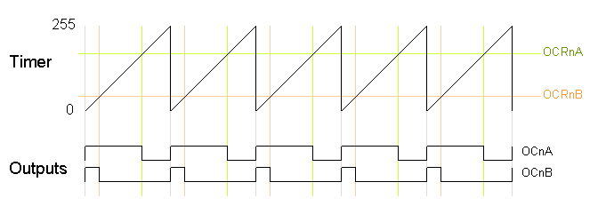
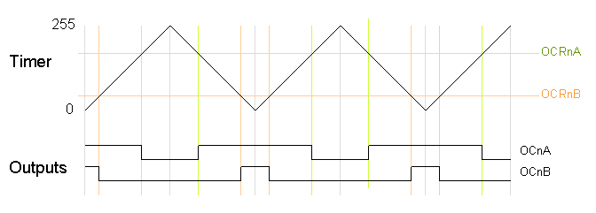
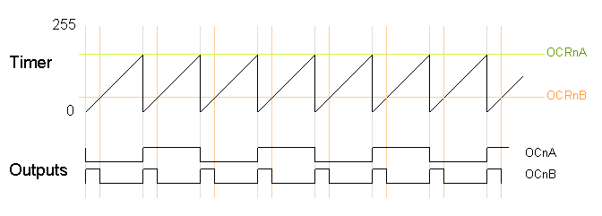
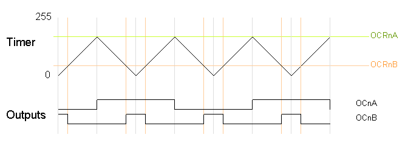

## Introduction
Pulse-width modulation (PWM) can be implemented on the Arduino in several ways. This tutorial explains simple PWM techniques, as well as how to use the PWM registers directly for more control over the duty cycle and frequency. This tutorial focuses on the Arduino Diecimila and Duemilanove models, which use the ATmega168 or ATmega328.

## Goals

- About Pulse Width Modulation techniques.
  

 ## Hardware & Software needed

- Arduino Board with an ATmega168 or ATmega328 chip. 
- Arduino IDE ([online](https://create.arduino.cc/) or [offline](https://www.arduino.cc/en/main/software)).


## Pulse Width Modulation

Pulse Width Modulation, or PWM, is a technique for getting analog results with digital means. Digital control is used to create a square wave, a signal switched between on and off. This on-off pattern can simulate voltages in between the full Vcc of the board (e.g., 5 V on UNO, 3.3 V on a MKR board) and off (0 Volts) by changing the portion of the time the signal spends on versus the time that the signal spends off. The duration of "on time" is called the pulse width. To get varying analog values, you change, or modulate, that pulse width. If you repeat this on-off pattern fast enough with an LED for example, the result is as if the signal is a steady voltage between 0 and Vcc controlling the brightness of the LED.



## PWM Examples

PWM has several uses:

* Dimming an LED
* Providing an analog output; if the digital output is filtered,
it will provide an analog voltage between 0% and 100%.
* Generating audio signals.
* Providing variable speed control for motors.
* Generating a modulated signal, for example to drive an infrared LED for a remote control.

## Simple Pulse Width Modulation with `analogWrite`

The Arduino's programming language makes PWM easy to use; simply call `analogWrite(pin, dutyCycle)`, where `dutyCycle` is a value from 0 to 255, and pin is one of the PWM pins (3, 5, 6, 9, 10, or 11). The `analogWrite()` function provides a simple interface to the hardware PWM, but doesn't provide any control over frequency. (Note that despite the function name, the output is a digital signal, often referred to as a square wave.)

Probably 99% of the readers can stop here, and just use `analogWrite`, but there are other options that provide more flexibility.

## Bit-Banging Pulse Width Modulation

You can "manually" implement PWM on any pin by repeatedly turning the pin on and off for the desired times. e.g.

```arduino
void setup()
{
  pinMode(13, OUTPUT);
}

void loop()
{
  digitalWrite(13, HIGH);
  delayMicroseconds(100); // Approximately 10% duty cycle @ 1KHz
  digitalWrite(13, LOW);
  delayMicroseconds(1000 - 100);
}
```

This technique has the advantage that it can use any digital output pin. In addition, you have full control the duty cycle and frequency. One major disadvantage is that any interrupts will affect the timing, which can cause considerable jitter unless you disable interrupts. A second disadvantage is you can't leave the output running while the processor does something else. Finally, it's difficult to determine the appropriate constants for a particular duty cycle and frequency unless you either carefully count cycles, or tweak the values while watching an oscilloscope.

A more elaborate example of manually PWMing all pins may be found [here](http://www.arduino.cc/playground/Main/PWMallPins/).

## Using the ATmega PWM Registers Directly

The ATmega168P/328P chip has three PWM timers, controlling 6 PWM outputs. By manipulating the chip's timer registers directly, you can obtain more control than the analogWrite function provides.

The AVR ATmega328P datasheet provides a detailed description of the PWM timers, but the datasheet can be difficult to understand, due to the many different control and output modes of the timers.

A word on the relationship between the Arduino language and the datasheet may be in order here.

**The Atmega 168/328 timers.**

The ATmega328P has three timers known as Timer 0, Timer 1, and Timer 2. Each timer has two output compare registers that control the PWM width for the timer's two outputs: when the timer reaches the compare register value, the corresponding output is toggled. The two outputs for each timer will normally have the same frequency, but can have different duty cycles (depending on the respective output compare register).

Each of the timers has a prescaler that generates the timer clock by dividing the system clock by a prescale factor such as 1, 8, 64, 256, or 1024. The Arduino has a system clock of 16MHz and the timer clock frequency will be the system clock frequency divided by the prescale factor. Note that Timer 2 has a different set of prescale values from the other timers.

The timers are complicated by several different modes. The main PWM modes are "Fast PWM" and "Phase-correct PWM", which will be described below. The timer can either run from 0 to 255, or from 0 to a fixed value. (The 16-bit Timer 1 has additional modes to supports timer values up to 16 bits.) Each output can also be inverted.

The timers can also generate interrupts on overflow and/or match against either output compare register, but that's beyond the scope of this article.

**Timer Registers**

Several registers are used to control each timer. The Timer/Counter Control Registers TCCRnA and TCCRnB hold the main control bits for the timer. (Note that TCCRnA and TCCRnB do not correspond to the outputs A and B.) These registers hold several groups of bits:

* Waveform Generation Mode bits (WGM): these control the overall mode of the timer.
(These bits are split between TCCRnA and TCCRnB.)
* Clock Select bits (CS): these control the clock prescaler
* Compare Match Output A Mode bits (COMnA): these enable/disable/invert output A
* Compare Match Output B Mode bits (COMnB): these enable/disable/invert output B

The Output Compare Registers OCRnA and OCRnB set the levels at which outputs A and B will be affected. When the timer value matches the register value, the corresponding output will be modified as specified by the mode.

The bits are slightly different for each timer, so consult the datasheet for details. Timer 1 is a 16-bit timer and has additional modes. Timer 2 has different prescaler values.

**Fast PWM**

In the simplest PWM mode, the timer repeatedly counts from 0 to 255. The output turns on when the timer is at 0, and turns off when the timer matches the output compare register. The higher the value in the output compare register, the higher the duty cycle. This mode is known as Fast PWM Mode. The following diagram shows the outputs for two particular values of OCRnA and OCRnB. Note that both outputs have the same frequency, matching the frequency of a complete timer cycle.



**Fast PWM Mode**

The following code fragment sets up fast PWM on pins 3 and 11 (Timer 2). To summarize the register settings, setting the waveform generation mode bits WGM to 011 selects fast PWM. Setting the COM2A bits and COM2B bits to 10 provides non-inverted PWM for outputs A and B. Setting the CS bits to 100 sets the prescaler to divide the clock by 64. (Since the bits are different for the different timers, consult the datasheet for the right values.) The output compare registers are arbitrarily set to 180 and 50 to control the PWM duty cycle of outputs A and B. (Of course, you can modify the registers directly instead of using `pinMode()`, but you do need to set the pins to output.)

```arduino
pinMode(3, OUTPUT);
  pinMode(11, OUTPUT);
  TCCR2A = _BV(COM2A1) | _BV(COM2B1) | _BV(WGM21) | _BV(WGM20);
  TCCR2B = _BV(CS22);
  OCR2A = 180;
  OCR2B = 50;
```

On the Arduino Duemilanove, these values yield:

* Output A frequency: 16 MHz / 64 / 256 = 976.5625Hz
* Output A duty cycle: (180+1) / 256 = 70.7%
* Output B frequency: 16 MHz / 64 / 256 = 976.5625Hz
* Output B duty cycle: (50+1) / 256 = 19.9%
  
The output frequency is the 16MHz system clock frequency, divided by the prescaler value (64), divided by the 256 cycles it takes for the timer to wrap around. Note that fast PWM holds the output high one cycle longer than the compare register value.

**Phase-Correct PWM**

The second PWM mode is called phase-correct PWM. In this mode, the timer counts from 0 to 255 and then back down to 0. The output turns off as the timer hits the output compare register value on the way up, and turns back on as the timer hits the output compare register value on the way down. The result is a more symmetrical output. The output frequency will be approximately half of the value for fast PWM mode, because the timer runs both up and down.



**Phase-Correct PWM example**

The following code fragment sets up phase-correct PWM on pins 3 and 11 (Timer 2). The waveform generation mode bits WGM are set to to 001 for phase-correct PWM. The other bits are the same as for fast PWM.

```arduino
pinMode(3, OUTPUT);
  pinMode(11, OUTPUT);
  TCCR2A = _BV(COM2A1) | _BV(COM2B1) | _BV(WGM20);
  TCCR2B = _BV(CS22);
  OCR2A = 180;
  OCR2B = 50;
```

On the Arduino Duemilanove, these values yield:

* Output A frequency: 16 MHz / 64 / 255 / 2 = 490.196Hz
* Output A duty cycle: 180 / 255 = 70.6%
* Output B frequency: 16 MHz / 64 / 255 / 2 = 490.196Hz
* Output B duty cycle: 50 / 255 = 19.6%

Phase-correct PWM divides the frequency by two compared to fast PWM, because the timer goes both up and down. Somewhat surprisingly, the frequency is divided by 255 instead of 256, and the duty cycle calculations do not add one as for fast PWM. See the explanation below under "Off-by-one".

**Varying the timer top limit: fast PWM**

Both fast PWM and phase correct PWM have an additional mode that gives control over the output frequency. In this mode, the timer counts from 0 to OCRA (the value of output compare register A), rather than from 0 to 255. This gives much more control over the output frequency than the previous modes. (For even more frequency control, use the 16-bit Timer 1.)

Note that in this mode, only output B can be used for PWM; OCRA cannot be used both as the top value and the PWM compare value. However, there is a special-case mode "Toggle OCnA on Compare Match" that will toggle output A at the end of each cycle, generating a fixed 50% duty cycle and half frequency in this case. The examples will use this mode.

In the following diagram, the timer resets when it matches OCRnA, yielding a faster output frequency for OCnB than in the previous diagrams. Note how OCnA toggles once for each timer reset.



**Fast PWM Mode with OCRA top**

The following code fragment sets up fast PWM on pins 3 and 11 (Timer 2), using OCR2A as the top value for the timer. The waveform generation mode bits WGM are set to to 111 for fast PWM with OCRA controlling the top limit. The OCR2A top limit is arbitrarily set to 180, and the OCR2B compare register is arbitrarily set to 50. OCR2A's mode is set to "Toggle on Compare Match" by setting the COM2A bits to 01.

```arduino
pinMode(3, OUTPUT);
  pinMode(11, OUTPUT);
  TCCR2A = _BV(COM2A0) | _BV(COM2B1) | _BV(WGM21) | _BV(WGM20);
  TCCR2B = _BV(WGM22) | _BV(CS22);
  OCR2A = 180;
  OCR2B = 50;
```

On the Arduino Duemilanove, these values yield:

* Output A frequency: 16 MHz / 64 / (180+1) / 2 = 690.6Hz
* Output A duty cycle: 50%
* Output B frequency: 16 MHz / 64 / (180+1) = 1381.2Hz
* Output B duty cycle: (50+1) / (180+1) = 28.2%

Note that in this example, the timer goes from 0 to 180, which takes 181 clock cycles, so the output frequency is divided by 181. Output A has half the frequency of Output B because the Toggle on Compare Match mode toggles Output A once each complete timer cycle.

**Varying the timer top limit: phase-correct PWM**

Similarly, the timer can be configured in phase-correct PWM mode to reset when it reaches OCRnA.



Phase-Correct PWM with OCRA top The following code fragment sets up phase-correct PWM on pins 3 and 11 (Timer 2), using OCR2A as the top value for the timer. The waveform generation mode bits WGM are set to to 101 for phase-correct PWM with OCRA controlling the top limit. The OCR2A top limit is arbitrarily set to 180, and the OCR2B compare register is arbitrarily set to 50. OCR2A's mode is set to "Toggle on Compare Match" by setting the COM2A bits to 01.

```arduino
pinMode(3, OUTPUT);
  pinMode(11, OUTPUT);
  TCCR2A = _BV(COM2A0) | _BV(COM2B1) | _BV(WGM20);
  TCCR2B = _BV(WGM22) | _BV(CS22);
  OCR2A = 180;
  OCR2B = 50;
```

On the Arduino Duemilanove, these values yield:

* Output A frequency: 16 MHz / 64 / 180 / 2 / 2 = 347.2Hz
* Output A duty cycle: 50%
* Output B frequency: 16 MHz / 64 / 180 / 2 = 694.4Hz
* Output B duty cycle: 50 / 180 = 27.8%

Note that in this example, the timer goes from 0 to 180 and back to 0, which takes 360 clock cycles. Thus, everything is divided by 180 or 360, unlike the fast PWM case, which divided everything by 181; see below for details.//

**Off-by-one**

You may have noticed that fast PWM and phase-correct PWM seem to be off-by-one with respect to each other, dividing by 256 versus 255 and adding one in various places. The documentation is a bit opaque here, so I'll explain in a bit of detail.

Suppose the timer is set to fast PWM mode and is set to count up to an OCRnA value of 3. The timer will take on the values 012301230123... Note that there are 4 clock cycles in each timer cycle. Thus, the frequency will be divided by 4, not 3. The duty cycle will be a multiple of 25%, since the output can be high for 0, 1, 2, 3, or 4 cycles out of the four. Likewise, if the timer counts up to 255, there will be 256 clock cycles in each timer cycle, and the duty cycle will be a multiple of 1/256. To summarize, fast PWM divides by N+1 where N is the maximum timer value (either OCRnA or 255).

Now consider phase-correct PWM mode with the timer counting up to an OCRnA value of 3. The timer values will be 012321012321... There are 6 clock cycles in each timer cycle (012321). Thus the frequency will be divided by 6. The duty cycle will be a multiple of 33%, since the output can be high for 0, 2, 4, or 6 of the 6 cycles. Likewise, if the timer counts up to 255 and back down, there will be 510 clock cycles in each timer cycle, and the duty cycle will be a multiple of 1/255. To summarize, phase-correct PWM divides by 2N, where N is the maximum timer value.

The second important timing difference is that fast PWM holds the output high for one cycle longer than the output compare register value. The motivation for this is that for fast PWM counting to 255, the duty cycle can be from 0 to 256 cycles, but the output compare register can only hold a value from 0 to 255. What happens to the missing value? The fast PWM mode keeps the output high for N+1 cycles when the output compare register is set to N so an output compare register value of 255 is 100% duty cycle, but an output compare register value of 0 is not 0% duty cycle but 1/256 duty cycle. This is unlike phase-correct PWM, where a register value of 255 is 100% duty cycle and a value of 0 is a 0% duty cycle.

**Timers and the Arduino**

The Arduino supports PWM on a subset of its output pins. It may not be immediately obvious which timer controls which output, but the following table will clarify the situation. It gives for each timer output the output pin on the Arduino (i.e. the silkscreened label on the board), the pin on the ATmega chip, and the name and bit of the output port. For instance Timer 0 output OC0A is connected to the Arduino output pin 6; it uses chip pin 12 which is also known as PD6.

|Timer output|Arduino output|Chip pin|Pin name|
|--|--|--|--|
|OC0A|6|12|PD6|
|OC0B|5|11|PD5|
|OC1A|9|15|PB1|
|OC1B|10|16|PB2|
|OC2A|11|17|PB3|
|OC2B|3|5|PD3|	
			
The Arduino performs some initialization of the timers. The Arduino initializes the prescaler on all three timers to divide the clock by 64. Timer 0 is initialized to Fast PWM, while Timer 1 and Timer 2 is initialized to Phase Correct PWM. See the Arduino source file wiring.c for details.

The Arduino uses Timer 0 internally for the millis() and delay() functions, so be warned that changing the frequency of this timer will cause those functions to be erroneous. Using the PWM outputs is safe if you don't change the frequency, though.

The `analogWrite(pin, duty_cycle)` function sets the appropriate pin to PWM and sets the appropriate output compare register to duty_cycle (with the special case for duty cycle of 0 on Timer 0). The `digitalWrite()` function turns off PWM output if called on a timer pin. The relevant code is wiring_analog.c and wiring_digital.c.

If you use `analogWrite(5, 0)` you get a duty cycle of 0%, even though pin 5's timer (Timer 0) is using fast PWM. How can this be, when a fast PWM value of 0 yields a duty cycle of 1/256 as explained above? The answer is that `analogWrite` "cheats"; it has special-case code to explicitly turn off the pin when called on Timer 0 with a duty cycle of 0. As a consequence, the duty cycle of 1/256 is unavailable when you use `analogWrite`` on Timer0, and there is a jump in the actual duty cycle between values of 0 and 1.

Some other Arduino models use different AVR processors with similar timers. The Arduino Mega uses the ATmega1280 (datasheet), which has four 16-bit timers with 3 outputs each and two 8-bit timers with 2 outputs each. Only 14 of the PWM outputs are supported by the Arduino Wiring library, however. Some older Arduino models use the ATmega8 (datasheet), which has three timers but only 3 PWM outputs: Timer 0 has no PWM, Timer 1 is 16 bits and has two PWM outputs, and Timer 2 is 8 bits and has one PWM output.

### Troubleshoot

It can be tricky to get the PWM outputs to work. Some tips:

* You need to both enable the pin for output and enable the PWM mode on the pin in order to get any output. I.e. you need to do pinMode() and set the COM bits.
* The different timers use the control bits and prescaler differently;
check the documentation for the appropriate timer.
* Some combinations of bits that you might expect to work are reserved,
which means if you try to use them, they won't work.
* For example, toggle mode doesn't work with fast PWM to 255, or with output B.
* Make sure the bits are set the way you think. Bit operations can be tricky,
so print out the register values with the binary (BIN) formatter and make sure they are what you expect.
* Make sure you're using the right output pins. See the table above.
* You'll probably want a decoupling capacitor to avoid spikes on the output.

An oscilloscope is very handy for debugging PWM if you have access to one. If you don't have one, I recommend using your sound card and a program such as xoscope.

## Conclusion

 This article helps explain the PWM modes of the Arduino. I found the documentation of the different modes somewhat opaque, and the off-by-one issues unexplained.

   [Read the original document](http://arcfn.com/2009/07/secrets-of-arduino-pwm.html)