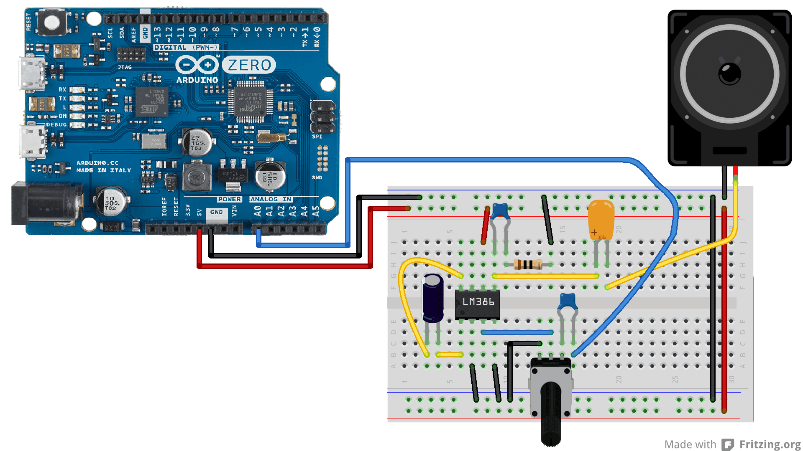

## Introduction
This tutorial demonstrates how to use an Arduino board (Arduino Zero, MKRZero or MKR1000 WiFi) to play a wave file stored on an SD card using the [AudioZero](https://www.arduino.cc/en/Reference/AudioZero) library and the 10 bit DAC.

## Goals

- How to play a wavefile stored on an SD card.

## Hardware & Software Needed

- [Arduino Zero](https://store.arduino.cc/arduino-zero), [MKRZero](https://store.arduino.cc/arduino-mkr-zero-i2s-bus-sd-for-sound-music-digital-audio-data)  or [MKR1000 WiFi](/hardware/mkr-1000-wifi) board
- [AudioZero](https://www.arduino.cc/en/Reference/AudioZero) library 
- Arduino IDE ([online](https://create.arduino.cc/) or [offline](https://www.arduino.cc/en/main/software)).

- 8 Ω speaker or headphones
- Breadboard
- Jumper wires

- Arduino shield with an SD card with CS on pin 4 (like the [MKR SD Proto Shield](/hardware/mkr-sd-proto-shield))

### Components to Build an External Audio amplifier:

- LM386 (low power audio amplifier)

- 10k Ω potentiometer
- 10 Ω resistor

- 2 x 10 &#xB5;F capacitor

- 0.05 &#xB5;F or 0.1 &#xB5;F capacitor

- 250 &#xB5;F capacitor

### The Circuit

To connect a speaker to the board you have add an amplification circuit connected between the `DAC0` pin and the speaker. The amplification circuit will increase the volume of the speaker. There are many audio amplifiers available, one of the most common is the LM386.
The following scheme shows how to build the circuit using the LM386 and a bunch of components.

You can supply the LM386 connecting the **Vs** pin with different voltages sources, like for example the +5 V present on the 5V pin of the Arduino Zero / MKRZero or an external 9V battery.
The gain of the amplifier is given by the capacitor connected to pin 1 and 8 of the LM386. With the 10 &#xB5;F capacitor the gain is set to 200, without the capacitor the gain is 50.
With the potentiometer you can control the volume of the amplifier.




For Arduino Zero and MKR1000 you need to connect shield or module for an SD or microSD card with CS on pin 4.


For MKRZero, the microSD Slot is built in. A .wav file named "test.wav" is in the card's root directory. For a simple test you can attach a pair of headphones directly to ground and DAC0, respecting the polarity.


**Warning**: do not connect the speaker directly to the pins of the Arduino Zero or MKRZero.

## Programming the Board

We will now get to the programming part of this tutorial.

**1.** First, let's make sure we have the drivers installed. If we are using the Web Editor, we do not need to install anything. If we are using an offline editor, we need to install it manually. This can be done by navigating to **Tools > Board > Board Manager....** Here we need to look for the **Arduino SAMD boards (32-bits Arm® Cortex®-M0+)** and install it.

**2.**  Now, we need to install the libraries needed. If we are using the Web Editor, there is no need to install anything. The AudioZero library can installed from Arduino IDE's library manager. To do this, open the Arduino IDE, go to **Tools-> Manage Libraries**. There you can search **AudioZero** and install the library shown. The 'more info' link will take you to the GitHub page which includes all the documentation for the library. For a more detailed explanation on installing and importing libraries see [this tutorial](https://www.arduino.cc/en/Guide/Libraries#toc3).

**3.** Here are some of the core functions of the sketch:

- `AudioZero.begin()` - Initializes the AudioZero library by specifying the target sample rate.
- `AudioZero.play()` - Writes an audio signal read from the SD card to DAC0.


### Audio File Format

The Audio file to store on the SD card must be in the .wav format with 88200 Hz, 8-bit unsigned PCM mono quality. This type of file can easily be created by software such as [audacity](http://audacityteam.org/).

## Code


```arduino

/*

  Simple Audio Player for Arduino Zero

 Demonstrates the use of the Audio library for the Arduino Zero

 Hardware required :

 * Arduino shield with a SD card on CS4

 * A sound file named "test.wav" in the root directory of the SD card

 * An audio amplifier to connect to the DAC0 and ground

 * A speaker to connect to the audio amplifier


 Arturo Guadalupi <a.guadalupi@arduino.cc>

 Angelo Scialabba <a.scialabba@arduino.cc>

 Claudio Indellicati <c.indellicati@arduino.cc>

 This example code is in the public domain

 http://arduino.cc/en/Tutorial/SimpleAudioPlayerZero

*/

#include <SD.h>
#include <SPI.h>
#include <AudioZero.h>

void setup()
{

  // debug output at 115200 baud

  Serial.begin(115200);

  // setup SD-card

  Serial.print("Initializing SD card...");

  if (!SD.begin(4)) {

    Serial.println(" failed!");

    while(true);

  }

  Serial.println(" done.");

  // 44100kHz stereo => 88200 sample rate

  AudioZero.begin(2*44100);
}

void loop()
{

  int count = 0;

  // open wave file from sdcard

  File myFile = SD.open("test.wav");

  if (!myFile) {

    // if the file didn't open, print an error and stop

    Serial.println("error opening test.wav");

    while (true);

  }

  Serial.print("Playing");


  // until the file is not finished

  AudioZero.play(myFile);

  Serial.println("End of file. Thank you for listening!");

  while (true) ;
}
```


## Testing It Out

After you have uploaded the code, your audio file should start playing, the audio file is defined in the code as `File myFile = SD.open("test.wav");`. To get additional information about the playback, open the serial monitor in the IDE by going to **Tools > Serial Monitor**. Remember that you can control the volume of the amplifier using the potentiometer.

### Troubleshoot

If the code is not working, there are some common issues we can troubleshoot:

- The wiring is incorrect.
- Make sure there are no missing curly brackets {}.
- You have not installed the [AudioZero](https://www.arduino.cc/en/Reference/AudioZero) library.
- You have not converted your audio file correctly.

## Conclusion

In this example, we have learned how to create a simple audio player using the AudioZero library! If you want to extend this project, take a look at the [Weather Audio Notifier](https://docs.arduino.cc/tutorials/zero/weather-audio-notifier) tutorial to create a project that notifies you of weather changes.