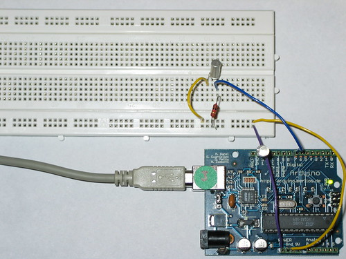

The tilt sensor is a component that can detect the tilting of an object. However it is only the equivalent to a pushbutton activated through a different physical mechanism. This type of sensor is the environmental-friendly version of a mercury-switch. It contains a metallic ball inside that will commute the two pins of the device from on to off and vice-versa if the sensor reaches a certain angle.

The code example is exactly as the one we would use for a pushbutton but substituting this one with the tilt sensor. We use a pull-up resistor (thus use active-low to activate the pins) and connect the sensor to a digital input pin that we will read when needed.

The prototyping board has been populated with a 1K resistor to make the pull-up and the sensor itself. We have chosen the tilt sensor from Assemtech, which datasheet can be found [here](http://www.elfa.se/pdf/35/03589330.pdf). The hardware was mounted and photographed by Anders Gran, the software comes from the basic Arduino examples.



```
/* Tilt Sensor
 * -----------
 *
 * Detects if the sensor has been tilted or not and
 * lights up the LED if so. Note that due to the
 * use of active low inputs (through a pull-up resistor)
 * the input is at low when the sensor is active.
 *
 * (cleft) David Cuartielles for DojoCorp and K3
 * @author: D. Cuartielles
 *
 */

int ledPin = 13;
int inPin = 7; 
int value = 0;

void setup() 
{
  pinMode(ledPin, OUTPUT);              // initializes digital pin 13 as output
  pinMode(inPin, INPUT);                // initializes digital pin 7 as input
}

void loop() 
{
  value = digitalRead(inPin);   // reads the value at a digital input 
  digitalWrite(ledPin, value);           
}
```