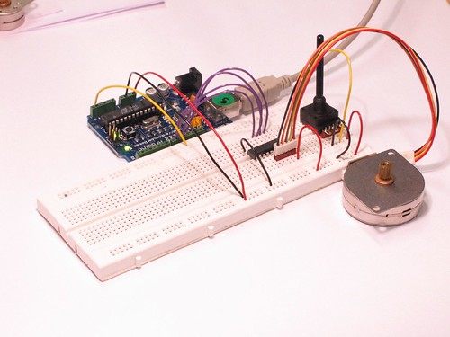

## Introduction

This page shows two examples on how to drive a unipolar stepper motor. These motors can be found in old floppy drives and are easy to control. The one we use has 6 connectors of which one is power (VCC) and the other four are used to drive the motor sending synchronous signals.

The first example is the basic code to make the motor spin in one direction. It is aiming those that have no knowledge in how to control stepper motors. The second example is coded in a more complex way, but allows to make the motor spin at different speeds, in both directions, and controlling both from a potentiometer.

The prototyping board has been populated with a 10K potentiometer that we connect to an analog input, and a ULN2003A driver. This chip has a bunch of transistors embedded in a single housing. It allows the connection of devices and components that need much higher current than the ones that the ATMEGA8 from our Arduino board can offer.


### Goals

The goals of this tutorial are:

- Learn about stepper motors
- Learn how to drive a unipolar stepper motor
- Explore different sketches to drive it


## Hardware & Software Needed

- Arduino Board 
- Unipolar stepper motor (Can be found in old floppy drives)
- ULN2003A driver
- 10k Ω potentiometer
- Jumper wires
- Arduino IDE ([online](https://create.arduino.cc/) or [offline](https://www.arduino.cc/en/main/software)).


## Stepper Motors 

Stepper motors are different from DC motors, in that you make them move by sending them phased pulses of current, making the motor move in "steps." In order to do this, you need to send pulse trains of varying polarity to multiple windings, the speed of the motor being determined by the frequency of the pulses, and the direction of motor motion being determined by the phasing between the pulses being applied to the various windings. As a result, you get more-precise control over motor motion, but at the cost of some control circuitry complexity.

If you want to know more about stepper motors, the link below may be useful for you to understand the underlying theory behind them:


- [Basic explanation about steppers.](http://www.solarbotics.net/library/pieces/parts_mech_steppers.html)





## Programming the Board

We will now get to the programming part of this tutorial. 

 Open the editor of your choice, and make sure you have your board installed. Select your board and port, and upload any of the two examples below.

If you need help setting up your environment, you can use our interactive getting started guide, found on the [hardware documentation page](https://docs.arduino.cc/).

## Code


### Example 1: Simple Example

The first example is the basic code to make the motor spin in **one direction**.

```arduino
/* Stepper Copal
 * -------------
 *
 * Program to drive a stepper motor coming from a 5'25 disk drive
 * according to the documentation I found, this stepper: "[...] motor 
 * made by Copal Electronics, with 1.8 degrees per step and 96 ohms 
 * per winding, with center taps brought out to separate leads [...]"
 * [http://www.cs.uiowa.edu/~jones/step/example.html]
 *
 * It is a unipolar stepper motor with 5 wires:
 * 
 * - red: power connector, I have it at 5V and works fine
 * - orange and black: coil 1
 * - brown and yellow: coil 2
 *
 * (cleft) 2005 DojoDave for K3
 * http://www.0j0.org | http://arduino.berlios.de
 *
 * @author: David Cuartielles
 * @date: 20 Oct. 2005
 */

int motorPin1 = 8;
int motorPin2 = 9;
int motorPin3 = 10;
int motorPin4 = 11;
int delayTime = 500;

void setup() {
  pinMode(motorPin1, OUTPUT);
  pinMode(motorPin2, OUTPUT);
  pinMode(motorPin3, OUTPUT);
  pinMode(motorPin4, OUTPUT);
}

void loop() {
  digitalWrite(motorPin1, HIGH);
  digitalWrite(motorPin2, LOW);
  digitalWrite(motorPin3, LOW);
  digitalWrite(motorPin4, LOW);
  delay(delayTime);
  digitalWrite(motorPin1, LOW);
  digitalWrite(motorPin2, HIGH);
  digitalWrite(motorPin3, LOW);
  digitalWrite(motorPin4, LOW);
  delay(delayTime);
  digitalWrite(motorPin1, LOW);
  digitalWrite(motorPin2, LOW);
  digitalWrite(motorPin3, HIGH);
  digitalWrite(motorPin4, LOW);
  delay(delayTime);
  digitalWrite(motorPin1, LOW);
  digitalWrite(motorPin2, LOW);
  digitalWrite(motorPin3, LOW);
  digitalWrite(motorPin4, HIGH);
  delay(delayTime);
}
```

### Example 2: Stepper Unipolar Advanced


The second example is a bit more advanced, it allows the motor to spin at different speeds, in **both directions** with the use of a potentiometer.

```arduino
/* Stepper Unipolar Advanced
 * -------------------------
 *
 * Program to drive a stepper motor coming from a 5'25 disk drive
 * according to the documentation I found, this stepper: "[...] motor 
 * made by Copal Electronics, with 1.8 degrees per step and 96 ohms 
 * per winding, with center taps brought out to separate leads [...]"
 * [http://www.cs.uiowa.edu/~jones/step/example.html]
 *
 * It is a unipolar stepper motor with 5 wires:
 * 
 * - red: power connector, I have it at 5V and works fine
 * - orange and black: coil 1
 * - brown and yellow: coil 2
 *
 * (cleft) 2005 DojoDave for K3
 * http://www.0j0.org | http://arduino.berlios.de
 *
 * @author: David Cuartielles
 * @date: 20 Oct. 2005
 */

int motorPins[] = {8, 9, 10, 11};
int count = 0;
int count2 = 0;
int delayTime = 500;
int val = 0;

void setup() {
  for (count = 0; count < 4; count++) {
    pinMode(motorPins[count], OUTPUT);
  }
}

void moveForward() {
  if ((count2 == 0) || (count2 == 1)) {
    count2 = 16;
  }
  count2>>=1;
  for (count = 3; count >= 0; count--) {
    digitalWrite(motorPins[count], count2>>count&0x01);
  }
  delay(delayTime);
}

void moveBackward() {
  if ((count2 == 0) || (count2 == 1)) {
    count2 = 16;
  }
  count2>>=1;
  for (count = 3; count >= 0; count--) {
    digitalWrite(motorPins[3 - count], count2>>count&0x01);
  }
  delay(delayTime);
}

void loop() {
  val = analogRead(0);
  if (val > 540) {
    // move faster the higher the value from the potentiometer
    delayTime = 2048 - 1024 * val / 512 + 1; 
    moveForward();
  } else if (val < 480) {
    // move faster the lower the value from the potentiometer
    delayTime = 1024 * val / 512 + 1; 
    moveBackward();
  } else {
    delayTime = 1024;
  }
}
```


## Testing It Out

After you have uploaded the code from the first example, the motor should now start to spin in one direction. If you upload the second example, you should be able to control the motor using the potentiometer.

### Troubleshoot

If the code is not working, there are some common issues we can troubleshoot:

- Stepper motor or potentiometer are not wired correctly.
- The motor is broken.
- Make sure that no `{}` brackets are missing.

## Conclusion

In this example, we tested out different sketches that allows us to drive a stepper motor that can be found in old floppy disks. Electronic components such as the stepper motor can be salvaged from old or broken devices. So next time something breaks you might be able to harvest some nice components and create cool projects with them!
