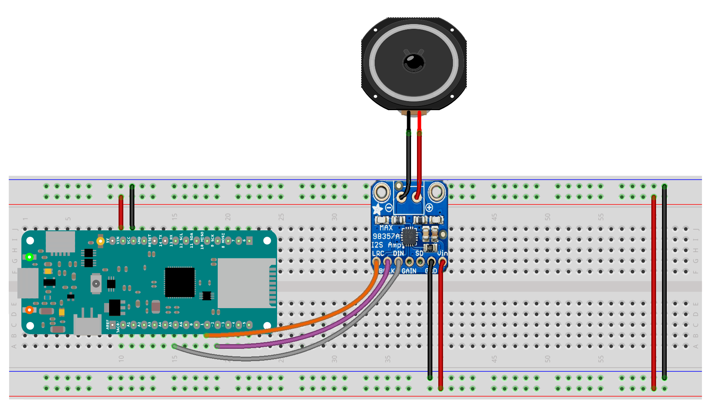
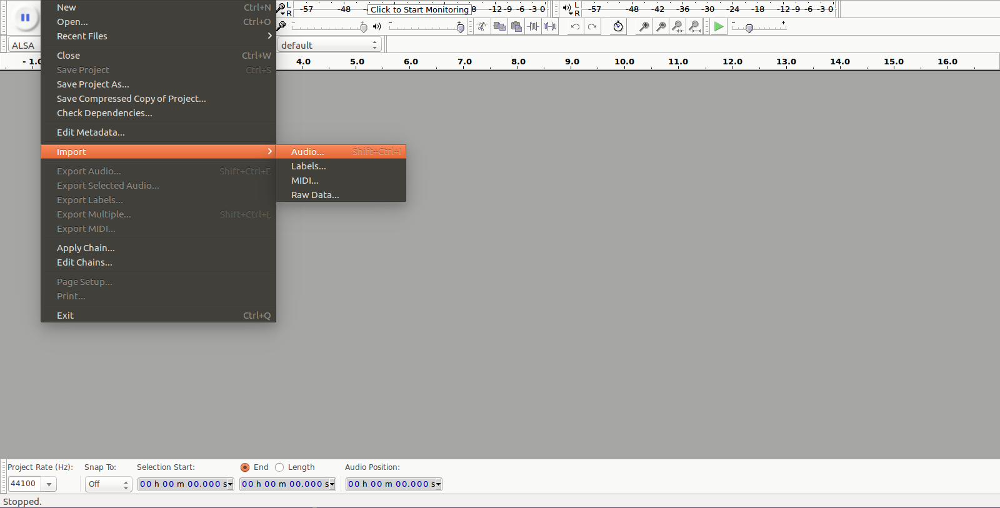
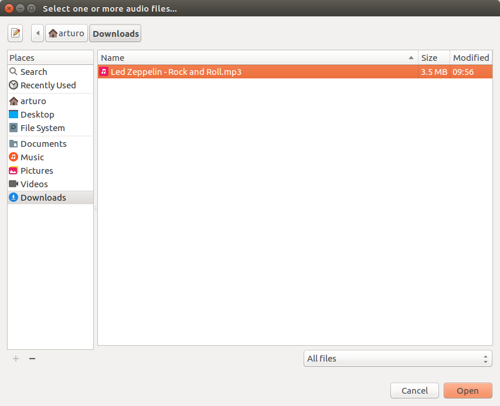
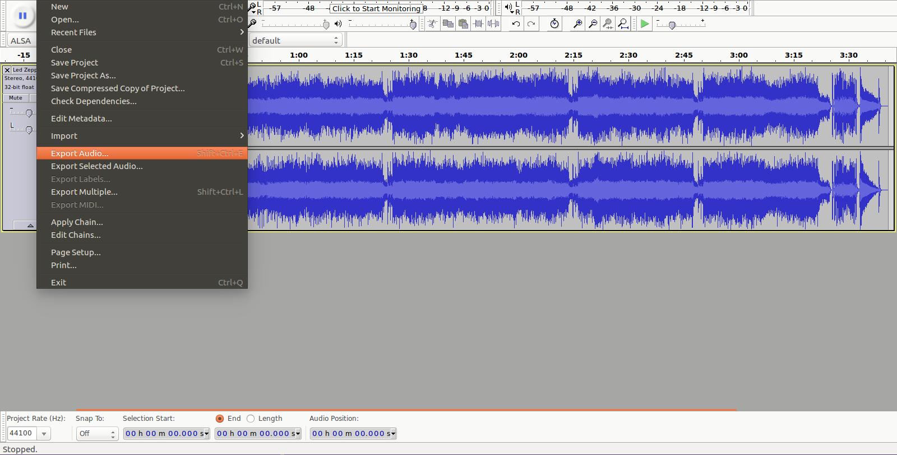
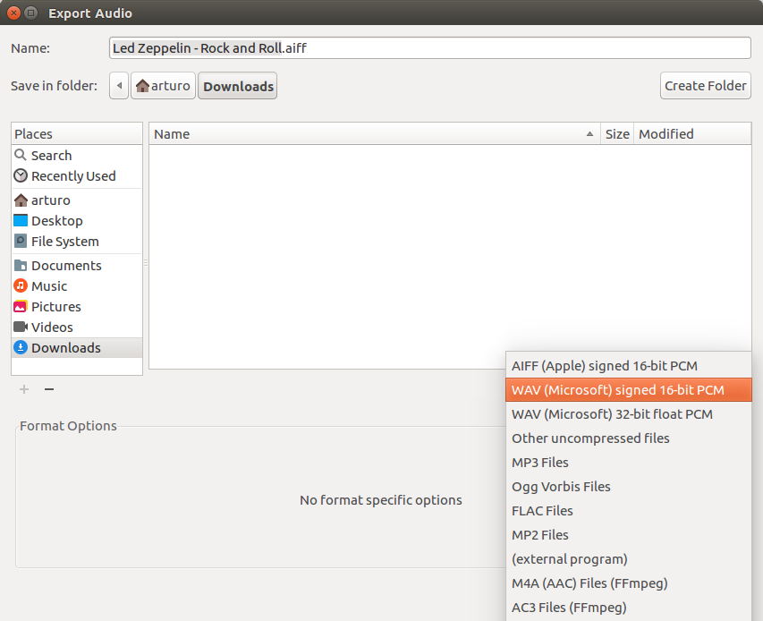

## Introduction
This example reads a wave file from an SD card and plays it using the I2S interface to a MAX98357 I2S Amp Breakout board. The wav file must be stereo signed 16 bit 44100Hz. You can export such files using free software like [audacity](http://www.audacityteam.org/). 

## Goals

- To use an I2S interface
- To playback wave files from an SD card


## Hardware & Software Needed 

- [Arduino Zero](https://store.arduino.cc/arduino-zero), [MKRZero](https://store.arduino.cc/arduino-mkr-zero-i2s-bus-sd-for-sound-music-digital-audio-data?queryID=undefined)  or [MKR1000 WiFi](/hardware/mkr-1000-wifi) Board

- MAX98357 I2S Amp Breakout board.
- Amplifier
- Arduino IDE ([online](https://create.arduino.cc/) or [offline](https://www.arduino.cc/en/main/software)).
- [ArduinoSound Library](https://www.arduino.cc/en/Reference/ArduinoSound)
- [SD Library](https://www.arduino.cc/en/reference/SD)
- Jumper wires
- Breadboard

### Circuit



## Converting Audio Files

Import your audio file:





Export the wav file:





## Programming the Board

**1.** First, let's make sure we have correct the drivers installed. If we are using the Web Editor, we do not need to install anything. If we are using an offline editor, we need to install it manually. This can be done by navigating to **Tools > Board > Board Manager...**. Here we need to look for the **Arduino SAMD boards (32-bits Arm® Cortex®-M0+)** and install it. 

**2.** Now, we need to install the libraries needed. If we are using the Web Editor, there is no need to install anything. If we are using an offline editor, simply go to **Tools > Manage libraries...** and search for **ArduinoSound**, **SD Library** and install it.


The sketch can be found in the snippet below. Upload the sketch to the board.

## Code

```arduino

/*

 This reads a wave file from an SD card and plays it using the I2S interface to

 a MAX08357 I2S Amp Breakout board.

 Circuit:

 * Arduino Zero, MKRZero or MKR1000 board

 * SD breakout or shield connected

 * MAX08357:

   * GND connected GND

   * VIN connected 5V

   * LRC connected to pin 0 (Zero) or pin 3 (MKR1000, MKRZero)

   * BCLK connected to pin 1 (Zero) or pin 2 (MKR1000, MKRZero)

   * DIN connected to pin 9 (Zero) or pin A6 (MKR1000, MKRZero)

 created 15 November 2016

 by Sandeep Mistry

 */

#include <SD.h>
#include <ArduinoSound.h>

// filename of wave file to play

const char filename[] = "MUSIC.WAV";

// variable representing the Wave File

SDWaveFile waveFile;

void setup() {

  // Open serial communications and wait for port to open:

  Serial.begin(9600);

  while (!Serial) {

    ; // wait for serial port to connect. Needed for native USB port only

  }

  // setup the SD card, depending on your shield of breakout board

  // you may need to pass a pin number in begin for SS

  Serial.print("Initializing SD card...");

  if (!SD.begin()) {

    Serial.println("initialization failed!");

    return;

  }

  Serial.println("initialization done.");

  // create a SDWaveFile

  waveFile = SDWaveFile(filename);

  // check if the WaveFile is valid

  if (!waveFile) {

    Serial.println("wave file is invalid!");

    while (1); // do nothing

  }

  // print out some info. about the wave file

  Serial.print("Bits per sample = ");

  Serial.println(waveFile.bitsPerSample());

  long channels = waveFile.channels();

  Serial.print("Channels = ");

  Serial.println(channels);

  long sampleRate = waveFile.sampleRate();

  Serial.print("Sample rate = ");

  Serial.print(sampleRate);

  Serial.println(" Hz");

  long duration = waveFile.duration();

  Serial.print("Duration = ");

  Serial.print(duration);

  Serial.println(" seconds");

  // adjust the playback volume

  AudioOutI2S.volume(5);

  // check if the I2S output can play the wave file

  if (!AudioOutI2S.canPlay(waveFile)) {

    Serial.println("unable to play wave file using I2S!");

    while (1); // do nothing

  }

  // start playback

  Serial.println("starting playback");

  AudioOutI2S.play(waveFile);
}

void loop() {

  // check if playback is still going on

  if (!AudioOutI2S.isPlaying()) {

    // playback has stopped

    Serial.println("playback stopped");

    while (1); // do nothing

  }
}
```

## Testing It Out

After you have uploaded the code, open the Serial Monitor in your IDE. You should now be able to see information about you chosen .wav file such as the duration and sample rate of the file. The playback of the audio should start with the function `AudioOutI2S.play(waveFile)`.

### Troubleshoot

If the code is not working, there are some common issues we can troubleshoot:

- The amplifier is not wired correctly.
- You have not installed the correct drivers.
- You have not installed the [ArduinoSound Library](https://www.arduino.cc/en/Reference/ArduinoSound).

## Conclusion

Congratulations! We have learned how to use an Arduino with an I2S interface to play wave files. After having completed this tutorial, you can perhaps start to tinker around with sensors that can trigger the playback of the wave files! 