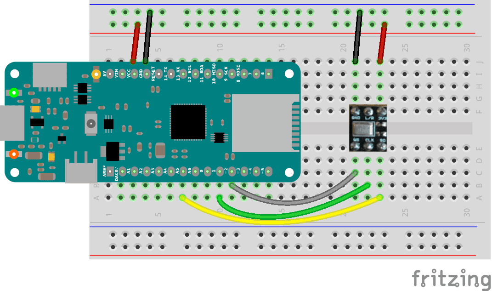

## Introduction
This example reads audio data from an Invensense's ICS43432I2S microphone breakout board, and uses the input to detect whistling sounds at a particular frequency. When a whistle is detected, it's level is used to control the  brightness of the built-in LED.

## Goals

- How to use and read audio data.
- How to use audio as an input to control the brightness of an LED.

## Hardware & Software Needed

- [Arduino Zero](https://store.arduino.cc/arduino-zero), [MKRZero](https://store.arduino.cc/arduino-mkr-zero-i2s-bus-sd-for-sound-music-digital-audio-data?queryID=undefined)  or [MKR1000](/hardware/mkr-1000-wifi) Board

- Invensense's ICS43432I2S microphone
- Arduino IDE ([online](https://create.arduino.cc/) or [offline](https://www.arduino.cc/en/main/software)).
- [ArduinoSound Library](https://www.arduino.cc/en/Reference/ArduinoSound)
- Jumper wires
- Breadboard

## Circuit




## Programming the Board


**1.** First, let's make sure we have correct the drivers installed. If we are using the Web Editor, we do not need to install anything. If we are using an offline editor, we need to install it manually. This can be done by navigating to **Tools > Board > Board Manager...**. Here we need to look for the **Arduino SAMD boards (32-bits Arm® Cortex®-M0+)** and install it. 

**2.** Now, we need to install the libraries needed. If we are using the Web Editor, there is no need to install anything. If we are using an offline editor, simply go to **Tools > Manage libraries...** and search for **ArduinoSound** and install it.


The sketch can be found in the snippet below. Upload the sketch to the board.


## Code

```arduino

/*

 This example reads audio data from an Invensense's ICS43432 I2S microphone

 breakout board, and uses the input to detect whistling sounds at a particular

 frequency. When a whistle is detected, it's level is used to control the

 brightness of an LED

 Circuit:

 * Arduino Zero, MKRZero or MKR1000 board

 * ICS43432:

   * GND connected GND

   * 3.3V connected 3.3V (Zero) or VCC (MKR1000, MKRZero)

   * WS connected to pin 0 (Zero) or pin 3 (MKR1000, MKRZero)

   * CLK connected to pin 1 (Zero) or pin 2 (MKR1000, MKRZero)

   * SD connected to pin 9 (Zero) or pin A6 (MKR1000, MKRZero)

 created 30 November 2016

 by Sandeep Mistry

 */

#include <ArduinoSound.h>

// the LED pin to use as output

const int ledPin = LED_BUILTIN;

// sample rate for the input

const int sampleRate = 8000;

// size of the FFT to compute

const int fftSize = 128;

// size of the spectrum output, half of FFT size

const int spectrumSize = fftSize / 2;

// frequency of whistle to detect

const int whistleFrequency = 1250;

// map whistle frequency to FFT bin

const int whistleBin = (whistleFrequency * fftSize / sampleRate);

// array to store spectrum output
int spectrum[spectrumSize];

// create an FFT analyzer to be used with the I2S input

FFTAnalyzer fftAnalyzer(fftSize);

void setup() {

  // setup the serial

  Serial.begin(9600);

  // configure the pin for output mode

  pinMode(ledPin, OUTPUT);

  // setup the I2S audio input for the sample rate with 32-bits per sample

  if (!AudioInI2S.begin(sampleRate, 32)) {

    Serial.println("Failed to initialize I2S input!");

    while (1); // do nothing

  }

  // configure the I2S input as the input for the FFT analyzer

  if (!fftAnalyzer.input(AudioInI2S)) {

    Serial.println("Failed to set FFT analyzer input!");

    while (1); // do nothing

  }
}

void loop() {

  if (fftAnalyzer.available()) {

    // analysis available, read in the spectrum

    fftAnalyzer.read(spectrum, spectrumSize);

    // map the value of the whistle bin magnitude between 0 and 255

    int ledValue = map(spectrum[whistleBin], 50000, 60000, 0, 255);

    // cap the values

    if (ledValue < 0) {

      ledValue = 0;

    } else if (ledValue > 255) {

      ledValue = 255;

    }

    // set LED brightness based on whistle bin magnitude

    analogWrite(ledPin, ledValue);

  }
}
```

## Testing It Out

After you have uploaded the code, start whisling. You should now be able to control the brightness of the in-built LED depending on the level of the whistle.

### Troubleshoot

If the code is not working, there are some common issues we can troubleshoot:

- The microphone is not wired correctly.
- You have not uploaded the sketch to the board.
- You have not installed the correct drivers.
- You have not installed the [ArduinoSound Library](https://www.arduino.cc/en/Reference/ArduinoSound).

## Conclusion

In this example, we have learned how to use whistling to control the brightness of the in-built LED, using the [ArduinoSound Library](https://www.arduino.cc/en/Reference/ArduinoSound) and a microphone. Now that you have learned how to use whistling as an input, you can start thinking about how to apply this input for other projects!