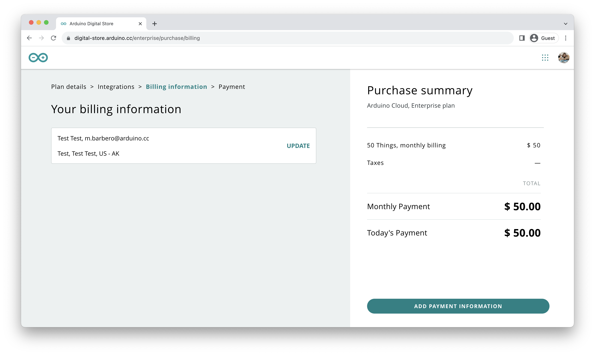

## Hardware and Software Requirements

### Hardware Requirements

* [Portenta X8](https://store.arduino.cc/products/portenta-x8) (x1)

***While the required hardware is not strictly necessary for the scope of this tutorial, it will be necessary to use the X8 Manager features after redeeming the voucher code.***

### Software Requirements

- An [Arduino Cloud](https://cloud.arduino.cc/) account is required to proceed with the steps provided in the following section. If you do not have an account, you can create one for free inside [cloud.arduino.cc](https://cloud.arduino.cc/home/?get-started=true).

## Arduino Cloud for Business Voucher with Portenta X8 Manager Add-On

The __Arduino Cloud for Business Voucher with Portenta X8 Manager Add-On__ grants the holder a one-time redemption opportunity for a trial-period subscription plan to the Arduino Cloud for Business.

It includes a complimentary trial-period subscription plan to the Portenta X8 Manager add-on.

## Voucher Activation Code

This voucher grants access to a single trial-period subscription plan to the Arduino Cloud for Business and the Portenta X8 Manager through a unique alphanumerical code. For simplicity, in this tutorial, we will refer to a sample code formed as:

`XXXXXXXXXX`

Any alphanumerical character received in the redemption code must be copied and used (including special characters like dash "-").

Once you have your unique code, follow the process below to redeem it and fully leverage the extensive benefits offered.

## Voucher Redemption Process

Navigate to the [Arduino Cloud](https://cloud.arduino.cc/) page and log in with your account using the `SIGN IN` button in the top-right corner. If you do not have an account, you can create one for free at [cloud.arduino.cc](https://cloud.arduino.cc/home/?get-started=true).

To redeem the voucher, once you are logged in with the desired account, go to `CLOUD`, click on the tab `PLANS` and locate the option `For Business` or follow this [link](https://cloud.arduino.cc/plans#business). To proceed, click the `PURCHASE` button under the `Enterprise Base Plan` column.

You will be redirected to the `Plan details` page, where you can customize the plan, defining billing frequency and the number of Things.

To properly use this voucher, the `Monthly` billing frequency must be selected, and the number of `Things` must be set to `50`. Any other configuration may result in a fee to be paid or a reduction of the voucher duration. Clicking `Continue` will take you to the `Integrations` page.

Select the `Portenta X8 Board Manager` add-on to coincide with the valid trial-period subscription plan to the Portenta X8 Manager add-on included within the voucher. It will prompt an additional query about the number of devices used with Foundries.io.

The voucher’s add-on option applies to the `Portenta X8 Board Manager` with `50` devices.

Proceed to the `Billing information` page.

The `Billing Information` page requires you to enter basic details before entering payment information. Payment information entry is an optional step: if you don't fill in the payment information at the voucher's expiry date, your Cloud for Business account will expire. If you want to keep it, You must access the payment information section and fill it in. 

You will be asked to provide:

- Billing Type
- Billing Address
- Billing Contact

If you have previously registered billing information, you can update it if any changes have occurred. Once these details are confirmed, proceed to the `Payment` page, where you will optionally enter payment information and have the opportunity to apply your voucher code.

To apply the unique voucher code, select the `USE COUPON` option, revealing a field where you can enter the provided unique voucher code. The `Purchase Summary` column will instantly reflect the changes upon code application.

It will validate your trial-period subscription plan to Arduino Cloud for Business and activate the Portenta X8 Manager add-on. Please note that you will see the single monthly billing information detail even if your voucher allows you to unlock a multi-monthly Cloud for Business evaluation free usage period.

After completing this step, you can proceed to create dedicated company spaces.

You can verify the subscription status for both Arduino Cloud for Business and the X8 Manager add-on under `MY PLANS` in the account image section or access it directly [here](https://digital-store.arduino.cc/subscriptions/plans) with the account logged in.

## Support

If you encounter any issues or have questions, we offer various support resources to help you find answers and solutions. In case of any issues with the redemption process, please contact us by filling out the form available [here](arduino.cc/en/contact-us/).
