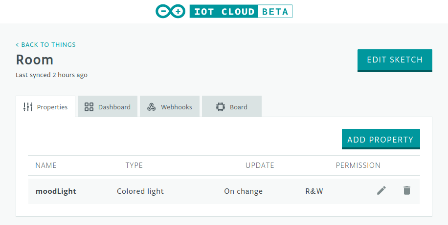
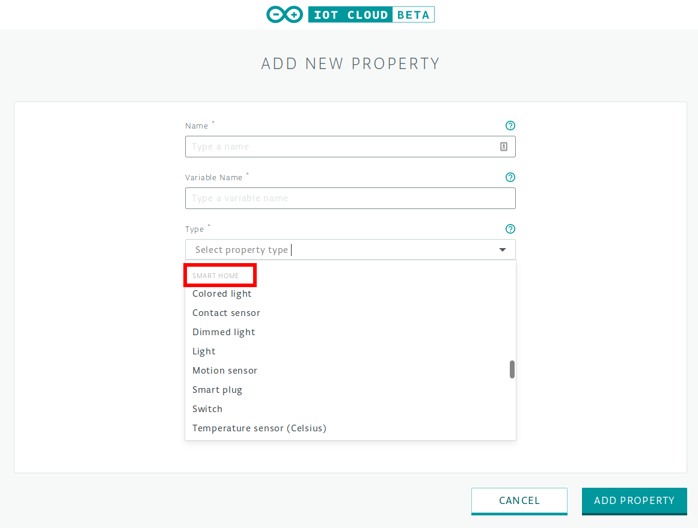
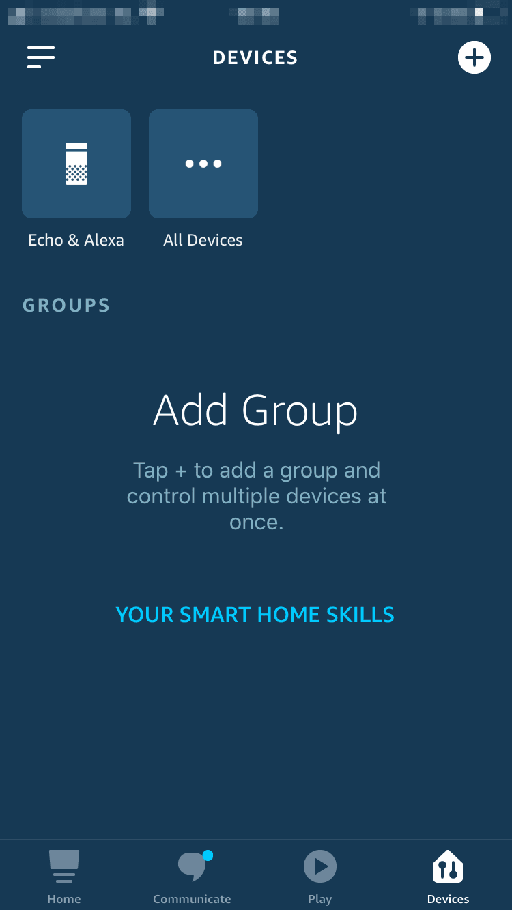
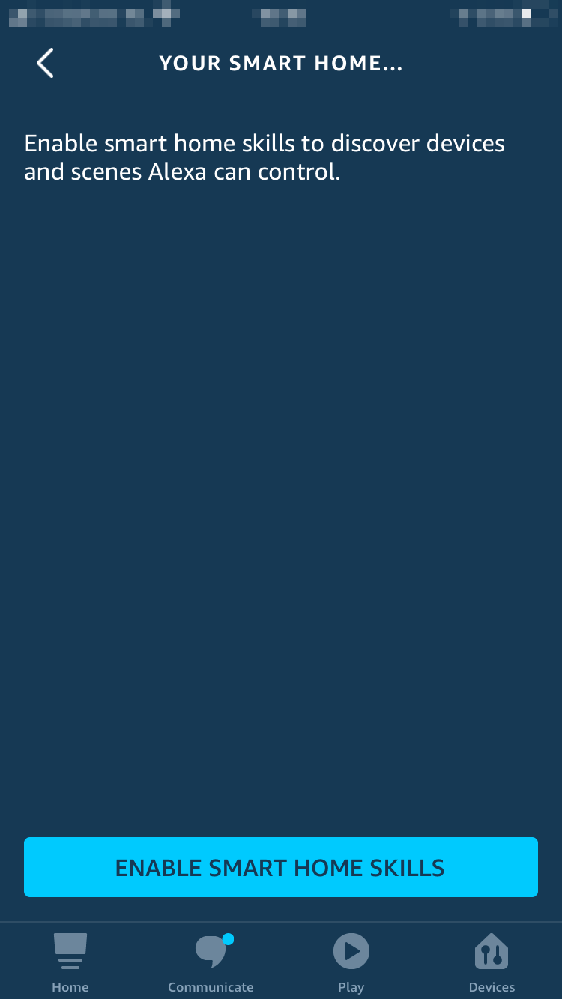
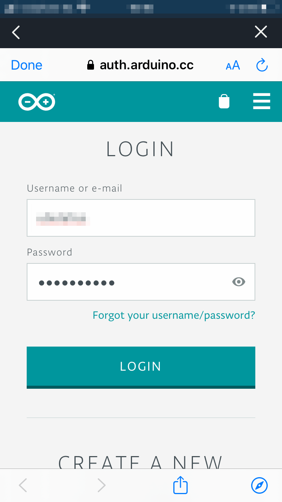
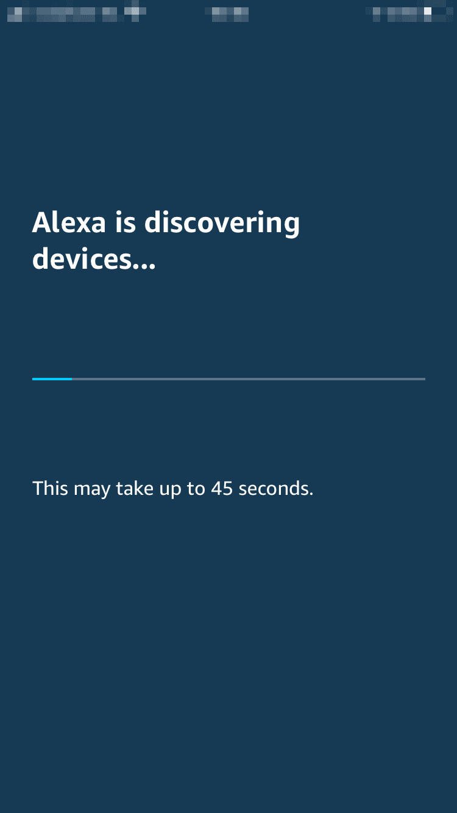
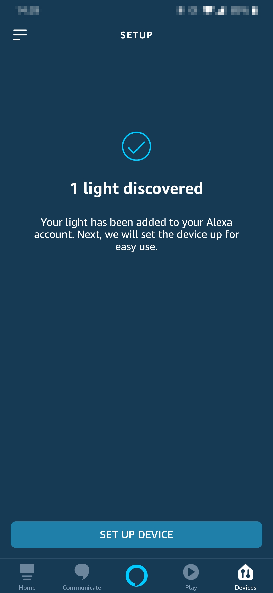
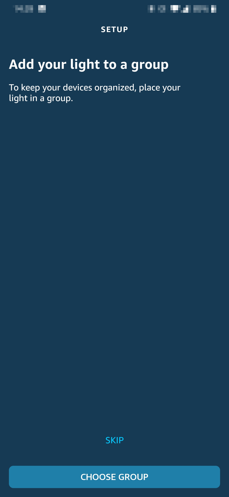
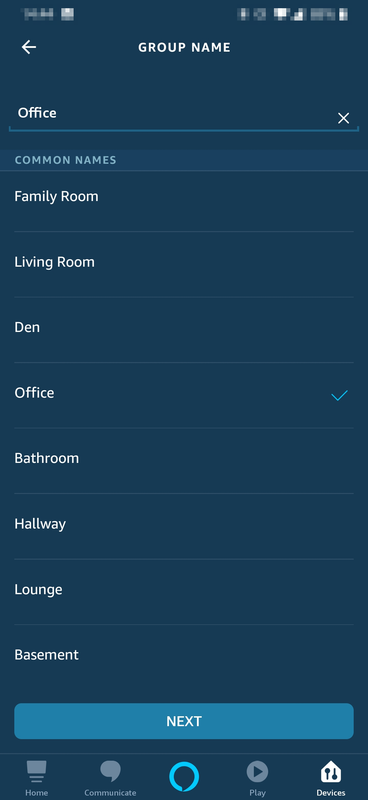
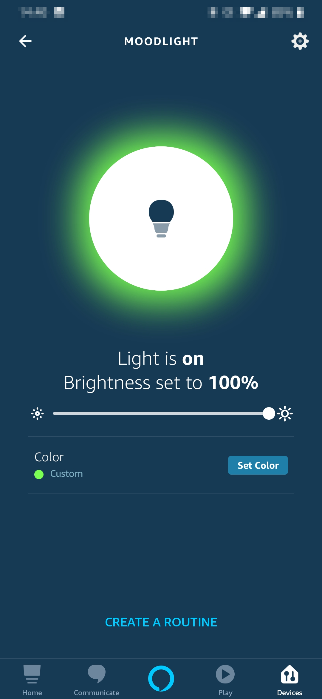

## Components and Supplies

- [Arduino Voice Controlled Light Bundle](https://store.arduino.cc/voice-controlled-light-bundle)

## Apps and Online Services

- [Arduino Cloud](https://cloud.arduino.cc)
- [Arduino Web Editor](https://create.arduino.cc/editor)
- [Arduino Amazon Alexa Official Arduino Skill](https://www.amazon.com/Arduino-LLC/dp/B07ZT2PK2H)

## About This Project

### Intro: Arduino Cloud

[Arduino Cloud ](https://create.arduino.cc/iot/)is a platform that enables anyone to build IoT connected objects with ease. In order to control our MKR RGB Shield using Alexa, we'll also be using the [Official Arduino Alexa Skill.](https://www.amazon.com/Arduino-LLC/dp/B07ZT2PK2H)

If you are new to Arduino Cloud, we advise to first take a look at [this introductory project,](https://create.arduino.cc/projecthub/133030/iot-cloud-getting-started-c93255) which will give you an overview and guide you through the process of setting up one of the supported boards, IoT Cloud *Things* and *Properties* and get you onboard.

### Part 1: Arduino Cloud

From the main [Cloud page,](https://create.arduino.cc/iot/things) we'll create a new thing and assign it a meaningful **name.** We'll then select the **board** we are going to use. If you can't see your board you might have skipped the [getting started procedure:](https://create.arduino.cc/getting-started) look at the section above.

Once done, we'll add a **property** to our **thing** that will represent the **RGB shield.** As a type remember to choose **ColoredLight** which lets us control an **RGB** Light, allowing us to change its brightness and colour. Set it as **Read** **and** **Write** because we'll need to control its behaviour through Alexa.

Here it is what the **Dashboard** view of your **Thing** should look like at this point:



When adding properties make sure you only use types listed under the **Smart Home** section, otherwise they will not work with Alexa.




Now go to the **Web Editor** by clicking the **Edit Sketch** button in your **Thing**'s edit view.

### Part 2: Arduino Web Editor

In the Web Editor we need to add some code to the **Sketch** automatically generated for us.

The first thing to include are the libraries which will help us to control the MKR RGB Shield:

```arduino
#include <ArduinoGraphics.h> 
#include <Arduino_MKRRGB.h>
```

We have to include both libraries because [Arduino\_MKRRGB](https://www.arduino.cc/en/Reference/ArduinoMKRRGB) depends on [ArduinoGraphics](https://www.arduino.cc/en/Reference/ArduinoGraphics).

Now in the **setup function** we can initialize the **Arduino MKR RGB Shield** with:

```arduino
if (!MATRIX.begin()) {
  Serial.println("Failed to initialize MKR RGB shield!");
  while (1);
}
MATRIX.brightness(10);
```

This way if the shield is not installed **Sketch** execution will be blocked.

The brightness is set to 10 for **development purposes** (**no external power supply** **needed**). You can use **larger values** (supported range is from 0 to 255) if you plan to use a **4 Amps** 5v power supply as stated in the [getting started guide](https://www.arduino.cc/en/guide/MKRRGBShield).

Now it's time to implement our callback function: the one responsible of setting the colour/state of the LEDs. This function will be executed every time a change in a **Property**'s value is pulled from IoT Cloud.

Let's implement `onMoodLightChange`:

```arduino
void onMoodLightChange() {
 uint8_t r, g, b;
 moodLight.getValue().getRGB(r, g, b);
 MATRIX.beginDraw();
 if (moodLight.getSwitch()) {
   Serial.println("R:"+String(r)+" G:"+String(g)+ " B:"+String(b));
   MATRIX.fill(r, g, b);
   MATRIX.rect(0, 0, MATRIX.width(), MATRIX.height());
 }
 else{
   MATRIX.clear();
 }
 MATRIX.endDraw();
}
```

With the code above we first read the **rgb value** from the Cloud and save the representation of the RGB colour in some variables, we then verify if the **light switch** is on; if it is we can turn on the light, using the **colour values** read before. Otherwise we turn off the light.

The `beginDraw` and `endDraw` functions are used to alter the state of the matrix, `fill` is used to select the colour to use, rect is a function used to specify the region to fill.

Of course we can define custom colours by name in the Alexa app so we won't have to manually tell which amounts of Red, Green or Blue we want to set. 

### Part 3: Amazon Alexa Skill Setup

We will now need the **Amazon Alexa app** which can be downloaded from the [Apple App Store ](https://apps.apple.com/us/app/amazon-alexa/id944011620)or the [Google Play Store.](https://play.google.com/store/apps/details?id=com.amazon.dee.app) Once installed, login with your existing account or create a new one.

Let's go through the steps necessary to install the Arduino Alexa Skill. We'll follow the sequence of images below to see all the required steps.













### Part 4: Amazon Alexa Devices Setup

After waiting a little bit, you should see that some devices have been found.

Follow the sequence of images below to setup the device:













**Note**: The devices will be named according to how we named our properties in Arduino Cloud. If you have trouble finding the devices, you might have not selected your property from the *"Smart Home"* section.

We're done, it's now time to voice control our MKR RGB Shield asking things like

* *”Alexa, turn on the light in the office”*
* *”Alexa, change the colour of the mood light to red”*
* *”Alexa, set the brightness of the mood light to 50%”*

Have fun playing with Alexa and IoT Cloud. If you have questions and/or build this project let us know in the comments below.

Thank you, the Arduino Team


## Complete Sketch


<iframe src='https://create.arduino.cc/editor/Arduino_Genuino/42c17c42-6c91-43fe-9079-125f6ce94d9b/preview?embed&snippet' style='height:510px;width:100%;margin:10px 0' frameborder='0'></iframe>