## Components and Supplies

- [Arduino MKR WiFi 1010](https://www.newark.com/71AC0169?COM=ref_hackster)
- [Arduino MKR ENV Shield](/hardware/mkr-env-shield)
- [Breadboard (generic)](https://www.newark.com/99W1759?COM=ref_hackster)
- [High Brightness LED, White](https://www.newark.com/57J2335?COM=ref_hackster)
- [Jumper wires (generic)](https://www.newark.com/88W2571?COM=ref_hackster)
- [LED RGB common cathode](https://www.sparkfun.com/products/9264)
- [Resistor 220 ohm](https://www.newark.com/multicomp/mccfr0w4j0221a50/carbon-film-resistor-220-ohm-250mw/dp/58K5029?COM=ref_hackster)

## Apps and Online Services

- [Arduino Web Editor](https://create.arduino.cc/editor)
- [Arduino Cloud](https://cloud.arduino.cc)
- [Arduino Amazon Alexa Official Arduino Skill](https://www.amazon.com/Arduino-LLC/dp/B07ZT2PK2H)

## About This Project

### Intro: Getting Started

In this tutorial we are going to use Arduino Cloud, if you are new to Arduino Cloud, we advise to first take a look at [this introductory project](https://create.arduino.cc/projecthub/133030/iot-cloud-getting-started-c93255), which will give you an overview and guide you through the process of setting up your supported board, IoT Cloud things and properties and get you onboard.

## Part 1: Arduino Cloud

From the main [IoT Cloud page](https://create.arduino.cc/iot), we'll create a new thing and assign it a meaningful **name.** We'll then select the **board** we are going to use. If you can't see your board you might have skipped adding a new Device following the procedure that starts after clicking the **ADD DEVICE** button, under the **Devices** section.

Once done, we'll add **three properties** to our **thing**. The first two will represent the **lamps**, the last one the **temperature.**

The type **ColoredLight** lets us control an **RGB** Light, allowing us to control its brightness and colour. Set it as **ReadandWrite** because we'll need to control its behaviour using Alexa.

The **DimmedLight** type is in a way similar to the above, but only lets us control the brightness of a Light.

The last property to add is the **temperature**. Let's add this one as **ReadOnly,** since we only want to know its value, not set it. As a type we can use **Temperature** **sensor** **(Celsius),** but feel free to set it as Fº if it suits you better.

Here it is what the **Dashboard** view of your **Thing** should look like at this point:

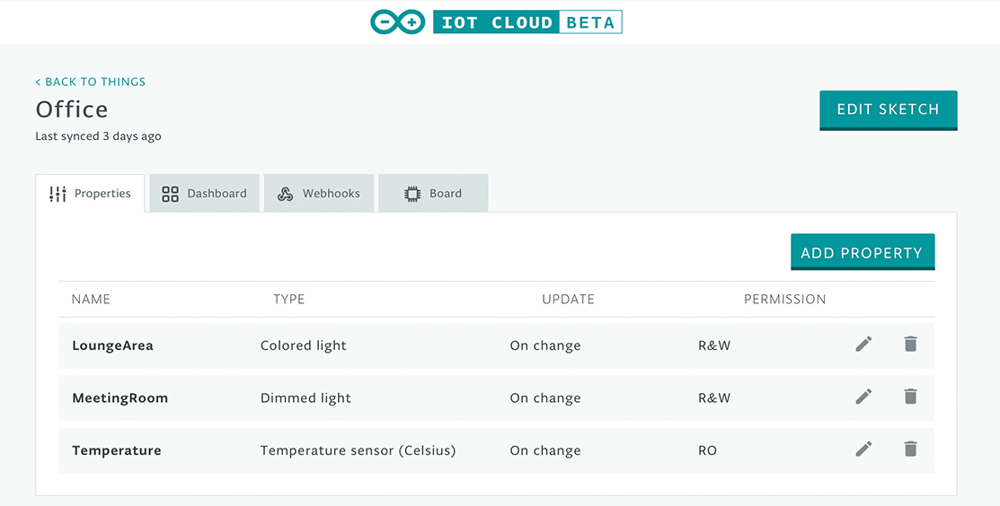

When adding properties make sure you only use types listed under the **Smart Home** section, otherwise they will not work with Alexa.

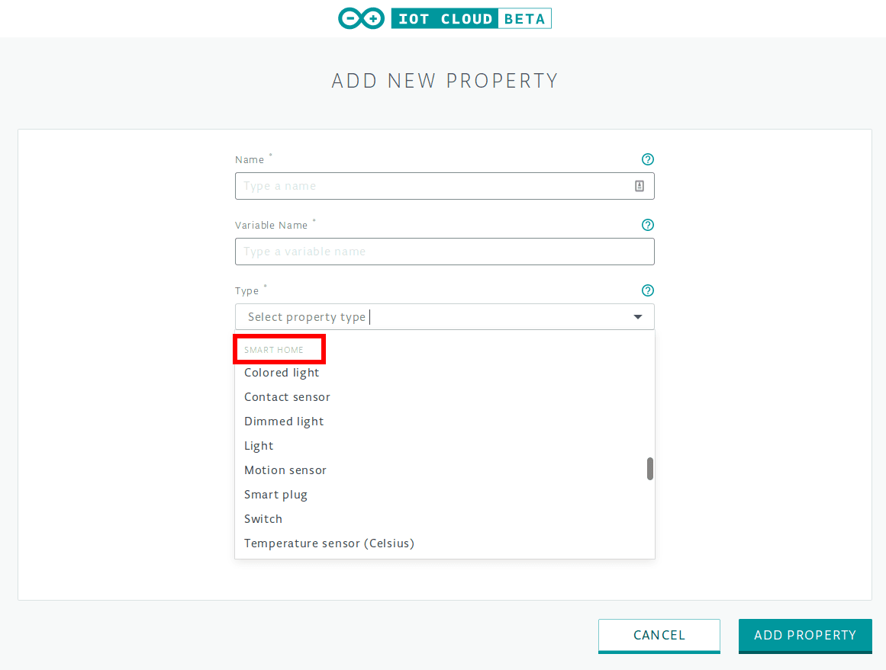

The Smart Home section

Now go to the **Web Editor** by clicking the **Edit Sketch** button in your **Thing**'s edit view.

### Part 2: Arduino Web Editor

In the Web Editor we need to add some code to the **Sketch** automatically generated for us.

Because we want to read some some environmental data (namely temperature, but feel free to add light, humidity and pressure if you please), we'll import the **Arduino_MKRENV** library at the top of our **Sketch**

```arduino
#include <Arduino_MKRENV.h>
```

Then we define some constants for the board pins that will be used for **R,G,Bandwhitelight**, this way the code is more readable:

```arduino
#define PIN_MEETING_ROOM 5
#define PIN_LOUNGE_AREA_R 2
#define PIN_LOUNGE_AREA_B 3
#define PIN_LOUNGE_AREA_G 4
```

Now in the **setup function** we can initialize the **Arduino MKR ENV Shield** with:

```arduino
if (!ENV.begin()) {
   Serial.println("Failed to initialize MKR ENV shield!");
   while (1);
}
```

This way if the shield is not installed **Sketch** execution will be blocked.

We do not need to specify that `pinMode` needs to be `OUTPUT` because we'll be using `analogWrite() `to set the intensity of our white LED or the single colours of the RGB one.

In the **loopfunction** we are going to read the temperature every second:

```arduino
temperature = ENV.readTemperature();
delay(1000);
```

Finally it's time to implement our callback functions: the ones that will be executed every time a change in a **Property**'s value is pulled from IoT Cloud.

We have to implement `onMeetingRoomChange` and `onLoungeAreaChange`:

```arduino
void onMeetingRoomChange() {
 uint8_t brightness = map(meetingRoom.getBrightness(), 0, 100, 0, 255);
 if (meetingRoom.getSwitch()) {
   Serial.println(brightness);
   analogWrite(PIN_MEETING_ROOM, brightness);    
 }
 else{
   analogWrite(PIN_MEETING_ROOM, LOW);
 }
}
```

with the code above we first read the **brightness value** from the Cloud and **map** it to a usable value, then we verify if the **light switch** is on, if it is we can turn on the light, using the `brightness` red before. Otherwise we turn off the light

The working principle is the same for the other callback:

```arduino
void onLoungeAreaChange() {
 uint8_t r, g, b;
 loungeArea.getValue().getRGB(r, g, b);
 if (loungeArea.getSwitch()) {
   Serial.println("R:"+String(r)+" G:"+String(g)+ " B:"+String(b));
   analogWrite(PIN_LOUNGE_AREA_R, r);
   analogWrite(PIN_LOUNGE_AREA_B, b);
   analogWrite(PIN_LOUNGE_AREA_G, g);
 }
 else{
    Serial.println("Lamp Off");
    analogWrite(PIN_LOUNGE_AREA_R, 0);
    analogWrite(PIN_LOUNGE_AREA_B, 0);
    analogWrite(PIN_LOUNGE_AREA_G, 0);
 }
}
```

The only notable difference is the fact that instead of the just brightness, we have three different components: they are the representation of the RGB colour of the light. Of course we can define custom colours by name in the Alexa app so we won't have to manually tell which amounts of Red, Green or Blue we want to set.

### Part 3: Amazon Alexa Skill Setup

We will now need the Amazon Alexa app which can be downloaded from the [Apple App Store](https://apps.apple.com/us/app/amazon-alexa/id944011620) or the [Google Play Store](https://www.google.com/url?sa=t&rct=j&q=&esrc=s&source=web&cd=16&cad=rja&uact=8&ved=2ahUKEwjz-JWPj8TlAhVC-qQKHXwfBe0QFjAPegQIBhAB&url=https%3A%2F%2Fplay.google.com%2Fstore%2Fapps%2Fdetails%3Fid%3Dcom.amazon.dee.app%26hl%3Den&usg=AOvVaw2um5S-c1aFHmAGypfT3pFm). Once installed, login with your existing account or create a new one.

Let's go through the steps necessary to install the Arduino Alexa Skill. We'll follow the sequence of images below to see all the required steps.


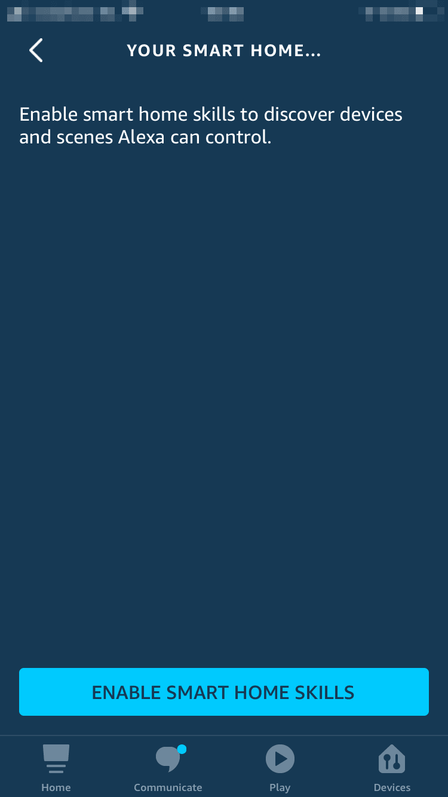


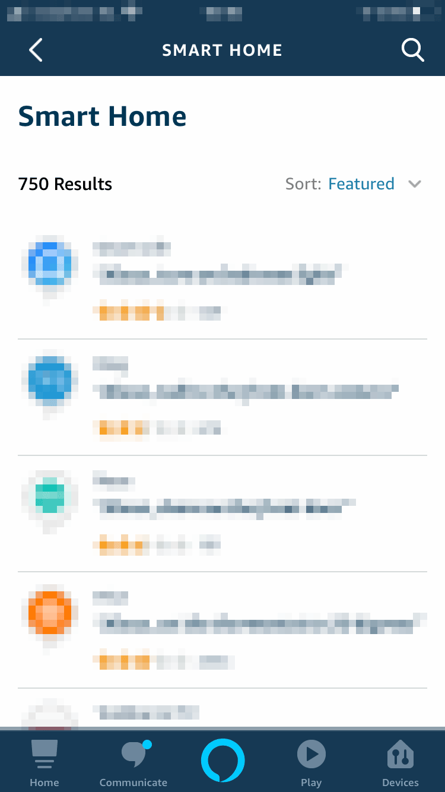


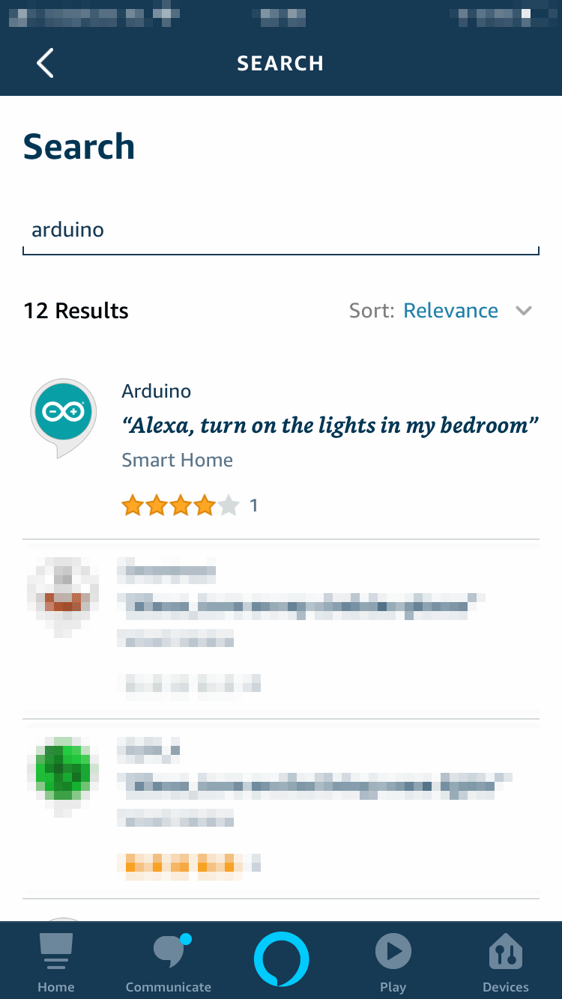


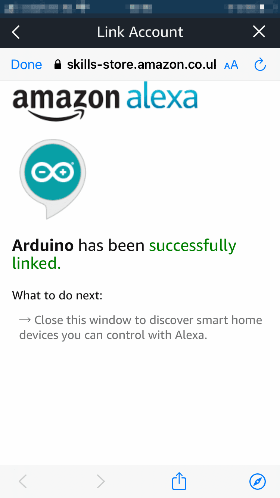


### Part 4: Amazon Alexa Devices Setup

After waiting a little bit, you should see that some devices have been found. 

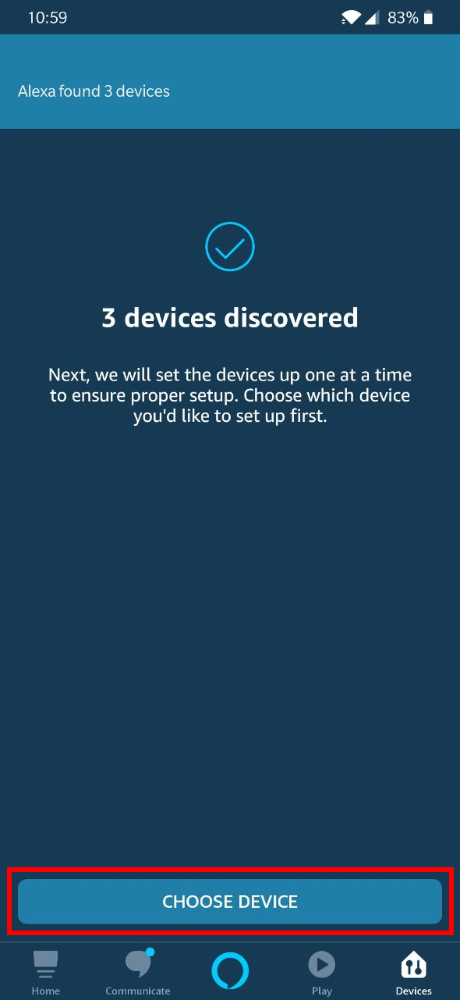

After tapping on **Choose Device** you will be presented with the setup page listing all the available devices (They will be named according to how we named our properties in Arduino Cloud).

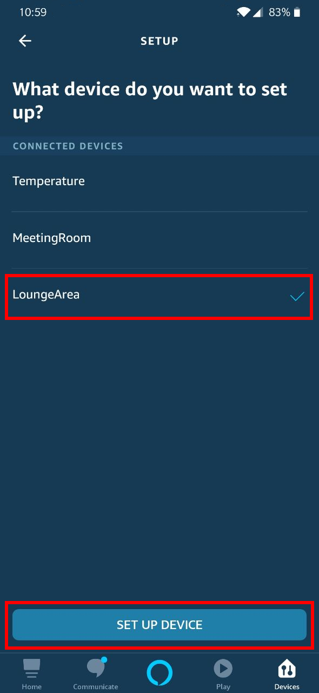

Let's choose one device and tap **Set** **Up** **Device**. If you like you can also add it to a group (This way you can control and organize your devices more easily), otherwise skip this part.

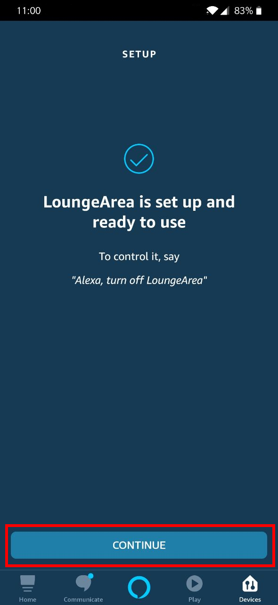

Repeat the **Setup** process for every device you want to control.

Finally the device view should look like this:

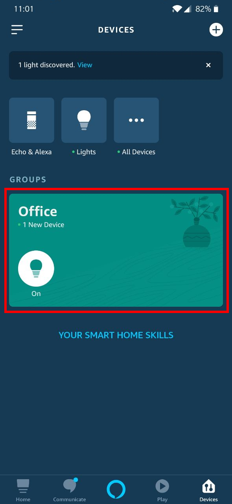

We can finally start asking things like "Alexa, what's the temperature in the office?" or "Alexa, turn on the light in the meeting room."

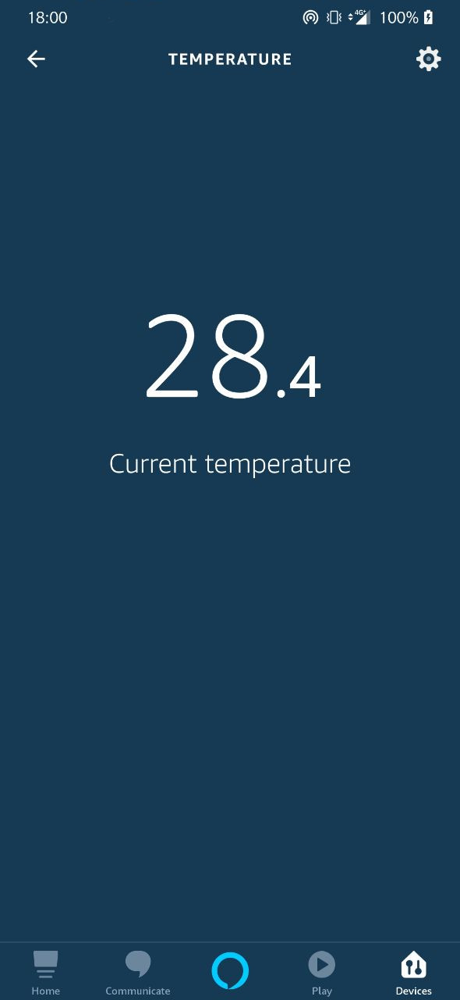

Have fun playing with Alexa and IoT Cloud. 

**The** **Arduino** **Team**

## Complete Sketch
<iframe src='https://create.arduino.cc/editor/Arduino_Genuino/111cdf8a-f8ca-4b79-8156-fe2e8f072435/preview?embed&snippet' style='height:510px;width:100%;margin:10px 0' frameborder='0'></iframe>

## Schematics

