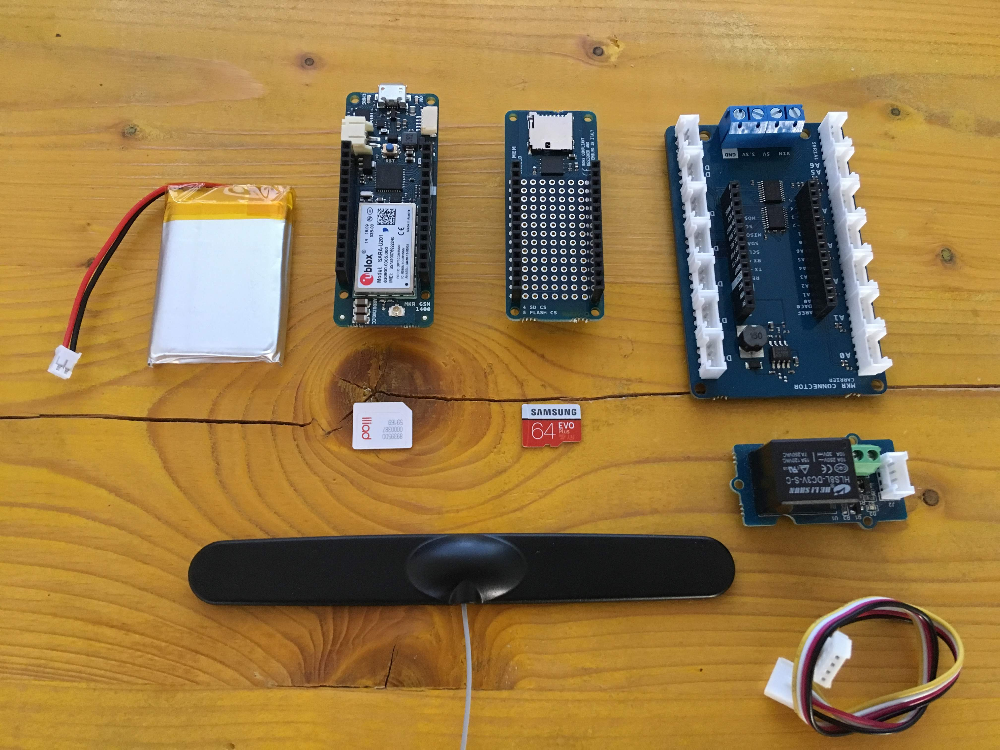
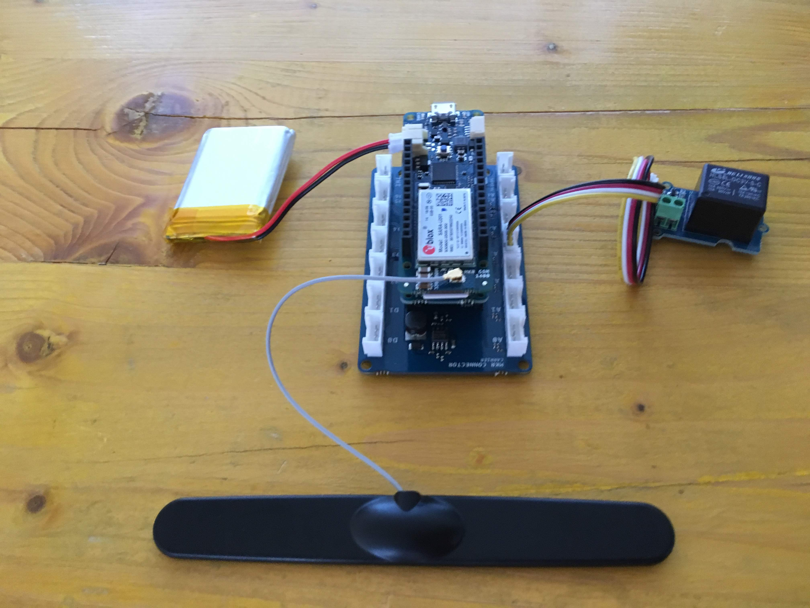

## Components and Supplies

- [Arduino MKR GSM 1400](https://www.newark.com/55AC1187?COM=ref_hackster)
- [Arduino MKR MEM Shield](https://store.arduino.cc/arduino-mkr-mem-shield)
- [Arduino MKR Connector Carrier (Grove compatible)](https://store.arduino.cc/arduino-mkr-connector-carrier)
- [Seeed Grove - Relay](https://www.seeedstudio.com/Grove---Relay-p-769.html)
- [Samsung Generic MicroSD](https://www.amazon.it/Samsung-MB-MC32GA-EU-MicroSD-Adattatore/dp/B06XFSZGCC/ref=sr_1_5?ie=UTF8&qid=1548151206&sr=8-5&keywords=micro+sd)
- [Li-Ion Battery 1000mAh](https://www.newark.com/96Y0775?COM=ref_hackster)
- [USB-A to Micro-USB Cable](https://www.newark.com/53W6089?COM=ref_hackster)

## About This Project

This project shows how to use an Arduino to receive a call and compare the calling number with numbers saved in the microSD card, without answering! This solution works also with a plain SIM with no data plan.

It's also possible to save new authorized numbers via SMS.

### What You Need

The project is based on an Arduino MKR GSM 1400, an antenna, a LiPo battery pack, an Arduino MKR MEM shield, a microSD card, an Arduino MKR Connector Carrier, a Grove Relay Module, one SIM card, and of course, a phone!

* The Arduino MKR GSM 1400 executes the sketch and supports the GSM connection that allows the call and SMS receiving features required by our project;
* Antenna and battery pack are respectively used to allow the connection to the cellular network with a good signal and to power the device when other power supplies are not available;
* The Arduino MKR MEM shield and microSD card (formatted as FAT16 or FAT32) are used to store a file with all the authorized phone numbers;
* Arduino MKR Connector Carrier is used to easily connect other electronics module as the Grove Relay Module;
* The SIM card is required to access the GSM network;
* PIN, is required to use the sim card.

### Hardware Setup




Insert microSD in the MKR MEM shield card holder and put it on the MKR Connector Carrier.

The antenna, the SIM and the battery pack should be connected to their own connector on the head and the tail of the MKR GSM 1400. 

Then connect the Grove Relay to the MKR Connector Carrier at D2 header.

The LiPo battery is optional, but it allows to cope with the peaks of current that the GSM module might require in particular conditions of poor coverage.




### How It Works

This project uses the MKRGSM library to manage the incoming calls and SMS messages.

When a call is received, the Arduino code catches the number and hangs the call. So the calling number is checked to find out if it's an authorized number. If it's authorized, the digital port 2 (D2) is turned ON for one second in order to activate the relay. The authorized numbers list is loaded from the [numbers.txt](http://numbers.txt/) file (located in the microSD card) on Arduino startup or when a new number is added to the list. 

When an SMS is received, if the sender is the admin and the message respects this format `SET<+XXXXXXXXXXX>`, the sent number is added to the [numbers.txt](http://numbers.txt/) file (stored in the microSD).

For security reasons, the sketch checks the number of the admin and this information must be stored in the arduino_secrets.h file.

### The Sketch

The first code section is used to include the libraries required by the application; `MKRGSM.h` include all the GSM connection functionalities, these are available through the object `GSMClient` and `GSM.`

**SD** include all the SD read and write functionalities.

`arduino_secrets.h` contains the sensitive data as SIM PIN and the Admin phone number

```arduino
// Include the GSM an SD library
#include <MKRGSM.h>
#include <SPI.h>
#include <SD.h>
// Include file with your sensitive data
#include "arduino_secrets.h"
// Max stored numbers
#define MAX_NUMBERS 5
// Relay pin number
#define GATE_PIN    2
```

Create and initialize the objects (GSM and SD) and variables

```arduino
// Initialize the library instance
GSM gsmAccess;
GSMVoiceCall vcs;
GSM_SMS sms;
// File object
File myFile;
// Pin number and Admin phone number from external file
const char PINNUMBER[] = SECRET_PINNUMBER;
String adminphone = SECRET_ADMINNUMBER;
// Array to hold the phone number for the incoming sms and call
char callnumber[20];
char smsnumber[20];
// phone numbers array
String numbers[MAX_NUMBERS];
int numberindex = 0;
```

Setup function, get the phone number list from numbers.txt and connect to the GSM network.

```arduino
void setup() {
 // initialize serial communications and wait for port to open
 Serial.begin(9600);
 // USE ONLY WITH A COMPUTER CONNECTED AND SERIAL MONITOR OPENED
 while (!Serial) {
   ; // wait for serial port to connect. Needed for native USB port only
 }
 // set up the pin as output and put it down
 pinMode(GATE_PIN, OUTPUT);
 digitalWrite(GATE_PIN, LOW);
 Serial.println("GSM Open Gate Sketch starting...");
 // Init SD card
 if (!SD.begin(4)) {
   Serial.println("initialization failed!");
   return;
 }
 // retrieve number from file stored in SD
 myFile = SD.open("numbers.txt");
 if (myFile) {
   // read from the file until there's nothing else in it
   while (myFile.available()) {
     // read a line and delete \r\n
     String reading = myFile.readStringUntil('\n');
     reading.trim();
     // add to numbers array
     if (numberindex < MAX_NUMBERS) {
       numbers[numberindex] = reading;
       numberindex++;
     }
   }
   // print the numbers
   if (numberindex > 0) {
     for (int i = 0; i < MAX_NUMBERS; i++) {
       Serial.print(i);
       Serial.print(" - ");
       Serial.println(numbers[i]);
     }
   }
   numberindex = 0;
   // close the file:
   myFile.close();
 } else {
   // if the file didn't open, print an error:
   Serial.println("error opening test.txt");
 }
 // connection state
 bool connected = false;
 // Init GSM shield
 while (!connected) {
   if (gsmAccess.begin(PINNUMBER) == GSM_READY) {
     connected = true;
   } else {
     Serial.println("Not connected");
     delay(1000);
   }
 }
 // This makes sure the modem correctly reports incoming events
 vcs.hangCall();
 Serial.println("Waiting for a call");
}
```

Loop function contains two main blocks. The first one takes care of the incoming call and catches the phone number. The second one is triggered when an SMS is received and then it extracts the message.

```arduino
void loop() {
 // Check the status of the voice call
 switch (vcs.getvoiceCallStatus()) {
   case IDLE_CALL:
     // Nothing is happening
     break;
   case RECEIVINGCALL:
     //Someone is calling us
     Serial.println("RECEIVING CALL");
     // Retrieve the calling number
     vcs.retrieveCallingNumber(callnumber, 20);
     // Check if it's the adminphone
     if (adminphone.equals(callnumber)) {
       Serial.println("Admin phone, open gate!");
       // open the gate and after 1 second close it
       digitalWrite(GATE_PIN, HIGH);
       delay(1000);
       digitalWrite(GATE_PIN, LOW);
     }
     // Check if it's an authorized number
     else {
       for (int i = 0; i < MAX_NUMBERS; i++) {
         if (numbers[i].equals(callnumber)) {
           Serial.println("Authorized, open gate!");
           // open the gate and after 1 second close it
           digitalWrite(GATE_PIN, HIGH);
           delay(1000);
           digitalWrite(GATE_PIN, LOW);
           break;
         }
       }
     }
     // Put down the call
     vcs.hangCall();
     break;
   case TALKING:
     // In this case the call would be established
     // Nothing to do here
     break;
 }
 // Check if there are any SMSs available
 if (sms.available()) {
   Serial.println("Message received from:");
   // Get remote number
   sms.remoteNumber(smsnumber, 20);
   Serial.println(smsnumber);
   // Read message bytes, save and print them
   int c;
   String smsmessage = "";
   while ((c = sms.read()) != -1) {
     // Serial.print((char)c);
     smsmessage += (char)c;
   }
   // Only the admin can edit the number list
   // example sms => SET <+00123456789>
   if (adminphone.equals(smsnumber)) {
     // Check the command
     if (smsmessage.indexOf("SET") > -1) {
       // Check for a phone number and add to the stored file
       int startindex = smsmessage.indexOf("<");
       int endindex = smsmessage.indexOf(">");
       String newnumber = smsmessage.substring(startindex + 1, endindex);
       myFile = SD.open("numbers.txt", FILE_WRITE);
       if (myFile) {
         Serial.print("Number to add: ");
         Serial.println(newnumber);
         // write number in the file
         myFile.println(newnumber);
         // close the file:
         myFile.close();
         Serial.println("saved.");
         // add to the local numbers list
         if (numberindex < MAX_NUMBERS) {
           newnumber.trim();
           numbers[numberindex] = newnumber;
           numberindex++;
         }
         else {
           Serial.println("Too many saved numbers!");
         }
       } else {
         // if the file didn't open, print an error:
         Serial.println("error opening numbers.txt");
       }
     }
   }
   Serial.println("\nEND OF MESSAGE");
   // Delete message from modem memory
   sms.flush();
   Serial.println("MESSAGE DELETED");
 }
 delay(1000);
}
```

### How to Use It

Be sure to have a [numbers.txt](http://numbers.txt/) file stored in the microSD. It can be blank or formatted in this way:

```arduino
+00XXXXXXXXXX
+00XXXXXXXXXX
+00XXXXXXXXXX
```

It's important to have a newline after the last number.

Double check that your phone number is properly stored in the `arduino_secrets.h` file, then upload the sketch and open the Serial Monitor to verify that the module properly connects to the network.

Now you are able to call or send SMS to the Arduino.

## Complete Sketch

<iframe src='https://create.arduino.cc/editor/FabLab_CastelfrancoVeneto/349f4108-9dba-4b01-a45c-dfe656785f7d/preview?embed&snippet' style='height:510px;width:100%;margin:10px 0' frameborder='0'></iframe>
