## Components and Supplies

- [ARDUINO MKR WIFI 1010](https://store.arduino.cc/arduino-mkr-wifi-1010)
- [Arduino MKR SD Proto Shield](https://store.arduino.cc/mkr-sd-proto-shield)
- [Arduino MKR Connector Carrier (Grove compatible)](https://store.arduino.cc/arduino-mkr-connector-carrier)
- [Seeed GROVE - 2-COIL LATCHING RELAY](https://store.arduino.cc/grove-2-coil-latching-relay)
- Generic microSD card
- [Arduino Bot Bundle](https://store.arduino.cc/bot-bundle)

## Apps and Online Services

- [Arduino Web Editor](https://create.arduino.cc/editor)
- [Telegram](https://telegram.org/)

## About This Project

In this project we'll see how to do home automation by using a tool that you probably have already installed into your smartphone (and if not, this is the moment to install it!): Telegram.

Telegram is "a Cloud-based mobile and desktop messaging app with a focus on security and speed."

It runs on almost all devices like smartphone or pc, and is available for almost all the OS. And it's free.

There's also a web version, so if you want to use it from your PC, you don't even need to install it, simply point your browser to:

https://web.telegram.org

Use Telegram is a smart way to do domotic, because you don't have to install other apps and overall because you can create your own Bot and share it with relatives or friends.

What is a Bot? 

"Bots are third-party applications that run inside Telegram. Users can interact with bots by sending them messages, commands and inline requests".

So basically it's a small App hosted and delivered for you by Telegram! 

*Don't forget that the components needed for this project are available on our store in the [BOT Bundle](https://store.arduino.cc/bot-bundle).*

### Hardware Setup

_f5u0RQNqkY.jpg)

This project is based on the new Arduino MKR Wifi 1010, and few other components ready-to-use; the BOM is the following:

* the Arduino MKR Wifi 1010 itself
* the Arduino SD proto shield and a standard micro SD card (formatted as FAT16 or FAT32); they are used to store the log file and the file with the authorized users
* the Arduino MKR Connector Carrier, that is used to connect easily to the Arduino board any of the hundreds Grove modules!
* the Grove 2-Coil Latching Relay module, a particular relay that doesn't need continuous power to keep the state

Of course you can reach the same setup using a breadboard, floating wires and spare components!

### Telegram Bot Setup

For first, we need to create a Telegram Bot.

If you already now how to do this, you can skip this step!

Start searching for @BotFather contact:

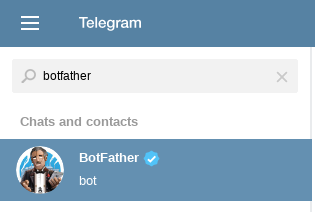

..and start a conversation with him.

Just press the small icon with a slash, and choose from the "menu" the "*/newbot*" command.

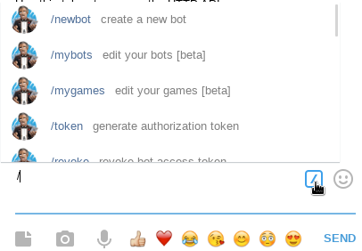

Now just follow the steps by choosing a *name* for your bot - that is the name that will appear in the contact list, and a *username* - that is a kind of "nickname" used to talk to it.

For this tutorial, i've chosen "HomoDomoBot" as name, and "homodomobitbot" as username (username must end in 'bot').

At the end of the step, BotFather will give you a *token*, that is a kind of unique key you have to take care of: you have to keep it secret! (and of course I've kept mine the same ;))

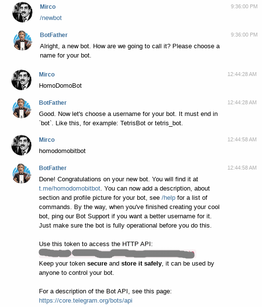

### The Sketch: First Connection to Telegram Bot

Now we have to setup the Arduino MKR Wifi 1010 in order to interface it to Telegram.

We can do this step both using the Arduino Web Editor (used in this project) and the Arduino IDE: you can find more information on their setup for the Arduino MKR WAN 1010 board at this [link](https://www.arduino.cc/en/Guide/MKRWiFi1010).

First thing to do, in order to be able to go on, is to downgrade the *ArduinoJson* library. The current version indeed is too recent to work well with the Telegram libraries.

So just go on the repository of that library: <https://github.com/bblanchon/ArduinoJson>

and choose the branch (release) 5.x, and download it - you should have now a file called *ArduinoJson-5.x.zip.*

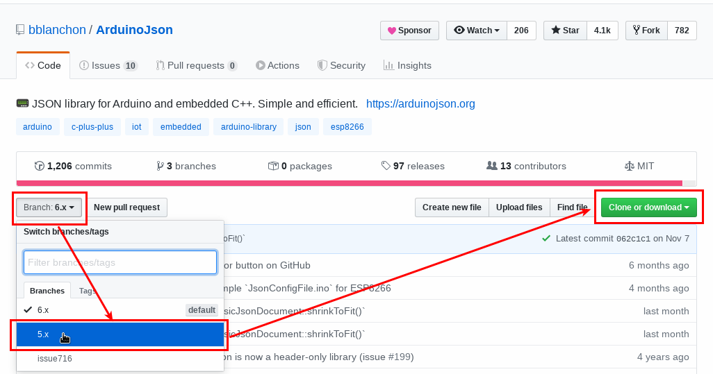

Now you have to upload it back to the Arduino Web Editor: choose from the left Menu "Libraries" and in the Library manager section, click on the Import icon and choose to import the file previously downloaded:


That's it. Since now, your default *ArduinoJson* library will be the one released 5.x

Then, from the Libraries section, search for the *UniversalTelegramBot* library.

Expand the provided examples, and open the *CustomKeyboard* example for the 101 board:

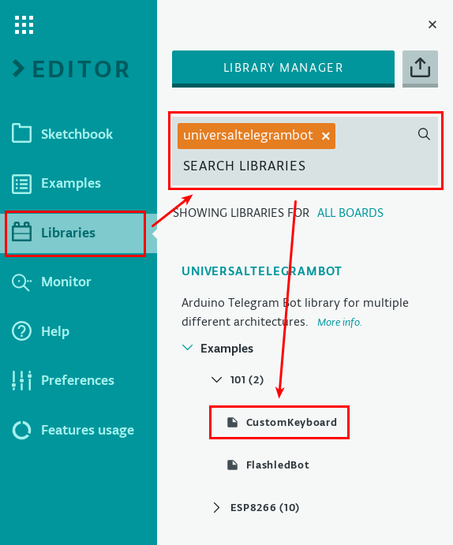

This example is for the Arduino WiFi Shield 101 and the Arduino MKR1000 board, but we can easily adapt it.

Just update the row:

```arduino
#include <WiFi101.h>
```

into 

```arduino
#include <WiFiNINA.h>
```

Change also: 

```arduino
// Initialize Wifi connection to the router
char ssid[] = "xxxxxxxxxxxxxxxxxxxxxx"; // your network SSID (name)
char password[] = "yyyyyyyy";           // your network key
const int ledPin = 13;
// Initialize Telegram BOT
#define BOTtoken "XXXXXXXXX:XXXXXXXXXXXXXXXXXXXXXXXXXXXXXXXXXXX"  // your Bot Token (Get from Botfather)
```

into 

```arduino
// Initialize Wifi connection to the router
char ssid[] = SECRET_SSID;              // your network SSID (name)
char password[] = SECRET_PASSWORD;      // your network key
const int ledPin = LED_BUILTIN;
const int relayPin = 2;
// Initialize Telegram BOT
#define BOTtoken SECRET_TOKEN // your Bot Token (Get from Botfather)
```

Basically, we have updated the pin of the led (LED\_BUILTIN points to the correct embedded led pin), and added the *relayPin* constant, with the value of the pin used to control the relay.

Don't forget to add in the *void setup()* function the following instruction:

```arduino
pinMode(relayPin, OUTPUT);
```

Then, instead of keeping the relevant info like ssid, password, token on the main code, by putting the "SECRET_" word in front of the variables name, we have moved them in the *SECRET* tab! 

If we'll share this sketch with someone else, the values on that tab will be blank. 

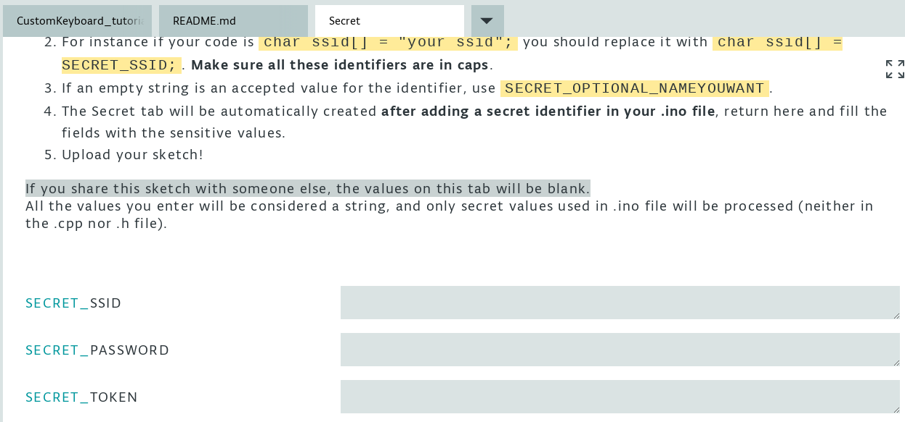


Upload now the sketch to your Arduino MKR WiFi 1010 and let's try this first Bot!

On Telegram, search for your Bot, and start a conversation with it. At the first connection, there'll be a *START* button; by pressing it we'll send the "/start" message and then, the reply of the Bot will be the list of the available.

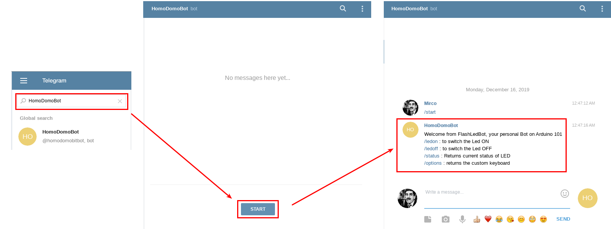

In particular, if we'll press the "/options" command, a keyboard will appear on the bottom of the chat windows!


By pressing then the */ledon* button om the keyboard, the LED on the board will be turned ON, and it'll come back to OFF status by pressing */ledoff* button.

Open the Serial monitor if you want to see what's happening in the *backstage*!

Let's see now how we can transform this example in tart now with a few improvements.

### The Sketch #2: From LED to Gate and Keyboard Update

This is the easiest improvement! 

We need to:

* update the keyboard in order to show a *Open the Gate* (or similar) button instead of */ledon* or */ledoff*
* control the relay: usually gates require a single 1s (or less) pulse to start opening.

For the keyboard, we have to update this section of code inside the `handleNewMessages` function:

```arduino
 if (text == "/options") {
     String keyboardJson = "[[\"/ledon\", \"/ledoff\"],[\"/status\"]]";
     bot.sendMessageWithReplyKeyboard(chat_id, "Choose from one of the following options", "", keyboardJson, true);
   }
   if (text == "/start") {
     String welcome = "Welcome from FlashLedBot, your personal Bot on Arduino 101\n";
     welcome = welcome + "/ledon : to switch the Led ON \n";
     welcome = welcome + "/ledoff : to switch the Led OFF \n";
     welcome = welcome + "/status : Returns current status of LED \n";
     welcome = welcome + "/options : returns the custom keyboard \n";
     bot.sendMessage(chat_id, welcome, "Markdown");
   }
```

We can understand, looking at the code, that every conditional statement is used to match a command received from the Bot.

And looking at the syntax used in the *keyboardJson* variable, we can see that square brackets are used to represent a single row of buttons; between them we can have one or more labels, separated each other by a comma.

Each label represent the command that will be sent by pressing the button.

So let's update that variable, and create a new conditional statement for the "Open the Gate" command!

Maybe we don't need an */options* command: we can open the keyboard directly with the */start* command.

The updated code section should be now like this:

```arduino
 if (text == "Open the Gate") {
       digitalWrite(relayPin, HIGH);
       delay(1000);
       digitalWrite(relayPin, LOW);
       bot.sendMessage(chat_id, "Gate opened!", "");
   }
   if (text == "/start") {
     String welcome = "Welcome from Wifi1010Bot, your personal Bot on Arduino MKR Wifi 1010\n";
     bot.sendMessage(chat_id, welcome, "Markdown");
     String keyboardJson = "[[\"Open the Gate\"]]";
     bot.sendMessageWithReplyKeyboard(chat_id, "Choose from one of the following options", "", keyboardJson, true);
   }
```

(pay attention to the button label: it must be the same as the one used in the conditional statement!)

Let's upload the updated code to Arduino MKR Wifi 1010 and test the Bot.

By sending the */start* command (or cleaning the history to restart the discussion with the Bot), we'll see the new keyboard!


### The Sketch #3: Secure the Bot and Log Actions!

Now the system is working and we can wire the relay to the gate control circuit.

But wait: if someone knows about my bot, he'll be able to open my gate or worst!

So how can we solve this issue?

Well, we know that in the message received from Telegram Bot, there are other info than the simple message itself.

For example, we have also the user id that has sent the message! 

The user id is a unique number assigned from Telegram at the moment of the account creation. Nobody can change it: it's exactly like an ID.

So we can check if the message is sent from a trusted person, and only in that case let the user interact with our home!

And of course we can log the commands received by the Bot, in order to keep history of when-who-what - this log will be stored on the SD card.

We can find our user id on Telegram thanks to another bot: @userinfobot . We already know how the bots work: just press (or digit) the */start* command.

This will replay with a few info, and between them the ID.

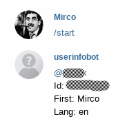

We have to consider that there must be an Admin, able to add or remove other users. 

The ID of this Admin will be written into the code and stored in the Secret tab, meanwhile the ID of the authorized users will be stored in the file *telegram.txt* the SD card, in order to save them between reboot or reset.

So, first of all we have to create this file into the SD card!

Then we need to include in our code the SD library. Just add at the beginning of the sketch:

```arduino
#include <SD.h> 
```

In this project, every authorized user will be saved in the file in the format XXXXXX:AAAAAA where XXXXXXX is the unique ID, and AAAAAA is the nickname of the user (e.g. 

```arduino
12345678:Max
98765432:Uwe
```

)

At boot time, the file *telegram.txt* is opened and copied into an array. Every time the Admin add or remove a user, the file is edited to keep track of all the changes until the next boot or reset.

So in the top part of the code add:

```arduino
// Telegram Bot ADMIN
String ADMIN_ID =  SECRET_ADMINID";
// Max registered telegram IDs
#define MAX_IDS 5
String telegram_ids[MAX_IDS];
int idIndex = 0;
```

(Remember to fill in the *Secret* tab the SECRET_ADMINID field!)

Add also this code, used to create a memory buffer (an array) of the last MAX_LOG_ROWS rows of the log, that is instead fully stored in the SD.

```arduino
// LOG buffer: max rows to show
#define MAX_LOG_ROWS 5
String log_rows[MAX_LOG_ROWS];
int logIndex = 0;
```

Then in the `setup()` function, add the code used to read from the SD file the user list, and to fill the *telegram_ids* array

```arduino
 // Init SD card
 if (!SD.begin(4)) {
   Serial.println("SD initialization failed!");
   return;
 }
 // retrieve IDs from the file in SD
 File myFile = SD.open("telegram.txt");
 if (myFile) {
   idIndex = 0;
   // read from the file until there's nothing else in it
   while (myFile.available()) {
     // read a line and delete \r\n
     String reading = myFile.readStringUntil('\n');
     reading.trim();
     // add to IDs array
     if (idIndex < MAX_IDS) {
       telegram_ids[idIndex] = reading;
       idIndex++;
     }
   }
   // print the IDs
   for (int i = 0; i < MAX_IDS; i++) {
     Serial.print(i);
     Serial.print(" - ");
     Serial.println(telegram_ids[i]);
   }
   // close the file:
   myFile.close();
 } else {
   // if the file didn't open, print an error:
   Serial.println("error opening telegram.txt");
 }
```

Now we can edit the *for* loop used to process the messages queue in the `handleNewMessages` function, retrieving from the message the ID, the username, and the date, so we can use later these info to log when-who-what; just add after these 2 rows:

```arduino
String chat_id = String(bot.messages[i].chat_id);
String text = bot.messages[i].text;
```

the following code. It will then check if the userId is the Admin (*isAdmin = true*), or if it's one of the listed on the file (*authorized = true*). If neither of these are true, we can suppose someone not trusted is trying to use our Bot - and of course we'll block him!

```arduino
 String userName = bot.messages[i].from_name;
   String msgDate = bot.messages[i].date;
   String userId = bot.messages[i].from_id;
   //authorization level check
   boolean authorized = false;
   boolean isAdmin = false;
   if (ADMIN_ID.equals(userId)) {
     Serial.println("Is Admin!");
     isAdmin = true;
   } else {
     for (int i = 0; i < idIndex; i++) {
       //user are saved in format "ID:nickname" but we need only the ID!
       String id = telegram_ids[i].substring(0, telegram_ids[i].indexOf(":"));
       Serial.println("Checking for " + id);
       if (id.equals(userId)) {
         authorized = true;
         break;
       }
     }
   }
   //if not authorized, exit
   if (!authorized && !isAdmin) {
     bot.sendMessage(chat_id, "Nice Try!", "");
     return;
   }
```

The Admin will be able to see other commands, in order to List the actual users, add new one or remove an existent one.

So we need to update the actual keyboard, and add conditional statement for manage the admin operations.

So the old keyboard become something like this: in case of the user is the Admin, we add a few other buttons.

```arduino
//if authorized, go on
   if (text == "/start") {
     String welcome = "Welcome from Wifi1010Bot, your personal Bot on Arduino MKR Wifi 1010\n";
     bot.sendMessage(chat_id, welcome, "Markdown");
     String keyboardJson = "[[\"Open the gate\"]";
     keyboardJson += (isAdmin ? ",[\"View Log\"],[\"List Users\", \"Add / Remove User\"]" : "");
     keyboardJson += "]";
     bot.sendMessageWithReplyKeyboard(chat_id, "Choose from one of the following options", "", keyboardJson, true);
   } 
```

Since now, and only for the Admin, the keyboard will be something like this:


We have added for the Admin the following commands:

* *View Log*: to see the last commands received by the Bot
* *List users*: to see the authorized users
* *Add / Remove User*: to manage the authorized users list

Add the following code just after the conditional statement used for the */start* command:

```arduino
 //Manage Users
   //List Users
   if (text == "List Users" && isAdmin) {
     bot.sendMessage(chat_id, "Here you are the allowed IDs:", "");
     for (int i = 0; i < idIndex; i++) {
       bot.sendMessage(chat_id, String(i) + " - " + telegram_ids[i]);
     }
   }
   
   if (text == "Add / Remove User" && isAdmin) {
     bot.sendMessage(chat_id, "To add a new ID, just type \"/add XXXXXXXX YYYYYY\" where XXXXXXXX is the user ID you want to add, and YYYYYY is his/her nickname, and send the message!");
     bot.sendMessage(chat_id, "To remove an existent ID, just type \"/del XXXXXXXX\" where XXXXXXXX is the user ID you want to remove, and send the message!");
   }
   
   if (text.indexOf("/add") > -1  && isAdmin) {
     if (idIndex < MAX_IDS) {
       //extract from the string the ID and the nick. We know that there's a space after "/add", and a space after the ID
       int firstSpace = text.indexOf(" ");
       int secondSpace = text.indexOf(" ", firstSpace + 1);
       String ID = text.substring(firstSpace + 1, secondSpace);
       String nickName = text.substring(secondSpace + 1, text.length());
       String newUser = ID + ":" + nickName;
       //modify the array used to store on memory the IDs
       telegram_ids[idIndex] = newUser;
       idIndex++;
       //update the file on SD as well
       writeToFile("telegram.txt", newUser);
       bot.sendMessage(chat_id, nickName + " added to authorized users' list!");
     } else {
       bot.sendMessage(chat_id, "You have to remove a User before to add another one, or you have to increase MAX_IDS on your code!");
     }
   }
   //Remove user
   if (text.indexOf("/del") > -1 && isAdmin) {
     int firstSpace = text.indexOf(" ");
     String ID = text.substring(firstSpace + 1, text.length());
     boolean removed = false;
     for (int i = 0; i < idIndex; i++) {
       //user are saved in format "ID:nickname"; we need only the ID to match the value to remove
       String id = telegram_ids[i].substring(0, telegram_ids[i].indexOf(":"));
       Serial.println("Checking for " + id);
       if (id.equals(ID)) {
         Serial.println("Found " + ID);
         //remove from the array the ID and trim it
         removeIndex(telegram_ids, MAX_IDS, i);
         removed = true;
         break;
       }
     }
     if (removed) {
       idIndex--;
       //if we have removed a user, we have to update the SD file as well (for first by removing it, then rewriting it from scratch)
       SD.remove("telegram.txt");
       for (int i = 0; i < idIndex; i++) {
         writeToFile("telegram.txt", telegram_ids[i]);
         delay(200);
       }
       bot.sendMessage(chat_id, ID + " successfully removed!");
     }
   }
  
   //View the Log!
   if (text == "View Log" && isAdmin) {
     //show the entries of the "rolling array" 
     if (logIndex == 0) {
       bot.sendMessage(chat_id, "Nothing to see here...", "");
     } else {
       bot.sendMessage(chat_id, "Here you are the last " + String(logIndex) + " events:", "");
       for (int i = 0; i < logIndex; i++) {
         bot.sendMessage(chat_id, log_rows[i]);
       }
     }
   }
```

Let's explain a bit more.

The Admin, using the command "*List Users*" will be able to see the content of the *telegram_ids* array (that is filled at boot time reading the file telegram.txt from the SD).

The command "*Add / Remove User*" will explain how to add or remove user.

The command "*/add XXXXXX YYYYYY*" will add the user ID XXXXXXXX and nick YYYYYY to the *telegram_ids* array and to the file *telegram.txt*

The command "*/del XXXXXX*" will remove the user ID XXXXXXXX from the array; after that, the file *telegram.txt* will be rewritten from scratch and saved (it's quite hard to remove a single row from a file!).

To remove the specific entry from the array and then "trim" it, and to write the file on the SD, we use a couple of additional libraries:

```arduino
void removeIndex(String array[], size_t length, size_t index) {
 //https://arduino.stackexchange.com/questions/22802/removing-element-from-array-while-keeping-order
 // Sanity check.
 if (array != nullptr && length > 0) {
   for (size_t i = index; i < (length - 1); i++) {
     array[i] = array[i + 1];
   }
   array[length - 1] = "";
 }
}
void writeToFile(String filename, String text) {
 // open the file. note that only one file can be open at a time,
 // so you have to close this one before opening another.
 File myFile = SD.open(filename, FILE_WRITE);
 // if the file opened okay, write to it:
 if (myFile) {
   Serial.print("Writing " + text + " on " + filename);
   myFile.println(text);
   // close the file:
   myFile.close();
   Serial.println("done.");
 } else {
   // if the file didn't open, print an error:
   Serial.println("error opening " + filename);
 }
}
```

Last but not the least, the command "*View Log*" will display the content of the *log_rows* array, so the last MAX_LOG_ROWS commands received.

We are missing only a thing at this point: how to prepare a log entry in the format when-who-what, and how to save it on the buffer and in the file.

The "when" is the problem, because the date we can retrieve from the message is in [EPOCH time format](https://en.wikipedia.org/wiki/Unix_time), that isn't so much readable by humans :)

In order to be able to convert it, we need to include another library at the beginning of the sketch:

```arduino
#include <TimeLib.h>
```

We have also to handle the timezone. So add in the top part of the code (after the definition of the log memory buffer will be ok):

```arduino
// Date time
const int timeZone = 1;     // Central European Time
//const int timeZone = -5;  // Eastern Standard Time (USA)
//const int timeZone = -4;  // Eastern Daylight Time (USA)
//const int timeZone = -8;  // Pacific Standard Time (USA)
//const int timeZone = -7;  // Pacific Daylight Time (USA)
```

Now we can go on, and add these few rows of code just before the authorization level check:

```arduino
 //convert EPOCH time into human readable date time
    unsigned long t = msgDate.toInt();
    char msgDateStr[17];
    sprintf (msgDateStr, "%02d/%02d/%02d %02d:%02d:%02d", day(t), month(t), year(t), hour(t) + timeZone, minute(t), second(t));
   
    //prepare the string for the log
    String logRow = String(msgDateStr) + " - " + userId + " " + userName + " - " + text;
```

We will use then this `saveToLog()` function to write to both the buffer and to the file (just put it at the end of the sketch)
 
```arduino
void saveToLog(String logRow) {
 Serial.println(logRow);
 //log to the "rolling array" only the last MAX_LOG_ROWS events
 if (logIndex >= MAX_LOG_ROWS) {
   //remove the first row - FIFO
   removeIndex(log_rows, MAX_LOG_ROWS, 0);
   logIndex--;
 }
 log_rows[logIndex] = logRow;
 logIndex++;
 //log to file
 writeToFile("log.txt", logRow);
}
```

Now we have a String with all the info related to a new message, and the function to store it. 

So let's update the code by adding the row:

```arduino
saveToLog(logRow);
```

every time we want to save a particular command. 

Maybe we don't need to save ALL the incoming message, but only the message from unauthorized user and message related to the opening of the gate, so for example the code that send back to the unauthorized user the message "Nice try" can become something like this:

```arduino
 //if not authorized, exit
   if (!authorized && !isAdmin) {
     bot.sendMessage(chat_id, "Nice Try!", "");
     saveToLog(logRow);
     return;
   }
```

...and so on!

Let's upload the code to our Arduino MKR Wifi 1010 and test the new sketch!

Here a gallery of a user (Andrea): at the beginning he's not authorized so at the */start* command he receives the "Nice Try!" message. But when authorized, he's finally able to load the keyboard and to open the gate!


Here the gallery of the Admin: he can query the log, and see that a user has tried to start a conversation with the Bot. The Admin knows Andrea so he add the user to the authorized users list. The Admin add then the guy from the fablab and query for the list of the authorized users. He then remembers that Andrea is not so living in the town anymore, so removes it from the list.


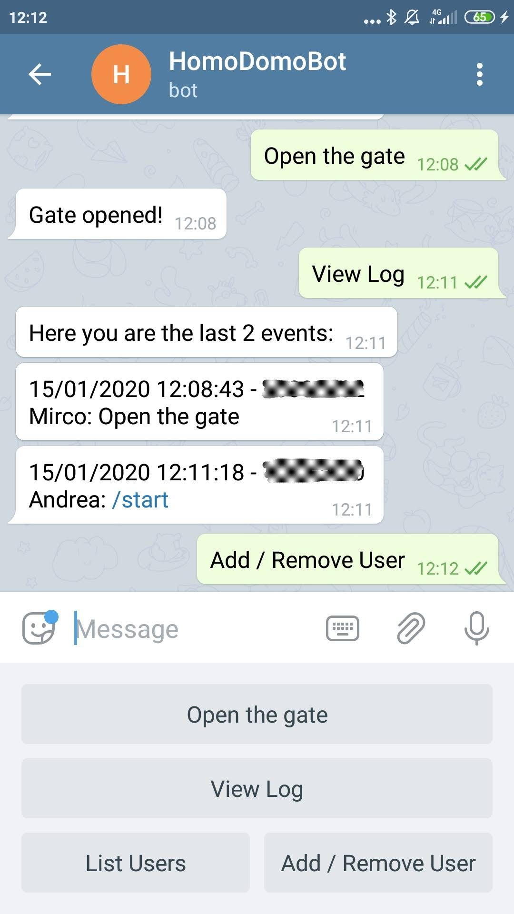


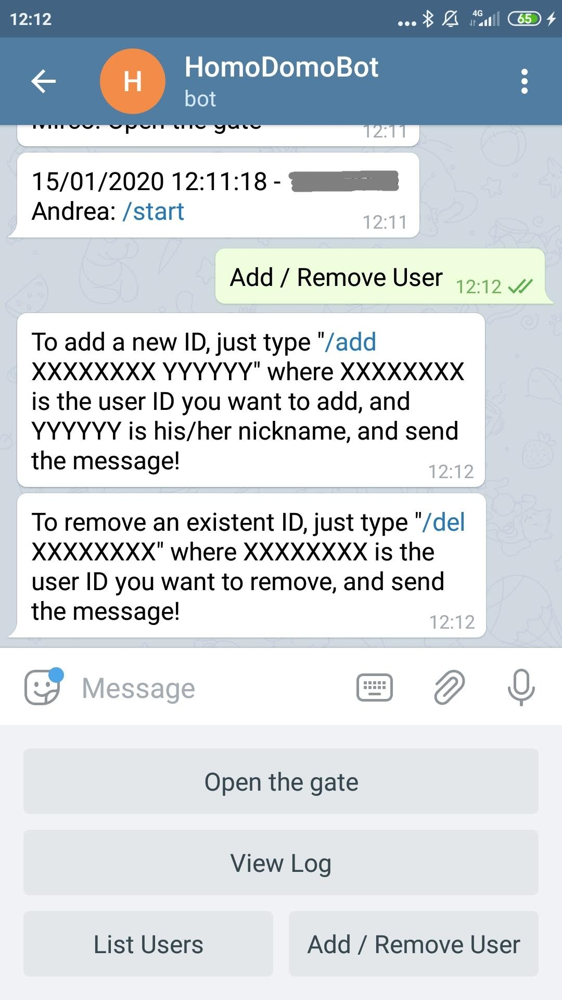


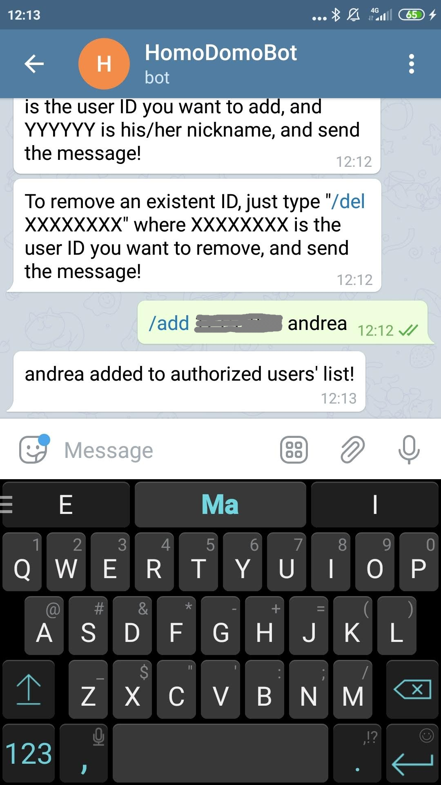


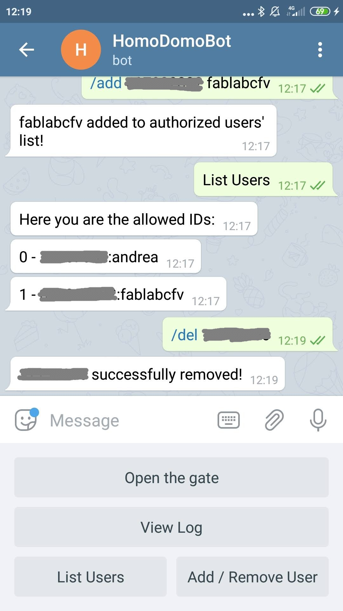


## Complete Sketch

<iframe src='https://create.arduino.cc/editor/FabLab_CastelfrancoVeneto/def2da20-93ce-41bc-a111-42bd6f591b72/preview?embed&snippet' style='height:510px;width:100%;margin:10px 0' frameborder='0'></iframe>
