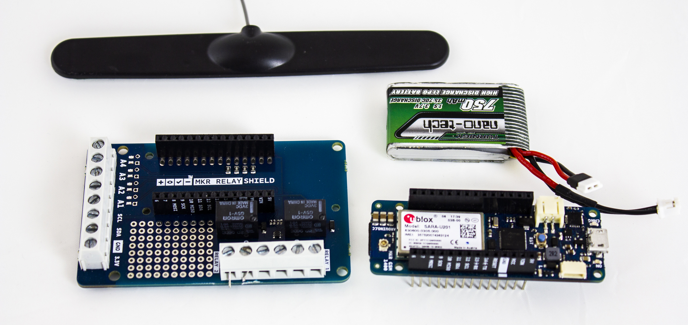
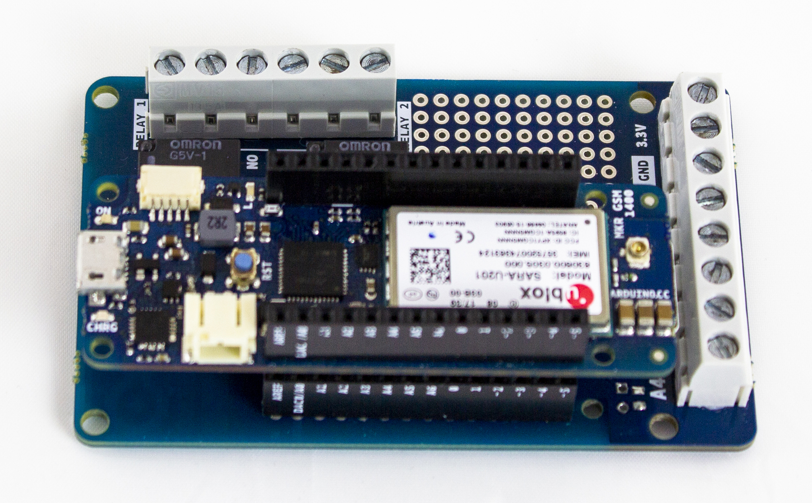
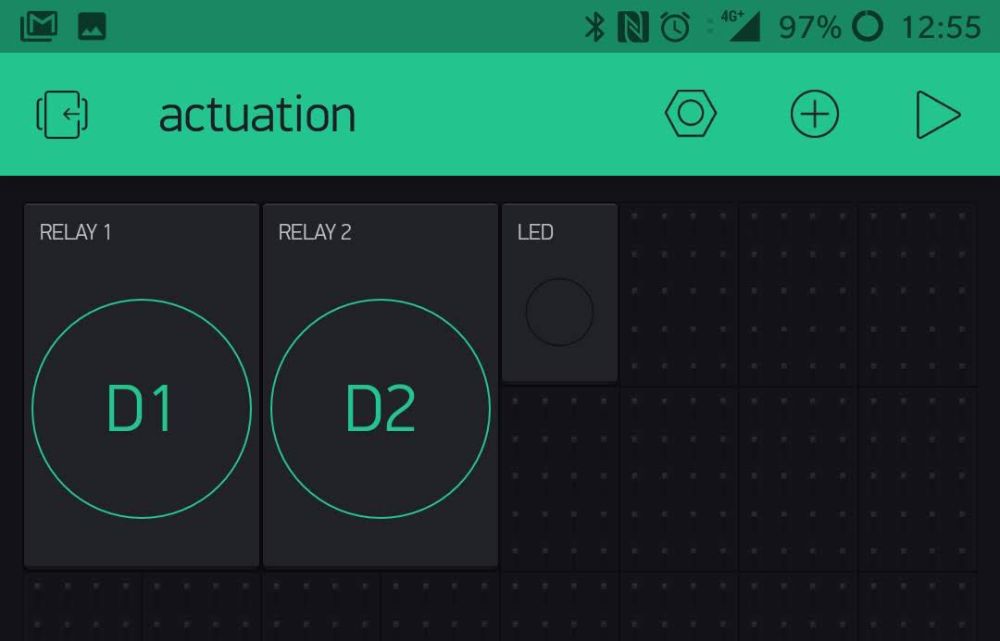
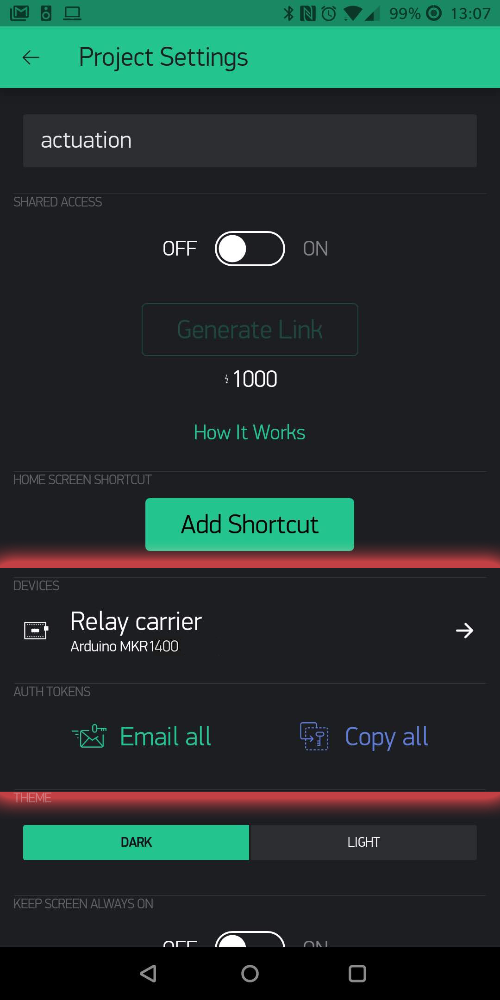

## Components and Supplies

- [Arduino MKR GSM 1400](https://www.newark.com/55AC1187?COM=ref_hackster)
- [Arduino MKR Relay Proto Shield](https://store.arduino.cc/mkr-relay-proto-shield)
- [Breadboard (generic)](https://www.newark.com/99W1759?COM=ref_hackster)
- [LED (generic)](https://www.newark.com/14N9416?COM=ref_hackster)
- [Resistor 220 ohm](https://www.newark.com/multicomp/mccfr0w4j0221a50/carbon-film-resistor-220-ohm-250mw/dp/58K5029?COM=ref_hackster)
- [Jumper wires (generic)](https://www.newark.com/88W2571?COM=ref_hackster)

## About This Project

This project shows how to control a MKR Relay shield using an Arduino MKR GSM 1400 and the Blynk Cloud service; we implemented a simple application that allows to switch the relays integrated on the shield using the widgets of Blynk.

### What You Need

The project uses an Arduino MKR GSM 1400, the antenna, a battery pack, a smartphone with Blynk installed, one data SIM card, two leds, two 220 ohm resistors, a breadboard, cables and a MKR Relay Shield. You also need to download the Blynk library through the Library Manager of the Arduino Software (IDE).

- The Arduino MKR GSM 1400 executes the sketch and supports the GSM connectivity that allows the localization functions required by our project;
- Antenna and battery pack are respectively used tor allow the connection to the cellular data network with a good signal and to power the device when other power supplies are not available;
- The MKR Relay Protoshield, is a board that includes two relays and is made for MKR format boards. It is used to switch loads and voltages usually not manageable with solid state solutions (MOSFET). In this project it just switches LEDs;
- The Mobile phone is required for the Blynk application that allows us to create an interface with two widgets. Blynk implements the communication between the MKR GSM 1400 and the smartphonephone;
- The SIM card is required to access the data network and allow network operation;
- PIN, APN and access credentials are required to connect to the data network.
- Leds, resistors, breadboard and cables, are used in this project to show the opening and closing of the relay contacts.




### Hardware Setup


The antenna, the SIM and the battery pack should be connected to their own connector on head and tail of the MKR GSM 1400.

The circuit on the breadboard is simple: bring 5V and GND to the rails on the breadboard (5V to the red rail and GND to the black one). Put on the breadboard each LED so that the short leg (-) goes to the black rail with a wire jumper. Each long leg (+) goes to the 220 ohm resistor that is connected with a wire jumper to one of the NO contact on the relay connector. The common of each relay goes to the red rail of the breadboard (5V).

When the relay is excited, it closes the NO contact bringing 5V to the LED that will light up.

Be careful to connect the MKR GSM 1400 to the MKR Relay Protoshield properly, aligning the labels of the connectors on each board.




### How It Works

This project uses the Blynk Cloud service and application interface to control the two relays of the MKR Relay Protoshield from a smartphone. The Blynk library allows the connection over the internet between our MKR GSM 1400 and an interface on an IOS or Android smartphone. The ease of use of Blynk makes the building of the interface very simple and straightforward. The communication is two way and this allows us to create two virtual switches and a LED on the interface. The LED on the smartphone screen is driven by our MKR GSM 1400, while the two switches are used to drive D1 and D2 that are connected to the MKR Relay Protoshield. 

### Blynk Setup

To make your life easier, we are sharing the QR Code of the interface so that you have everything already set up on your smartphone even if you are new to Blynk.


When the interface is loaded, you should see something like this screenshot:




The next step is necessary to bind your smartphone Blynk app with your MKR GSM 1400. This happens with a token that you should send from your smartphone to your email. 

Tap on the nut icon on the right top corner to open the *Project Settings* page




### The Sketch

The software provided for the project uses an Arduino sketch that includes the MKRGSM and Blynk libraries and a simple Blynk application to allow the shield’s relays control by the MKRGSM board.

- The Blynk: uses a Led used as connection alive monitor and two switch buttons, one to enable the relay 1 and the other for relay 2.
- The Arduino sketch, involves many APIs of the MKRGSM:
- Connection APIs used through GSM, GPRS and GSMClient classes, these are used to connect the board to the GSM network;
- Blynk APIs required to allow the connection between the board and the smartphone application and the interaction with the widget used by the project.

The first code section is used to includes the libraries required by the application; **MKRGSM** include all the GSM connection functionalities, these are available through the object **GSMClient, GPRS** and **GSM**, the header **BlynkSimpleMKRGSM** import the APIs through which the sketch is able to interact with the Blynk app:

```arduino
#define BLYNK_PRINT Serial
#include <MKRGSM.h>
#include <BlynkSimpleMKRGSM.h>
GSMClient client;
GPRS gprs;
GSM gsmAccess;
```

After the include section, are assigned all the credential data required by the connection, auth[] is required to pair the sketch with a particular project on Blynk, **pin**, **apn**, **user** and **pass** instead are used to access the SIM and establish the connection with the data network; their values are assigned by the input fields defined in **Secrets tab.** 

***Please note: if the SIM does not have a PIN or the Network doesn't require a Password, you need to put "" in the corresponding Secrets fields.***

```arduino
char auth[] = SECRET_AUTH_TOKEN;
// Your access credentials.
// Set password to "" for open networks.
char pin[] = SECRET_PINNUMBER;
char apn[]  = SECRET_GPRS_APN;
char user[] = SECRET_GPRS_LOGIN;
char pass[] = SECRET_GPRS_PASSWORD;
```

**WidgetLED** is used to control the led widget on the app, the value on brachet are the pin assigned to this object, in this example **Virtual pin 1 (V1),** Blynk timer is used for timing the led blinking on the app:

```arduino
BlynkTimer timer;
WidgetLED led1(V1);
BlynkTimer timer;
```

The setup section allow to initialize all the object used by the sketch, the Blynk instance play a central role because it establish the connection and initialize all structure to control the app widget on the smartphone:

```arduino
void setup()
{
// Debug console
Serial.begin(9600);
// Here your Arduino connects to the Blynk, through begin you can set all the access credential required to establish a connection with the app
Blynk.begin(auth, gsmAccess, gprs, client , pin, apn,  user, pass);
//here is assigned the time interval and function that should be executed when the timer interrupt rises
timer.setInterval(1000L, blinkLedWidget);
}
```

The function blinkLedWidget() is attached to the time interrupt and is called when this last rises, simply get the value of the led1( pin V1) and switch his status:

```arduino
//Is alive code section, this allow to turn ON and OF the led on blynk app
void blinkLedWidget()
{
// the following APIs allow to get and set a value on the led widget of the app
if (led1.getValue()) {
led1.off();
Serial.println("LED on V1: off");
} else {
led1.on();
Serial.println("LED on V1: on");
}
}
```

## Complete Sketch

<iframe src='https://create.arduino.cc/editor/Arduino_Genuino/2150dc78-c24a-4c9b-a3f1-189788ed7be1/preview?embed&snippet' style='height:510px;width:100%;margin:10px 0' frameborder='0'></iframe>


## How to Use It

Before you can get everything up and running you should have filled the **arduino_secrets.h** piece of code with the auth token got by email and the credentials to access the internet over GPRS. With this data, the sketch can be uploaded to the MKR GSM 1400.

Launch the Blynk application on your smartphone, then select the project created with the QR code and tap on the "play" icon on the right of the top bar. You should see the icon of a small board with a red blob on it: it is the status of the connection with your board. Load the sketch and wait for the connection process to happen. You may want to monitor it through the Serial Monitor.

Anyway, when the board connects to the Blynk server, the red blob should disappear and on the interface you should start to see the virtual LED blinking with a slow pace. You are connected!

Touch the two round switches to turn on and off the LEDs. If you hear the relays clicking but there is no light from the LEDs check the wiring.

## What's Next

We taught you how to control the two relays of the MKR Relay Protoboard from the smartphone using Blynk. You can easily replace the two LEDs with other electric or electronic devices and change the app interface to suit your taste. The most difficult parts are already sorted out.