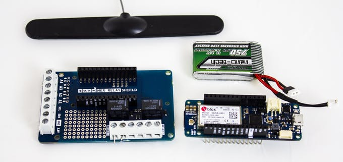
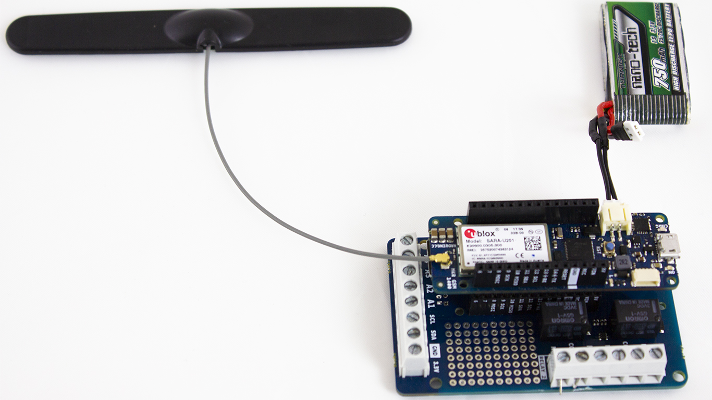
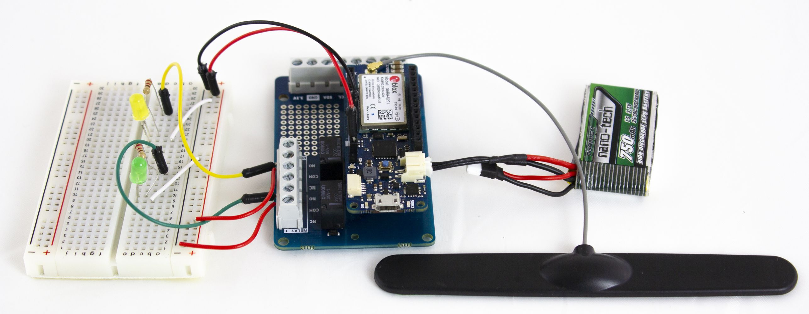

## Components and Supplies

- [Arduino MKR GSM 1400](https://www.newark.com/55AC1187?COM=ref_hackster)
- [Arduino MKR Relay Proto Shield](https://store.arduino.cc/mkr-relay-proto-shield)
- [Breadboard (generic)](https://www.newark.com/99W1759?COM=ref_hackster)
- [LED (generic)](https://www.newark.com/14N9416?COM=ref_hackster)
- [Resistor 220 ohm](https://www.newark.com/multicomp/mccfr0w4j0221a50/carbon-film-resistor-220-ohm-250mw/dp/58K5029?COM=ref_hackster)
- [Jumper wires (generic)](https://www.newark.com/88W2571?COM=ref_hackster)

## About This Project

This project shows how to control a MKR Relay Shield using a MKR GSM 1400 and the Short Message Service (SMS); this solution works with a plain SIM with no data plan and it is suitable for applications where the GSM network is with poor coverage.

### What You Need

The project uses a MKR GSM 1400, the antenna, a battery pack, a mobile phone, one SIM card, two LEDs, two 220 ohm resistors, a breadboard, cables, and a MKR Relay Shield.

* The MKR GSM 1400 executes the sketch and manages the incoming and outgoing SMSs;
* Antenna and battery pack are respectively used tor allow the connection to the cellular network with a good signal and to power the device when other power supplies are not available;
* The MKR Relay Proto Shield is a board that includes two relays and is made for MKR format boards. It is used to switch loads and voltages usually not manageable with solid state solutions (MOSFET). In this project it just switches LEDs;
* The mobile phone is required to send and receive the text messages;
* The SIM card is required to access the GSM network and allow network operation;
* LEDs, resistors, breadboard and cables, are used in this project to show the opening and closing of the relay contacts.




### Hardware Setup

The antenna, the SIM and the battery pack should be connected to their own connector on head and tail of the MKR GSM 1400.




The circuit on the breadboard is simple: bring 5V and GND to the rails on the breadboard (5V to the red rail and GND to the black one). Put on the breadboard each LED so that the short leg (-) goes to the black rail with a wire jumper. Each long leg (+) goes to the 220 ohm resistor that is connected with a wire jumper to one of the NO contact on the relay connector. The common of each relay goes to the red rail of the breadboard (5V).




### How It Works

This project uses the SMS capabilities of the GSM network to receive some text that is parsed and used to toggle the two relays. For security reasons, the sketch checks the number of the sender and this information must be stored in the arduino_secrets.h file. We don't know the status of the relays and therefore the sketch uses a "toggle" approach, where each SMS received with 1 or 2 as text toggles the status of the corresponding relays. To let you know the result of the operation, an SMS is sent back with the message "Relay (number), state: 0 or 1". Looking at the history of the messages you should be able to keep track of the relays status.

### The Sketch

The first code section is used to includes the libraries required by the application; **MKRGSM** include all the GSM connection functionalities, these are available through the object **GSMClient, GPRS** and **GSM**, the header **GSM_SMS** import the APIs through which the sketch is able manage the SMS sended or received by the MKRGSM:

```arduino
#include <MKRGSM.h>
GSM gsmAccess;
GSM_SMS sms;
```

After the include section, we provide the two lines of code that refer to your secret pin number and incoming number. With this syntax the Cloud Editor generates a new Tab called Secrets where you input the two constants:

```arduino
char PINNUMBER [] = SECRET_PINNUMBER;
String sender = SECRET_YOUR_NUMBER;
```

The setup section initializes all the objects used by the sketch; the GSM connection sequence that allow to register to the network occupies most of this section.

```arduino
void setup()
{
// initialize serial communications and wait for port to open:
Serial.begin(9600);
while (!Serial) {
; // wait for serial port to connect. Needed for native USB port only
}
Serial.println("SMS Messages Receiver");
// connection state
bool connected = false;
// Start GSM connection
while (!connected) {
if (gsmAccess.begin(PINNUMBER) == GSM_READY) {
connected = true;
} else {
Serial.println("Not connected");
delay(1000);
}
}
Serial.println("GSM initialized");
Serial.println("Waiting for messages");
}
```

Last code section is the loop function where the basic control logic is executed. In our caseit simply checks if an SMS is available, if true, gets the SMS from the SIM and checks the text. If it is from the right sender it decodes the first character and switches the relay specified by the user. To confirm the operation it sends an SMS with the status of the Relay switched. It is important to delete the received SMS from the SIM card to avoid that it fills up and stops receiving SMSs. The sketch uses the ASCII code of the numbers 1 and 2 in the `swtch ... case` structure.

```arduino
void loop()
{
 int c;
 String texmsg = "";
 // If there are any SMSs available()
 if (sms.available()) {
Serial.println("Message received from:");
// Get remote number
sms.remoteNumber(senderNumber, 20);
Serial.println(senderNumber);
if (String(senderNumber) == sender) {
// An example of message disposal
// Any messages starting with # should be discarded
if (sms.peek() == '#') {
Serial.println("Discarded SMS");
sms.flush();
}
c = sms.read();
switch (c) {
case 49:
digitalWrite(1, !digitalRead(1));
texmsg = "Relay 1, state: " +  String(digitalRead(1));
sms.beginSMS(senderNumber);
sms.print(texmsg);
sms.endSMS();
break;
case 50:
digitalWrite(2, !digitalRead(2));
texmsg = "Relay 2, state: " +  String(digitalRead(2));
sms.beginSMS(senderNumber);
sms.print(texmsg);
sms.endSMS();
break;
default:
break;
}
Serial.println("\nEND OF MESSAGE");
// Delete message from modem memory
sms.flush();
Serial.println("MESSAGE DELETED");
} else {
sms.flush();
Serial.println("MESSAGE DELETED");
}
 }
 delay(1000);
}
```
## Complete Sketch

<iframe src='https://create.arduino.cc/editor/Arduino_Genuino/5b8c84a4-9712-4358-bc46-cad4815cd25b/preview?embed&snippet' style='height:510px;width:100%;margin:10px 0' frameborder='0'></iframe>

## How to Use It

Double check that your phone number is properly stored in the Secrets Tab, then upload the sketch and open the Serial Monitor to verify that the module properly attaches to the network.

From a simple mobile phone, send an SMS with just "1" or "2" to the mobile number associated with the SIM inserted in the MKR GSM 1400 board. You should see in a few seconds the LED turning on or off depending on its state before the SMS was sent. Together with the change of state the sketch sends back a message containing the current state of the toggled LED. 