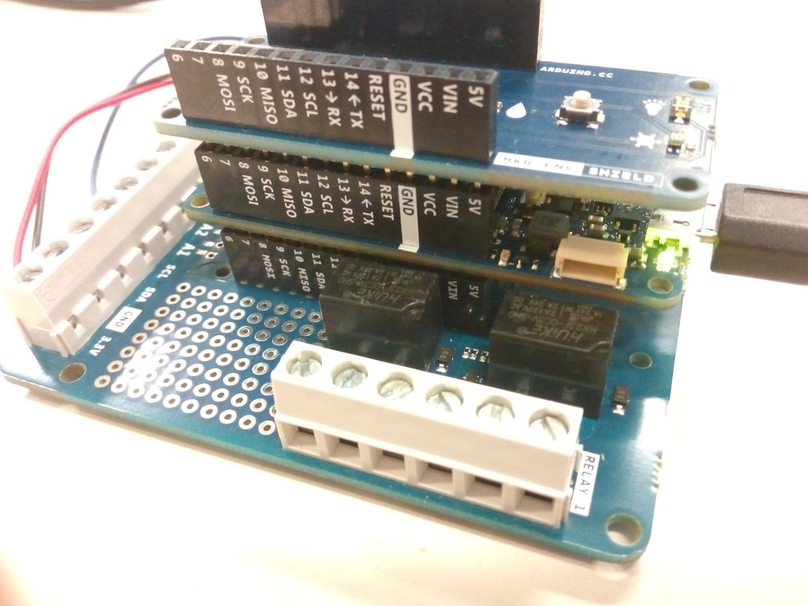
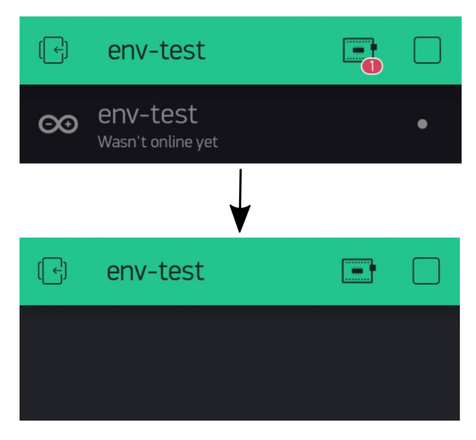
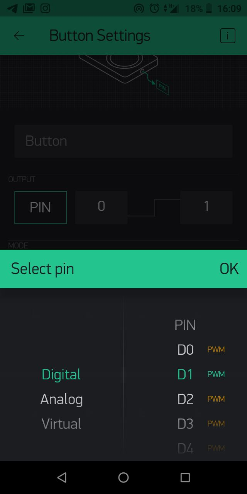
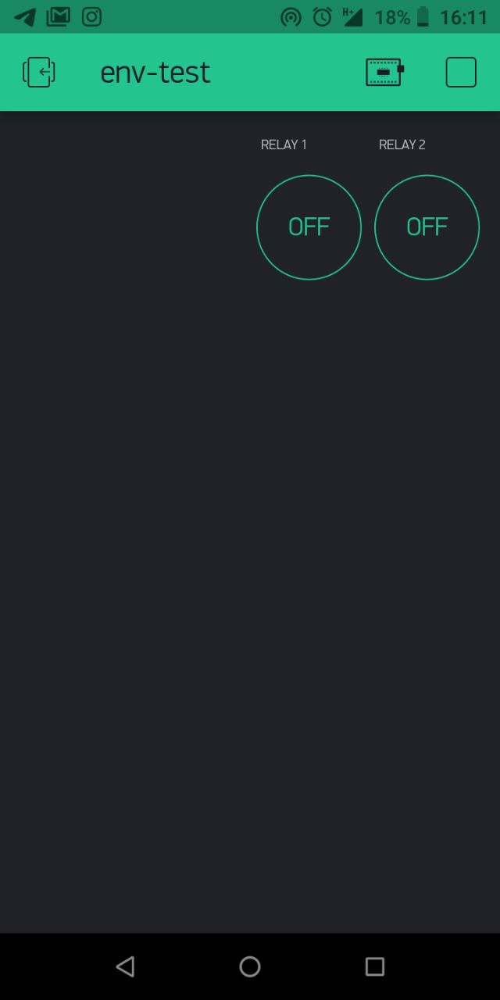
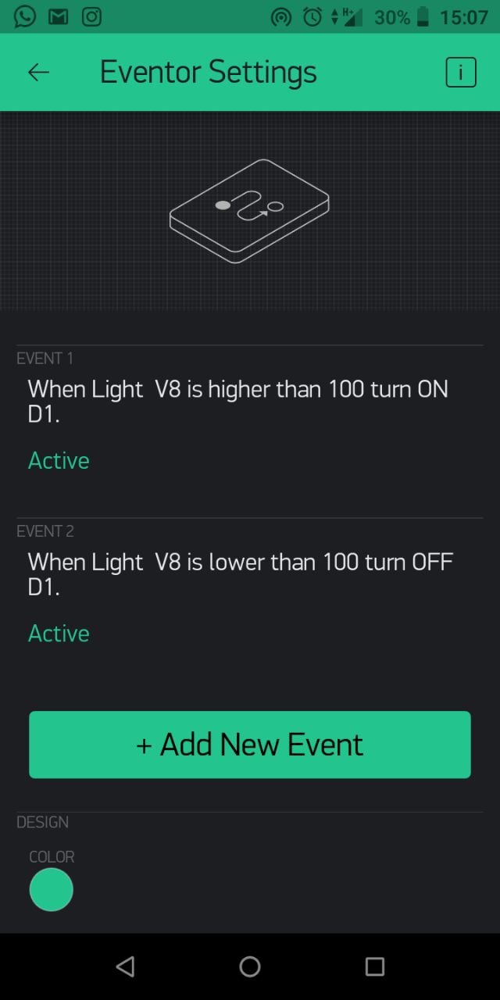
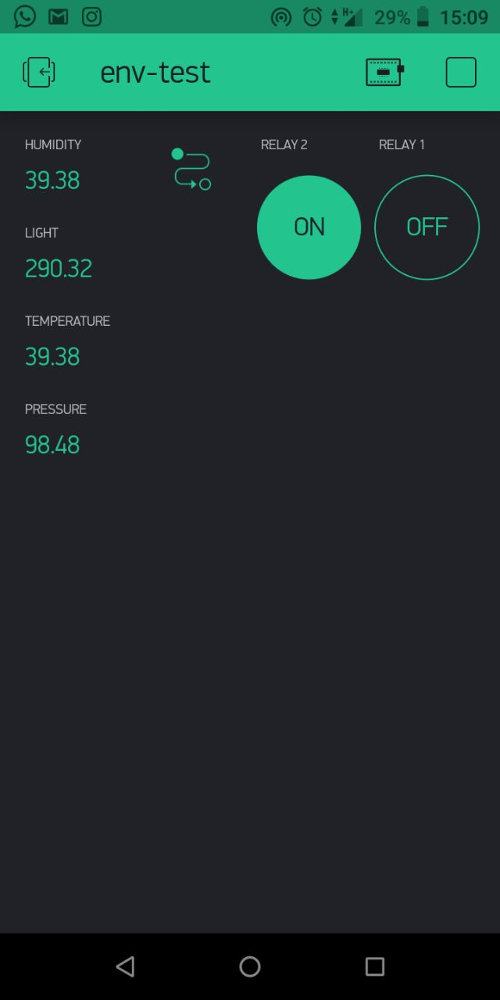

## Components and Supplies

- [Arduino MKR IoT Prime Bundle](https://www.distrelec.biz/en/mkr-iot-prime-bundle-arduino-akx00018/p/30142238?ext_cid=bmnlbbazzen-ArduinoNPI&cw=1924)

## Apps and Online Services

- [Arduino Cloud Editor](https://create.arduino.cc/editor)
- [Blynk](https://www.blynk.cc/getting-started)

## About This Project

In this tutorial, we'll toy around the new IoT Cloud Kit from Arduino, featuring a [MKR WiFi 1010](https://store.arduino.cc/mkr-wifi-1010), the [Environmental Shield](https://store.arduino.cc/mkr-env-shield) and the [MKR Relay Proto Shield](https://store.arduino.cc/mkr-relay-proto-shield) (among LEDs, breadboards, LEDs and wires).

We are going to control and monitor all data from the device using the popular bottom-up DIY monitoring app [Blynk](https://blynk.io/).

### Install the App

After you create account / log in to the app, you'll be ask to input the hardware you are using. 


Blynk has a huge user base and try to keep the list of hardware up-to-date. Nevertheless you won't find Arduino MKR1010 in the list, when you'll be ask to choose your hardware. **Even if we are using Arduino MRK1010 you can select Arduino MKR1000 at this stage.**

Give the project a name: I'll choose **env-test.** Since today I'm keeling an hacker, I'll choose **DarkTheme**!

If you do everything all right you'll be sent an auth token to the mail address you specified when registered. **Keep this code for you and don't share it to anyone!**

### Connect Your Blynk App to Your Board

In the Arduino IDE, open the Library Manager, and look for the Blynk library.


Then open `File>Examples>Blynk>Boards_wifi>Arduino_MKR 1010`

Input your data (ssid, password, and token), then upload the code to the board. 




In order to check if the connection between the Blynk servers and your board is actually working, you have to press the play button in the top right corner and check if the little red dot disappeared from the lower right corner of the menu, as well as the notification area empty. 



I'd like to test if the connection is really working by creating two pushbutton to control relay on D1 and D2. 





If everything is working, by pressing I can hear the Relays ticking on the board. 

### Let's Add the Extra Data the Environmental Shield Is Providing

As you probably noticed, when defining a PIN you can decide whether it being digital, analog or virtual. We'll import the `Arduino_MKRENV `Library and send our data as virtual pins.

```arduino
#include <Arduino_MKRENV.h>
// Environmental Shield Data
float t;
float h;
float p;
float l;
```

Before the setup() function we are going to declare this function:

```arduino
// This function sends Arduino's up time every second to Virtual Pin (5, 6, 7, 8).
// In the app, Widget's reading frequency should be set to PUSH. This means
// that you define how often to send data to Blynk App.
void sendSensor()
{
 float h = ENV.readHumidity();
 float t = ENV.readTemperature();
 float p = ENV.readPressure();
 float l = ENV.readLux();
 // You can send any value at any time.
 // Please don't send more that 10 values per second.
 Blynk.virtualWrite(V5, h);
 Blynk.virtualWrite(V6, t);
 Blynk.virtualWrite(V7, p);
 Blynk.virtualWrite(V8, l);
}
```

In the `setup()`, we simply remind the board to update Blynk on a certain interval.

```arduino
 // Setup a function to be called every second
 timer.setInterval(1000L, sendSensor);
```

Last but not least, we need to update our `loop() function `using timer. 

```arduino
void loop()
{
 Blynk.run();
 timer.run();
}
```

## Complete Sketch
<iframe src='https://create.arduino.cc/editor/officine-innesto/abd05f21-e82c-4321-af6f-bacc73bd923a/preview?embed&snippet' style='height:510px;width:100%;margin:10px 0' frameborder='0'></iframe>


## What If You Want to Automate a Process?

Blynk is really handy if you want to monitor data. If you want to be notified or create an action based on the behavior of the data, you'll have to create this heuristic on Blynk Cloud. 

For example, if I want the relay to close when the light is growing over a certain threshold, I'll have to create an event.



Or Blynk app now is like this:



Happy Blynking with the IoT Cloud Kit!