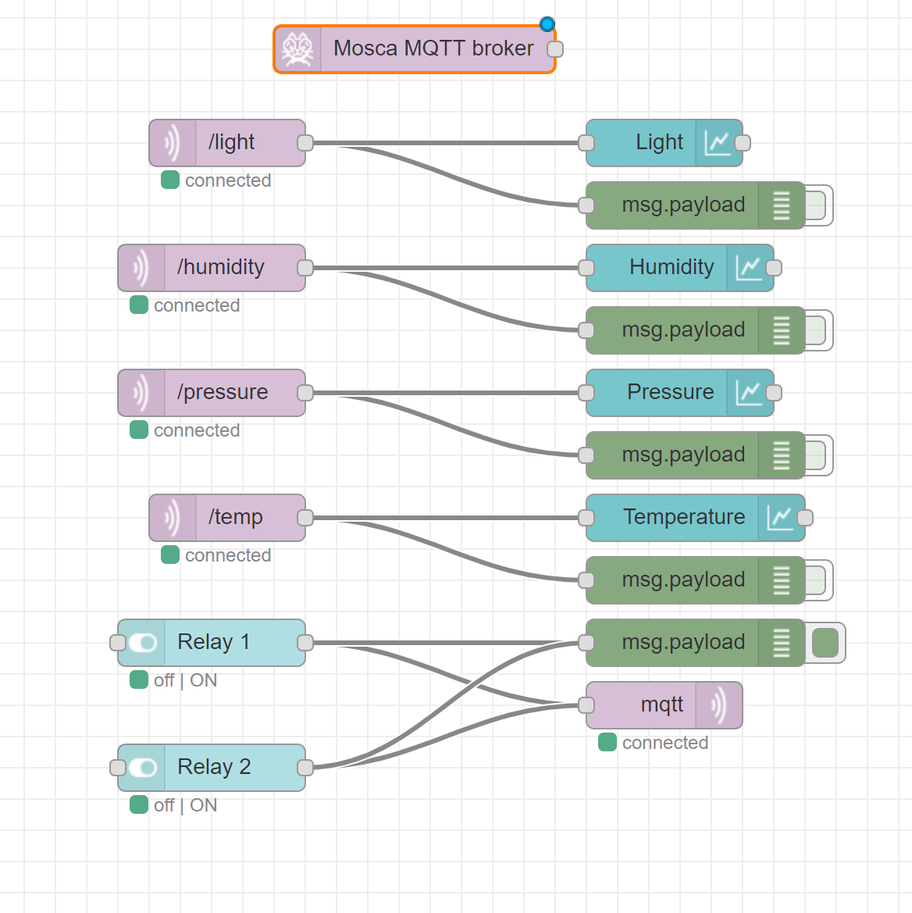
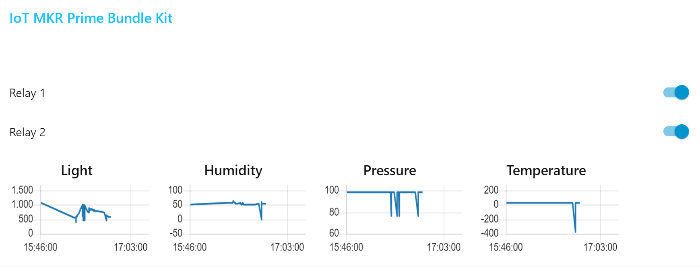

## Components and Supplies

- [Arduino MKR IoT Bundle](/hardware/iot-bundle)
- [Raspberry Pi 3 Model B](http://www.newark.com/raspberry-pi/raspberrypi3-modb-1gb/sbc-raspberry-pi-3-mod-b-1gb-ram/dp/77Y6519?COM=ref_hackster)

## Apps and Online Services

- [Arduino Web Editor](https://create.arduino.cc/editor)
- [MQTT](http://mqtt.org/)
- [Node-RED](https://nodered.org/)

## About This Project

We are going to make our MKR IoT Bundle connect to a local server (this very same technology could be hosted on AWS or wherever). 

The connection is going to be held through [MQTT](https://en.wikipedia.org/wiki/MQTT), a [lightweight message protocol developed for machine to machine communication](http://mqtt.org/). 

In order to do this we need to do some work on the server side. I'm using a Raspberry PI with Node-RED on it, but you can host an instance of Node-RED on Windows/MAC/Linux or on the Cloud (Bluemix, AWS, etc..).

This tutorial heavily relies on [Interfacing Arduino MKR or ESP via MQTT - Node-RED 101 ](https://www.hackster.io/officine/interfacing-arduino-mkr-or-esp-via-mqtt-node-red-101-4833bc)we did back in January. We are touching all the points and adding the data visualisation, but don't hesitate to go through that tutorial in order to see all the steps in the setup of the cloud instance. 

### The Server

In order to prepare your Node-RED instance properly you need to install two Nodes: [Node-RED Dashboard](https://flows.nodered.org/node/node-red-dashboard) and [an MQTT brocker written in node.js](https://flows.nodered.org/node/node-red-contrib-mqtt-broker).

Once you are done, copy the flow you find in the sowftare section in your palette by doing *import > clipboard*







### The Client 

We are using the **Iot Prime MKR Bundle** to visualise **Light**, **Humidity**, **Pressure** and **Temperature** using **MQTT**. We are going to create a channel for each one of this data, as well as the two relays.

We'll be using the [MQTT Library](https://github.com/256dpi/arduino-mqtt) by [Joël Gähwiler 256dpi](https://github.com/256dpi) (you should be able to run everything from your Arduino Online Editor sketch, by adding Wifi information to have the board conneting to the internet. 

Don't forget the [MKR\_ENV Library](https://github.com/arduino-libraries/Arduino_MKRENV) you need to use the data from the board (if going with the online IDE, it's going to be impoted automatically 👌

The sending of the data is done in loop: 
 
```arduino
 // read enrivornmental data
 float t = ENV.readTemperature();
 float h = ENV.readHumidity();
 float p = ENV.readPressure();
 float l = ENV.readLux();
```

and later published, casted ina a `string()`

```arduino
 if (millis() - lastMillis > 1000) {
   lastMillis = millis();
   client.publish("/hello", "world"); 
   client.publish("/temp", String(t)); 
   client.publish("/humidity", String(h)); 
   client.publish("/pressure", String(p)); 
   client.publish("/light", String(l)); 
 }
```

In order to read the value of the pushbutton of the Node-RED Dashboard, I've nested two condition inside of the `messageReceived` function. 

If the topic is `/relay1` or `relay2`, trigger it (and trigger the onboard LED, as a notification)

```arduino
void messageReceived(String &topic, String &payload) {
 Serial.println("incoming: " + topic + " - " + payload);
 if (topic == "/relay1") {
   if (payload == "true") {
     digitalWrite(R1, HIGH);
     digitalWrite(led, HIGH);
   } else if (payload == "false") {
     digitalWrite(R1, LOW);
     digitalWrite(led, LOW);
   }
 }
 if (topic == "/relay2") {
   if (payload == "true") {
     digitalWrite(R2, HIGH);
     digitalWrite(led, HIGH);
   } else if (payload == "false") {
     digitalWrite(R2, LOW);
     digitalWrite(led, LOW);
   }
 }
}
```

You can `#copypasta` the code and test & tweak it yourself!

## JSON 

### Node-Red Dashboard Flow

This flow is visualizing the data sent via MQTT to the brocker.

```arduino
[{"id":"703b47b.5c41fb8","type":"tab","label":"Flow 1","disabled":false,"info":""},{"id":"c6c9dfb0.bec5f8","type":"mqtt in","z":"703b47b.5c41fb8","name":"","topic":"/temp","qos":"0","datatype":"auto","broker":"447166d7.c2fef","x":410,"y":340,"wires":[["963ce144.613608","60eacc81.fe61cc"]]},{"id":"963ce144.613608","type":"debug","z":"703b47b.5c41fb8","name":"","active":false,"tosidebar":true,"console":false,"tostatus":false,"complete":"false","x":710,"y":380,"wires":[]},{"id":"ab49bd0c.be7e08","type":"mqtt out","z":"703b47b.5c41fb8","name":"","topic":"","qos":"","retain":"","broker":"447166d7.c2fef","x":690,"y":460,"wires":[]},{"id":"4413b98b.0ee328","type":"mosca in","z":"703b47b.5c41fb8","mqtt_port":1883,"mqtt_ws_port":8080,"name":"","username":"","password":"","dburl":"","x":170,"y":60,"wires":[[]]},{"id":"3b910073.fdd5b","type":"mqtt in","z":"703b47b.5c41fb8","name":"","topic":"/pressure","qos":"0","datatype":"auto","broker":"447166d7.c2fef","x":400,"y":260,"wires":[["80205d8.49f8aa","5cd668ff.28609"]]},{"id":"3276f36c.216f24","type":"mqtt in","z":"703b47b.5c41fb8","name":"","topic":"/humidity","qos":"0","datatype":"auto","broker":"447166d7.c2fef","x":400,"y":180,"wires":[["1a729bd7.be63bc","de157a7a.f73d5"]]},{"id":"cfb5c9ec.9f535","type":"mqtt in","z":"703b47b.5c41fb8","name":"","topic":"/light","qos":"0","datatype":"auto","broker":"447166d7.c2fef","x":410,"y":100,"wires":[["30e59264.6e30f6","5c96c4f7.74d53c"]]},{"id":"80205d8.49f8aa","type":"debug","z":"703b47b.5c41fb8","name":"","active":false,"tosidebar":true,"console":false,"tostatus":false,"complete":"false","x":710,"y":300,"wires":[]},{"id":"1a729bd7.be63bc","type":"debug","z":"703b47b.5c41fb8","name":"","active":false,"tosidebar":true,"console":false,"tostatus":false,"complete":"payload","targetType":"msg","x":710,"y":220,"wires":[]},{"id":"30e59264.6e30f6","type":"debug","z":"703b47b.5c41fb8","name":"","active":false,"tosidebar":true,"console":false,"tostatus":false,"complete":"false","x":710,"y":140,"wires":[]},{"id":"5c96c4f7.74d53c","type":"ui_chart","z":"703b47b.5c41fb8","name":"","group":"61cb93ff.8cf4a4","order":4,"width":"0","height":"0","label":"Light","chartType":"line","legend":"false","xformat":"HH:mm:ss","interpolate":"linear","nodata":"","dot":false,"ymin":"","ymax":"","removeOlder":1,"removeOlderPoints":"","removeOlderUnit":"3600","cutout":0,"useOneColor":false,"colors":["#1f77b4","#aec7e8","#ff7f0e","#2ca02c","#98df8a","#d62728","#ff9896","#9467bd","#c5b0d5"],"useOldStyle":false,"outputs":1,"x":690,"y":100,"wires":[[]]},{"id":"de157a7a.f73d5","type":"ui_chart","z":"703b47b.5c41fb8","name":"","group":"61cb93ff.8cf4a4","order":5,"width":"0","height":"0","label":"Humidity","chartType":"line","legend":"false","xformat":"HH:mm:ss","interpolate":"linear","nodata":"","dot":false,"ymin":"","ymax":"","removeOlder":1,"removeOlderPoints":"","removeOlderUnit":"3600","cutout":0,"useOneColor":false,"colors":["#1f77b4","#aec7e8","#ff7f0e","#2ca02c","#98df8a","#d62728","#ff9896","#9467bd","#c5b0d5"],"useOldStyle":false,"outputs":1,"x":700,"y":180,"wires":[[]]},{"id":"5cd668ff.28609","type":"ui_chart","z":"703b47b.5c41fb8","name":"","group":"61cb93ff.8cf4a4","order":6,"width":"0","height":"0","label":"Pressure","chartType":"line","legend":"false","xformat":"HH:mm:ss","interpolate":"linear","nodata":"","dot":false,"ymin":"","ymax":"","removeOlder":1,"removeOlderPoints":"","removeOlderUnit":"3600","cutout":0,"useOneColor":false,"colors":["#1f77b4","#aec7e8","#ff7f0e","#2ca02c","#98df8a","#d62728","#ff9896","#9467bd","#c5b0d5"],"useOldStyle":false,"outputs":1,"x":700,"y":260,"wires":[[]]},{"id":"60eacc81.fe61cc","type":"ui_chart","z":"703b47b.5c41fb8","name":"","group":"61cb93ff.8cf4a4","order":7,"width":"0","height":"0","label":"Temperature","chartType":"line","legend":"false","xformat":"HH:mm:ss","interpolate":"linear","nodata":"","dot":false,"ymin":"","ymax":"","removeOlder":1,"removeOlderPoints":"","removeOlderUnit":"3600","cutout":0,"useOneColor":false,"colors":["#1f77b4","#aec7e8","#ff7f0e","#2ca02c","#98df8a","#d62728","#ff9896","#9467bd","#c5b0d5"],"useOldStyle":false,"outputs":1,"x":710,"y":340,"wires":[[]]},{"id":"898e8fb0.ac40d8","type":"ui_switch","z":"703b47b.5c41fb8","name":"","label":"Relay 1","tooltip":"","group":"61cb93ff.8cf4a4","order":2,"width":"0","height":"0","passthru":false,"decouple":"false","topic":"/relay1","style":"","onvalue":"true","onvalueType":"bool","onicon":"","oncolor":"","offvalue":"false","offvalueType":"bool","officon":"","offcolor":"","x":400,"y":420,"wires":[["ab49bd0c.be7e08","1919344d.9c56a4"]]},{"id":"1919344d.9c56a4","type":"debug","z":"703b47b.5c41fb8","name":"","active":true,"tosidebar":true,"console":false,"tostatus":false,"complete":"false","x":710,"y":420,"wires":[]},{"id":"5bd7c311.0385fc","type":"ui_switch","z":"703b47b.5c41fb8","name":"","label":"Relay 2","tooltip":"","group":"61cb93ff.8cf4a4","order":3,"width":"0","height":"0","passthru":false,"decouple":"false","topic":"/relay2","style":"","onvalue":"true","onvalueType":"bool","onicon":"","oncolor":"","offvalue":"false","offvalueType":"bool","officon":"","offcolor":"","x":400,"y":500,"wires":[["ab49bd0c.be7e08","1919344d.9c56a4"]]},{"id":"447166d7.c2fef","type":"mqtt-broker","z":"","name":"","broker":"localhost","port":"1883","clientid":"","usetls":false,"compatmode":true,"keepalive":"60","cleansession":true,"birthTopic":"","birthQos":"0","birthPayload":"","closeTopic":"","closePayload":"","willTopic":"","willQos":"0","willPayload":""},{"id":"61cb93ff.8cf4a4","type":"ui_group","z":"","name":"IoT MKR Prime Bundle Kit ","tab":"56fe067d.dd1478","disp":true,"width":"18","collapse":false},{"id":"56fe067d.dd1478","type":"ui_tab","z":"","name":"Home","icon":"dashboard","disabled":false,"hidden":false}]
```

## Complete Sketch

<iframe src='https://create.arduino.cc/editor/officine-innesto/6ca0a728-495c-45a5-bb74-3b0e2eabeeb4/preview?embed&snippet' style='height:510px;width:100%;margin:10px 0' frameborder='0'></iframe>
