## Components and Supplies

- [Arduino Nano Every](/hardware/nano-every)
- [SparkFun Atmospheric Sensor Breakout - BME280](https://www.sparkfun.com/products/13676)
- [Maxim Integrated DS3231MPMB1 Peripheral Module](https://www.maximintegrated.com/en/products/digital/real-time-clocks/DS3231MPMB1.html/tb_tab3)
- [Digilent WS2812 Addressable LED Strip](http://store.digilentinc.com/)

## Necessary Tools and Machines

- 3D Printer (generic)

## About This Project

### The Inspiration

Some of you might know the color changing little statues that are sold as souvenirs in many European cities. These white statues are painted with a specific chemical substance that reacts to air humidity and change the color from light blue to pink, going through other hues in a continuous change. They are supposed to forecast the local weather in the short term. They actually show the current situation but the forecasting powers are very limited and inaccurate.

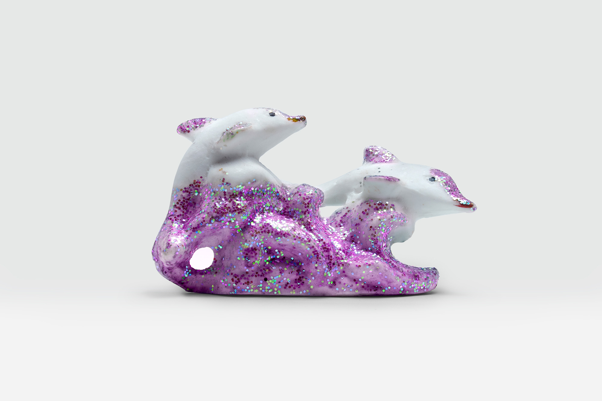


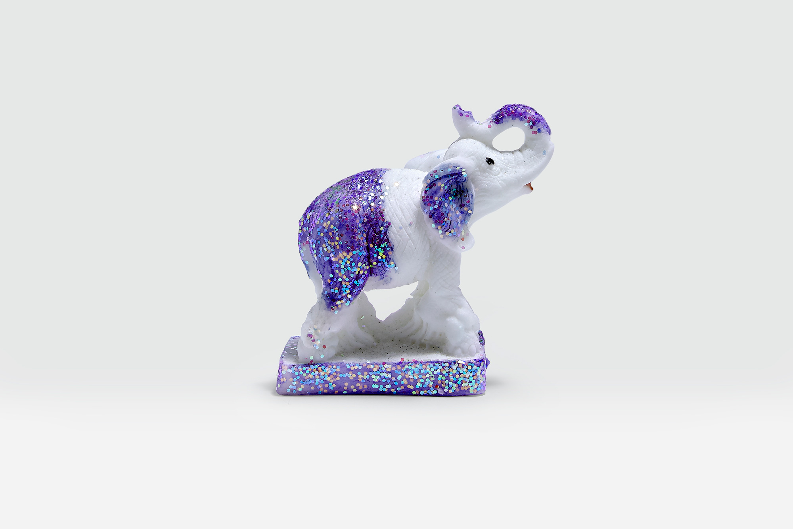


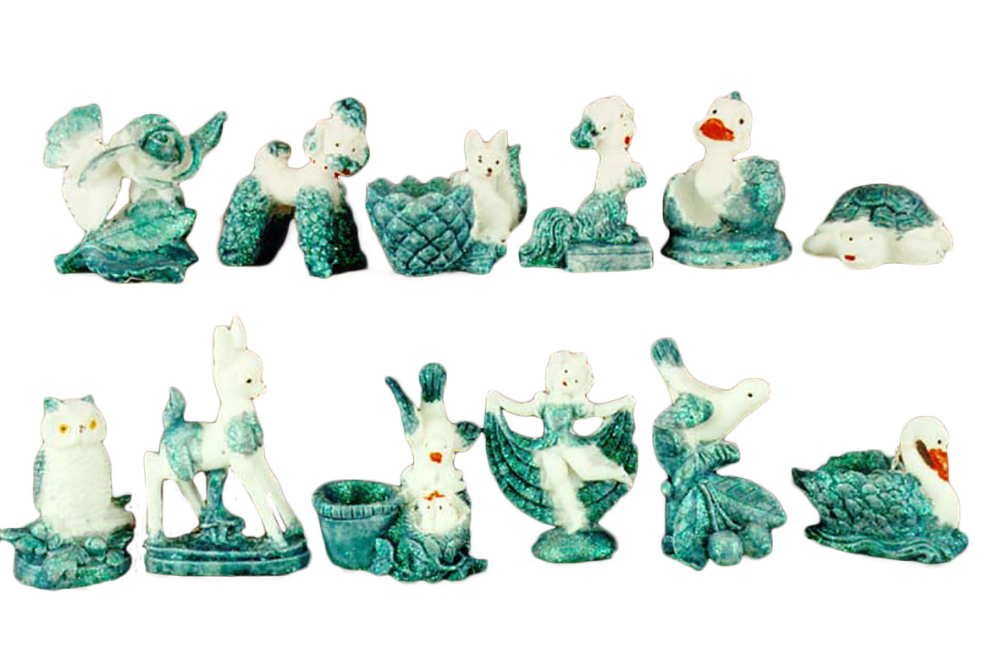


Starting from that we decided to make a Weather Forecasting Gnome, based on the new Arduino Nano Every and the BME280 sensor. The task that that at the beginning seemed easy turned out to be quite a challenge. The plain barometer is something that allows to have a short term forecast as it tells you if the pressure is raising or lowering and according to the relative pressure calculated as the sea level pressure offset by the local altitude it can also give you some “High” and“Low” reading.

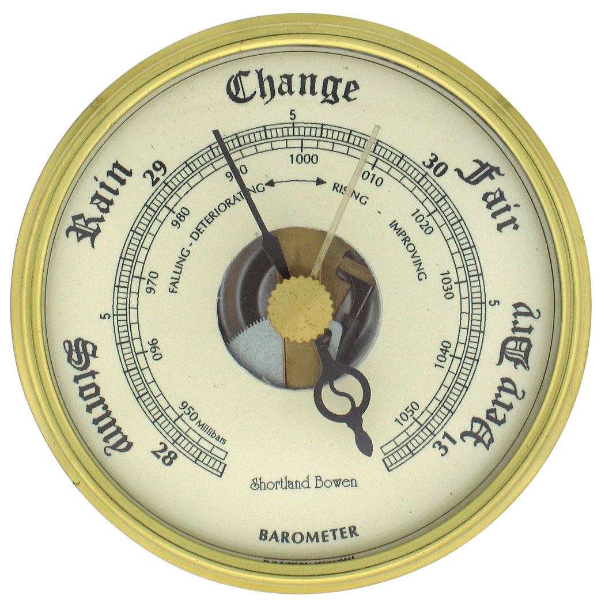

To get to a more accurate forecast, also relative humidity and winds are taken in account and the classic barometer is replaced by a more complex forecast device, the “Zambretti Forecaster”.

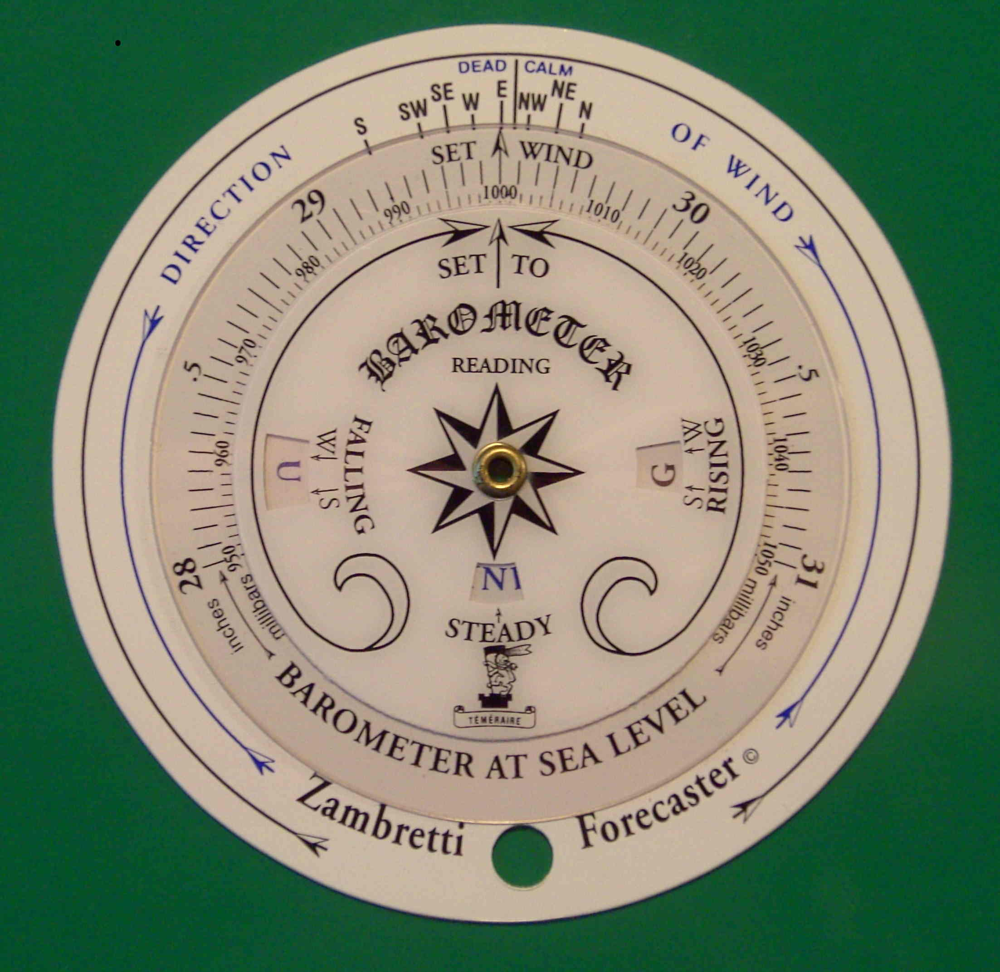

This forecaster has been documented by the authors Zambra end Negretti back in 1920 and it has become the solution for a local weather forecast in many microcontroller based projects. You can find the full details on the forecaster here ([http://drkfs.net/zambretti.htm)](https://web.archive.org/web/20190821001641/http://drkfs.net/zambretti.htm) and we also found the work of **Fandonov** ([https://github.com/fandonov/weatherstation)](https://github.com/fandonov/weatherstation) very useful for his implementation of the Zambretti forecaster in his e-Ink display weather forecaster.

## The Components

We are running this project on our **Arduino Nano Every** plus to which we added the **BME280** sensor from Bosch, a real time clock **DS3231** and a tiny strip of eight **WS2812B** smart LEDs.

The BME280 is capable of measuring temperature, pressure, humidity and give also some clues about absolute humidity and altitude, but as we will see further down, the altitude and pressure are bound together and for our purposes we need to find the real altitude of our Gnome Weather Forecaster.

The DS3231 real time clock module is needed because part of the Zambretti calculation is bound to the season and the only way for this device to know about the season is through a real time clock module properly set. It might look as a waste of resources, but you can improve the code we are supplying with features like a brightness control according to the time of the day and other amenities and use more the RTC in the sketch.

The last component, the strip of LEDs is the equivalent of the colored paint of the little statues that change its color. Here we are taking advantage of the RGB colors to represent the weather forecast with a little more detail, even if the representation of the full 26 different conditions of the Zambretti forecast are too much for a simple color display.

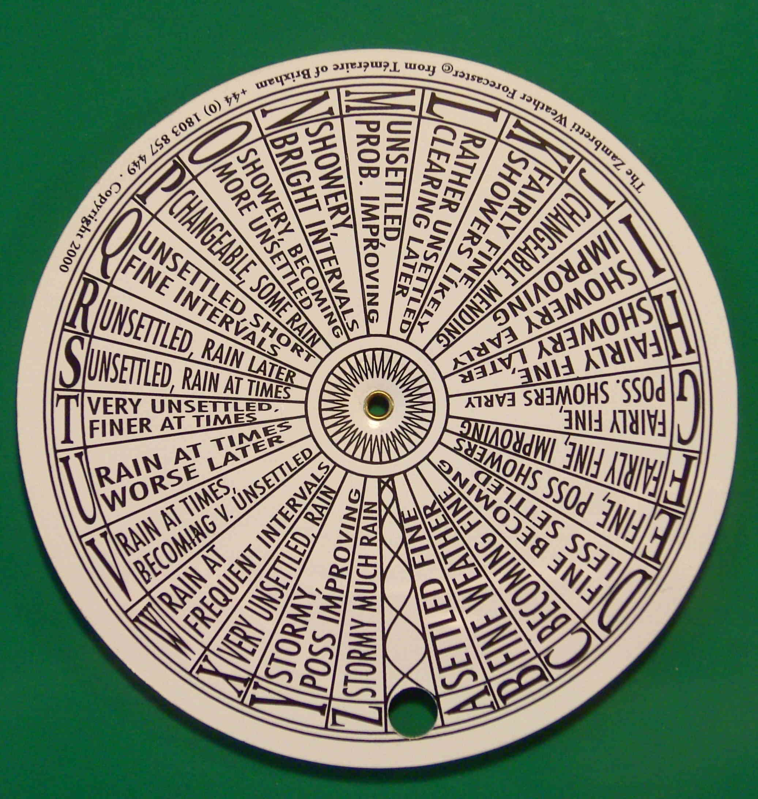


We decided to simplify it and it is a work in progress you can easily change to a different color coding.

## Wiring

The two main modules are both based on **I2C** and therefore the wiring is really simple.The RTC module we are using has even a pass through for the four connections and this makes our wiring a 10 minutes work. VCC and GND are taken from Arduino Nano Every 3V3 (Red) and GND (Black) pins on the header and soldered to the corresponding pins on one side of the DS3231 module, then the I2C interface is as usual on A4 and A5 of the Arduino. A4 is SDA (blue wire in the pictures) and A5 is SCL (yellow wire in the picture). We take the same four connections from the other side of the RTC module and wire them to the BME280 module just taking care of the order. There is no standard for the VCC / GND / SDL / SCA sequence and each module might have a different order that needs care.

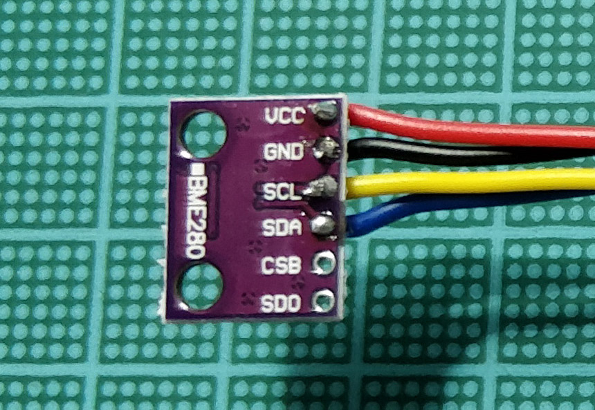


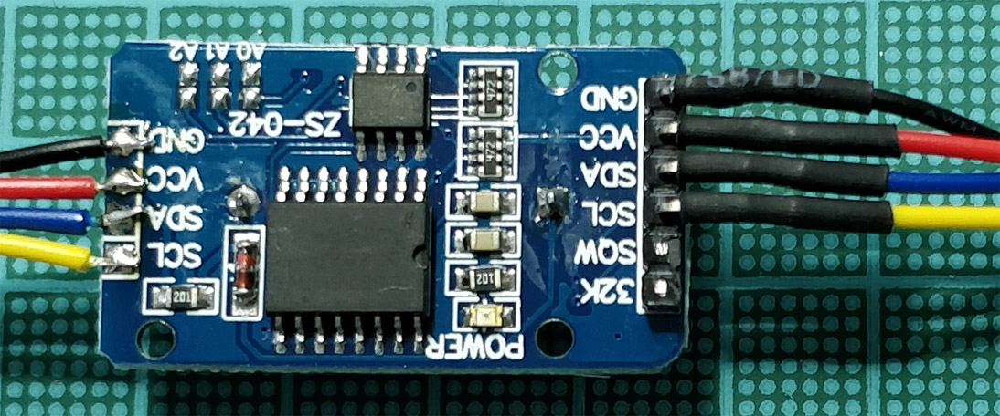


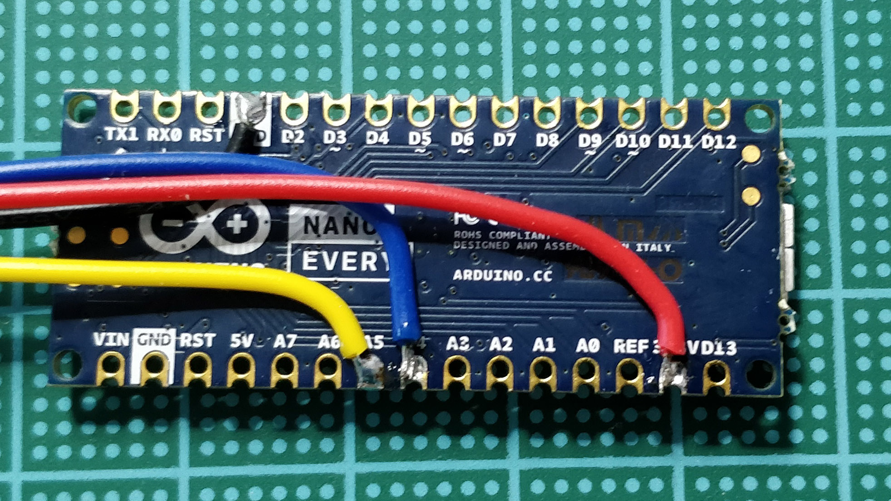


The LED strip has the usual three labels VDC, DIN and GND. This time the power supply will comes from the 5V pin. One reason is that we have the pad free for soldering, the other is that we are feeding the board from USB and 5V is from USB directly, with no stress for the power regulator of the Nano.

The data is fed to the strip on D7 pin, but could be any other one you may find suitable.Just edit the sketch with the pin you chose in the **#define LED_PIN 7** line close to the top.

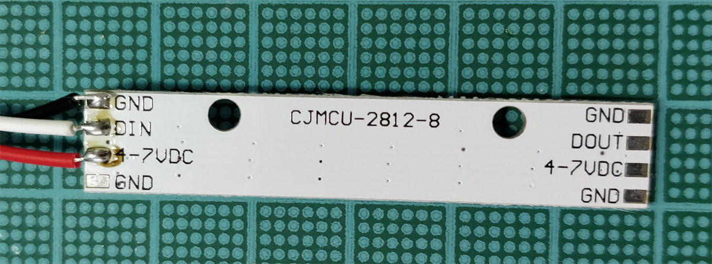


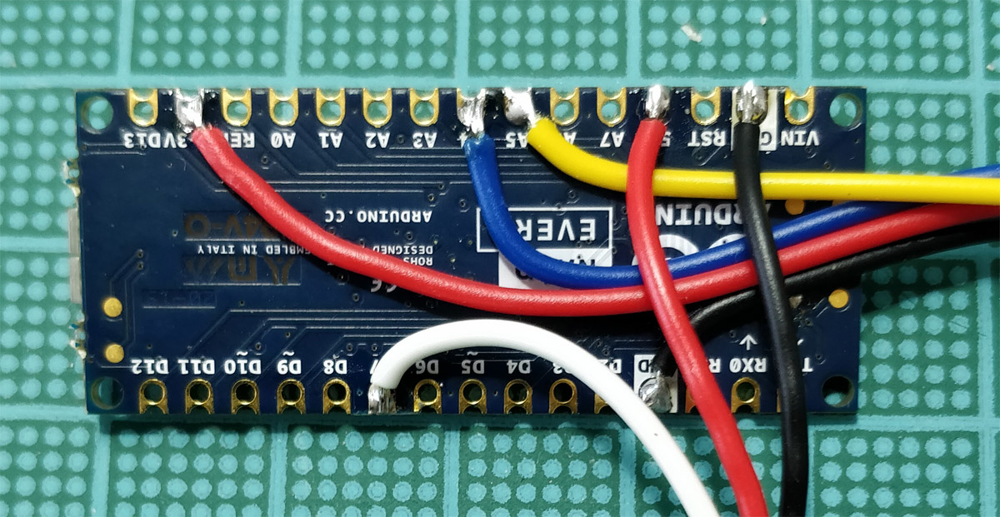


This is it for the wiring. We will power the circuit via USB because it needs to be continuously on to monitor the environmental parameters and make a forecast. A power bank for a mobile phone might power the circuit for quite some hours, but It would inevitably run out of energy.

### Schematics
.jpg)

## The Sketch

To get this project working we need several libraries and you find them in the first lines of the sketch as #INCLUDEs.

**Wire** is necessary for the I2C communication, the **Adafruit_Sensors** and **Adafruit_BME280** allow us to read the data from the pressure, humidity and temperature sensor. The LED strip is managed by the **Adafruit_NeoPixel** lib that gives us a quick and effective control over each pixel color. Last, but not least important is **RTCLib** that allows us to read all the information from the DS3231 Real Time Clock.

The constants we use are those for the average sea level pressure and for the Led strip. The value we are using for the average sea level pressure is 1013,25 mbar, equivalent to 101,325 kPa and it is the value recognised internationally.

After the initialisation of the various devices, we define some variables that will be used for the forecast and also for some textual output on the Serial Monitor. If you want to see what’s going on with the weather in depth, you can connect the pc and read the data supplied, otherwise, you might simplify a lot the sketch just avoiding all the string formatting and printing.

We decided to keep these **debug** information available to keep also some educational value in the project.

The array starts empty and the code is filling it **every 10 minutes** with a new value so that the last cell of the array contains the newest pressure reading. The value that contains the pressure is **seapressure** and it is calculated to compensate the height at which the device is placed.

A very important variable is the altitude of the device. We know the sea level pressure and we need to adjust the reading from the sensor so that we can feed into the Zambretti formula the pressure we would read at sea level starting from what we read from the sensor. There is a formula that does this calculation knowing a series of parameters and if you have at hand a GPS (even your smartphone could have one) to read the altitude, you can put that value in the altitude variable. With that information, the formula is


With the following:

**P0** is the relative sea-level pressure;

**P** is the station pressure in hPa;

**h** is the altitude in meters and

**T** is the temperature in Celsius.

With the output of this formula we have the pressure brought at the sea level, so that we can feed it into our array. The array is like a shift register and any time a new value is added, all the former values are shifted one position left (the oldest value is at 0 and the newest is at 9).

With this array of 10 values, spaced in time by 10 minutes, the Zambretti formula finds out the pressure variation tendency (falling, stable or rising) and values on a sliding window of values collected in the last 100 minutes. In the formula alsothe month is taken in account because Zambra and Negretti found it was relevant to get a more accurate forecast.

For the first 100 minutes however, the device is collecting the first complete set of pressure readings, therefore the forecast will be completely wrong. At the completion of this set, the forecast will be adjusted every 10 minutes.

The following lines replicate the physical object to find out the letter corresponding to the forecast using the three windows (falling / steady / rising) and the pressure reading. This means that for the same pressure reading, it is the short term change that makes the difference as well as summer/winter seasons. It is done in the function **calc_zambretti** that gets as input the oldest three values of pressure averaged, the last three values averaged and finally the month to spot the season.

The long list of **if… then… else** finally pics the Zambretti output and rearranges the 26 messages in simpler groups that are **Sunny, Sunny Cloudy, Worsening, Cloudy,** **Rainy**, telling us if the pressure is raising, stable or falling as well. We kept the original algorithm of [Fandonov ](https://github.com/fandonov/weatherstation))because it allows you to understand very well how the forecast works, then we had simplified the output coding the five possible situations into five different LED colors. The usage of a strip allows the slow change from one color into the other, scrolling up one LED at each new forecast; this is also a solution to give you the trend of the forecast.

We implement the scrolling of the led bar with a simple routine that copies the content of each led to the next one starting from the top, so that it shifts everything up, then the new value is defined by the Zambretti algorithm and it is written in the first LED position.

## Code 

Open this sketch in your Arduino IDE and make sure you have downloaded all the libraries needed.

```arduino

#include <Wire.h>
#include <Adafruit_Sensor.h>
#include <Adafruit_BME280.h>
#include <Adafruit_NeoPixel.h>
#include "RTClib.h"

#define SEALEVELPRESSURE_HPA (1013.25)
#define LED_PIN    7
#define NumLEDs 8

RTC_DS3231 rtc;   // initialise the RTC DS3231
Adafruit_BME280 bme;  // initialise the BME280 sensor
Adafruit_NeoPixel strip(NumLEDs, LED_PIN, NEO_GRB + NEO_KHZ800);

unsigned long delayTime;  // refresh rate for the readings
int t_hour = 0;
int t_minute = 0;
int oldpos = 0;     //Variables to scroll the LED bar
int newpos = 0;


int pressureArray[10] = {0};  // here we store the pressure readings 
byte counter = 0;
byte delta_time = 0;
int Z = 0;

char tStr[21];
char pStr[22];
char hStr[20];
char pseaStr[26];
char timeStr[6];
char dateStr[12];
char zambretti[10] = "N/A";
char pressureHistory[57];
char pressureHistory2[57];

int temperature;
int humidity;
int pressure;
int altitude = 355;   // Here you should put the REAL altitude of the iGnome


void setup() {
  bool status;
  Serial.begin(57600);   // default settings
  Serial.println("Starting measurements");
  if (! rtc.begin()) {
    Serial.println("Couldn't find RTC");
    while (1);
  }

  if (rtc.lostPower()) {
    Serial.println("RTC lost power, lets set the time!");
    // following line sets the RTC to the date & time this sketch was compiled
    rtc.adjust(DateTime(F(__DATE__), F(__TIME__)));

  }
  status = bme.begin();
  if (!status) {
    while (1);
  }
  delayTime = 20000;

  strip.begin();           // INITIALISE the LED strip object 
  strip.show();            // Turn OFF all pixels after init
  strip.setBrightness(100); // Set BRIGHTNESS to about 2/5 (max = 255)
}


void loop() {

  temperature = (int)bme.readTemperature();
  humidity = (int)bme.readHumidity();
  pressure = (int)(bme.readPressure() / 100.0F);

  // Let's see the reading that will determine the forecast

  Serial.print("Measured altitude ");
  Serial.println((int)bme.readAltitude(SEALEVELPRESSURE_HPA));

  int seapressure = station2sealevel(pressure, altitude, temperature);

  DateTime now = rtc.now();
  int t_hour2 = now.hour();
  int t_minute2 = now.minute();


  if (t_hour2 != t_hour or t_minute2 != t_minute) {
    delta_time++;
    if (delta_time > 10) {    // every minute we increment delta_time, then every 10 minutes
      delta_time = 0;         // we store the value in the array 

      if (counter == 10)  // if we read 10 values and filled up the array, we shift the array content
      {
        for (int i = 0; i < 9; i++) {   // we shift the array one position to the left
          pressureArray[i] = pressureArray[i + 1];
        }
        pressureArray[counter - 1] = seapressure;
      }
      else {        // this code fills up the pressure array value by value until is filled up
        pressureArray[counter] = seapressure;
        counter++;
      }
    }

    Z = calc_zambretti((pressureArray[9] + pressureArray[8] + pressureArray[7]) / 3, (pressureArray[0] + pressureArray[1] + pressureArray[2]) / 3, now.month());

// From here is just for debug purposes on the serial monitor

    sprintf(zambretti, "Z=%d", Z);
    sprintf(tStr, "%d C", temperature);
    sprintf(hStr, "%d %%", humidity);
    sprintf(pStr, "%d hPa", pressure);
    sprintf(pseaStr, "%d hPa", seapressure);
    sprintf(dateStr, "%02d.%02d.%d", now.day(), now.month(), now.year());
    sprintf(timeStr, "%02d:%02d", now.hour(), now.minute());
    sprintf(pressureHistory, "%d,%d,%d,%d,%d,%d,%d,%d,%d,%d,", pressureArray[0], pressureArray[1], pressureArray[2],
            pressureArray[3], pressureArray[4], pressureArray[5], pressureArray[6], pressureArray[7], pressureArray[8], pressureArray[9]);

    Serial.println(zambretti);
    Serial.println(tStr);
    Serial.println(hStr);
    Serial.println(pStr);
    Serial.println(pseaStr);
    Serial.println(dateStr);
    Serial.println(timeStr);
    Serial.println(pressureHistory);
    Serial.println(pressureHistory2);

// END of testing purposes

    StripScroll();    // advance the LED colors in the strip preparing for the new entry

    if (pressureArray[9] > 0 and pressureArray[0] > 0) {
      if (pressureArray[9] + pressureArray[8] + pressureArray[7] - pressureArray[0] - pressureArray[1] - pressureArray[2] >= 3) {
        //RAISING
        Serial.println("Raising");
        if (Z < 3) {
          Serial.println("Sunny");
          strip.setPixelColor(0, 255, 127, 0);
        }
        else if (Z >= 3 and Z <= 9) {
          Serial.println("Sunny Cloudy");
          strip.setPixelColor(0, 0, 255, 255);
        }
        else if (Z > 9 and Z <= 17) {
          Serial.println("Cloudy");
          strip.setPixelColor(0, 127, 0, 255);
        }
        else if (Z > 17) {
          Serial.println("Rainy");
          strip.setPixelColor(0, 255, 0, 127);
        }
      }

      else if (pressureArray[0] + pressureArray[1] + pressureArray[2] - pressureArray[9] - pressureArray[8] - pressureArray[7] >= 3) {
        //FALLING
        Serial.println("Falling");
        if (Z < 4) {
          Serial.println("Sunny");
          strip.setPixelColor(0, 255, 127, 0);
        }
        else if (Z >= 4 and Z < 14) {
          Serial.println("Sunny Cloudy");
          strip.setPixelColor(0, 0, 255, 255);
        }
        else if (Z >= 14 and Z < 19) {
          Serial.println("Worsening");
          strip.setPixelColor(0, 192, 0, 255);
        }
        else if (Z >= 19 and Z < 21) {
          Serial.println("Cloudy");
          strip.setPixelColor(0, 127, 0, 255);
        }
        else if (Z >= 21) {
          Serial.println("Rainy");
          strip.setPixelColor(0, 255, 0, 127);
        }
      }
      else {
        //STEADY
        Serial.println("Steady");
        if (Z < 5) {
          Serial.println("Sunny");
          strip.setPixelColor(0, 255, 127, 0);
        }
        else if (Z >= 5 and Z <= 11) {
          Serial.println("Sunny Cloudy");
          strip.setPixelColor(0, 0, 255, 255);
        }
        else if (Z > 11 and Z < 14) {
          Serial.println("Cloudy");
          strip.setPixelColor(0, 127, 0, 255);
        }
        else if (Z >= 14 and Z < 19) {
          Serial.println("Worsening");
          strip.setPixelColor(0, 192, 0, 255);
        }
        else if (Z >= 19) {
          Serial.println("Rainy");
          strip.setPixelColor(0, 255, 0, 127);
        }
      }
    }
    else {
      if (seapressure < 1005) {
        Serial.println("Rainy");
        strip.setPixelColor(0, 255, 0, 127);
      }
      else if (seapressure >= 1005 and seapressure <= 1015) {
        Serial.println("Cloudy");
        strip.setPixelColor(0, 127, 0, 255);
      }
      else if (seapressure > 1015 and seapressure < 1025) {
        Serial.println("Sunny Cloudy");
        strip.setPixelColor(0, 0, 255, 255);
      }
      else {
        Serial.println("Rainy");
        strip.setPixelColor(0, 255, 0, 127);
      }
    }

    t_hour = t_hour2;
    t_minute = t_minute2;

  }
  strip.show();
  delay(delayTime);

}


int calc_zambretti(int curr_pressure, int prev_pressure, int mon) {
  if (curr_pressure < prev_pressure) {
    //FALLING
    if (mon >= 4 and mon <= 9)
      //summer
    {
      if (curr_pressure >= 1030)
        return 2;
      else if (curr_pressure >= 1020 and curr_pressure < 1030)
        return 8;
      else if (curr_pressure >= 1010 and curr_pressure < 1020)
        return 18;
      else if (curr_pressure >= 1000 and curr_pressure < 1010)
        return 21;
      else if (curr_pressure >= 990 and curr_pressure < 1000)
        return 24;
      else if (curr_pressure >= 980 and curr_pressure < 990)
        return 24;
      else if (curr_pressure >= 970 and curr_pressure < 980)
        return 26;
      else if (curr_pressure < 970)
        return 26;
    }
    else {
      //winter
      if (curr_pressure >= 1030)
        return 2;
      else if (curr_pressure >= 1020 and curr_pressure < 1030)
        return 8;
      else if (curr_pressure >= 1010 and curr_pressure < 1020)
        return 15;
      else if (curr_pressure >= 1000 and curr_pressure < 1010)
        return 21;
      else if (curr_pressure >= 990 and curr_pressure < 1000)
        return 22;
      else if (curr_pressure >= 980 and curr_pressure < 990)
        return 24;
      else if (curr_pressure >= 970 and curr_pressure < 980)
        return 26;
      else if (curr_pressure < 970)
        return 26;
    }
  }
  else if (curr_pressure > prev_pressure) {
    //RAISING
    if (mon >= 4 and mon <= 9) {
      //summer
      if (curr_pressure >= 1030)
        return 1;
      else if (curr_pressure >= 1020 and curr_pressure < 1030)
        return 2;
      else if (curr_pressure >= 1010 and curr_pressure < 1020)
        return 3;
      else if (curr_pressure >= 1000 and curr_pressure < 1010)
        return 7;
      else if (curr_pressure >= 990 and curr_pressure < 1000)
        return 9;
      else if (curr_pressure >= 980 and curr_pressure < 990)
        return 12;
      else if (curr_pressure >= 970 and curr_pressure < 980)
        return 17;
      else if (curr_pressure < 970)
        return 17;
    }
    else
      //winter
    {
      if (curr_pressure >= 1030)
        return 1;
      else if (curr_pressure >= 1020 and curr_pressure < 1030)
        return 2;
      else if (curr_pressure >= 1010 and curr_pressure < 1020)
        return 6;
      else if (curr_pressure >= 1000 and curr_pressure < 1010)
        return 7;
      else if (curr_pressure >= 990 and curr_pressure < 1000)
        return 10;
      else if (curr_pressure >= 980 and curr_pressure < 990)
        return 13;
      else if (curr_pressure >= 970 and curr_pressure < 980)
        return 17;
      else if (curr_pressure < 970)
        return 17;
    }
  }
  else {
    if (curr_pressure >= 1030)
      return 1;
    else if (curr_pressure >= 1020 and curr_pressure < 1030)
      return 2;
    else if (curr_pressure >= 1010 and curr_pressure < 1020)
      return 11;
    else if (curr_pressure >= 1000 and curr_pressure < 1010)
      return 14;
    else if (curr_pressure >= 990 and curr_pressure < 1000)
      return 19;
    else if (curr_pressure >= 980 and curr_pressure < 990)
      return 23;
    else if (curr_pressure >= 970 and curr_pressure < 980)
      return 24;
    else if (curr_pressure < 970)
      return 26;

  }
}

int station2sealevel(int p, int height, int t) {  // from pressure at our height to sea level
  return (double) p * pow(1 - 0.0065 * (double)height / (t + 0.0065 * (double)height + 273.15), -5.275);
}

void StripScroll() {    // scroll up all the LED strip by 1 
  for (int led = 0; led <= (NumLEDs); led++)
  {
    oldpos =  NumLEDs - led - 2;
    newpos = oldpos + 1;
    strip.setPixelColor(newpos, strip.getPixelColor(oldpos));
  }
}


```

## Putting Everything Together

We are hosting the circuit in our “standard” 3D-printed Gnome. This time the BME280 is partially out of the back of the Gnome, from his heels, while the USB is accessible at mid height. You can modify the STL files we already shared in our former project [Gnome Traveller](https://create.arduino.cc/projecthub/Arduino_Genuino/gnome-traveller-3a78cd) to let the sensor and the USB port be accessible from the outside.

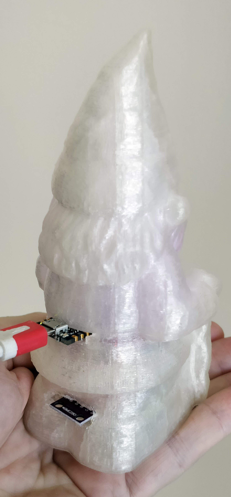


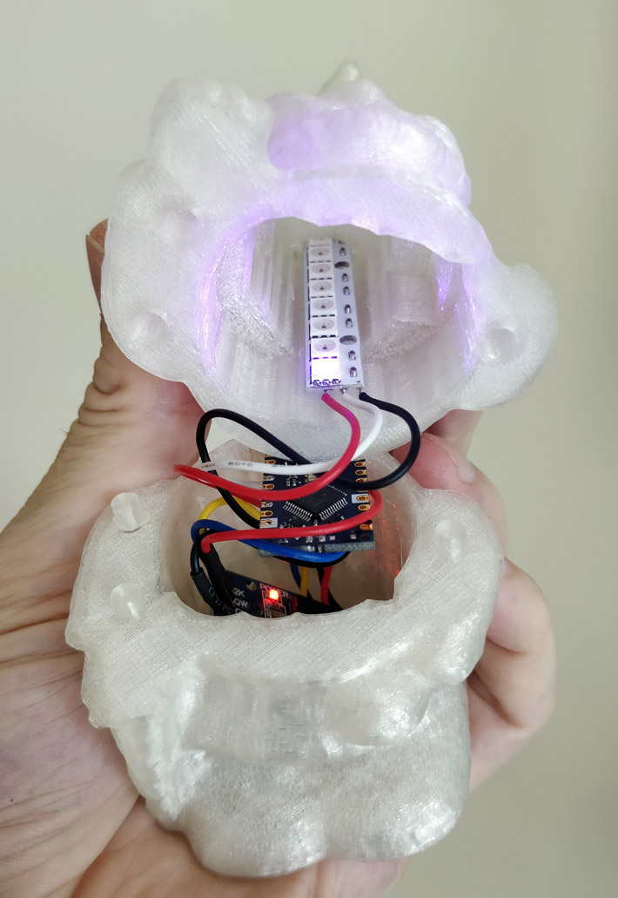


The wiring is really simple and therefore putting everything in the 3D-printed Gnome should be very easy. In our setup the strip is in the upper part of the Gnome so that the head and hat light up with the color of the forecast. Keeping the sensor outside the Gnome is best as it allows it to get air from the environment. The best results require the sensor to be in the open air and not your apartment where humidity and temperature are kept under control.

A solution could be to keep the gnome close to a window and keep the sensor outside with a 4 wires cable link; I2C can tolerate up to one meter and that is more than you need to put the sensor out of the window.


### Load the Code and Monitor the Readings

When all the hardware is set up, you can proceed with the sketch. Copy it from here and also check with Library Manager that you have all the needed libraries:

* Adafruit_Sensor
* Adafruit_BME280
* Adafruit_NeoPixel
* RTClib

The Arduino Nano Every uses the **MegaAVR core** and you should have that properly installed as well: if you have the board in the list of the available ones it is installed, otherwise you need to use the **Board Manager** to install it.

Launch the verify of the sketch just to be sure everything is correct and then upload. Open the Serial Monitor and look at the data that slowly will be printed. Every minute you get a pressure reading, every ten minutes the reading is stored.

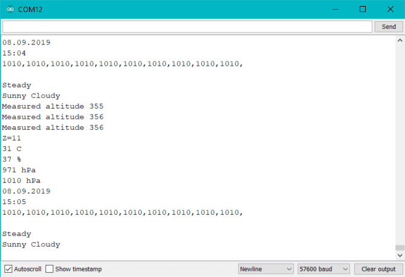


Take a break and let the array fill up with the real data. Come back after a couple of hours and what you see and read should be meaningful.

Yellow is sunny, azure is cloudy and then it goes to purple and red when the weather worsens up to the rain.

## Gnome STL Files

### Gnome Lower Part

<iframe title="nano_gnome_bottom_Yh3Kgm7JAj.stl" frameborder="0" allowfullscreen mozallowfullscreen="true" webkitallowfullscreen="true" allow="fullscreen; autoplay; vr" xr-spatial-tracking execution-while-out-of-viewport execution-while-not-rendered web-share src="https://sketchfab.com/models/8d74c04fd87e4af38318dc2264b0b726/embed" style="height:510px;width:100%;margin:10px 0"> </iframe>


### Gnome Upper Part

<iframe title="nano_gnome_top_uxgzY4SKtG.stl" frameborder="0" allowfullscreen mozallowfullscreen="true" webkitallowfullscreen="true" allow="fullscreen; autoplay; vr" xr-spatial-tracking execution-while-out-of-viewport execution-while-not-rendered web-share src="https://sketchfab.com/models/05abd3e1e249478cb1cb96b59aed4e5a/embed" style="height:510px;width:100%;margin:10px 0"> </iframe>


## Make It Your Own

We kept the text in the sketch so that you can easily change the color for each of the managed weather conditions. The syntax is **strip.setPixelColor(LED, R, G, B);** with LED that should always be the first in the strip (0) and RGB values from 0 to 255. There is an overall brightness setting that you can use to get a different intensity of the LED throughout the day; look for the **strip.setBrightness(100);** line and turn it into something related to night and day reading the RTC.