## Components and Supplies

- [Arduino Nano Every](/hardware/nano-every)
- [Arduino MKR GPS Shield](https://store.arduino.cc/mkr-gps-shield)
- [Digilent MicroSD Card with Adapter](http://store.digilentinc.com/)
- [SparkFun Level Shifter Board](https://www.sparkfun.com/products/12009)
- Power Bank Electronics
- [Li-Ion Battery 1000mAh](https://www.newark.com/96Y0775?COM=ref_hackster)
- [Slide Switch](https://www.newark.com/15N7301?COM=ref_hackster)
- [Wire, Wrapping Wire](https://www.newark.com/10F7545?COM=ref_hackster)

## Necessary Tools and Machines

- 3D Printer (Generic)
- Soldering iron (Generic)

## About This Project

This project is based on the [Arduino Nano Every](https://store.arduino.cc/nano-every) board, the MKR GPS module, and some other components. The idea is that this little Gnome – in Italian Nano is also a synonym of Gnome – will follow us in our trips and holidays, keeping track on a microSD card of all the places we visit. The log file can be fed to Google Maps to obtain the visual representation of his, and ours, journey.

## The Gnome

The requirements for this design are related to our idea of enclosing everything in our 3D-printed Gnome, therefore space is an asset with which we have to deal. The Gnome model is a derivative of the one you can find on [Thingiverse](https://www.thingiverse.com/thing:140611), done by Tony Buser. 

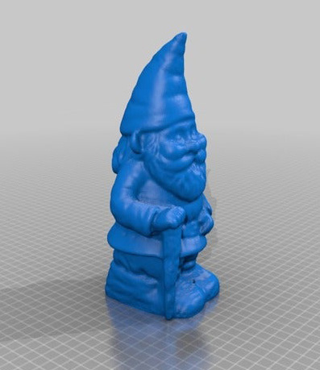


We cut the Gnome in two parts, emptied it to make space for the parts and we added three pins and three matching holes to allow easy opening and closing without losing the alignments between the parts. You can find the STL files below.

## Gnome STL Files

### Gnome Lower Part


 <iframe title="nano_gnome_bottom_DwZtEltFiJ.stl" frameborder="0" allowfullscreen mozallowfullscreen="true" webkitallowfullscreen="true" allow="fullscreen; autoplay; vr" xr-spatial-tracking execution-while-out-of-viewport execution-while-not-rendered web-share src="https://sketchfab.com/models/42c494950ac74c70a9047bbb7c44a6b7/embed" style="height:510px;width:100%;margin:10px 0"> </iframe>

### Gnome Upper Part

<iframe title="nano_gnome_top_kTDM0lZLdB.stl" frameborder="0" allowfullscreen mozallowfullscreen="true" webkitallowfullscreen="true" allow="fullscreen; autoplay; vr" xr-spatial-tracking execution-while-out-of-viewport execution-while-not-rendered web-share src="https://sketchfab.com/models/765d893d669145c98407bb0931c58e50/embed" style="height:510px;width:100%;margin:10px 0"> </iframe>

## The Parts

To fulfil the requirements, we did some scavenging around and we found a compact charge/discharge module from a used single cell power bank, a miniature switch, a Li-Ion battery from an old GPS navigation system and an SD to microSD adaptor. To these used parts we had to add two four channels bi-directional level shifter, insulating tape and some electrical wires.

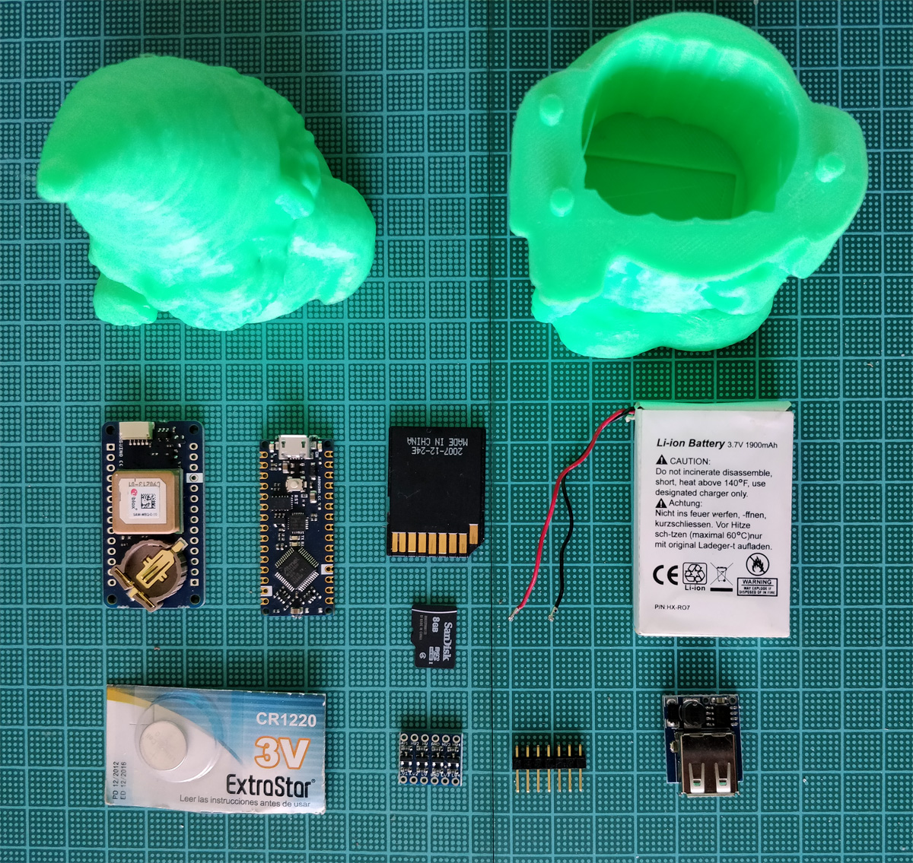


Just to give you an idea, the 3D-printed Gnome weights 68 grams, the electronic parts weight another 68 grams (23 for the electronics and 55 for the Li-Ion battery) and the size is 70x70x140mm (we enlarged the original 3d model to have a reasonable space inside).

## The Circuit

This design is quite straightforward and it uses the hardware Serial1 on pins 0 and 1 of the Nano Every to communicate with the MKR GPS Shield, from which we also connect the EXTINT pin to make our assembly capable of using the advanced features of the GPS module. The Nano Every is based on a 5V microcontroller and the MKR GPS Shield is strictly 3.3V, therefore we use a level shifter that gets both 5V and 3.3V supply on HV and LV so that the two sides of the level shifter provide the proper signal conversion. The module has 4 lines and we use 3 of them.

The connections for this part are:

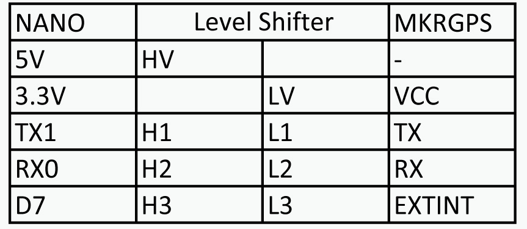

The other device we are connecting to our Nano Every is a microSD to store the logs of our trips. As we said before, we have space constraints and the usage of an SD or micro SD shield could make the whole project too big. A SD to microSD adapter is what we chose also because very often they are given together with the microSD memory card and therefore we have many of them around our labs. They are small and can be easily turned into an SD card interface. The connections are those of a standard SPI interface.

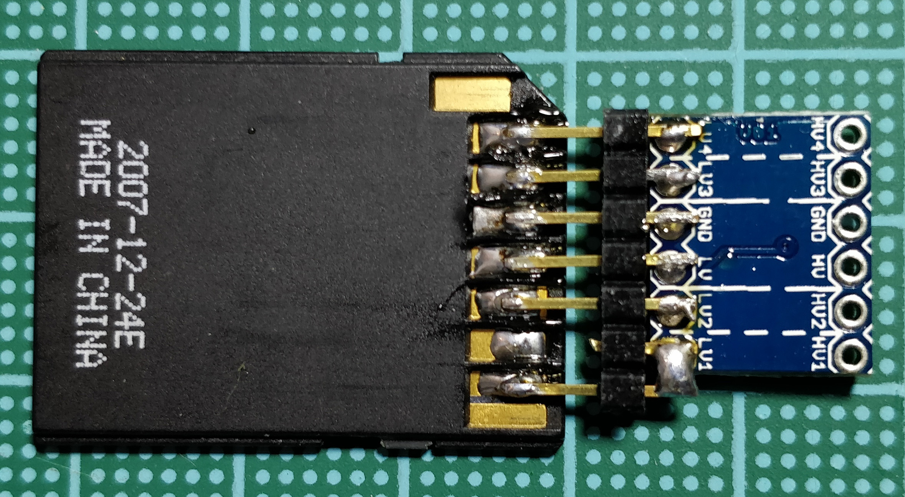

The SD to microSD adapter is made compatible with the 5V of the Arduino Nano Every through a level shifter

The pins of the SD are with the same spacing of our standard pinstrips (2.54mm) so we soldered 6 pins as you see in the picture to have an easy connection with our level shifter. It is worth noting that the two central pads of the level shifter are a perfect match for the GND and 3.3V of the SD adaptor. To better understand the connections here is the pinout of the SD adaptor here is the pinout.

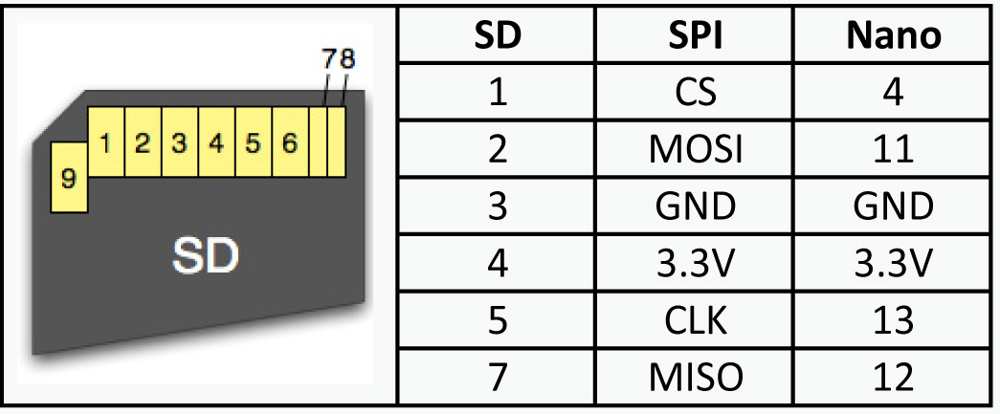


As for the GPS, also the SD and microSD are 3.3V electronics and a level shifter is put between the adaptor and the Nano Every as explained above.

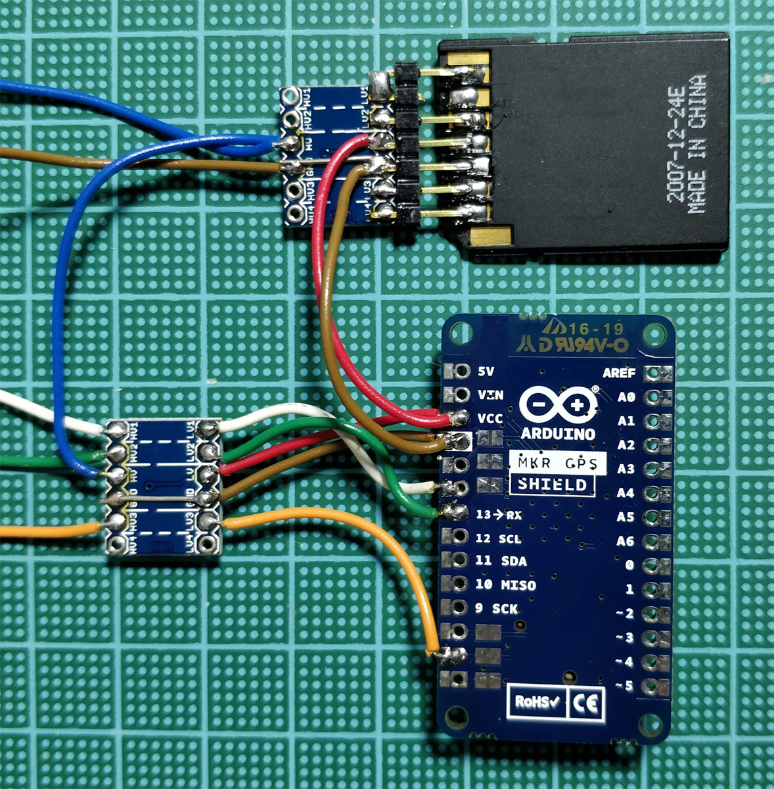


The last bit of the circuit is related to the power supply: we want to carry around our Gnome and a rechargeable battery is needed. We chose a 1900mAh Li-Ion rugged battery that should feed our circuit for many hours: the power consumption at 5V averages 70 mA that means over 27 hours of continuous logging. 

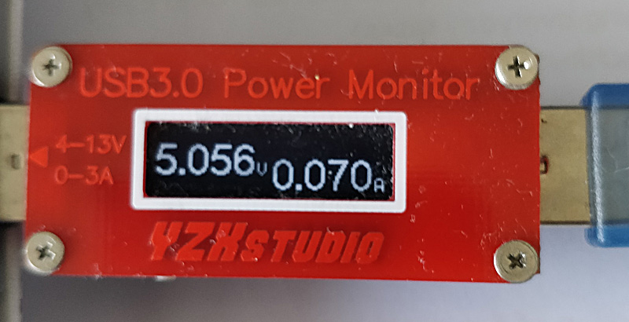


We put a switch on the 5V feed to the circuit so that we can switch our iGnome Traveller on and off at will. The software will cope with this creating, as explained later, a new log file at every power cycle.

As you can see from the picture of the whole project, the 5V and 3.3V are fed to the first level shifter, then to the second one and the 3.3V goes from the level shifters to the attached device (GPS and SD Adapter).

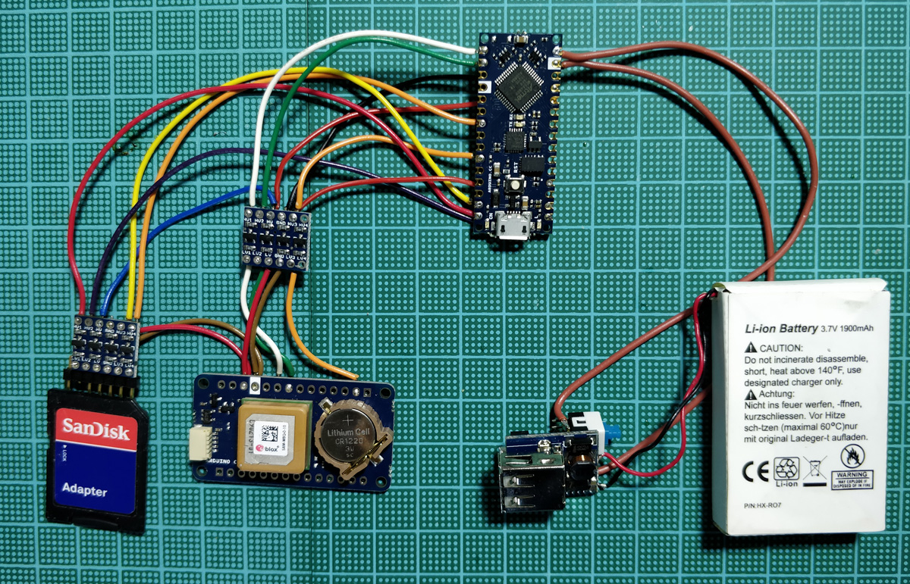


Everything folds into the 3D-printed Gnome lower half and the battery charger and 5V supply is the only piece that is left floating and will go in the upper part. 

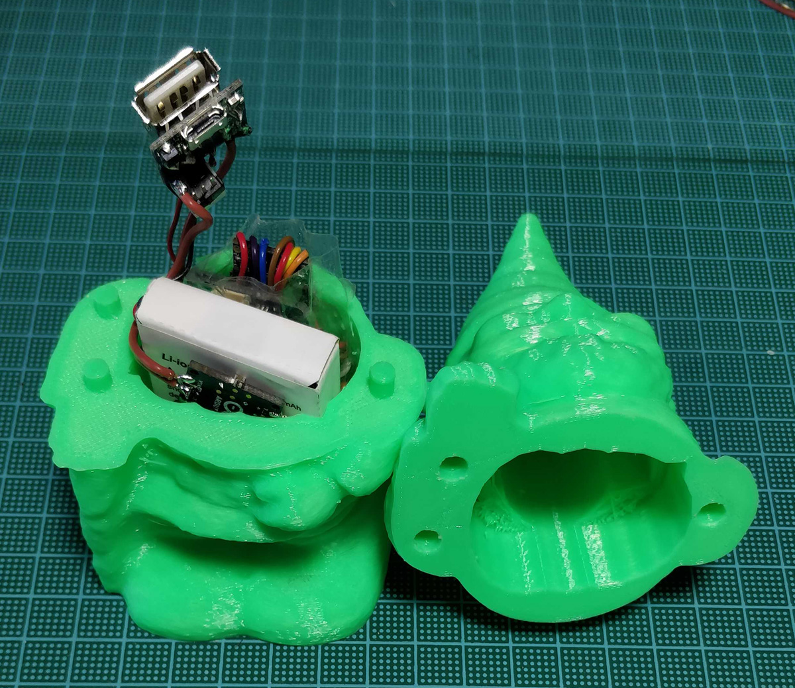

The switch is soldered directly to the 5V output of the power bank electronics and cuts the supply to the 5V pin of the Nano Every.

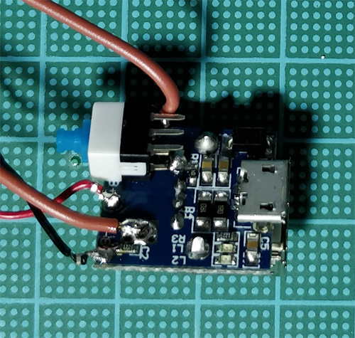


## The Sketch

The sketch uses three libraries: TinyGPS++, SD and SPI. We decided to use [TinyGPS++](http://arduiniana.org/libraries/tinygpsplus/) by 'Mikal Hart' because it is very simple to use and works flawlessly with a lot of GPS modules. If you want to use another module, different from our MKR GPS, you are free to do it without losing the sketch functionality. The Nano Every has three hardware serial ports and we are using **Serial1** , available on pins 0 and 1, to communicate with the GPS. Serial is the one connected to the USB to serial interface and we use it to send messages to the serial console.

SD and SPI are our standard libraries and allow you to manage files on the SD card and communicate with it through the SPI interface.

The first lines of the sketch take care of the libraries to include and then create the GPS object that will parse the data received as NMEA sentences from the GPS.

The line used to select the SD on the SPI bus is the standard **D4**, also used by some SD and microSD shields and it is defined in the **chipSelect** variable. The next lines define the pace at which the GPS position is logged, expressed in microseconds. It is currently set at 10 seconds, but can be lowered to 1 seconds or increased at will remembering that we don’t put the GPS module or the Every in sleep mode and therefore the consumption isn’t affected by the pace of the readings. If you want a better power management, you can implement the sleep mode with the current wiring. Remember that when the GPS module is brought out of sleep mode, it takes a few seconds to get a new position fix, therefore you should wait for a valid reading before the next sleep mode is activated or enforce an adequate timeout before forcing the sleep mode in absence of a position fix.

The **DEBUG** define allows you to test the GPS connection and signal reception getting the output on both the SD and the Serial Console. When everything is working, you can set DEBUG at 0 and avoid some traffic to the console.

The setup takes care of the serial ports initialisation setting their speed. Serial goes to the Console and Serial1 goes to the MKR GPS Shield. The next lines check if the microSD is properly connected and available. To create the log file, we start from the basic filename **GnomeT00.CSV** and then we test the existence of the numbered files from 00 to 99. As soon as the routine finds the first empty number, it creates the log file.

This part echoes the information on the Serial Console, then the DEBUG variable is taken in account to keep the flow of data to the Console or to print it just on the file.

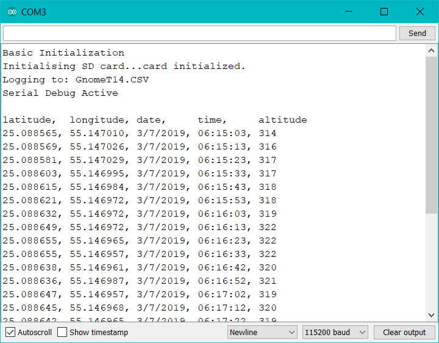


The loop contains the code necessary to read the data from Serial1, parse it and write the formatted latitude, longitude, elevation, date and time to the log file. If Debug is “1” then the same data is sent to the Serial Console.

### Code 

Load this sketch and compile it after you have downloaded TinyGPSPlus library from http://arduiniana.org/libraries/tinygpsplus/

```arduino
#include <TinyGPS++.h>
#include <SPI.h>
#include <SD.h>

TinyGPSPlus gps;

int chipSelect = 4;   // digital pin 4 for the SD cs line
File logfile;// the logging file

//data logger timing and other
long logPace=10000; // 10 seconds between entries
long readTime = 0; // time of last read()
#define DEBUG 1 // echo GPS data to serial port for debug purposes

void setup() {
  Serial.begin(115200);
  Serial1.begin(9600);  // our module communicates at 9600
  delay(1000);
  Serial.println("Basic Initialization");  // we sen something to the consolle

  // initialize the SD card
  Serial.print("Initialising SD card...");

  // see if the card is present and can be initialized:
  if (!SD.begin(chipSelect)) {
    Serial.println("Card read failed, or not present");
    // Stop the sketch
    return;
  }
  Serial.println("card initialized.");

  // create a new file
  char filename[] = "GnomeT00.CSV";
  for (byte i = 0; i < 100; i++) {
    filename[6] = i / 10 + '0';
    filename[7] = i % 10 + '0';
    if (! SD.exists(filename)) {
      // open the next file in the numbered sequence
      logfile = SD.open(filename, FILE_WRITE);
      break;  // leave the loop!
    }
  }

  Serial.print("Logging to: ");
  Serial.println(filename);

  logfile.println("latitude, longitude, altitude, date, time");

#if DEBUG   //serial debug active?
  Serial.println("Serial Debug Active");
  Serial.println();
  Serial.println("latitude,  longitude, date,     time,     altitude");
#endif// we show the columns for the data sent to console

#if !DEBUG   //serial debug deactivated
  Serial.println("No Serial Debug");
#endif
}

void loop() {

  while (Serial1.available() > 0)
  {
    gps.encode(Serial1.read());
    if (gps.location.isValid())
    {
      if ((millis() - readTime) < logPace) return;
      readTime = millis();
      logfile.print(gps.location.lat(), 6);
      logfile.print(", ");
      logfile.print(gps.location.lng(), 6);
      logfile.print(", ");
      logfile.print(gps.altitude.meters(), 0);
      logfile.print(", ");  
      logfile.print(gps.date.day());
      logfile.print(F("/"));
      logfile.print(gps.date.month());
      logfile.print(F("/"));
      logfile.print(gps.date.year());
      logfile.print(", ");
      if (gps.time.hour() < 10) logfile.print(F("0"));
      logfile.print(gps.time.hour());
      logfile.print(F(":"));
      if (gps.time.minute() < 10) logfile.print(F("0"));
      logfile.print(gps.time.minute());
      logfile.print(F(":"));
      if (gps.time.second() < 10) logfile.print(F("0"));
      logfile.print(gps.time.second());
      logfile.println("");
#if DEBUG   //serial debug active?
      Serial.print(gps.location.lat(), 6);
      Serial.print(", ");
      Serial.print(gps.location.lng(), 6);
      Serial.print(", ");
      Serial.print(gps.date.day());
      Serial.print(F("/"));
      Serial.print(gps.date.month());
      Serial.print(F("/"));
      Serial.print(gps.date.year());
      Serial.print(", ");
      if (gps.time.hour() < 10) Serial.print(F("0"));
      Serial.print(gps.time.hour());
      Serial.print(F(":"));
      if (gps.time.minute() < 10) Serial.print(F("0"));
      Serial.print(gps.time.minute());
      Serial.print(F(":"));
      if (gps.time.second() < 10) Serial.print(F("0"));
      Serial.print(gps.time.second());
      Serial.print(", ");
      Serial.print(gps.altitude.meters(), 0);
      Serial.println("      ");
#endif
      logfile.flush();        //write data to disk
    }
  }
}


```

Please note that on Google Maps you can import the logged data to get every line of the log as a pin on the map, but if you want to see the elevation information as well, you need Google Earth Pro that can show the information in 3D and a file converter that puts the information in the right format. With just latitude and longitude the position marker will be on the surface regardless the elevation information.

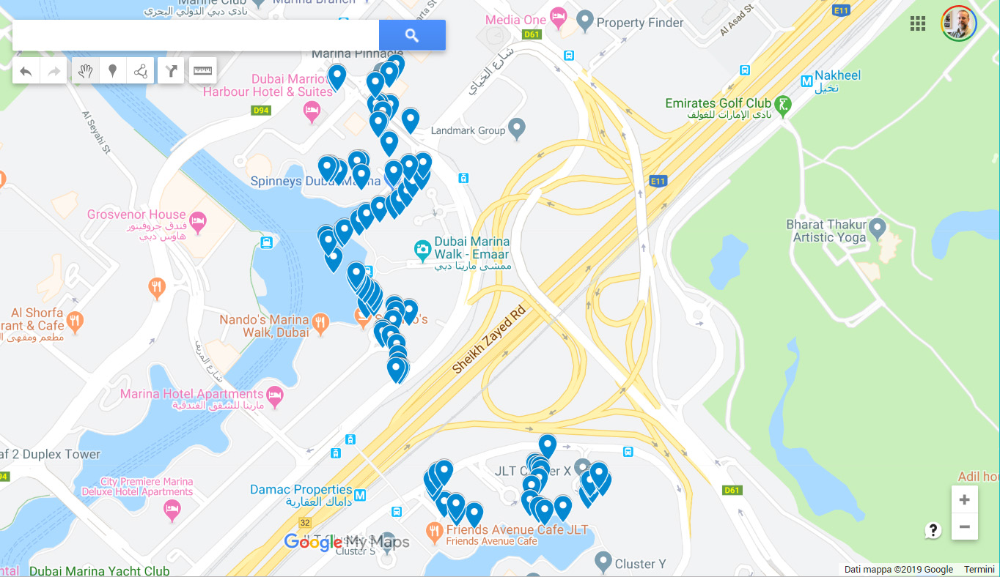


If you want to see the correct position in the 3D space, with elevation, you need to create a **KML** file from the CSV and among the various solutions available online we have found that **ATSB KML Creator** does this conversion perfectly. The ATSB KML Creator utilizes spreadsheets containing recorded GPS parameters (latitude, longitude and altitude) to create a flight path in KML format, viewable using Google Earth. The ATSB KML Creator also incorporates the display of user selected parameters in conjunction with the flight path using the 'Elevation Profile' feature in Google Earth. You can find it here: <https://www.atsb.gov.au/atsb-kml-creator>

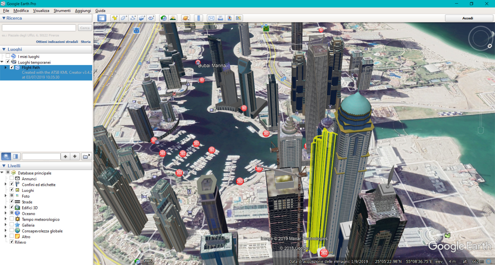


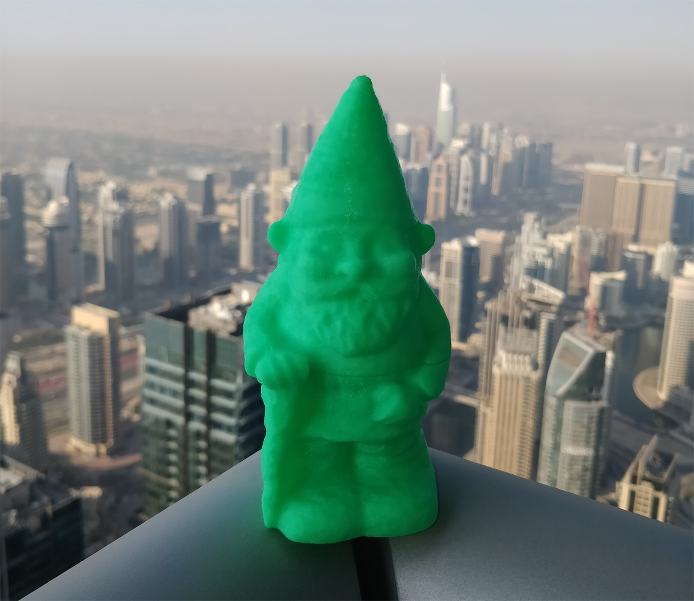

We wish to thank Jeremy Blum ([http://www.jeremyblum.com](http://www.jeremyblum.com/)) and credit him for his sketch of an Arduino GPS tracker that we took as a starting point for ours.