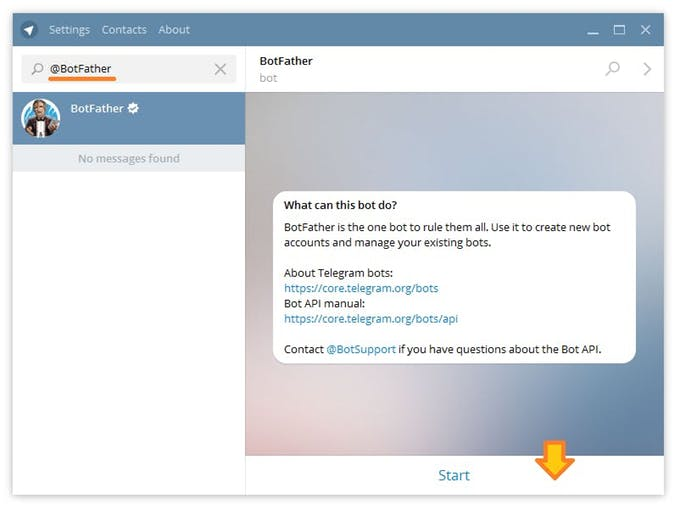
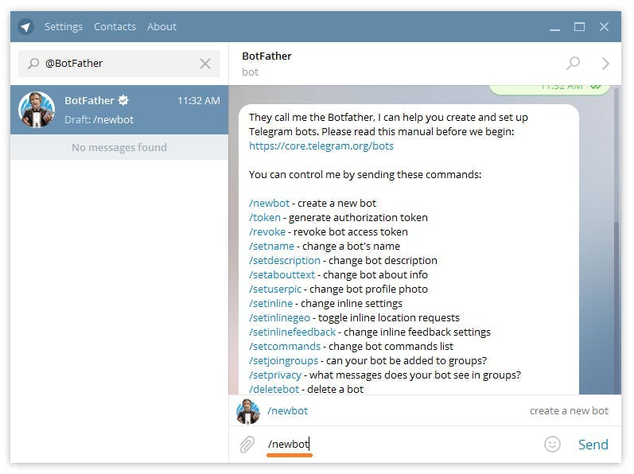
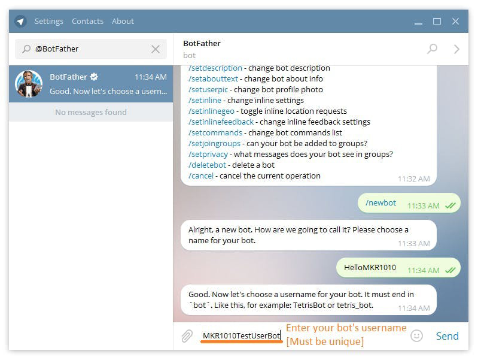
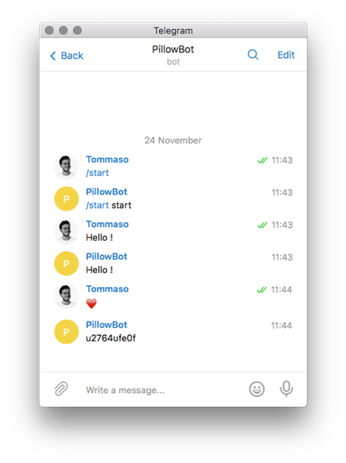
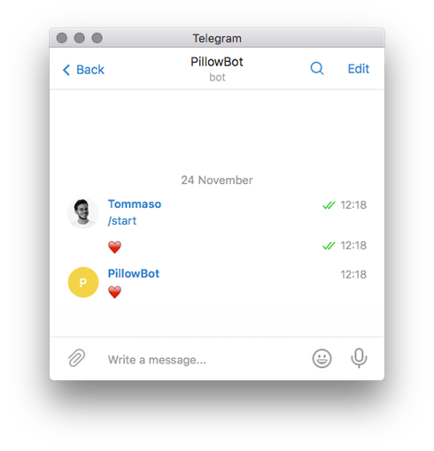
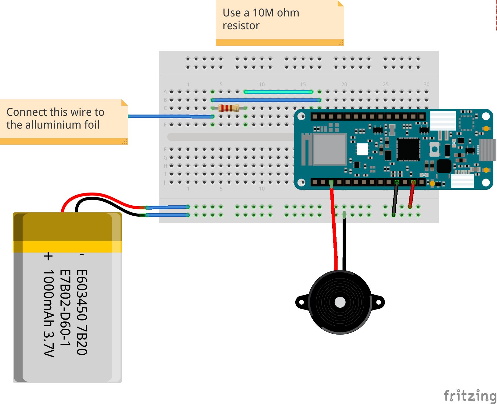
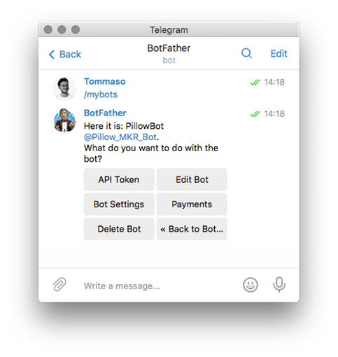
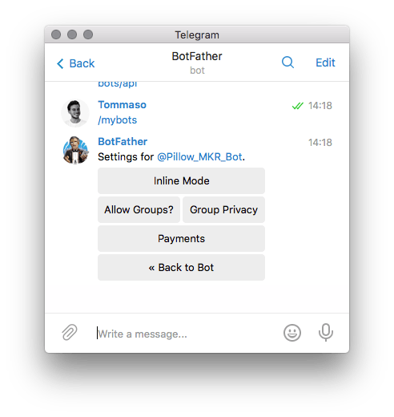
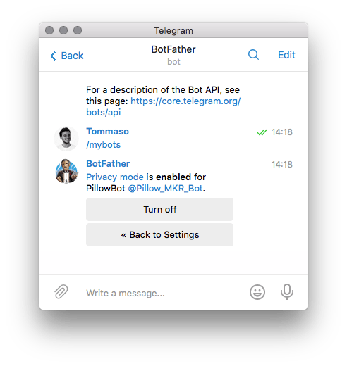

## Components and Supplies

- [Arduino MKR IoT Bundle 1010](https://store.arduino.cc/arduino-iot-mkr-wifi-1010-bundle)

## About This Project

We all know that being without that special person in your life can be difficult, but what if you could send love and affection remotely over the Internet by just hugging a pillow? Now, we can't really send hugs... but what we can send is a sweet emoji through a messaging app, triggered by you giving a pillow a hug. When you hug the *I Love You Pillow* you will hear the sound of a heartbeat coming from the buzzer inside. Depending on the length of your hug, a different emoji will be sent from a Telegram Bot to whatever chat you choose. Stay in touch with your loved one with this huggable device! 

### In a Nutshell

In this experiment, we will use aluminum foil to create a DIY capacitive sensor that will be used to detect hugs. In order to create our hug-sending-device we will need the following components:

* Buzzer
* Aluminum foil
* 1 resistor 5M ohm
* Breadboard
* Wires


### Learning Goals

* Introducing Telegram Bots
* Managing capacitive sensors
* Telegram Bots and group chats **#ProTips**
* WiFi best practices **#ProTips**

**Pro Tips** are useful but not strictly necessary steps that add a layer of complexity to the project. 

### Want to Know More?

This tutorial is part of a series of experiments that familiarise you with the MKR WiFi 1010 and IoT. All experiments can be built using the components contained in the MKR IoT Bundle.

* I Love You Pillow with MKR WiFi 1010
* [Puzzle Box with MKR WiFi 1010](https://create.arduino.cc/projecthub/Arduino_Genuino/puzzlebox-with-mkr-wifi-1010-7a39c4)
* [Pavlov's Cat with MKR WiFi 1010](https://create.arduino.cc/projecthub/Arduino_Genuino/pavlov-s-cat-with-mkr-wifi-1010-9ea418)
* [The Nerd with MKR WiFi 1010](https://create.arduino.cc/projecthub/Arduino_Genuino/the-nerd-with-mkr-wifi-1010-462cc5)
* [Plant Communicator with MKR WiFi 1010](https://create.arduino.cc/projecthub/Arduino_Genuino/plant-communicator-with-mkr-wifi-1010-efc920)

### Introducing Telegram Bots

[Telegram](https://telegram.org/) is a popular messaging app for both mobile and desktop. Besides letting us chat with our friends it also allows us to create handy and powerful chat-bots!

A chat-bot is nothing but a contact you can chat with, but instead a person behind it, there is a machine that replies accordingly to the code you wrote.

[The TelegramBot library](https://github.com/CasaJasmina/TelegramBot-Library) for Arduino gives us an easy way to implement the logic behind the chat-bot.

### Create Your Bot

Creating a bot is so easy! Just follow these few simple steps or take a look at the documentation [here](https://core.telegram.org/bots#3-how-do-i-create-a-bot).










### Set Up the Board

**First off make sure we have all the needed libraries.** Here's the list of all the libraries we will need:

* WiFiNINA
* TelegramBot
* ArduinoJson
* CapacitiveSensor

You can easily install them following this [simple guide](https://www.arduino.cc/en/Guide/Libraries).

In order to use Telegram's API we first need to upload the certificates on the MKR WiFi 1010. **This applies to most of online services and APIs!**

Upload the Firmware Updater example from the WiFiNINA library and add [api.telegram.org ](http://api.telegram.org/)to the domains. These are the steps to follow:

* Run the IDE;
* Upload the sketch "Example->WiFiNINA->tools->Firmware updater"
* Open "WiFi101/WiFiNINA firmware updater" in tools
* Click on "Add Domain"
* Add <https://api.telegram.org>
* Click on "Upload Certificates to WiFi module"
* Upload your sketch

Let the magic happen!

**Open the EchoBot example from the TelegramBot library, fill in your WiFi credentials and the API token you received from the BotFather and upload!**

> example > TelegramBot > EchoBot 

You just created a bot that echoes all your messages.

### EchoBot and Emoji

Emojis are everywhere! We will use them to send our love and hugs. Using the EchoBot example is an easy way to see how the bots read your emoji.




**Unfortunately the way the bot receives the emoji is not the same used to send them.** In order to send an emoji we will need to use **UNICODE** characters.

For instance to send an heart emoji we will use: `\U00002764`

You can see the full list of unicode emoji codes [here](https://unicode.org/emoji/charts/full-emoji-list.html). In order to create a bot that replies to an heart emoji with another heart emoji we will use a code like this:

```arduino
void loop() {
 message m = bot.getUpdates(); // Read new messages
 if ( m.chat_id != 0 ) { // Check if there are some updates
   Serial.println(m.text); // print the message received
   if (m.text == "u2764ufe0f") { //check if it received an heart emoji
     bot.sendMessage(m.chat_id, "\U00002764");
     // Reply to the same chat with the heart emoji
   }
 }
}
```

The result will be:




### Capacitive Sensor

Enough with Telegram, let's start building our DIY capacitive sensor!

The [CapacitiveSensor](https://github.com/PaulStoffregen/CapacitiveSensor) library turns two or more Arduino pins into a capacitive sensor, which can sense the electrical capacitance of the human body. 

All the sensor setup requires is a medium to high value resistor and a piece of aluminum foil. 

**At its most sensitive, the sensor will start to sense a hand or body inches away from the sensor and through different kind of materials**. We will hide our sensor inside the pillow!

Upload the example sketch, connect the wires and see the result on the console:

```arduino
#include <CapacitiveSensor.h>
CapacitiveSensor   foil = CapacitiveSensor(5, 4);
// 10M resistor between pins 5 & 4, pin 4 is sensor pin, add a wire and or foil
void setup()
{
 foil.set_CS_AutocaL_Millis(0xFFFFFFFF);     // turn off autocalibrate
 Serial.begin(9600);
}
void loop()
{
 long start = millis();
 long sensor_value =  foil.capacitiveSensor(30);
 Serial.print(millis() - start);        // check on performance in milliseconds
 Serial.print("\t");                    // tab character for debug windown spacing
 Serial.print(sensor_value);            // print sensor output
 Serial.println("\t");                    // print sensor output 3
 delay(500);                             // arbitrary delay to limit data to serial port
}
```


We will use `sensor_value` as a threshold to detect hugs!

### The Heartbeat

The longer you hug, the more heartbeats you hear. The more the heart beats the more love you send (and different emoji, as well).

We will emulate the sound of a heartbeat using a buzzer and a few simple lines of code.

```arduino
int Buzzer = 8; // Pin attached to the buzzer
void setup() {}
void loop() {
 HeartBeat();
 delay(1000);
}
void HeartBeat() {
 tone(Buzzer, 31, 200); // tone(Pin, Note, Duration);
 delay(200);
 tone(Buzzer, 31, 400);
 delay(200);
 noTone(Buzzer);
 delay(1000);
} 
```

For a more complex use of the buzzer and the Tone function take a look at the dropdown menu examples and look for `Digital > ToneMelody`

## Complete Sketch

<iframe src='https://create.arduino.cc/editor/Arduino_Genuino/2e531875-1a8c-423c-878d-a82faf433dab/preview?embed&snippet' style='height:510px;width:100%;margin:10px 0' frameborder='0'></iframe>

## Schematics


### #ProTip: Chat-Id and Group-Chat

In order to send messages, a bot needs a **chat-id.** The chat id is the unique identifier of a chat between someone and a bot. In order to get the bot to send messages to a specific person you first need that person to text the bot and save the chat-id of that specific chat.

In this project, the bot will reply only to the very last person who text it no matter who that was.

**The bots are public, everyone can text a Bot!**

If you want to include the bot in a group chat you need to disable the privacy mode allowing the bot to read all the messages, otherwise it would only be able to detect commands that start with `/:`










### #ProTip: WiFi Best Practices

WiFi can be tricky. Sometimes it just turns off for few seconds with apparently no reason at all. This could be a problem for your Arduino since most of the time we run the WiFi connection function only at the beginning of the sketch.

Online services can be tricky as well, When the Arduino sends a request to a server (Telegram in this case) it waits for a reply. For hundreds of reasons a reply can fail to arrive, keeping the Arduino in an infinite loop.

**To make your project more stable, you can add a watchdog.**A watchdog is a timer that has to be periodically updated, otherwise it will reboot the board.

You can use these two libraries to add a watchdog to your project:

* [Adafruit SleepyDog](https://github.com/adafruit/Adafruit_SleepyDog)
* [Adafruit ASF Core](https://github.com/adafruit/Adafruit_ASFcore) // has to be downloaded and installed manually from Github

The EchoBot example will then look like this:

```arduino
#include <WiFi101.h>
#include <SPI.h>
#include <TelegramBot.h>
#include <Adafruit_SleepyDog.h>
// Initialize Wifi connection to the router
char ssid[] = "xxxx";             // your network SSID (name)
char pass[] = "yyyy";           // your network key
// Initialize Telegram BOT
const char BotToken[] = "xxxx";
WiFiSSLClient client;
TelegramBot bot (BotToken, client);
void setup() {
 Serial.begin(115200);
 while (!Serial) {}
 delay(3000);
 // attempt to connect to Wifi network:
 Serial.print("Connecting Wifi: ");
 Serial.println(ssid);
 while (WiFi.begin(ssid, pass) != WL_CONNECTED) {
   Serial.print(".");
   delay(500);
 }
 Serial.println("");
 Serial.println("WiFi connected");
 bot.begin();
 Watchdog.enable(10000); // set the timer to 10 sec
}
void loop() {
 Watchdog.reset(); // if this function is not called within 10 seconds the board will reset itself
 message m = bot.getUpdates(); // Read new messages
 if ( m.chat_id != 0 ) { // Checks if there are some updates
   Serial.println(m.text);
   bot.sendMessage(m.chat_id, m.text);  // Reply to the same chat with the same text
 } else {
   Serial.println("no new message");
 }
}
```

