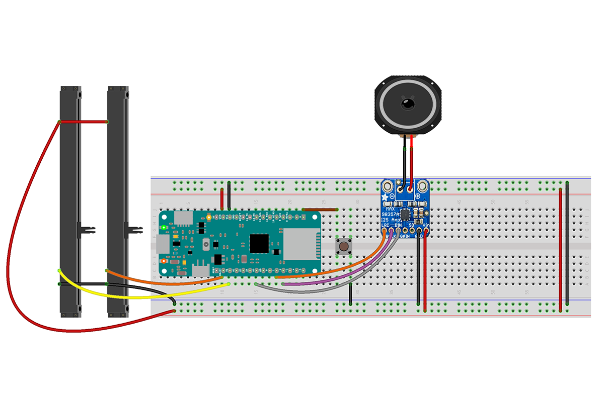

## Components and Supplies

- [Arduino MKR Zero](/hardware/mkr-zero)
- [Breadboard (generic)](https://www.newark.com/99W1759?COM=ref_hackster)
- [Jumper wires (generic)](https://www.newark.com/88W2571?COM=ref_hackster)
- [Adafruit MAX98357A](https://www.adafruit.com/product/3006)
- [Speaker: 3W, 4 ohms](https://www.adafruit.com/products/1314)
- [RobotGeek Slider](https://www.robotgeek.com/robotgeek-slider)

## Apps and Online Services

- [Arduino IDE](https://www.arduino.cc/en/main/software)
- [Arduino Web Editor](https://create.arduino.cc/editor)

## About This Project

### Arduino I2S Library

The new [Arduino I2S library](https://www.arduino.cc/en/Reference/I2S) allows you to send and receive digital audio data on the I2S bus. This example aims to show how to use this library to drive an I2S DAC to reproduce sound computed within the Arduino sketch.

For more information about the library and how it works read the library page.

## I2S Connections

The I2S DAC used in this example needs only 3 wires for the I2S bus (plus power supply). Connections for the I2S on the Arduino MKRZero are the following:

* SD (Serial Data) on pin A6;
* SCK (Serial Clock) on pin 2;
* FS (Frame or Word Select) on pin 3;

### Schematics

## Code

<iframe src='https://create.arduino.cc/editor/Arduino_Genuino/5574e381-3fe5-4c8f-9877-0dea97ea6ec3/preview?embed&snippet' style='height:510px;width:100%;margin:10px 0' frameborder='0'></iframe>

### How It Works

A theremin has basically two controls:

* Pitch
* Volume

In this example these two parameters are changed moving two slide potentiometers, but you can modify it to read them using for example a ping sensor! In this way your theremin will be more realistic!

The two potentiometers are wired in a voltage divider fashion, so moving them you will get (from `analogRead()`) values in the range 0 - 1023. These values are then mapped to between the minimum and maximum frequency and the minimum and maximum volume.

The sound sent on the I2S bus is a simple sine whose frequency and amplitude is changed according to the potentiometers reading. 