## Components and Supplies

- [Arduino MKR WiFi 1010](https://www.newark.com/71AC0169?COM=ref_hackster)
- [Arduino MKR Connector Carrier (Grove compatible)](https://create.arduino.cc/projecthub/products/buy/87326)
- [Seeed Grove - Dust Sensor（PPD42NS）](https://www.seeedstudio.com/Grove-Dust-Sensor%EF%BC%88PPD42NS%EF%BC%89-p-1050.html)
- [Arduino Seeed Seed - Grove - Oled Display 0.96"](https://store.arduino.cc/grove-oled-display-0-96)
- [Seeed Grove - Air quality sensor v1.3](https://www.seeedstudio.com/Grove-Air-quality-sensor-v1.3-p-2439.html)
- [Arduino USB cable type A male to micro type B male](https://store.arduino.cc/usb-cable-type-a-male-to-micro-type-b-male)

## About This Project

Do you ever worry about the air quality at home, in which we past lot of time recently, due to the pandemic?

Or in your DIY lab in the middle of 3d printers / saw / cnc / lasercutter?

With this project, we'll build an IoT Air Quality checker, so we can know in every moment of the day which are the value measured thanks to an online dashboard, that you can also share with relatives and / or friends.

### Hardware Setup

This project is based on the Arduino MKR Wifi 1010, and few other Grove components ready-to-use; the BOM is the following:

* the Arduino MKR Wifi 1010 itself
* the Arduino MKR Connector Carrier, that is used to connect easily to the Arduino board any of the hundreds Grove modules!
* the Grove Air Quality Sensor, that can detect carbon monoxide, alcohol, acetone, paint thinner, formaldehyde and other slightly toxic gases (connected to A0 port)
* the Grove Dust Sensor, that is able to detect not only cigarette smoke but also house dust which are indoor asthma triggers (connected to D0 port)
* the Grove OLED display, used to show all the values retrieved from the sensors, and other info (connected to TWI port)

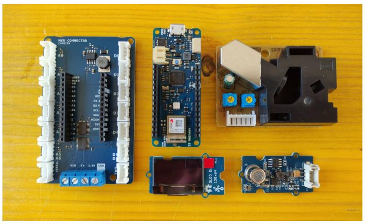

Of course you can reach the same setup using a breadboard, floating wires and spare components!

### The Board Setup

In this project we are going to use [Arduino Cloud](https://create.arduino.cc/iot), where you can create IoT applications in a few simple steps.

We can just start connecting the MKR WiFi 1010 to the Web Editor.

You can then find more information on the Web Editor setup for the MKR WiFi 1010 at [this link.](https://www.arduino.cc/en/Guide/MKRWiFi1010)

After connecting your Arduino to the usb port, be sure to have selected the right board and the right port.


At this point, since the MKR WiFi 1010 is a Cloud compatible board, we can start with the Arduino Cloud setup.

### Arduino Cloud Setup

Thanks to this platform, the dashboard creation will be really easy, and the base of the Arduino code will be auto-generated, and usable directly on the Arduino Web Editor.

This is one of the feature of Arduino Cloud, many interesting others are described in [this official blog post](https://blog.arduino.cc/2021/06/18/14-awesome-arduino-cloud-features-you-never-knew-existed)!

The very first steps to use Arduino Cloud are well described in the [official "Getting started" guide](https://docs.arduino.cc/cloud/iot-cloud/tutorials/iot-cloud-getting-started). 

First step is to create a *thing*, in which we'll configure the board we are going to use, the variables used for the measurements and the wifi credentials.


Let's start with the device:

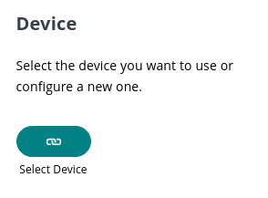

The configuration is really easy:

* Choose the board vendor (in our case it's Arduino).
* Choose which board we are going to use (we'll see already our board, If we have previously connected it to the Web Editor).
* Wait for the an update for securing the communication.
* Click the done button.

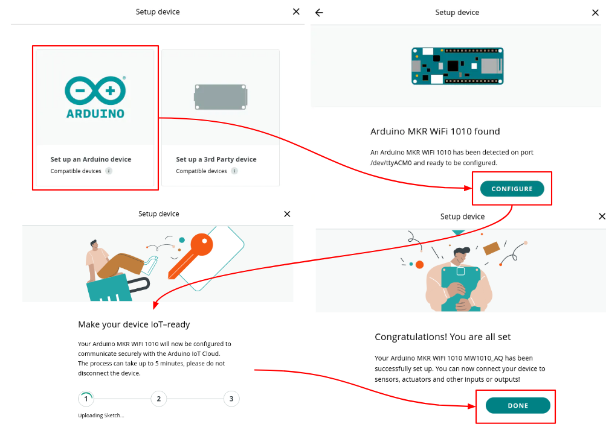

Now it's time to create the variables!

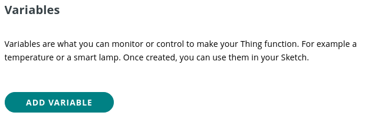

For each variable we have to define:

* The name.
* The data type - it has to be the same of the variable used in the main sketch to store the sensors' value.
* If it's read only (most of the variables are used only to show values), or if it's read & write - in this case we can interact from the dashboard with the local board.
* The update policy - in this case we'll use "on change", since we'll use a reasonable interval between variables update in the main sketch.

Let's see the creation of the variable for the Grove Air Quality Sensor. 

For this measurement we'll use an `analogRead()`.

So we'll have a value from 0 to 1023. It's an *int* value, it's *read only* on the dashboard side, and it will be updated by the sketch.

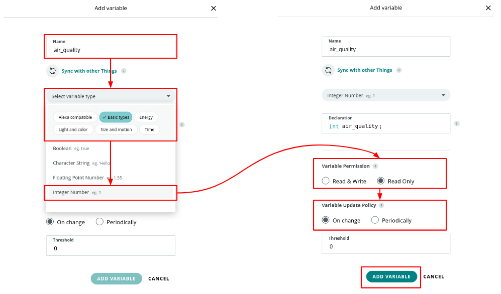

As seen in the [Grove guide](https://wiki.seeedstudio.com/Grove-Air_Quality_Sensor_v1.3/), there are a few main cases in which the measurement can be divided, to describe the air quality:

* air fresh -- indicating a good air condition
* low pollution -- indicating a rather low concentration of target gases exist.
* high pollution -- you should be aware of the pollution level and think if some measures should be taken

So let's create a *string* variable as well - to store and show the "meaningful" description.

Here the variables used for the Air Quality Sensor:

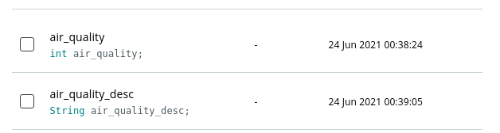

Now, it's up to the Dust Sensor.

The PM (Particulate Matter) level in the air is measured by counting the Low Pulse Occupancy time (LPO time) in given time unit, that is proportional to PM concentration. This sensor is responsive to PM of diameter 1μm.

The measurement unit is pcs/0.01cf, and it'a `float` number. Read-only, and will be update on change.

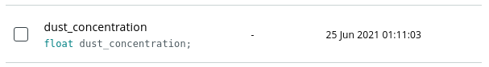

And last, create a `String` variable read & write, in order to let the dashboard user to write a text, that will be shown in the local device through the OLED display!

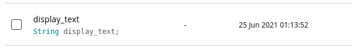

Next step is to setup the Wifi Credentials that will be used by the board to connect to the Internet and to the Arduino Cloud

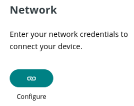

### The Auto-Generated Sketch

After creating variables, in the *sketch* section we'll find an auto-generated sketch, than we can open directly in the Web Editor by pressing the *Open full editor* button!

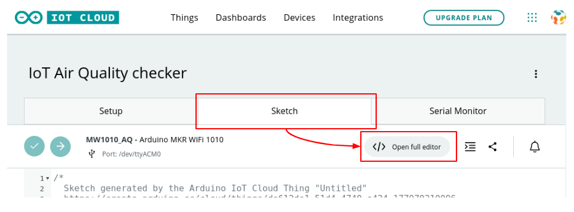

Now we continue editing the sketch in the Web Editor.

We'll find a few more tabs, in particular:

* thingProperties.h tab - that we dn't have to edit! - where we'll find the variables declared prevoiously, and the unique ID of the thing and it's properties.
* Secret tab where we'll find the WiFi credentials.

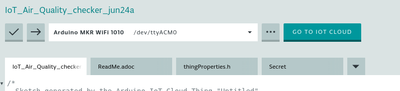

Being separated from the main sketch tab, we can share without problem our sketch: those information will not be shown, since strictly related to our own thing and wifi connection!

### Edit Sketch for Air Quality Measurements

For first add the code used for the Air Quality Sensor measurement.

We can find [here](https://seeeddoc.github.io/Grove-Air_Quality_Sensor/) a code snippet for Arduino and RaspberryPi, and we can see that the "meaningful" cases are related to different threshold:

* value > 700 means High Pollution
* value > 300 means Low Pollution
* otherwise, Air is fresh enough

After updating the `air_quality` variable, fill the `air_quality_desc` as well upon these threshold.

```arduino
air_quality = analogRead(air_quality_pin);
if (air_quality > 700) {
  air_quality_desc = "High Pollution";
} else if (air_quality > 400) {
  air_quality_desc = "Low Pollution";
} else {
  air_quality_desc = "Fresh Air";
}
```

Then we can add the code for the Dust Sensor. 

[Here](https://wiki.seeedstudio.com/Grove-Dust_Sensor/) we can find a good example on how to use it

In the header declare these variables, used for the reading interval of the sensor, and to elaborate its measurement:

```arduino
int dust_sensor_pin = 0;
unsigned long duration;
unsigned long starttime;
unsigned long sampletime_ms = 30000; //sample 30s;
unsigned long lowpulseoccupancy = 0;
float ratio = 0;
```

In the setup set `dust_sensor_pin` as INPUT and update the `starttime` variable:

```
pinMode(dust_sensor_pin,INPUT);
starttime = millis();
```

In the loop we can insert this snippet of code, in which every `sampletime_ms` we use both the air quality sensor and the dust sensor!

The dust concentration calculation is based on the same [example](https://wiki.seeedstudio.com/Grove-Dust_Sensor/) previously used:

```arduino
 duration = pulseIn(dust_sensor_pin, LOW);
   lowpulseoccupancy = lowpulseoccupancy+duration;
   if ((millis()-starttime) > sampletime_ms)
        //air quality sensor
        air_quality = analogRead(air_quality_pin);
        if (air_quality > 700) {
          air_quality_desc = "High Pollution";
        } else if (air_quality > 400) {
          air_quality_desc = "Low Pollution";
        } else {
          air_quality_desc = "Fresh Air";
        }
    
       //dust sensor
       ratio = lowpulseoccupancy/(sampletime_ms*10.0);  // Integer percentage 0=>100
       dust_concentration = 1.1*pow(ratio,3)-3.8*pow(ratio,2)+520*ratio+0.62; 
       lowpulseoccupancy = 0;
       starttime = millis();
   }
```

### Oled Display

Now we can go on with the Oled Display.

We'll use it to display measurements, but because of we'll have a shared dashboard, we could use it to visualize messages from the online dashboard! 

We have to use the *Grove Oled Display 0.96* library, and we can install it from the Library Manager. Just search for "oled" and then star the library, in order to have it available! 

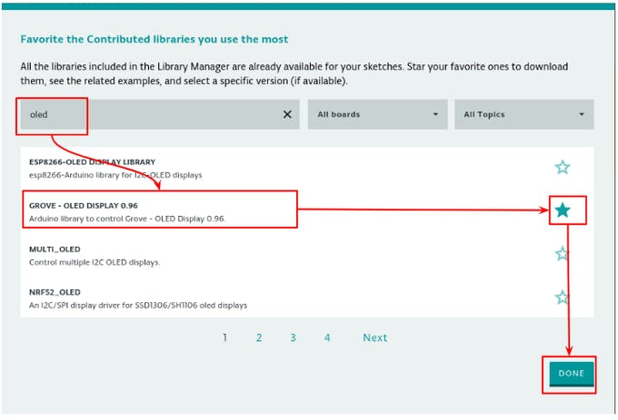

We'll find all the needed code in the **OLED_Hello_World** example.

This display is able to show up to 8 rows, 16 chars each. In order to visualize information in the display, we have to place it using *XY* coordinate, where the top left corner is **X0**, **Y0**, and X is for the columns and Y for the rows

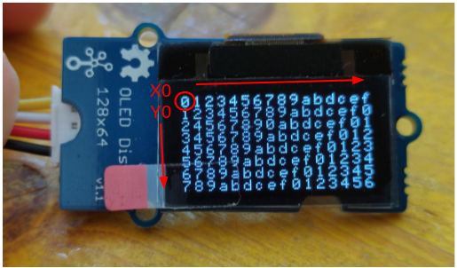

Let's start including the required libraries in the header:

```arduino
#include <Wire.h>
#include <SeeedOLED.h>
```

Let's create a char array variable used for the conversion of all the `String` variables we want to display on the OLED:

```  arduino
//max chars per row: 16, plus 1 char for string termination
char oled_text[17]; 
```

and then initialize the display in the setup and clear it at least at the beginning:

```  arduino
Wire.begin();
SeeedOled.init();
SeeedOled.setNormalDisplay();      //Set display to normal mode
SeeedOled.setPageMode();           //Set addressing mode to Page Mode
SeeedOled.clearDisplay();          //Clear the display
```

Let's print on the display a welcome message too, with the name of the project (the spaces are used to align the text):

```  arduino
 SeeedOled.setTextXY(0, 0);
 SeeedOled.putString("IOT AIR QUALITY");
 SeeedOled.setTextXY(1, 0);
 SeeedOled.putString("   CHECKER"); 
```

Now we can use the OLED in our loop.

We'll display the measurements, and if there's available a message from the dashboard, it will be shown!

For every element we want to display, we have to specify :

- the type (String / int / float) using the  `putString()`, `putNumber()`, `putFloat()` functions.

- the row and the column where we want it to appear using the `setTextXY`() function.

Every time we want to update a value in the OLED, we have to `clear` it from the previous written values.

In order to do this, instead to use the `clearDisplay()` function, we clear the specific row by putting a string of spaces. 

Let's create an easy function for this:

```arduino
void clearRow(int row) {
 SeeedOled.setTextXY(row, 0);
 SeeedOled.putString("                     ");
}
```

That's useful considering that we are going to update different rows in different moment:

- the rows used to show the measurements will be updated every `sampletime_ms`

- the rows used to show the custom message will be updated every time someone will write a message on the dashboard.

So in the `if` in which we do the measurements, we can add these rows:

```arduino
 //1^, 2^ & 3^ rows: the air quality value and description.
   clearRow(0);
   SeeedOled.setTextXY(0, 0);
   SeeedOled.putString("AIR QUALITY:");
   
   air_quality_desc.toCharArray(oled_text, 64);
   clearRow(1);
   SeeedOled.setTextXY(1, 0);
   SeeedOled.putString(oled_text);
   clearRow(2);
   SeeedOled.setTextXY(2, 0);
   SeeedOled.putNumber(air_quality);
   //4^ & 5^ rows: the dust sensor
   SeeedOled.setTextXY(3, 0);
   SeeedOled.putString("DUST pcs/0.01cf:");
   clearRow(4);
   SeeedOled.setTextXY(4, 0);
   SeeedOled.putFloat(dust_concentration);
```

The [toCharArray()](https://www.arduino.cc/reference/en/language/variables/data-types/string/functions/tochararray/) function is used to convert each String variable in a char array, in order to print them in the display with the `putString()`.

For the custom message we have 3 rows available; the first will be used as description, and the last 2 for the message itself.

Each row can display 16 characters, so we'll have to split the message in chunks of that dimension using the [substring()](https://www.arduino.cc/reference/en/language/variables/data-types/string/functions/substring/) function. 

For this we use a `for` loop, shifting of 16 chars in each iteration (2 at the moment).

```arduino
 //6^, 7^ & 8^ rows: message
 SeeedOled.setTextXY(5, 0);
 SeeedOled.putString("LAST MSG:");
 for (int i=0; i< 2; i++) {
   clearRow(6 + i);
   SeeedOled.setTextXY(6 + i, 0);
   String subString = display_text.substring(i * 16, (i * 16) + 16);
   subString.toCharArray(oled_text, 17);
   SeeedOled.putString(oled_text);
 }
 display_text = ""; 
```

In this gallery the OLED display e few seconds after reset, in normal usage, and after receiving a message from the dashboard:

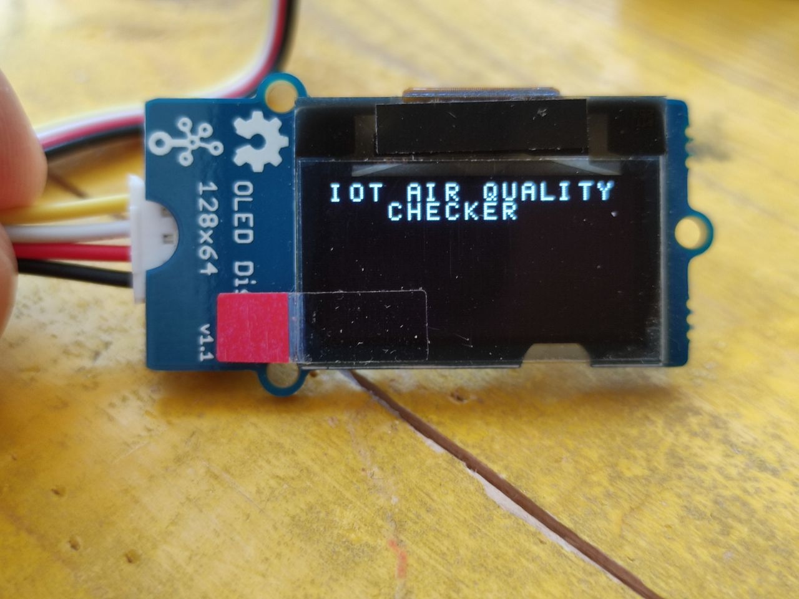


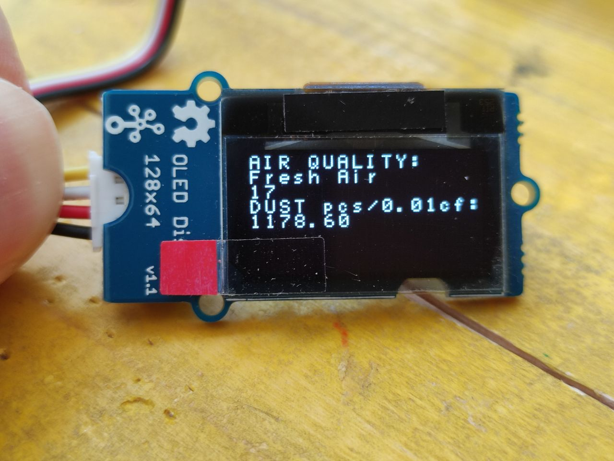


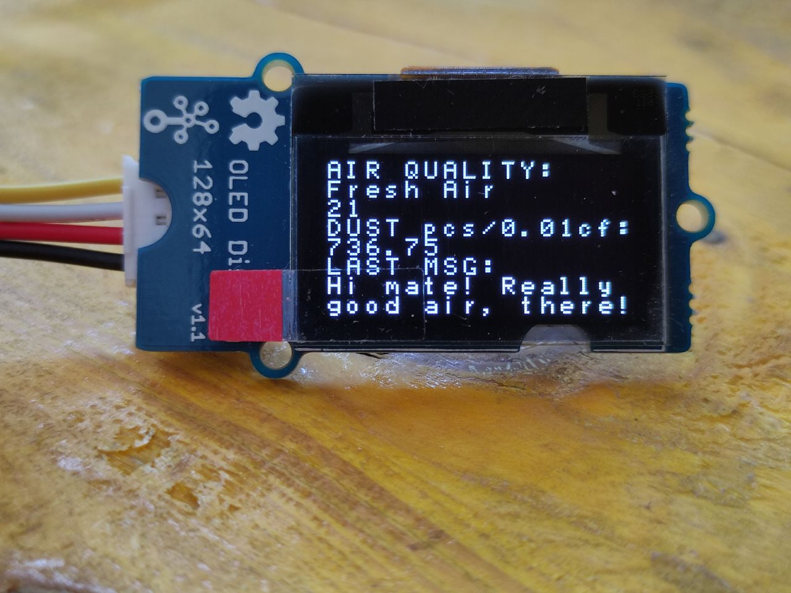


That's it! the complete sketch can be found below.

## Complete Sketch

<iframe src='https://create.arduino.cc/editor/FabLab_CastelfrancoVeneto/1db87e24-26b7-4e61-b76e-a0bf210b7ddb/preview?embed&snippet' style='height:510px;width:100%;margin:10px 0' frameborder='0'></iframe>


### Edit the Dashboard

Last step is to create a custom Dashboard.

Just press the **Go to IoT Cloud** button to switch from the Web Editor to the Arduino Cloud.

Here switch to the Dashboards menu, and then *BUILD DASHBOARD*

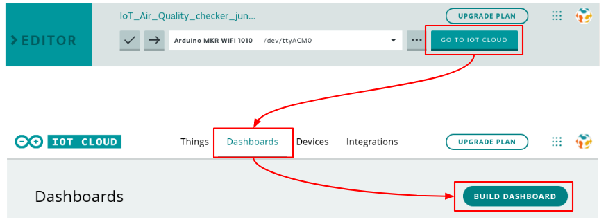

Now we can start building the new dashboard, switching in edit mode.

We can add a single widget, or a set of standard widget based on the things' variables.

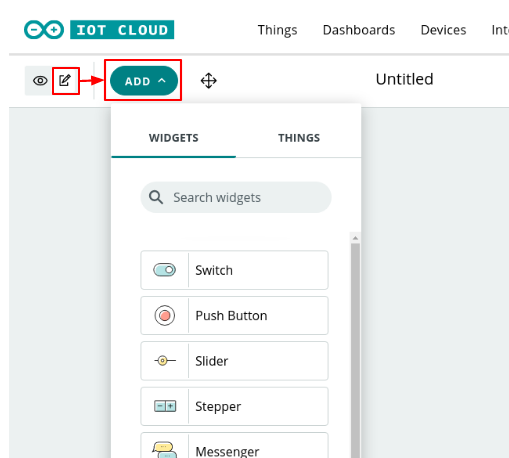

Once chosen the widget, we can configure it with Name, and link it to a variable.

We'll choose **Value** widget to show:

* Air quality, meaningful value (explained in the pics below)
* Dust concentration, numeric value
* Text that will be forwarder to the local display

and **Chart** widget to show:

* Air quality, numeric value
* Dust concentration, numeric value

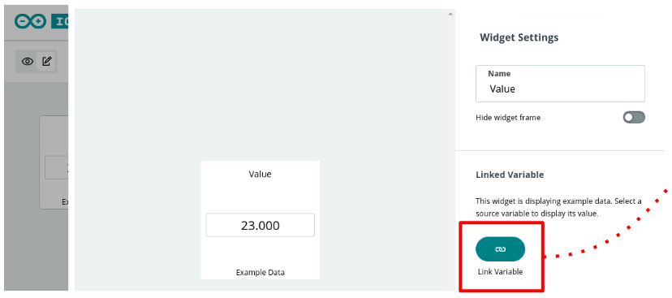


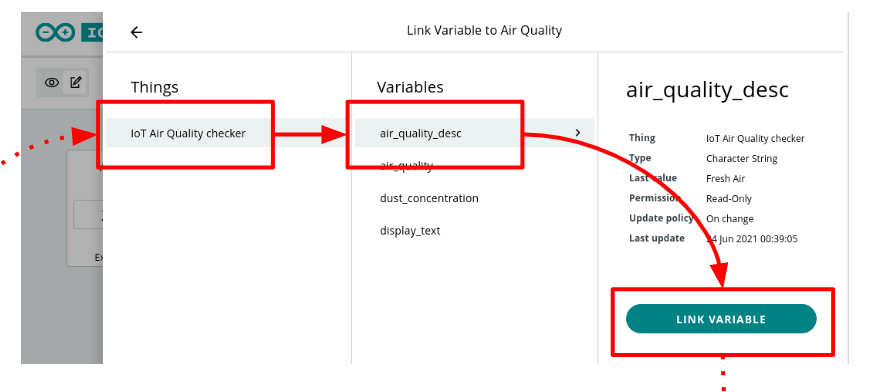


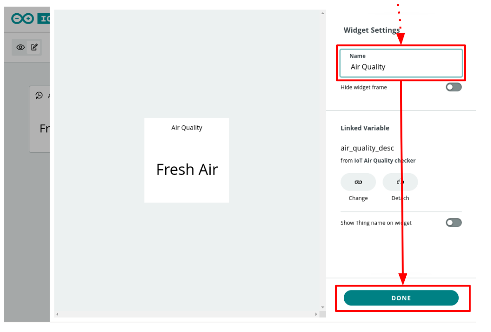


After choosing all the widgets and linked all the variables to them, it's time to work on the layout!

Keep the **Edit mode** on, and click on the **arrows** icon: we'll be able to drag'n'drop the widget and to change their size.

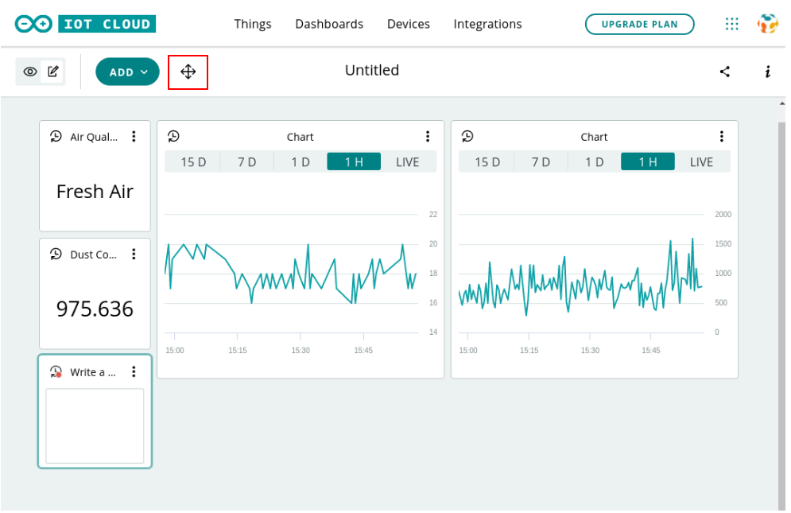


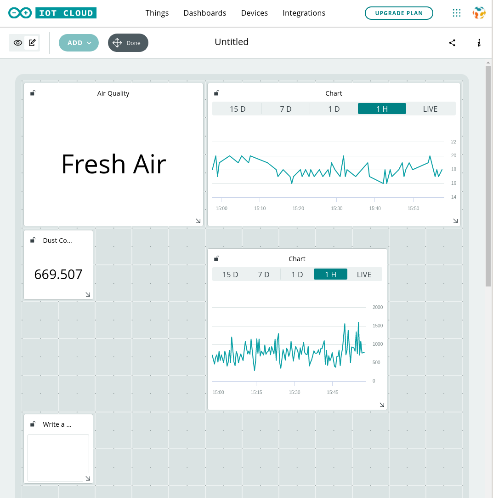


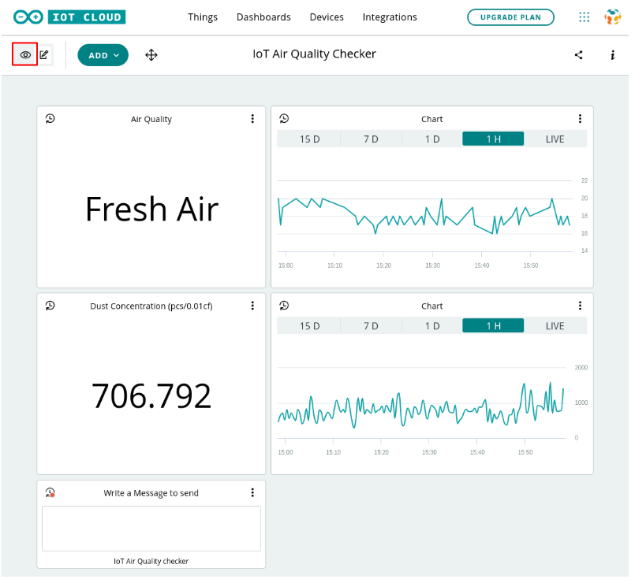


Now you can share your dashboard with other Arduino IoT users, and let them see the air quality of your place / lab / whatever! They will be allowed to send you a message as well, using the widget titled "Write a Message to Send".

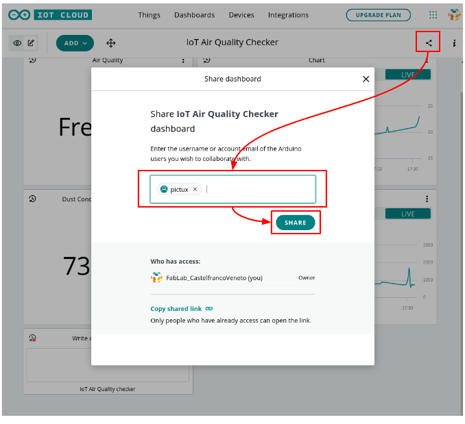

### Next Steps

Don't stop now, and go on creating and inventing interactive circuits and dashboard to share! 

You could connect your app to external services using the [webhook](https://support.arduino.cc/hc/en-us/articles/360016119339-Available-Webhook-Platforms)!

Or maybe build a portable Air Quality Checker kit, and together with geolocalization data create a map of the most polluted (or most clear!) area!
