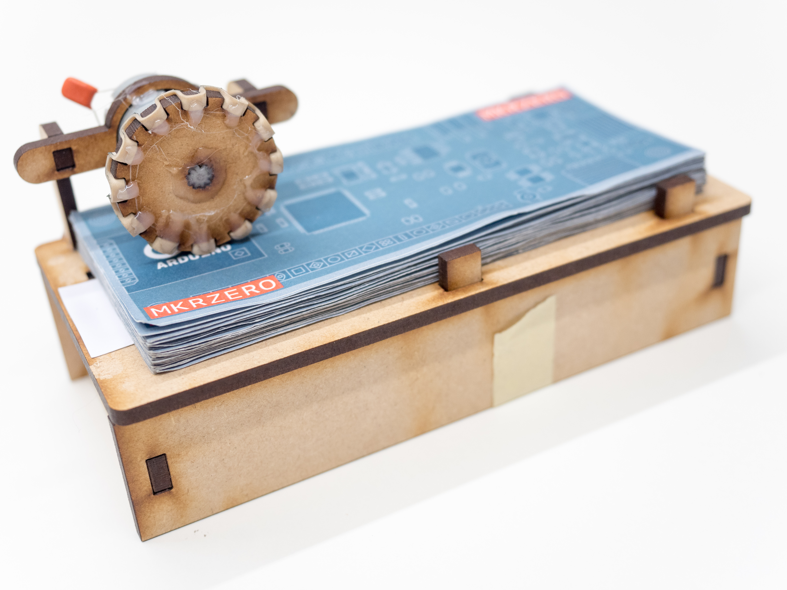
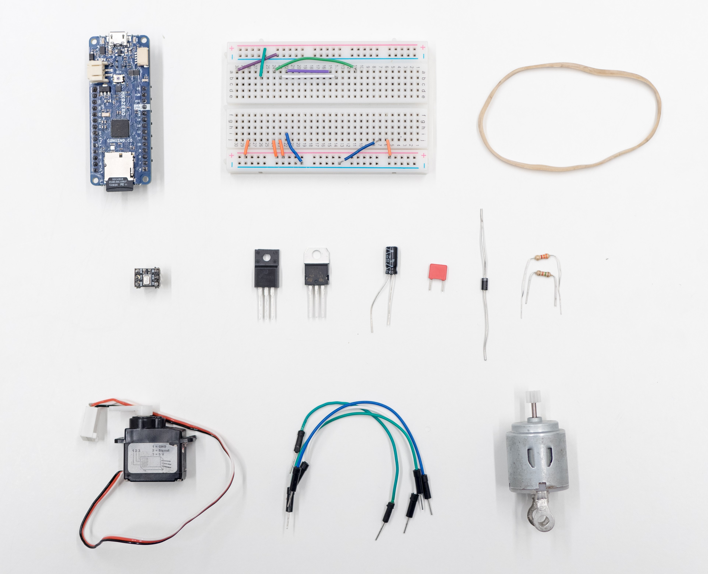
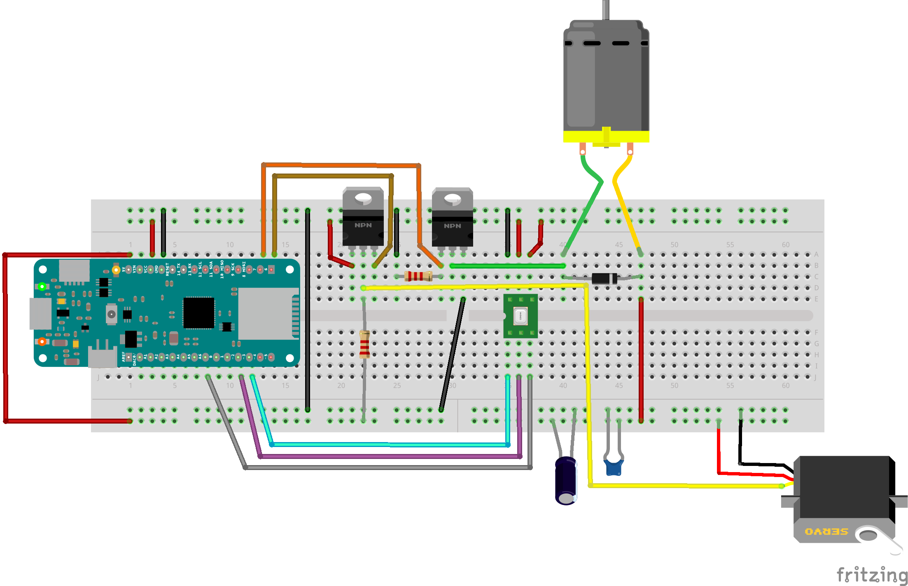
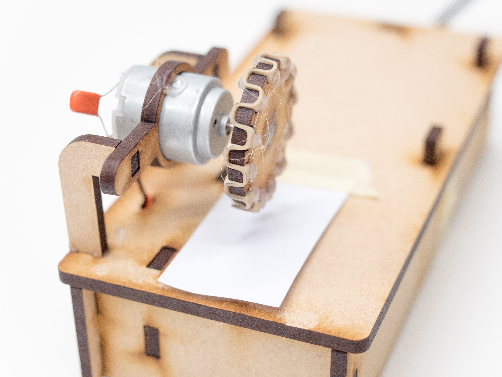
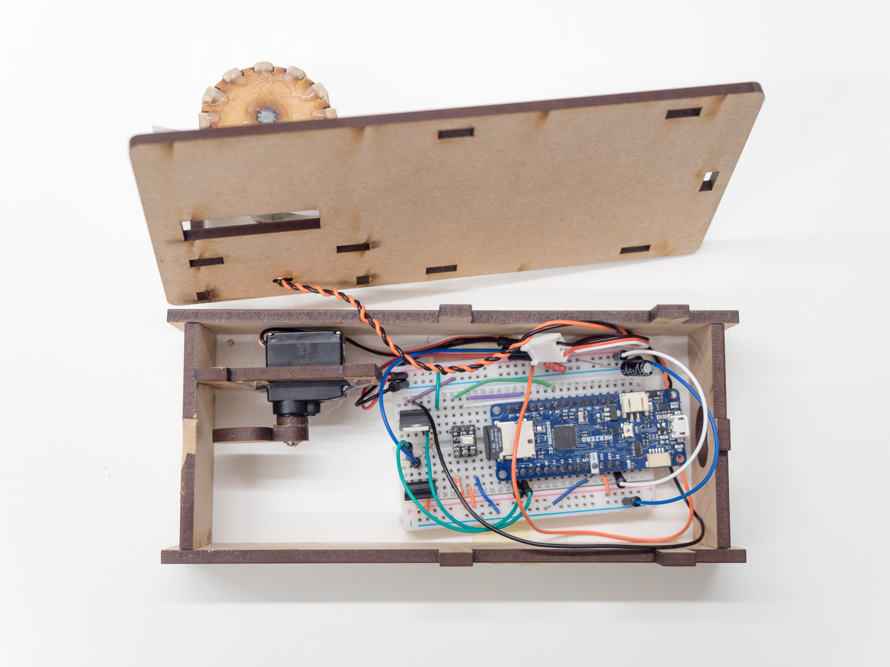

## Components and Supplies

- [Arduino MKR Zero](/hardware/mkr-zero)
- Medium breadboard
- [Jumper Wires](https://store.arduino.cc/products/breadboard-jumper-wire-pack-200mm-100mm)
- [Diode](https://store.arduino.cc/product/C000018)
- Mosfet N-Channel
- ICS43432 I2S digital microphone
- [micro servo motor+ DC motor](https://store.arduino.cc/product/c000044)
- 0.1 uF ceramic capacitor
- 100 uF electrolitic capacitor
- 2.2Kohm resistor
- Rubber band

## Necessary Tools and Machines

- Laser cutter (Generic)

## Apps and Online Services

- [Arduino IDE](https://www.arduino.cc/en/main/software)
- [Arduino Web Editor](https://create.arduino.cc/editor)

## About This Project

### Introduction 

With this project, you will be able to create a fun **Make it rain** clap machine. To activate the machine just clap your hands and the machine will start running! The sketch uses the new [ArduinoSound library](https://www.arduino.cc/en/Reference/I2S) to interface with an I2S digital microphone. A DC motor and a standard servo motor are used to push the money out. We used a laser cutter to make the MDF pieces for the box. A rubber band and a little bit of hot glue and your machine will be ready to go. Check the video below to see it in action! 

### Hardware

To run the sketch of the Make-it-Rain machine we use an Arduino MKRZero board. The small form factor will help us in hiding the board inside the box. In order to detect the clapping we are using a ICS43432 I2S digital microphone. To turn on the DC motor we use an N-Channel MOSFET, a diode and a 2.2Kohm pull down resistor. To provide the 5V PWM signal to the servo motor we use an N-Channel MOSFET and a 2.2Kohm pull up resistor. You will need a small breadboard and some jumper wires to make the connections. To block the noise from the DC motor that might interfere with the servo we use a 0.1uF and a 100uF capacitor.

You can power everything from your computer via USB or if you want to make it portable, you can use a LiPo battery to the MKRZero and an external battery to give the motor extra power.

Component list

### Connecting the Electronics

The I2S DAC used in this example needs only 3 wires for the I2S bus (plus power supply). Connections for the I2S on the Arduino MKRZero are the following:

* SD (Serial Data) on pin A6
* SCK (Serial Clock) on pin 2
* FS (Frame or Word Select) on pin 3

Follow the diagram to build your circuit. Notice that in order to make the diagram more clear we used a full size breadboard that will not fit into the box. Use a medium size breadboard instead. 

## Uploading the Code

Okay, now you should have all the electronics in place. It's time to upload the sketch to the MKRZero board. For this project you will need the new [AudioSound library](https://www.arduino.cc/en/Reference/I2S), make sure you have it in libraries->ArduinoSound. The library will allow us to decode the I2S message from the digital microphone. Now you need to download the sketch for the Make-it-Rain clap machine and place it in the sketchbook folder. 

You can find the sketch and schematics below. Open your Arduino IDE and use the Boards Manager to install the MKRZero board. Once installation is finished you should be able to select the MKRZero board from the menu Tools->Board. Now connect the MKRZero to your computer using the USB cable. In the IDE, go to `File->Sketchbook->MKRZero_MakeItRainMachine` and open the sketch. Compile and upload to the board!

## Code 

<iframe src='https://create.arduino.cc/editor/Arduino_Genuino/381d524a-61c4-404f-b3c0-38b5c6958d3e/preview?embed&snippet' style='height:510px;width:100%;margin:10px 0' frameborder='0'></iframe>

## Schematics

## Assembling the Make-It-Rain Box

To assemble the Make It Rain box:

**Note**: You will need to adjust the pieces to fit your particular components. Use hot glue to secure any loose parts. 

**You can find the laser cutter template [here!](https://hacksterio.s3.amazonaws.com/uploads/attachments/234082/I6neCvVZL9MBbADnderV.rar)**

* Lasercut the pieces out of 4 mm MDF.
* Take a rubber band and weave it into the spokes of the wheel as shown in the photo.
* Attach the wheel to the DC motor gear.
* Take the lifting arm and glue on the round gear holder.
* Attach the lifting arm to the micro servo.
* Place the DC motor and micro servo into their respective holders.
* Assemble the base of the box and lid with the DC motor arms.
* Cut a small piece of card stock and tape it over the lifting arm slot as shown in the photo.
* Assemble the electronics and connect the motors.
* Upload the code.
* Place bills onto the Make It Rain box and test!
  

Make it Rain!