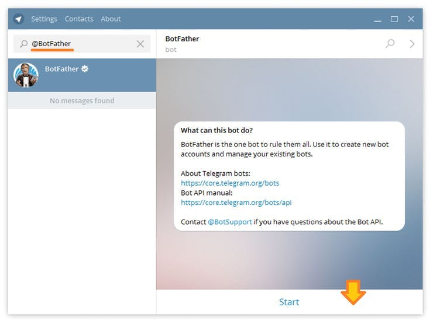
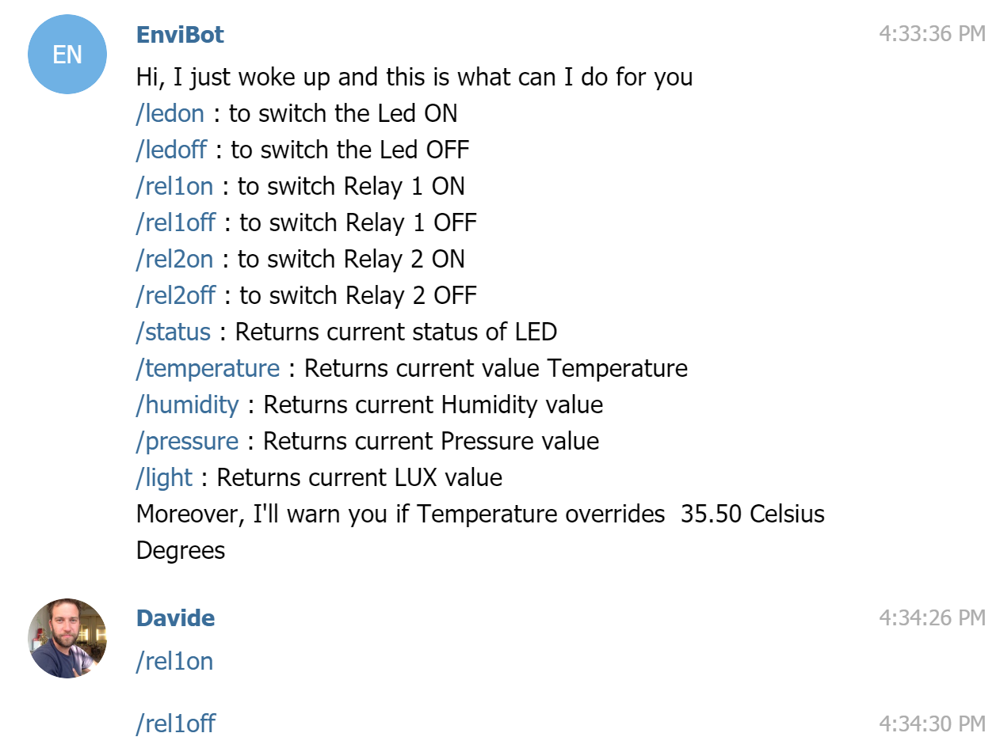

## Components and Supplies

- [Arduino MKR IoT Prime Bundle](https://www.distrelec.biz/en/mkr-iot-prime-bundle-arduino-akx00018/p/30142238?ext_cid=bmnlbbazzen-ArduinoNPI&cw=1924)

## Apps and Online Services

- [Telegram](http://telegram.org)

## About This Project

In this tutorial, we'll toy around the new IoT Cloud Kit from Arduino, featuring (among LEDs, breadboards, LEDs & wires) a [MKR WiFi 1010](https://store.arduino.cc/mkr-wifi-1010), the [Environmental Shield ](https://store.arduino.cc/mkr-env-shield)and the [MKR Relay Proto Shield](https://store.arduino.cc/mkr-relay-proto-shield).

We are going to make the data collected by the board accessible through a **conversational UI**. We'll be using **Telegram**, so you'll need to set up an account on that chat service (you are going to need a mobile phone number as well). 

* We are going to use **Universal Telegram Bot** library by Brian Lough together with **ArduinoJson** library written by Benoît Blanchon.
* We are going to be notified if a specific sensor (in this example is `t` for temperature) goes over `temp_limit`, 35.5.
* We are going to have full control on the built-in LED on the Arduino and on the two **RELAYs** on the board.

Wow! Let's start toying the boards. 

### Create a New TelegramBot Using BotFather

Be sure you have installed Telegram on your phone or your laptop, then, in the search bar, look for @botfather.



Talk to him and use the **/newbot** command to create a new bot. The BotFather will ask you for a name and username, then generate an authorization token for your new bot. The **Name** of your bot will be displayed in contact details and elsewhere. The **Username** is a short name, to be used in mentions and telegram.me links. Your bot's username **must** end in ‘bot’, e.g. ‘tetris_bot’ or ‘TetrisBot’.

Open `Universal TelegramBot > 101 > Echobot.ino`.

Since this code relies on another Wifi Library, we'll have to change the 

```arduino
#include <WiFi101.h>
```

to 

```arduino
#include <WiFiNINA.h>
```

Or even add this magic piece of code that would make the Arduino IDE call which of the two libraries based on the target board specified. 

```arduino
// This header is used to tell the Arduino IDE
// to compile with the proper WIFI Library 
// between MKR1000 and MKR1010  
#ifdef ARDUINO_SAMD_MKRWIFI1010
#include <WiFiNINA.h>
#elif ARDUINO_SAMD_MKR1000
#include <WiFi101.h>
#else
#error unsupported board#endif
```

Now, if you updated the WiFi SSID and password, together with a valid bot token you should be replied with your latest message. Let's add the data. 

Important! In order to make the BOT talking to you (and just to you!) you need to sort out you `chat_id `(the number that Telegram assigns to the conversation between you and your BOT) 

You can discover this by adding this string to the `HandleNewMessages` function.

```arduino
 Serial.println(chat_id);
```

 Keep this code for you, and add it in the final code as `Mychat_id` String defined at the beginning of the sketch.

### Environmental Data in the Replies

We are going to create a string that will be sent as an answer. We are going to store all the important information in the data string.

```arduino
/*
 MKR ENV Shield - Read Sensors
 This example reads the sensors on-board the MKR ENV shield
 and prints them to the Serial Monitor once a second.
 The circuit:
 - Arduino MKR board
 - Arduino MKR ENV Shield attached
 This example code is in the public domain.
*/
  
#include <Arduino_MKRENV.h>
#include <WiFiSSLClient.h>
  
#include <UniversalTelegramBot.h>
#ifdef ARDUINO_SAMD_MKRWIFI1010
#include <WiFiNINA.h>
#elif ARDUINO_SAMD_MKR1000
#include <WiFi101.h>
#else
#error unsupported board
#endif
  
// Initialize Wifi connection to the router
char ssid[] = "SSIDName"; // your network SSID (name)
char password[] = "SSIDKey";  // your network key
#define BOTtoken "BotToken" // your Bot Token (Get from Botfather)
  
  
WiFiSSLClient client;
  
UniversalTelegramBot bot(BOTtoken, client);
int Bot_mtbs = 1000; //mean time between scan messages
long Bot_lasttime;   //last time messages' scan has been done
  
void setup() {
 Serial.begin(115200);
 while (!Serial);
 if (!ENV.begin()) {
   Serial.println("Failed to initialize MKR ENV shield!");
   while (1);
 }
 delay(100);
 // Attempt to connect to Wifi network:
 Serial.print("Connecting Wifi: ");
 Serial.println(ssid);
 while (WiFi.begin(ssid, password) != WL_CONNECTED) {
   Serial.print(".");
   delay(500);
 }
 Serial.println("");
 Serial.println("WiFi connected");
 Serial.println("IP address: ");
 IPAddress ip = WiFi.localIP();
 Serial.println(ip);
}
void loop() {
 Serial.print("Temperature = ");
 Serial.print(ENV.readTemperature());
 Serial.println(" °C");
 Serial.print("Humidity    = ");
 Serial.print(ENV.readHumidity());
 Serial.println(" %");
 Serial.print("Pressure    = ");
 Serial.print(ENV.readPressure());
 Serial.println(" kPa");
 Serial.print("Lux .       = ");
 Serial.println(ENV.readLux());
 Serial.print("UVA         = ");
 Serial.println(ENV.readUVA());
 Serial.print("UVB         = ");
 Serial.println(ENV.readUVB());
 Serial.print("UV Index    = ");
 Serial.println(ENV.readUVIndex());
 Serial.println();
 delay(1000);
 String data = "Hey! Temperature is " + String(ENV.readTemperature()) + " C, " + " Humidity is " + String(ENV.readHumidity()) + "%";
 if (millis() > Bot_lasttime + Bot_mtbs)  {
   int numNewMessages = bot.getUpdates(bot.last_message_received + 1);
   while (numNewMessages) {
     Serial.println("got response");
     for (int i = 0; i < numNewMessages; i++) {
       Serial.println(bot.messages[i].chat_id);
       bot.sendMessage(bot.messages[i].chat_id, bot.messages[i].text, "");
       bot.sendMessage(bot.messages[i].chat_id, data, "");
     }
     numNewMessages = bot.getUpdates(bot.last_message_received + 1);
   }
   Bot_lasttime = millis();
 }
}
```

## Complete Sketch

<iframe src='https://create.arduino.cc/editor/officine-innesto/777a9743-2a8f-47ac-8d51-a924ffec6773/preview?embed&snippet' style='height:510px;width:100%;margin:10px 0' frameborder='0'></iframe>


### Adding the Relays

The MKR Relay Proto Shield has two relays on pin 1 and 2. We are going to add them. I have adapted this needs to a very powerful conversational UI example made by [Giancarlo Bacchio and Brian Lough for the Universal Telegram Bot Library ](https://github.com/witnessmenow/Universal-Arduino-Telegram-Bot/tree/v1.1.0/examples/101/FlashledBot)

Feel free to change `bot_name` to match the name of your real bot! Have fun!

