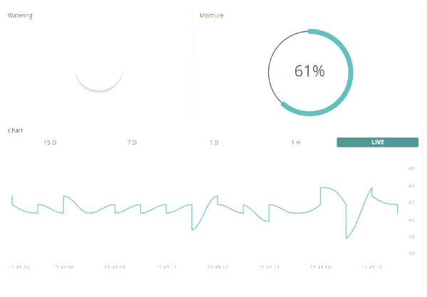
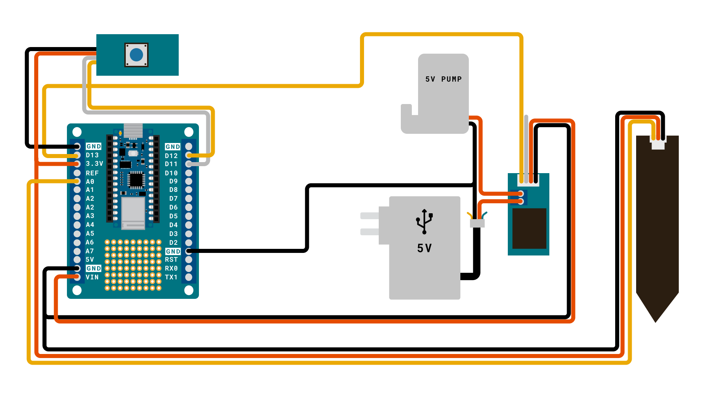
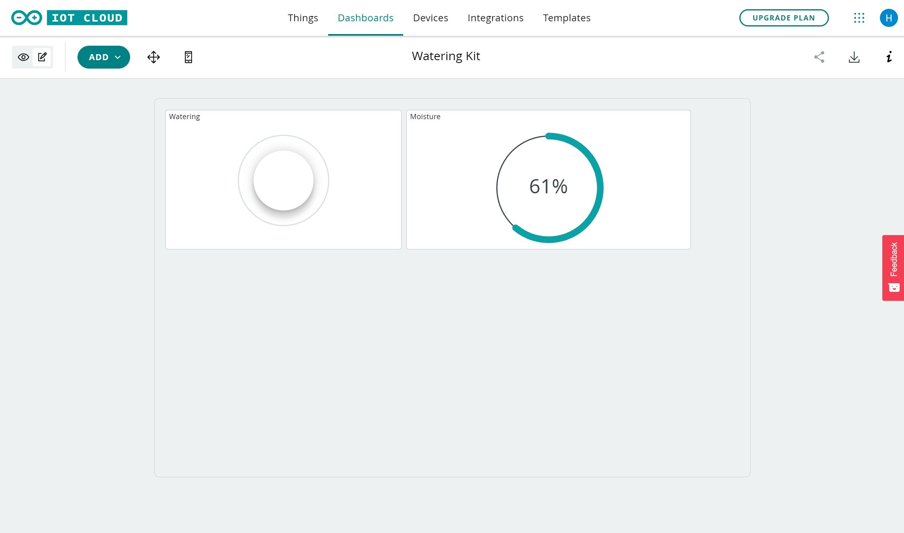
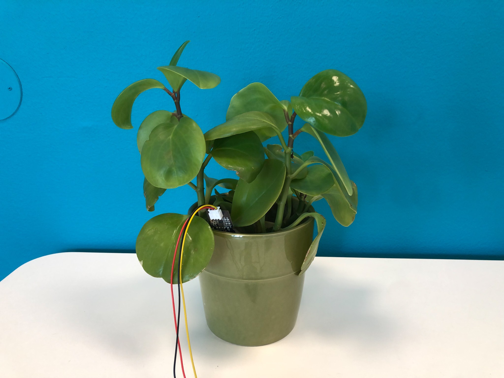
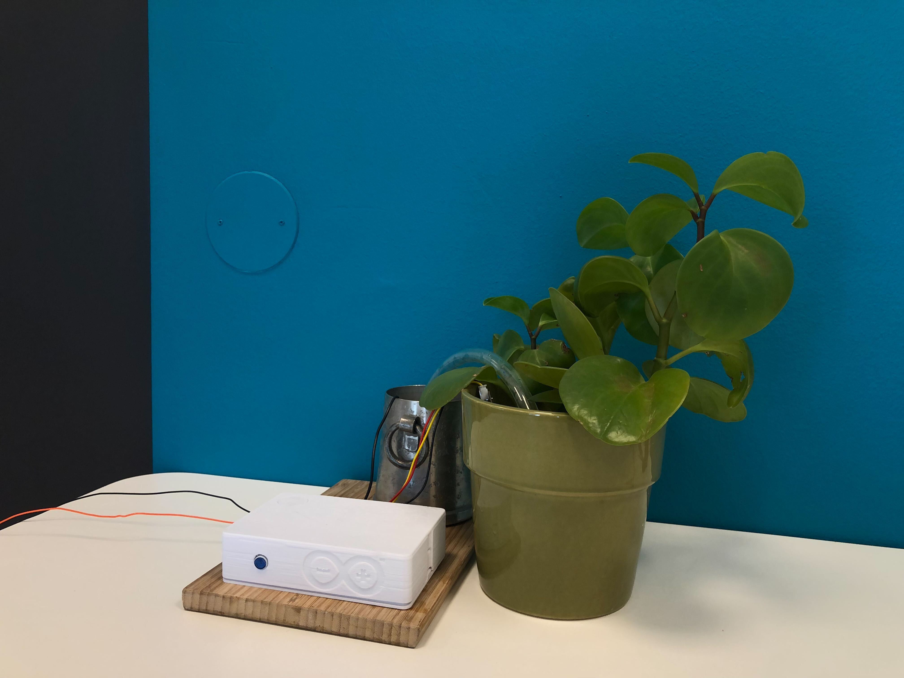

Decorating your home with plants is an easy way to bring some life into your day-to-day. The only problem is - those plants need water to survive, and if you forget to pay attention to them for a while you may need to start over. So instead of staying ever vigilant, why not spend an afternoon creating a setup that will let you both monitor the amount of moisture in your plants soil, and water your plants from afar using the [Arduino IoT Cloud](https://docs.arduino.cc/cloud/iot-cloud)?

## How It Works

Attaching an external relay to the Nano 33 IoT screwterminal lets you control circuits that are powered separately. In this tutorial we will be using a relay module attached to the Nano Screw Terminal Shield to control a pump, providing water for one of our plants from the Arduino IoT Cloud thanks to the functionality of the [Arduino Nano 33 IoT](https://store.arduino.cc/products/arduino-nano-33-iot). 

We will also connect a soil moisture sensor creating a sophisticated smart garden setup, capable of:

- Remote watering of a plant **(with a pump)**.
- Checking the moisture of your plant **(with a moisture sensor)**.
- Tracking this data over time, creating a chart documenting your plants moisture levels. 



## Hardware & Software Needed

- [Nano Plant watering kit](URL) 
- [3D-printed enclosure (optional)](DOWNLOAD-LINK)
- USB - wall adapter

OR

- [Arduino Nano 33 IoT](https://store.arduino.cc/products/arduino-nano-33-iot)
- [Arduino Nano Screw terminal Shield](URL)
- 5V submersible pump.
- 1 meter watering pipe.
- USB wall adapter
- Water container.
- Micro-USB cable.
- Open ended USB Cable.
- [Soil moisture sensor](https://store.arduino.cc/products/grove-moisture-sensor).
- Grove LED button
- [3D-printed enclosure](DOWNLOAD-LINK) (optional)
- Grove cables

### Apps and Online Services

- [Arduino IoT Cloud](https://docs.arduino.cc/cloud/iot-cloud)

## Hardware & Circuit Assembly

Begin by connecting the Nano 33 IoT board to the screwterminal. Then we need to connect the relay, the pump, the button, and most importantly the power cable to power the entire system. The screw terminals on the shield are great for sturdily attaching wires to your Arduino board without needing to solder, just feed the wires into the hole on the side and clamp it down by tightening the related screw.

Take the open ended USB cable and connect the positive wire (+) to the VIN pin and the negative wire (-) to GND. The USB-cable can then be plugged into any USB port, on a laptop, or in a wall-adapter, as long as it can provide at least 500 mA at 5V. Most wall-adapters meet these requirements, so don't worry too much about finding the right one. 

Next, take the pump and connect the negative wire (-) to GND on the Nano Screw Terminal Shield and connect the positive wire (+) to one of the screw terminals in the relay module, it doesn't matter which one. 

Now connect the other screw terminal on the relay module to the VIN pin.

There are cases were multiple wires are going into the same screw terminal, you may find it easier to get them in at the same time if you twist them together before trying to insert them.


<br />

The open ended grove cable from the relay module should be wired as follows:

- Black wire (-) to GND pin.

- Red wire (+) to A7 pin.
- Yellow wire to D13 pin.

 <br />

The grove button should be wired as follows:

- Black wire (-) to GND pin.

- Red wire (+) to 3.3V pin.

- Yellow wire to D12 pin.

- White wire to D11 pin.

<br />

The moisture sensor should be wired as follows:

- Black wire (-) to GND pin. 

- Red wire (+) to 3.3V pin.

- Yellow wire to A0 pin.

<br />

### Circuit

Below is the complete circuit for this setup.



If you are using the 3D-printed enclosure we provide a 3D-model for, now is a good time to fit the components inside if you haven't already. Use the standoffs to click the components into place.

In the top-cover of the enclosure you will find a hole that will fit the LED-Button. Simply push the button into place, it might take a little force but it will firmly click into place.

We recommend gathering the cables that will leave through the opening, and zip-tying them to the bottom of the enclosure using the two slits in the bottom-plate, this way it stays organised and is a little bit easier to close.


## IoT Cloud Setup

***If you are new to the Arduino IoT Cloud, please refer to the [Getting Started Guide](https://docs.arduino.cc/cloud/iot-cloud/tutorials/iot-cloud-getting-started) or visit the [full documentation](https://docs.arduino.cc/cloud/iot-cloud) to learn more about the service.*** 

Begin by navigating to the [Arduino IoT Cloud](https://create.arduino.cc/iot/things). You will need to have a registered account with Arduino to use it. Follow the steps below to set up the Arduino IoT Cloud. 

**1.** Create a new Thing, and select/configure the Nano 33 IoT board. Note that the board needs to be connected to your computer during this setup.

**2.** Create variables according to the table below:

| Name        | Data Type | Function                               | Permission   |
| ----------- | --------- | -------------------------------------- | ------------ |
| watering    | boolean   | Activate / de-activate pump            | Read & Write |
| waterTime   | int       | How long the pump should run (seconds) | Read & Write |
| moisture    | int       | Read moisture                          | Read Only    |

**3.** Enter your credentials to your Wi-Fi network in the network section. 

**4.** Your Thing overview should now look like the following:


**5.** Go to the sketch tab, and use the following code:

```arduino
/* 
 Nano 33 IoT smart garden kit 

 A setup that allows for remote/local control of a pump, as well as reading sensors.

 Built using the Arduino IoT Cloud service

 Components used:
- Arduino Nano 33 IoT
- Arduino Nano Screw terminal Shield
- 5V submersible pump
- 1 meter watering pipe
- Water container
- USB wall adapter
- Micro-USB cable
- Open ended USB Cable
- Soil moisture sensor
- Grove LED button
- 3D-printed enclosure 
- Grove cables
*/

/* ------------- START CONFIG ------------- */
constexpr int BUTTON_PIN = 4;
constexpr int LED_PIN    = 5;
constexpr int RELAY_PIN  = 6;
constexpr int MOIST_PIN  = A0;


int raw_moisture = 0;
/* ------------- END CONFIG ------------- */

#include "thingProperties.h"
#include <Bounce2.h>

Bounce b;
unsigned long startedWatering;

void setup() {
  Serial.begin(9600);
  delay(1500);

  b.attach(BUTTON_PIN,INPUT_PULLUP);
  b.interval(25);
  pinMode(LED_PIN, OUTPUT);
  pinMode(RELAY_PIN, OUTPUT);

  // Make sure the pump is not running
  stopWatering();

  // Connect to Arduino IoT Cloud
  initProperties();
  ArduinoCloud.begin(ArduinoIoTPreferredConnection);
  setDebugMessageLevel(4);
  ArduinoCloud.printDebugInfo();

  // Blink LED to confirm we're up and running
  for (int i = 0; i<=4; i++) {
    digitalWrite(LED_PIN, HIGH);
    delay(200);
    digitalWrite(LED_PIN, LOW);
    delay(200);
  }

}

void loop() {
  ArduinoCloud.update();
  
  // Read the sensor and convert its value to a percentage 
  // (0% = dry; 100% = wet)
  raw_moisture = analogRead(MOIST_PIN);
  moisture = map(raw_moisture, 610, 90, 0, 100); 
  Serial.println(moisture);

  // Set the LED behavior according to the moisture percentage or watering status
  if (watering) {
    digitalWrite(LED_PIN, HIGH);
  } else if (moisture > 40) {
    // good, LED is turned off
    digitalWrite(LED_PIN, LOW);
  } else if (moisture > 10) {
    // warning, slow blink
    digitalWrite(LED_PIN, (millis()%1000)<500);
  } else {
    // need water, fast blink
    digitalWrite(LED_PIN, (millis()%500)<250);
  }
  
  // Stop watering after the configured duration
  if (watering && (millis() - startedWatering) >= waterTime*1000) {
    stopWatering();
  }

  // Read button status
  b.update();
  if (b.changed() && b.read() == false) { // button pressed
    if (watering) {
      stopWatering();
    } else {
      startWatering();
    }
  }
}

// This function is triggered whenever the server sends a change event,
// which means that someone changed a value remotely and we need to do
// something. 
void onWateringChange() {
  if (watering) {
    startWatering();
  } else {
    stopWatering();
  }
}


void startWatering () {
  watering = true;
  startedWatering = millis();
  digitalWrite(RELAY_PIN, HIGH);
}

void stopWatering () {
  watering = false;
  digitalWrite(RELAY_PIN, LOW);
}

void onWaterTimeChange()  {
  // Add your code here to act upon WaterTime change
}

```

**6.** Upload the code. When successful, you can navigate over to the **"Dashboards"** section. Create a new dashboard.

**7.** Inside the dashboard view, click on **"Add"** then **"Things"** and select your Thing. This will generate a list of widgets and you can click on **"Create Widget"** to complete it. You should now see something similar to this dashboard:



Once you see the values changing, we know that the connection is successful, and we can monitor and interact with our device.

***In this dashboard, we replaced some of the widgets with nicer representations, like gauges and percentage.***

## Final Setup

We have now assembled the hardware + configured the Arduino IoT Cloud, and we are ready to start using our setup. Now, let's start using it.

1. If you have confirmed that the connection works, we can unplug the setup from the computer, and move it to the plant we want to monitor.
2. Place the moisture sensor into the soil of the plant.
3. Place the pump inside a water container. Attach the plastic pipe to the pump, and place the other end into the plant pot. Place the enclosure with your electronics next to the plant. Your setup could now look like this: 
4. Finally, plug in a USB adapter into the wall. This will now power the entire setup, which should now connect to the IoT Cloud, via your Wi-Fi network. And that is it, you now have a Smart Garden setup! 

## Usage

Let's take a look at what our Smart Garden can do. To control it, we can either use the dashboard in the Arduino IoT Cloud, or the Arduino Remote app ([Playstore](https://play.google.com/store/apps/details?id=cc.arduino.cloudiot&hl=en&gl=US) / [Appstore](https://apps.apple.com/us/app/arduino-iot-cloud-remote/id1514358431)).


***In this dashboard, we have also added a chart widget to monitor the soil moisture over time.***

**Watering:** to activate the pump, do the following:
- Select number of seconds that you want the pump to run for.
- Click on the switch widget. The pump will now run for `x` amount of seconds, and then it will turn off.
- You can also activate the pump locally with the Grove button. 

**Moisture:** monitor the moisture of your plant: if it is low, turn on the pump, and watch the moisture levels rise. The moisture of your plant can be viewed in the cloud dashboard.

**Button:** you can activate the pump from without a connection by pressing the button. 


## Conclusion

With a smart garden setup, you can easily monitor the environment of your plant, and water it remotely. In this tutorial, we have gone through the basic elements needed for achieving just that: but there are more things you can do. Below is a list of some fun ideas that you can do with your plant:

- **Automatic watering** - instead of watering your plant remotely, you can also activate the pump automatically whenever moisture drops too low. We do however think it is more fun to control it from a phone, but the choice is yours.
- **Cooling/heating fan** - With some more work, you can connect a cooling/heating fan. This can help you bring the temperature to a perfect level (some plants like it cold, some hot).
- **Humidifier** - a humidifier is an awesome component that increases the humidity (a perfect combo if you also add a humidity sensor).
- **UV lights** - a UV light allows you to grow plants even when there's no natural sun light.