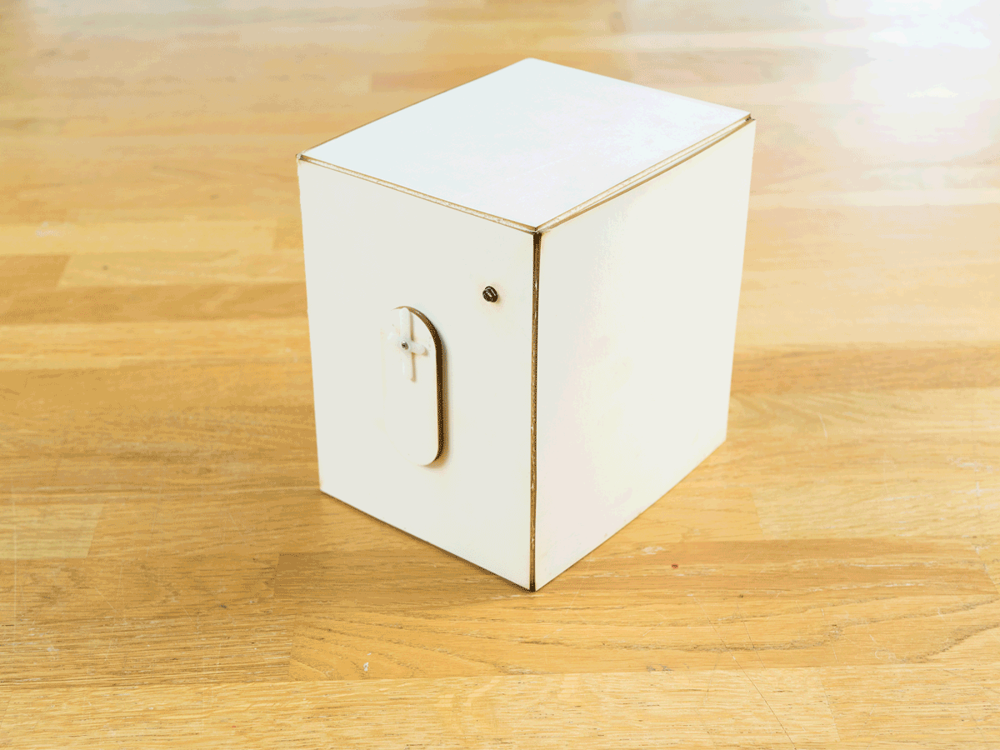
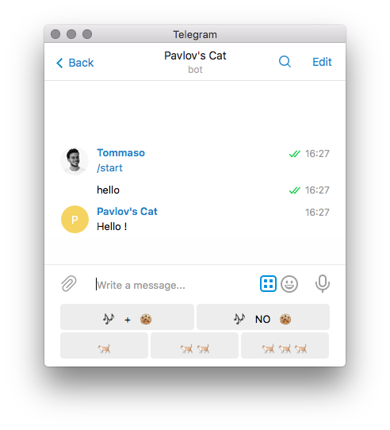
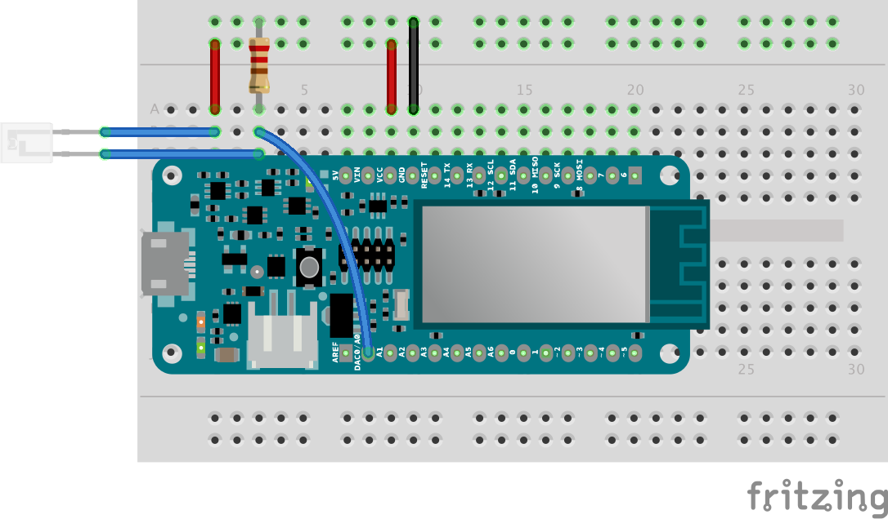
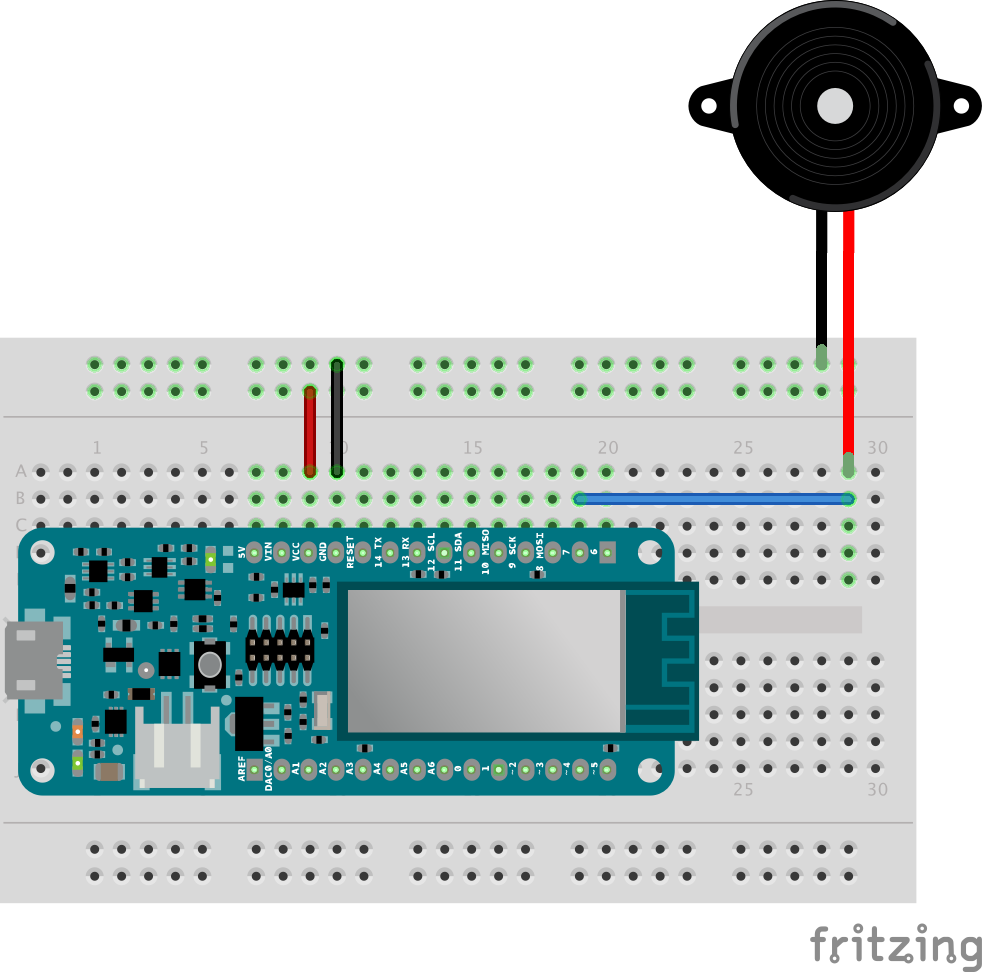
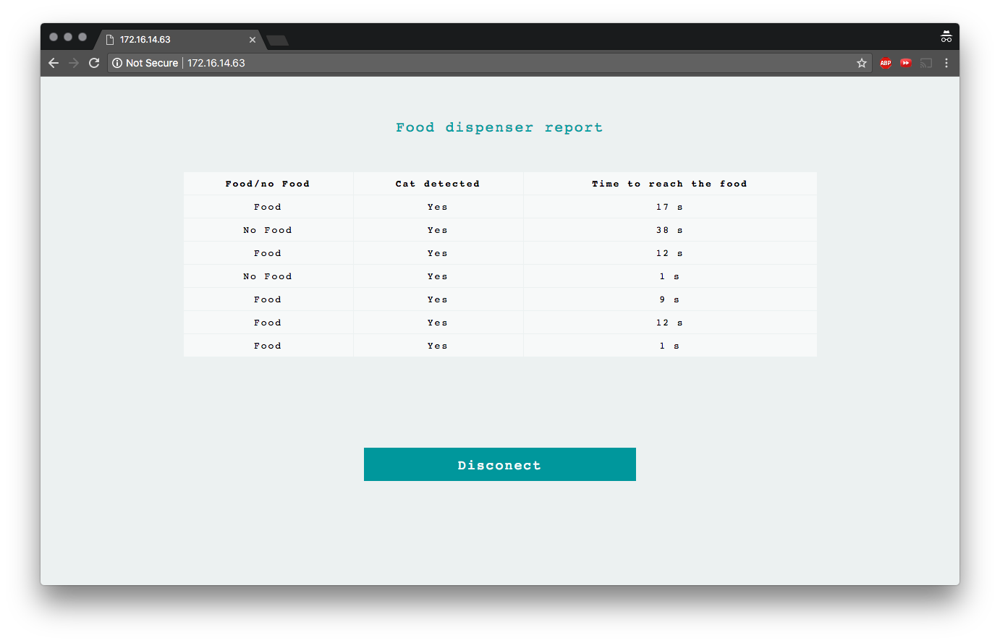

## Components and Supplies

- [Arduino MKR IoT Bundle](https://store.arduino.cc/usa/arduino-iot-mkr1000-bundle)

## Apps and Online Services

- [Telegram](https://telegram.org/)

## About This Project

If you ever tried to train a cat, you know how hard it is. Cats are their own masters, but now you have the chance to let the cats do your bidding using this IoT-enabled device.

### Welcome to Pavlov's Cat Experiment! 

In this project, you will learn how to teach your cat when it is (and isn't) dinner time using nothing but the components in the MKR IoT Bundle and some cardboard.

And we all know that cats already love cardboard boxes! 

Every time the cat hears a certain melody, it receive food. A light sensor detects the presence of a cat. Another melody does nothing. See how this will work?

You will be able to monitor your cat's progression over time, and set the food dispensing rate from your phone. Once you have reached satisfying statistics, it is time to repurpose the sensor into a wearable. Your cat should from then on follow you if you make that beeping sound.

*Disclaimer: No cats were hurt in the development of this experiment. Also, no guarantee that the cat will eat the food, but you get the picture, right?*

### In a Nutshell

You will be able to build your own food dispenser by following these simple step-by-step instructions. The dispenser is basically just some cardboard and a servo motor with some added Arduino magic.

Using a messaging service called Telegram, you can set the amount of food to be dispensed and trigger the melodies played with the buzzer.

A light sensor is used to detect if the cat reacted to the melody and got to the food.

**Pro Tip:** You can host a webpage on the MKR1000 and display the collected data in a handy table.

**Get the cardboard blueprint for this project [here!](https://hacksterio.s3.amazonaws.com/uploads/attachments/387170/pavlovcase_ShVm1OJRIF.dxf
)**


### Components

* Servo motor
* Phototransistor
* 220 ohm resistor
* Buzzer



### Learning Goals

In this experiment you will learn how to:

* Manage Telegram Bots with a custom keyboard
* Set up and manage web server functionality from the MKR1000 itself. **#ProTip**

**Pro Tips** are useful but not strictly necessary steps that add a layer of complexity to the project.

### Want to Know More?

This tutorial is part of a series of experiments that familiarise you with the MKR1000 and IoT. All experiments can be built using the components contained in the MKR IoT Bundle.

* [I Love You Pillow](https://create.arduino.cc/projecthub/arduino/love-you-pillow-f08931)
* [Puzzle Box](https://create.arduino.cc/projecthub/arduino/puzzlebox-c1f374)
* Pavlov's Cat
* [The Nerd](https://create.arduino.cc/projecthub/arduino/the-nerd-0144f9)
* [Plant Communicator](https://create.arduino.cc/projecthub/arduino/plant-communicator-7ea06f)

### Telegram and Arduino

[Telegram ](https://telegram.org/)is a popular messaging app for both mobile and desktop. Besides letting us chat with our friends it also allows us to create handy and powerful chat-bots!

The [TelegramBot library ](https://github.com/CasaJasmina/TelegramBot-Library)for Arduino gives us an easy way to implement the logic behind the chat-bot.

To learn how to create a Bot and manage basic functionalities take a look at the [I Love You Pillow](https://create.arduino.cc/projecthub/arduino/love-you-pillow-f08931) tutorial.

### Create Your Custom Keyboard

Telegram allows us to create a custom keyboard for fast replies. It means that when you talk to a bot a certain selection of buttons will be displayed instead of the default keyboard. You can easily customize those buttons and improve the user experience of your device.

Our custom keyboard looks like this: 




We will use the first row of buttons to play the melody and dispense food, while the second row of buttons will be used to set the speed of the servo motor and therefore the amount of food to be dispensed.

**To create a custom keyboard we first need to declare it:**

```arduino
TelegramKeyboard keyboard_one; 
```

**Then define the rows:**

```arduino
 const char* row_one[] = {MusicAndFood, MusicNoFood}; 
 const char* row_two[] = {OnePortion, TwoPortion, ThreePortion}; 
```

**And finally assign the rows to the keyboard:**

```arduino
keyboard_one.addRow(row_one, 2); // assign a row to one or more keyboards 
keyboard_one.addRow(row_two, 3); // second argument is the length of the row 
```

Remember that an emoji needs to be sent using UNICODE. For instance to send an heart emoji we will use: `\U00002764`

You can see the full list of unicode emoji codes [here.](https://unicode.org/emoji/charts/full-emoji-list.html) It means that to define our buttons we will use this:

```arduino
 const char*  MusicAndFood = "\U0001F3B6   +   \U0001F36A"; // Note + Cookie 
 const char*  MusicNoFood = "\U0001F3B6   NO   \U0001F36A"; // Note NO Cookie 
 const char*  OnePortion = "\U0001F408"; // CAT 
 const char*  TwoPortion = "\U0001F408 \U0001F408"; // 2 CATS 
 const char*  ThreePortion = "\U0001F408 \U0001F408 \U0001F408"; // 3 CATS 
```

### Here Is the Full sketch:

```arduino
#include <WiFi101.h> 
#include <SPI.h> 
#include <TelegramBot.h> 
const char* ssid = SECRET_SSID;    //  your network SSID (name) 
const char* password = SECRET_PSWD;  // your network password 
const char BotToken[] = SECRET_BOT_TOKEN; 
WiFiSSLClient client; 
TelegramBot bot (BotToken, client); 
TelegramKeyboard keyboard_one; 
String OldChatId = ""; 
void setup() { 
 Serial.begin(115200); 
 delay(3000); 
 // attempt to connect to Wifi network: 
 Serial.print("Connecting Wifi: "); 
 Serial.println(ssid); 
 while (WiFi.begin(ssid, password) != WL_CONNECTED) { 
   Serial.print("."); 
   delay(500); 
 } 
 Serial.println(""); 
 Serial.println("WiFi connected"); 
 // choose the emoji you like using UNICODE 
 // here's the list https://unicode.org/emoji/charts/full-emoji-list.html 
 const char*  MusicAndFood = "\U0001F3B6   +   \U0001F36A"; // Note + Cookie 
 const char*  MusicNoFood = "\U0001F3B6   NO   \U0001F36A"; // Note NO Cookie 
 const char*  OnePortion = "\U0001F408"; // CAT 
 const char*  TwoPortion = "\U0001F408 \U0001F408"; // 2 CATS 
 const char*  ThreePortion = "\U0001F408 \U0001F408 \U0001F408"; // 3 CATS 
 // define your row's 
 const char* row_one[] = {MusicAndFood, MusicNoFood}; 
 const char* row_two[] = {OnePortion, TwoPortion, ThreePortion}; 
 keyboard_one.addRow(row_one, 2); // assign a row to one or more keyboards 
 keyboard_one.addRow(row_two, 3); // second argument is the length of the row 
 bot.begin(); 
} 
void loop() { 
 message m = bot.getUpdates(); // Read new messages 
 if ( m.chat_id != 0 ) { // Checks if there are some updates 
   OldChatId = m.chat_id; 
   Serial.println(m.text); 
   bot.sendMessage(m.chat_id, "Hello !", keyboard_one); 
 } 
 delay(1000); 
} 
```

**Unfortunately the way the bot sends the emojis is not the same used to receive them.** Using the EchoBot example is an easy way to see how bots receive emoji.

For instance the emoji we will use are received like this:

```arduino
ud83cudfb6  // Melody 
ud83cudf6a  // Cookie
ud83dudc08  // Cat
```

### Detect the Cat!

In order to detect the presence of the cat we will use a phototransistor, which is able to measure the light intensity and therefore if someone has passed close to it.



Phototransistor wiring

**Note that we used a 220 ohm resistor.**

To read values from the sensor we will only need a `analogRead(A6).` 

Since we are interested in detecting the cat presence only after the melody, and just for a certain amount of time we can use the following logic:

```arduino
unsigned long timer;
bool startDetecting = true;
int threshold=200; // arbitrary value
void setup(){
timer=millis()
Serial.begin(9600);
} 
void loop(){
if (startDetecting) { 
   int value = analogRead(A6); 
   if (value < threshold) { 
     Serial.println("cat detected!");
     startDetecting = false; 
   } 
   else if (millis() - timer > 120000) { 
     Serial.println("no cat detected in the past two minutes");
     startDetecting = false; 
   } 
 } 
}
```

**Note that we use the** **`millis()`** **function to set a timer**. `Millis()`gives us the time in milliseconds since the board was up and running. We can use it to set timers and trigger events after a certain amount of time.

**We also use a threshold** to determine if the cat was detected. That threshold is arbitrary, you can set it accordingly to your light condition.

### Play the Song

To play the song we will use the buzzer and the `tone() `function.




We will use a slightly modified version of the standard example **toneMelody.** You can find it in the dropdown menu: 

```arduino
examples > digital > toneMelody.
```

### Add the Servo Motor

The servo is used to open the box and deliver food.

Note that we use a variable `int PortionAmount = 1;`to set the amount of time the servo has to remain turned 90 degrees. **We will be able to change its value through Telegram.**

.png)

Attach the servo to pin 7 and upload the this sketch to see it working.

```arduino
#include <Servo.h> 
Servo myservo;  // create servo object to control a servo 
int pos = 0;    // variable to store the servo position 
int PortionAmount = 1; // Set default amount of food to 1 portion 
void setup() { 
 myservo.attach(7);  // attaches the servo on pin 6 to the servo object 
} 
void loop() { 
   moveServo(); 
   delay(2000); 
} 
void moveServo() { 
 Serial.println("moving servo"); 
 for (pos = 0; pos <= 90; pos += 1) { // goes from 0 degrees to 90 degrees 
   myservo.write(pos);  // tell servo to go to position in variable 'pos' 
   delay(15); // waits 15ms for the servo to reach the position 
 } 
 delay(PortionAmount * 300);  // keep the box open for a time interval based on the amount of food you want to deliver 
 for (pos = 90; pos >= 0; pos -= 1) { // goes from 90 degrees to 0 degrees 
   myservo.write(pos); / tell servo to go to position in variable 'pos' 
   delay(15); // waits 15ms for the servo to reach the position 
 } 
} 
```

## Complete Sketch

<iframe src='https://create.arduino.cc/editor/Arduino_Genuino/a2b194b4-ef03-41ea-a2ca-81bf2cf3a2b8/preview?embed&snippet' style='height:510px;width:100%;margin:10px 0' frameborder='0'></iframe>


### #ProTip: Add a Web Server

One of the most powerful functionalities of the MKR1000 is the **Access Point Mode.**

**It allow us to host a web page on the MKR1000 that we can access to by using the board IP address and being connected to the same network**.

We will use this tool to print the data collected by the food dispenser.



Web page hosted on the mkr1000

**This step requires basic knowledge of HTML and CSS** (or a lot of trust in the example sketch. You can check the basic web sever example at:

```arduino
> example > WiFi101 > AP_SimpleWebServer
```

We will trigger the access point mode by **sending a specific word** to our Telegram Bot, which **will reply with the link to reach the web page.** Then the telegram client will be disconnected and   **the web-server is started.**

```arduino
else if(m.text == "Server"){ 
  IPAddress ip = WiFi.localIP(); 
  web_server_mode=true; 
  String message = "To see the webpage go to http://"+IpToString(ip); 
  bot.sendMessage(m.chat_id, message , keyboard_one); 
  telegram_client.stop(); 
  delay(1000); 
  server.begin();   // start the web server on port 80 
  } 
```

**The web page includes a button that will turn off the web server mode and go back as a telegram client:**

```arduino
if (currentLine.endsWith("GET /BACKBUTTON")) {  // if button pressed
   web_server_mode=false; 
   client.stop(); 
   delay(1000); 
   bot.begin(); 
   bot.sendMessage(OldChatId, "Back online !", keyboard_one); 
   } 
```

**Each time the cat detection is ends a new cell of the table is added** with the gathered data: if food was delivered, if the cat showed up within two minutes and how long did it take to reach the dispenser.

```arduino
AddTableCell(food/noFood, Yes/No, TimeValue); 
```

Then the String containing all the table cells is updated and integrated in the rest of the main html.

```arduino
 table_cells+=cell; // add new cell
 html = html_1 + table_cells + html_2; // add cells to main html
```

Check at the final Pro example to see how to integrate all of these new functionalities!

**Tip:** if you want your data to survive a reset of the board have a look at the [Flash Storage](https://github.com/cmaglie/FlashStorage) library or check the [Nerd](https://create.arduino.cc/projecthub/67621/the-nerd-0144f9) project! 

## #ProTips Code

<iframe src='https://create.arduino.cc/editor/Arduino_Genuino/7774f61e-7d82-4442-a97c-721091fe37bd/preview?embed&snippet' style='height:510px;width:100%;margin:10px 0' frameborder='0'></iframe>
