## Components and Supplies

- [Arduino MKR IoT Bundle](https://store.arduino.cc/usa/arduino-iot-mkr1000-bundle)

## Apps and Online Services

- [Zapier](https://zapier.com/)
- [ThingSpeak API](https://github.com/iobridge/ThingSpeak)

## About This Project

### Introduction

As the English poet William Wordsworth once said: 

"Your mind is the garden, your thoughts are the seeds, the harvest can be either flowers or weeds."

Keeping your plants alive can be quite the challenge as they are very bad at communication. 

One way to keep them happy is to bring your plants with you, but maybe you don't want to lug around with that big-ole-cactus or fern sticking out of your winter jacket pockets. Also, most plants dislike the cold. 

After spending months trying to communicate with our Spider Plant, we gave up and used the MKR IoT Bundle components to create a device that remotely surveys the well being of any plant instead. 

### In a nutshell:

In this experiment you will learn how to protect your plants and make sure they survive as well as using Arduino magic. 

By monitoring moisture, temperature and light, you can make sure that your plants are happy. It can send emails and graphs on a daily basis and notify you of its needs. 

### Components

* TMP36 temperature sensor
* Phototransistor
* DIY moisture sensor

### Learning Goals

* Introducing Zapier internet service
* Sending HTTP requests
* Managing Real Time Clock and alarms
* Building a DIY moisture sensor
* Plotting values with thingSpeak **#ProTips**
* Style your email with HTML and CSS **#ProTips**
* Test APIs with PostMan **#ProTips**

### Want to Know More?

This tutorial is part of a series of experiments that familiarise you with the MKR1000 and IoT. All experiments can be built using the components contained in the MKR IoT Bundle.

* [Love You Pillow](https://create.arduino.cc/projecthub/arduino/love-you-pillow-f08931)
* [Puzzle Box](https://create.arduino.cc/projecthub/arduino/puzzlebox-c1f374)
* [Pavlov's Cat](https://create.arduino.cc/projecthub/arduino/pavlov-s-cat-7e6577)
* [The Nerd](https://create.arduino.cc/projecthub/arduino/the-nerd-0144f9)
* Plant Communicator

### Set up Zapier

[Zapier](https://zapier.com/app/explore) is an online automation tool that can easily manage the APIs of other apps for us. It is a great tool to combine multiple tasks or if the app we want to use has complex API that cannot be managed by an Arduino.

In our case we will use it to send an email with the data retrieved from the Arduino.

Follow this few simple steps to create your own zap!


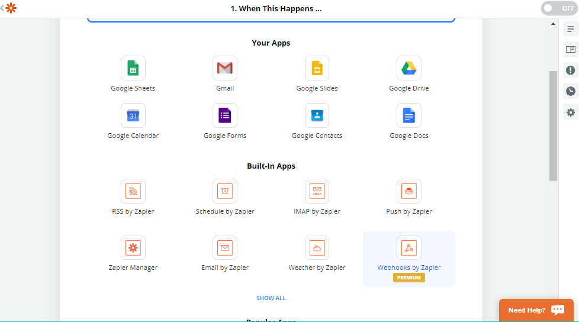


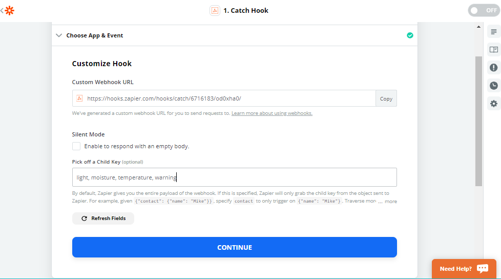


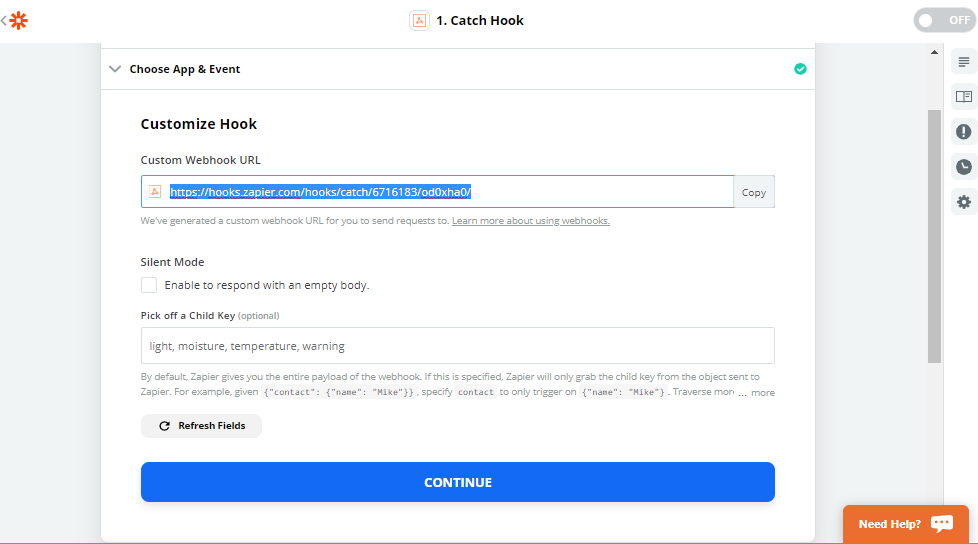


In order to proceed we need to test our hook first copying the given URL, then selecting the Test and Review button that appears when you press Continue. Add these parameters to the URL:

`custom_webhook_URL?temperature=0&moisture=0&light=0&warning=0 `

Now just copy and paste this URL on a new browser page. 

You should see a response like this:

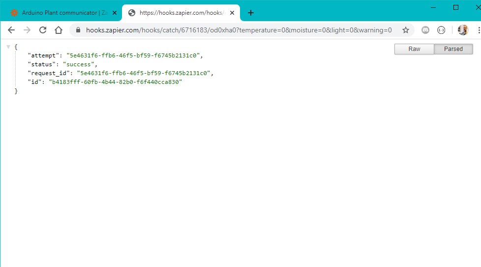


Congratulations! You just sent an **http request!**

**This is exactly the what we will do with our Arduino board.** But instead of pasting that URL into a browser page we will send it directly to the Zapier server. Also we will modify the values of the parameters that are now set to zero with our sensors values.

*For a more advanced way to test and work with API have a look at the **#ProTip** at the bottom of the page.

After you tested your request you can proceed creating the Zap. 

Proceed in the Edit with the **Do This...**


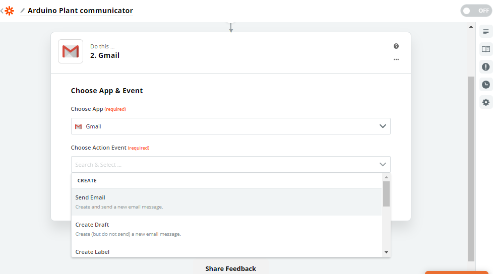


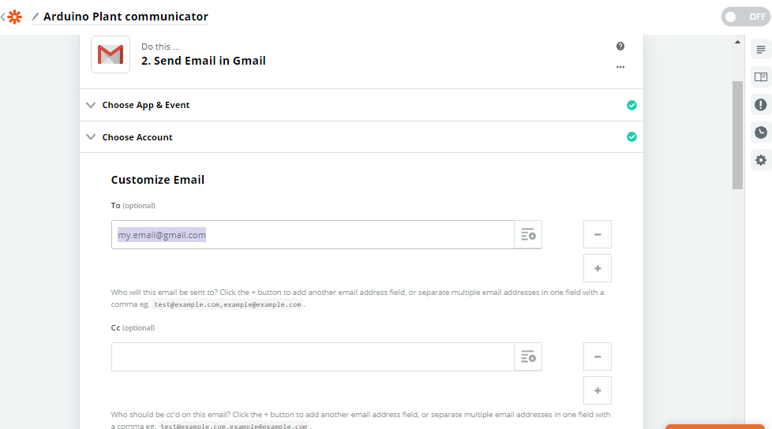


To access the catch hook strings, we need to click on the con on the top right of the input field that opens up the dropdown as shown in this picture.

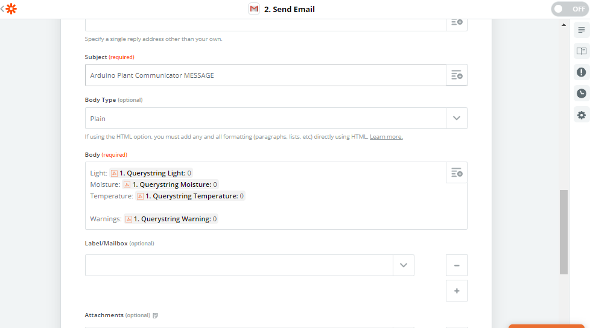


Check your mailbox to see the generated email from Zapier. It will be from the account you used in the first step of gmail configuration. 

### Set up the Board

In order to implement all the functionalities we are going to use the following libraries:

* WiFi101 // to connect to internet and scan the networks
* RTCZero // to manage time triggered events

You can download them from the library manager as explained in [this guide.](https://www.arduino.cc/en/Guide/Libraries)

In order to use Zapier's API we first need to **upload the certificates** on the MKR1000. **This applies to most of online services and APIs!**

Upload the Firmware Updater example from the WiFi101 library and add **hooks.zapier.com** to the domains.

```arduino
> examples > WiFi101 > FirmwareUpdater 
```

**If you are using the Arduino Web Editor this feature is not yet implemented and you need to do this through the** **[Arduino Desktop Application.](https://www.arduino.cc/en/Main/Software)**

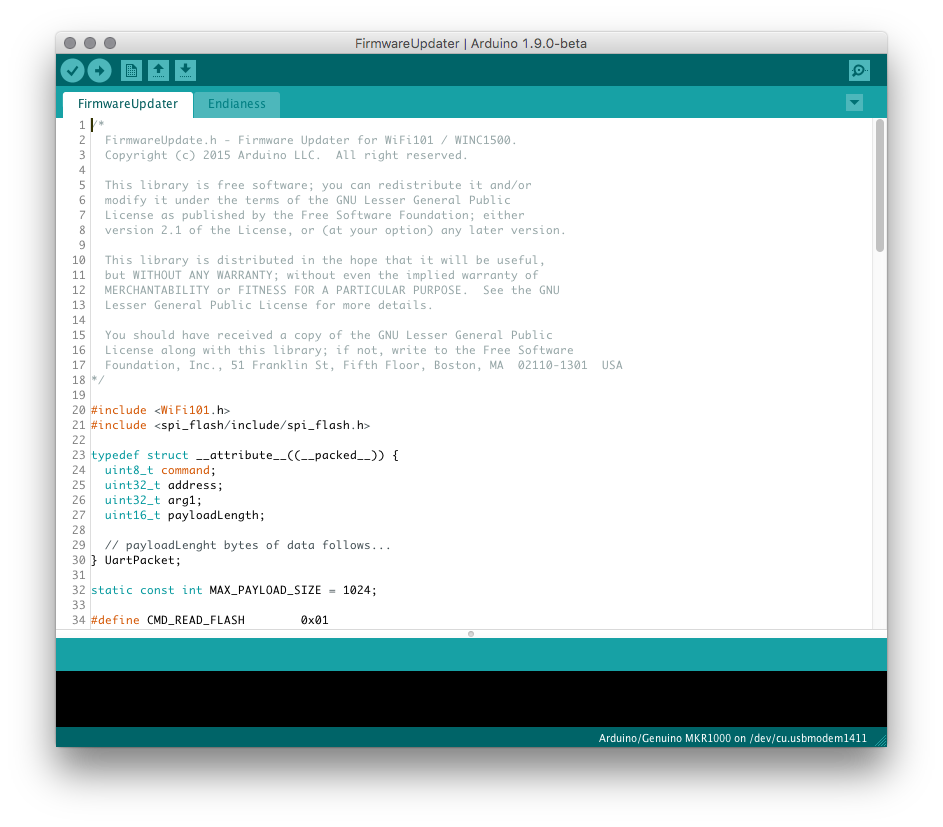


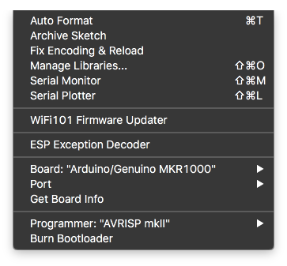


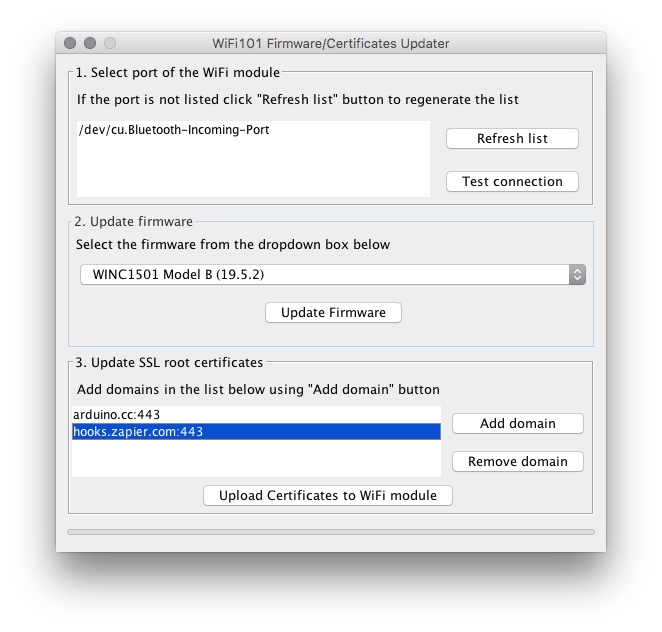


### Sending HTTP Request

We are now ready to send the HTTP request from the Arduino board.

For now we will set an arbitrary value to our parameter that later on will be substituted with real sensor values.

```arduino
 float temperature = 22; 
 int moisture = 150; 
 int light = 40; 
 String warning = "This is a warning message"; 
 warning.replace(" ", "%20"); 
```

Note that **the string has to be encoded**, since blank spaces cannot be sent in an HTTP request. All blank spaces are substituted with the encoded equivalent *`%20`*

After setting up our parameters we will call the `send_email()` function, which will convert all of them into Strings and **will rebuild the same URL that we used before** to then post it to the Zapier server.

**Fill in this sketch with your WiFi credential and the piece of URL that you received from Zapier and upload.**

```arduino
#include <WiFi101.h> 
#include<WiFiSSLClient.h> 
const char* ssid = SECRET_SSID;    //  your network SSID (name) 
const char* password = SECRET_PSWD;  // your network password 
String httpsRequest = SECRET_REQUEST; // your Zapier URL 
const char* host = "hooks.zapier.com"; 
WiFiSSLClient client; 
void setup() { 
 Serial.begin(9600); 
 while (!Serial); 
 delay(2000); 
 Serial.print("Connecting Wifi: "); 
 Serial.println(ssid); 
 while (WiFi.begin(ssid, password) != WL_CONNECTED) { 
   Serial.print("."); 
   delay(500); 
 } 
 Serial.println(""); 
 Serial.println("WiFi connected"); 
} 
void loop() { 
 float temperature = 22; 
 int moisture = 150; 
 int light = 40; 
 String warning = "This is a warning message"; 
 warning.replace(" ", "%20"); 
 send_email(temperature, moistue, light, warning ); 
 delay(20000) 
} 
void send_email(float temperature, int moisture, int light, String warning) { 
 // convert values to String 
 String _temperature = String(temperature); 
 String _moisture = String(moisture); 
 String _light = String(light); 
 String _warning = warning; 
 if (client.connect(host, 443)) { 
   client.println("POST " + httpsRequest + "?temperature=" + _temperature + "&moisture=" + _moisture + "&light=" + _light + "&warning=" + _warning + " HTTP/1.1"); 
   client.println("Host: " + String(host)); 
   client.println("Connection: close"); 
   client.println(); 
   delay(1000); 
   while (client.available()) { // Print on the console the answer of the server 
     char c = client.read(); 
     Serial.write(c); 
   } 
   client.stop();  // Disconnect from the server 
 } 
 else { 
   Serial.println("Failed to connect to client"); 
 } 
} 
```

It will send an email to the address you choose every 20 seconds.

**Be careful with the requests, Zapier allow you only 100 free request per month.**

### RTC and Alarms

We can use the Real Time clock of the MKR1000 to send an email every day at a certain hour.

This sketch will set the time and date at 16:00 of December 4th 2017 **and then trigger an alarm every day at 16:01.**

Note that since the alarm is attached to an *interrupt* function **we cannot include any delays**, but we can use boolean variable to trigger actions in the `loop()`

```arduino
#include <RTCZero.h> 
RTCZero rtc; // create RTC object 
/* Change these values to set the current initial time */ 
const byte seconds = 0; 
const byte minutes = 0; 
const byte hours = 16; 
/* Change these values to set the current initial date */ 
const byte day = 4; 
const byte month = 12; 
const byte year = 17; 
bool email_already_sent = false; 
void setup() { 
 Serial.begin(9600); 
 while (!Serial); 
 delay(2000); 
 rtc.begin(); // initialize RTC 24H format 
 rtc.setTime(hours, minutes, seconds); 
 rtc.setDate(day, month, year); 
 rtc.setAlarmTime(16, 1, 0);  // Set the time for the Arduino to send the email 
 rtc.enableAlarm(rtc.MATCH_HHMMSS); 
 rtc.attachInterrupt(alarmMatch); 
} 
void loop() { 
 if (!email_already_sent) { 
   // send_email(); 
   email_already_sent = true; 
 } 
} 
void alarmMatch() { // triggered when the alarm goes on 
 Serial.println("Alarm Match!"); 
 email_already_sent = false; 
} 
```

### DIY Soil Moisture Sensor

Two wires placed in the soil pot form a variable resistor, **whose resistance varies depending on soil moisture**. 

This variable resistor is connected in a voltage divider configuration, and Arduino collects a voltage proportional to resistance between the 2 wires.

Meaning that **the more humid the soil is, the less voltage will be measured from the Arduino.**

Using the **1 Mega Ohm resistor** and two wires, we can create our DIY soil moisture sensor!

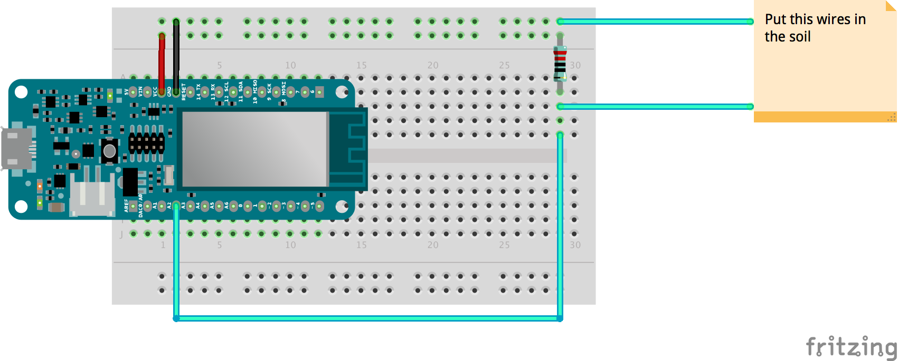


Uploading the following sketch you can start reading the values of the sensor, we suggest you **start testing it first in a dry soil** and and note down the value you read.

**That value will be used to set a threshold** so that the Arduino will know when your plants need water and send you an **emergency email.**

```arduino
int moisturePin = A2; 
// Set this threeshold accordingly to the resistance you used 
// The easiest way to calibrate this value is to test the sensor in both dry and wet soil 
int threeshold = 800; 
void setup() { 
 Serial.begin(9600); 
 while (!Serial); 
 delay(2000); 
} 
void loop() { 
 Serial.println(get_average_moisture()); 
 delay(5000); 
} 
int get_average_moisture() { // make an average of 10 values to be more accurate 
 int tempValue = 0; // variable to temporarily store moisture value 
 for (int a = 0; a < 10; a++) { 
   tempValue += analogRead(moisturePin); 
   delay(100); 
 } 
 return tempValue / 10; 
} 
```

### Add Temperature and Light Sensor

See the schematic below to wire up the two sensors. We will use these two functions to read values from the sensors:

```arduino
float get_temperature(){ 
 int reading = analogRead(A1);   
 float voltage = reading * 3.3; 
 voltage /= 1024.0;  
// Print tempeature in Celsius 
float temperatureC = (voltage - 0.5) * 100 ; //converting from 10 mv per degree with 500 mV offset 
// Convert to Fahrenheit 
float temperatureF = (temperatureC * 9.0 / 5.0) + 32.0; 
return temperatureC; 
}  
int get_light(){ 
 int light_value=analogRead(A0); 
 return light_value; 
} 
```

Note that you can use the Fahrenheit units by returning `temperatureF` instead of `temperatureC`


## Complete Sketch

<iframe src='https://create.arduino.cc/editor/Arduino_Genuino/9da43150-c521-4b8d-80a5-9fc0bde7a0a2/preview?embed&snippet' style='height:510px;width:100%;margin:10px 0' frameborder='0'></iframe>


### #ProTip: Plot Values Using ThingSpeak

For all of you control freaks, here is the instructions to plot all the data collected in a beautiful graph like this:

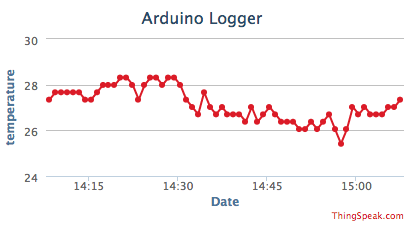


We will use the [ThingSpeak](https://thingspeak.com/) platform to plot out graphs, follow these steps to get started.


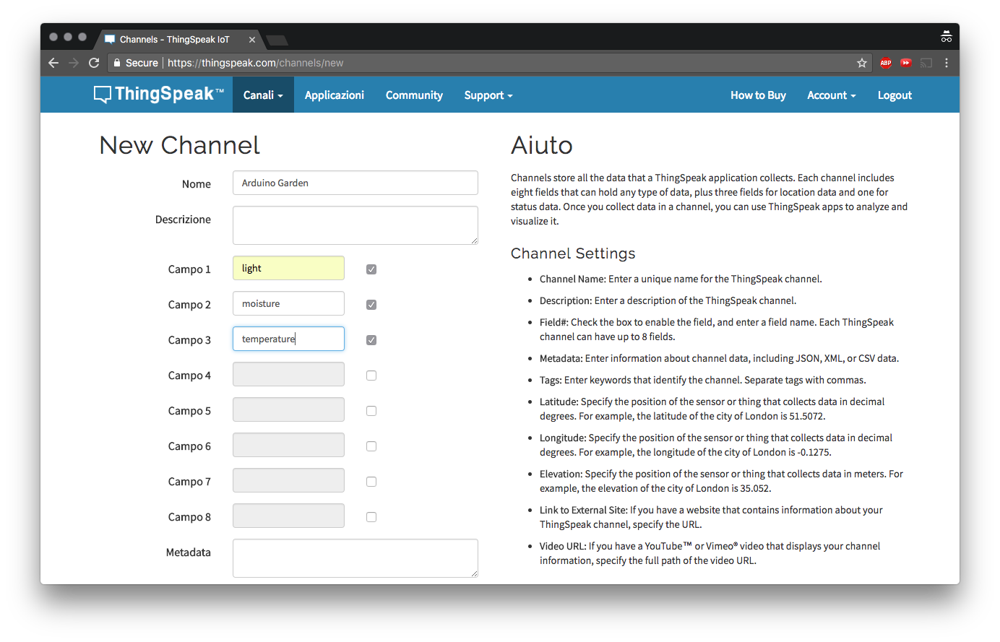


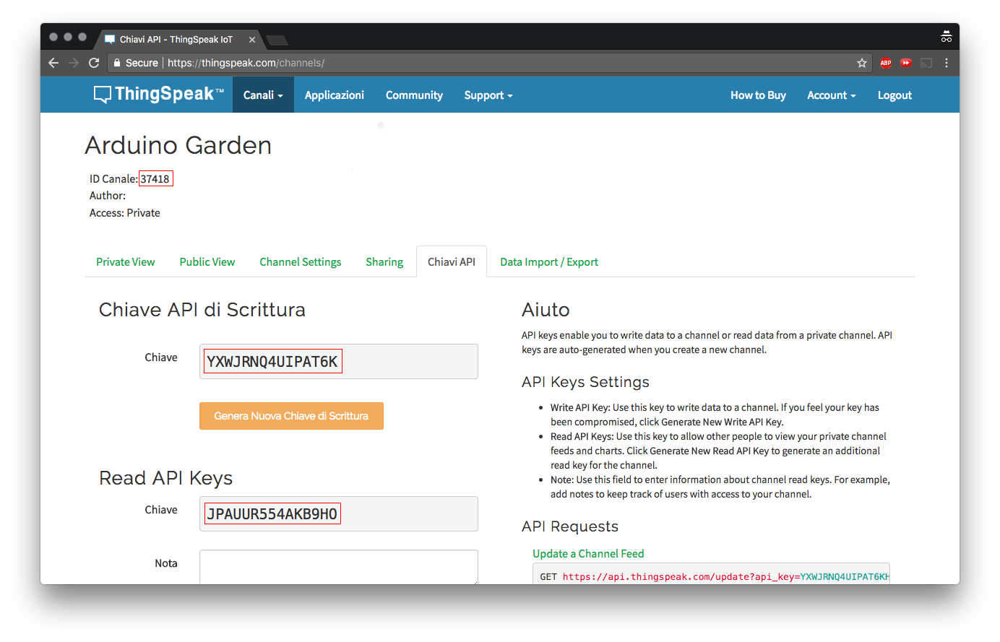


Download the [ThingSpeak](https://github.com/mathworks/thingspeak-arduino) library and let's get started. This sketch below will upload sensors values to the cloud every minute, just fill in you WiFi credentials and the API keys of you channel and upload.

```arduino
#include <WiFi101.h> 
#include<WiFiSSLClient.h> 
#include "ThingSpeak.h" 
const char* ssid = SECRET_SSID;    //  your network SSID (name) 
const char* password = SECRET_PSWD;  // your network password 
WiFiClient  ThingSpeakClient; 
unsigned long myChannelNumber = 356392; 
const char * myWriteAPIKey = SECRET_WRITE_API; 
int lightPin = A0; //the analog pin the light sensor is connected to 
int tempPin = A1; //the analog pin the TMP36's Vout (sense) pin is connected to 
int moisturePin = A2; 
void setup() { 
 Serial.begin(9600); 
 while (!Serial); 
 delay(2000); 
 Serial.print("Connecting Wifi: "); 
 Serial.println(ssid); 
 while (WiFi.begin(ssid, password) != WL_CONNECTED) { 
   Serial.print("."); 
   delay(500); 
 } 
 Serial.println(""); 
 Serial.println("WiFi connected"); 
 ThingSpeak.begin(ThingSpeakClient);
} 
void loop() { 
 ThingSpeak.setField(1, get_light()); 
 ThingSpeak.setField(2, get_temperature()); 
 ThingSpeak.setField(3, get_average_moisture()); 
 ThingSpeak.writeFields(myChannelNumber, myWriteAPIKey); 
 Serial.println("message sent to cloud"); 
 delay(60000); // send values every 1 minute 
} 
float get_temperature() { 
 int reading = analogRead(tempPin); 
 float voltage = reading * 3.3; 
 voltage /= 1024.0; 
 // Print tempeature in Celsius 
 float temperatureC = (voltage - 0.5) * 100 ; //converting from 10 mv per degree with 500 mV offset 
 // Convert to Fahrenheit 
 float temperatureF = (temperatureC * 9.0 / 5.0) + 32.0; 
 return temperatureC; 
}
int get_average_moisture() { // make an average of 10 values to be more accurate 
 int tempValue = 0; // variable to temporarily store moisture value 
 for (int a = 0; a < 10; a++) { 
   tempValue += analogRead(moisturePin); 
   delay(10); 
 } 
 return tempValue / 10; 
} 
int get_light() { 
 int light_value = analogRead(A0); 
 return light_value; 
} 
```

In the *complete Pro sketch below* you can see how to attach this upload to an RTC alarm that gets triggered every minute.

Unfortunately Gmail doesn't let us embed **graphs** and **iframes** in the body of the email, but we can send the link via email in a beautiful button, see the tip below.

We chose ThingSpeak, but there are tons of alternatives out there! Take a look a [Dweet.io](http://dweet.io/) and [freeboard.io](http://freeboard.io/) for instance.


### #ProTip: Style Your Email

Zapier allow us to **embed some html and css code in the body** of the email. We can use that to send pretty stylised email like this:

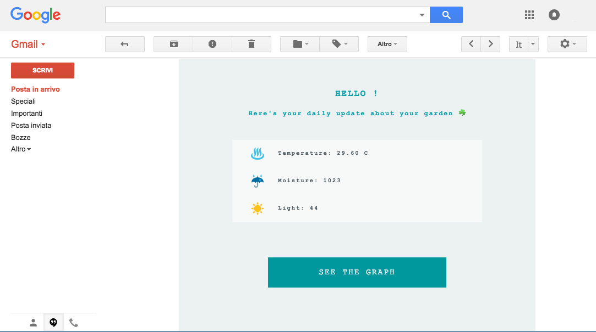


To achieve this result just change **the body type to html** on the Zapier interface and add your custom HTML and CSS.

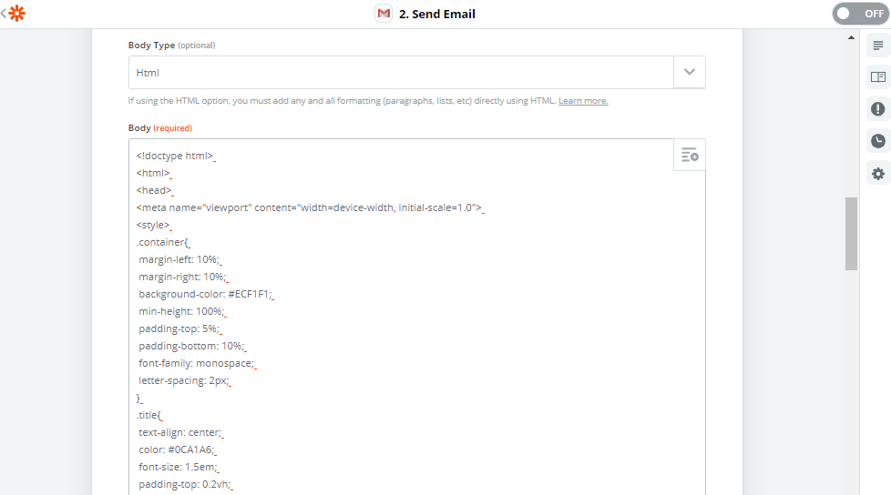


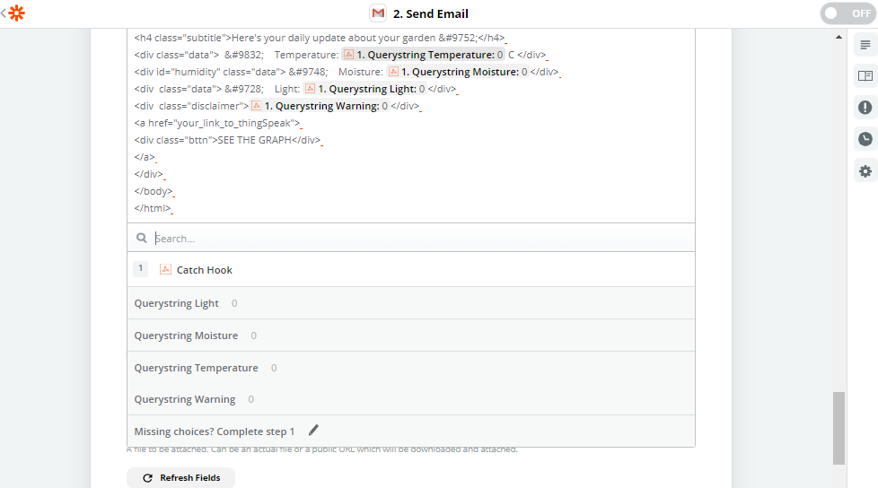


**Copy and paste this template:**

```html
<!doctype html> 
<html> 
<head> 
<meta name="viewport" content="width=device-width, initial-scale=1.0"> 
<style> 
.container{ 
 margin-left: 10%; 
 margin-right: 10%; 
 background-color: #ECF1F1; 
 min-height: 100%; 
 padding-top: 5%; 
 padding-bottom: 10%; 
 font-family: monospace; 
 letter-spacing: 2px; 
} 
.title{ 
 text-align: center; 
 color: #0CA1A6; 
 font-size: 1.5em; 
 padding-top: 0.2vh; 
} 
.subtitle{ 
 text-align: center; 
 color: #0CA1A6; 
 font-size: 1.1em; 
 padding-bottom: 4%; 
 padding-left: 4%; 
 padding-right: 4%; 
} 
.data{ 
 padding-bottom: 2%; 
 padding-top: 2%; 
 padding-left: 5%; 
 margin-left: 15%; 
 margin-right: 15%; 
 background-color: #F7F9F9; 
 text-align: left; 
 color: #4E5B61; 
 font-size: 1em; 
 font-weight: bold; 
} 
.bttn{ 
 padding-bottom: 3%; 
 padding-top: 3%; 
 margin-left: 25%; 
 margin-right: 25%; 
 margin-top: 10%; 
 background-color: #00979D; 
 text-align: center; 
 color: #F7F9F9; 
 font-size: 1.4em; 
} 
.disclaimer{ 
text-align:center; 
color:#DA5B4A; 
font-size: 1.1em; 
font-weight: bold; 
margin-top: 10%; 
} 
.bttn:hover{ 
background-color: #008184; 
} 
a{ 
 text-decoration: none; 
} 
</style> 
</head> 
<body> 
<div class="container"> 
<h2 class="title">HELLO !</h2> 
<h4 class="subtitle">Here's your daily update about your garden &#9752;</h4> 
<div class="data">  &#9832;    Temperature: {{querystring__temperature}} C </div> 
<div id="humidity" class="data"> &#9748;    Moisture: {{_querystring__moisture}}</div> 
<div  class="data"> &#9728;    Light: {{querystring__light}}</div> 
<div  class="disclaimer">{{querystring__warning}}</div> 
<a href="your_link_to_thingSpeak"> 
<div class="bttn">SEE THE GRAPH</div> 
</a> 
</div> 
</body> 
</html> 
```

## #ProTip: Test API with PostMan

Working with HTTP request can be hard, luckily there are a lot of tools that can help us building the URL we need.

[Postman](https://www.getpostman.com/) is a great example: 

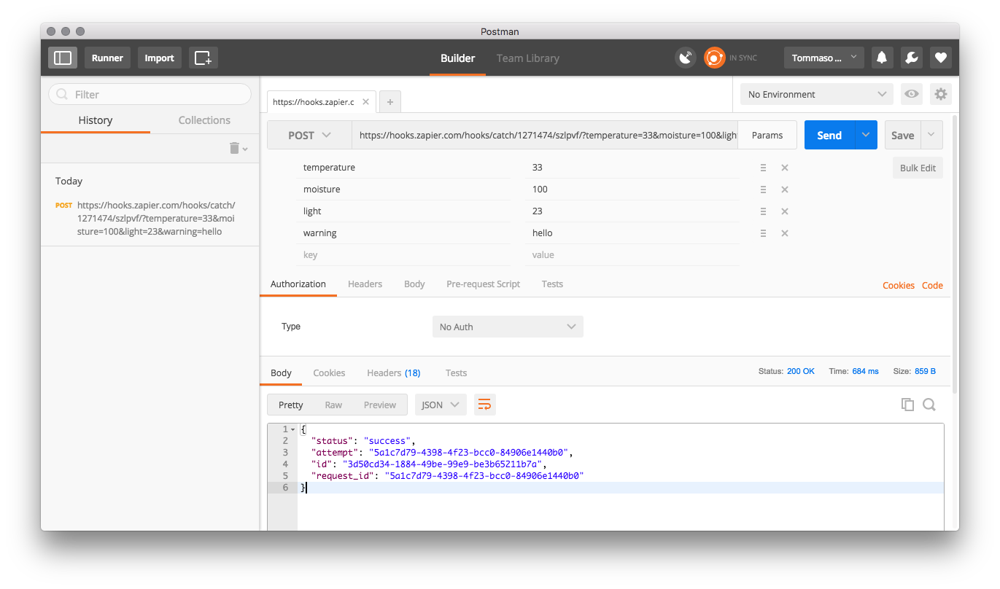

Just paste the initial URL given by Zapier, add parameters and send it. It will print out the response from the server and compose the URL for you.


### Complete ProTip Sketch

<iframe src='https://create.arduino.cc/editor/Arduino_Genuino/db0e97a1-fdd2-4317-b065-0eb180b2dc81/preview?embed&snippet' style='height:510px;width:100%;margin:10px 0' frameborder='0'></iframe>
