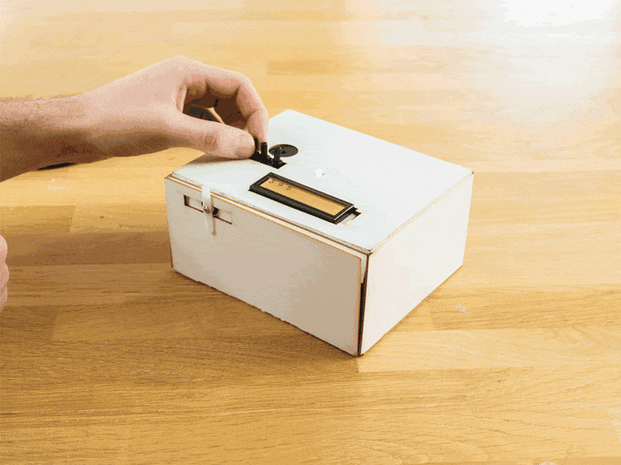
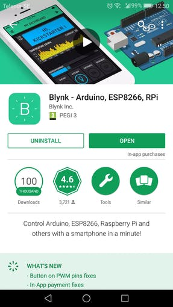
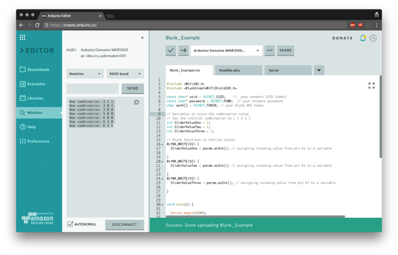
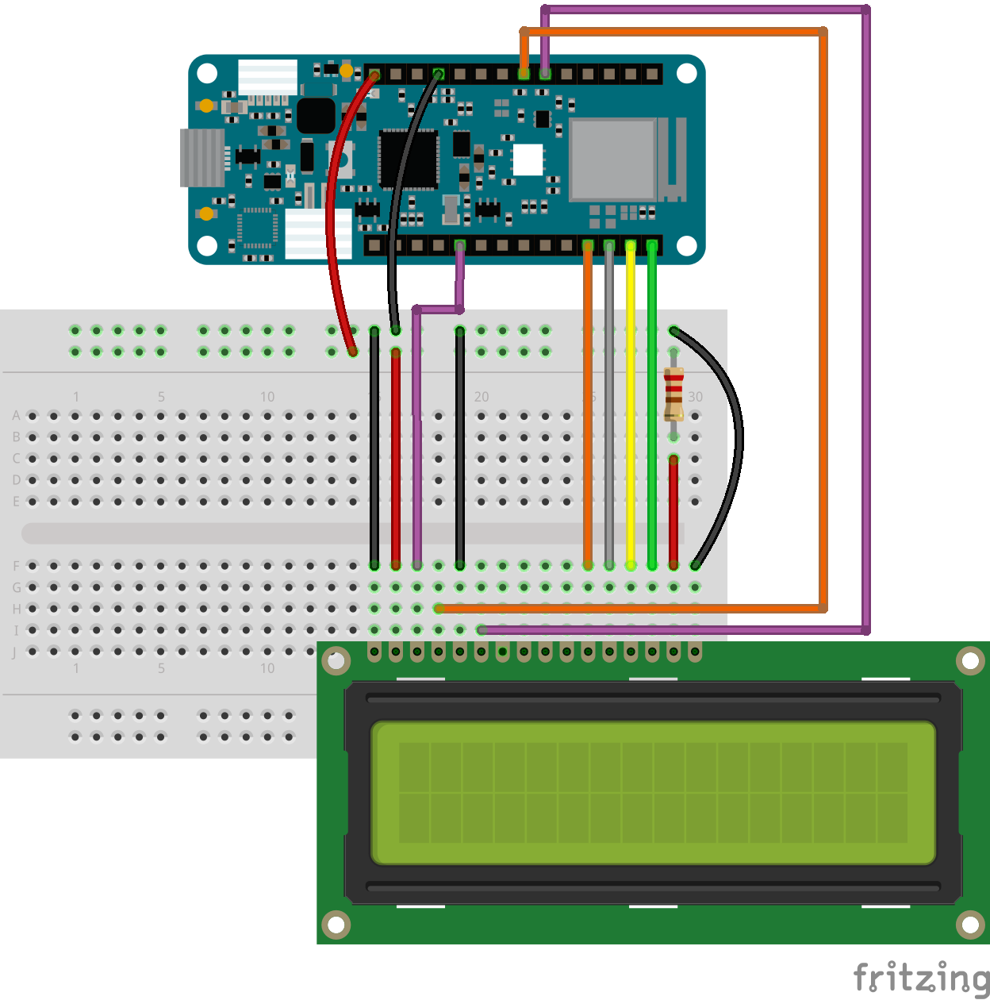
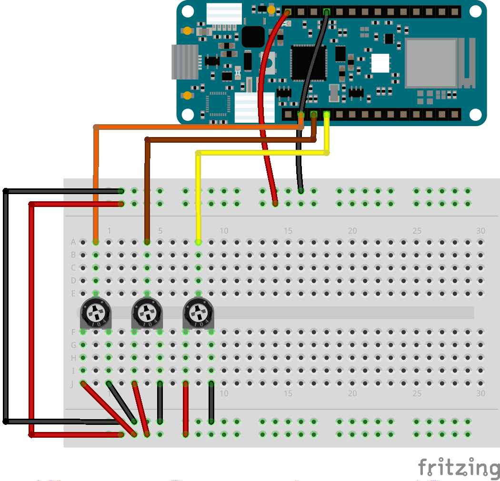
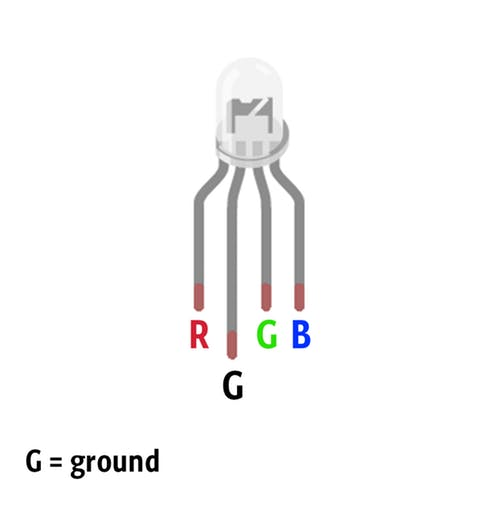
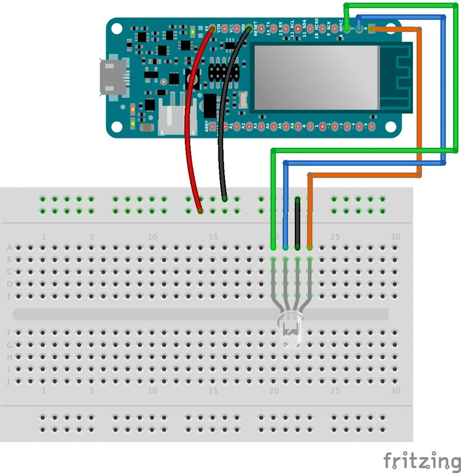
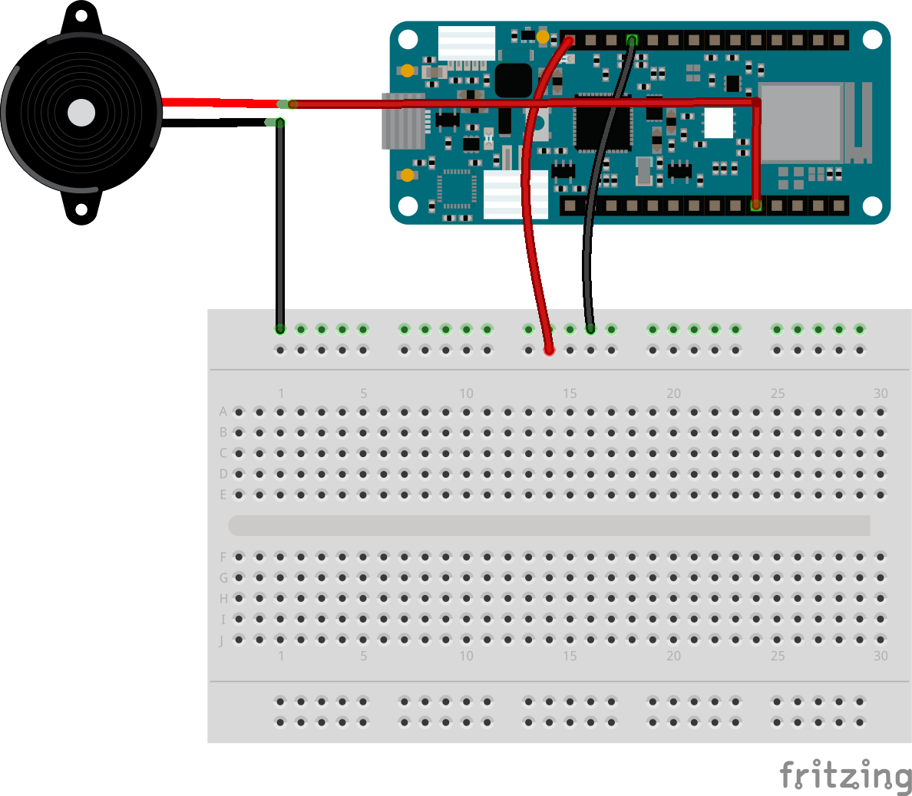
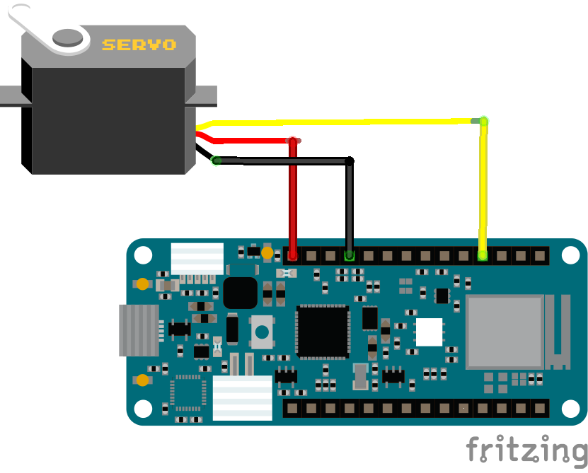

## Components and Supplies

- [Arduino MKR IoT Bundle 1010](https://store.arduino.cc/arduino-iot-mkr-wifi-1010-bundle)

## Apps and Online Services

- [Blynk](https://www.blynk.cc/getting-started)

## About This Project

Keeping your valuable items away from prying eyes can be hard sometimes, unless you put it in a big safe or something similar... but who has room for that? Instead, create your own puzzlebox using the components from the MKR IoT Bundle and some cardboard! We can't guarantee the safety of your belongings, but at least it will be a fun deterrent for potential thieves. Of course, we advise you to stash you candy in there... not actual valuables. 

### In a Nutshell

In order to open the box, which is held closed with a servo motor, you will have to turn the potentiometers until you get the right combination. The combination can be set through the online app [Blynk](http://www.blynk.cc/). An LED will help you guess, giving you colour feedbacks: the closer you are the warmer the colour. When the right combination is guessed the buzzer will start playing a song while the servo will open the box. In order to create our puzzle box we will need the following components: 

* Buzzer
* RGB LED
* 3 potentiometers
* LCD screen
* Servo motor



### Learning Goals

* Introducing Blynk internet platform
* Wiring and using the LCD screen
* Playing Star Wars theme with the buzzer

### Want to Know More?

This tutorial is part of a series of experiments that familiarise you with the MKR WiFi 1010 and IoT. All experiments can be built using the components contained in the MKR IoT Bundle.

* [I Love You Pillow with MKR WiFi 1010](https://create.arduino.cc/projecthub/Arduino_Genuino/i-love-your-pillow-with-mkr-wifi-1010-84b6da)
* Puzzle Box with MKR WiFi 1010
* [Pavlov's Cat with MKR WiFi 1010](https://create.arduino.cc/projecthub/Arduino_Genuino/pavlov-s-cat-with-mkr-wifi-1010-9ea418)
* [The Nerd with MKR WiFi 1010](https://create.arduino.cc/projecthub/Arduino_Genuino/the-nerd-with-mkr-wifi-1010-462cc5)
* [Plant communicator with MKR WiFi 1010](https://create.arduino.cc/projecthub/Arduino_Genuino/plant-communicator-with-mkr-wifi-1010-efc920)

### Introducing Blynk

[Blynk ](http://www.blynk.cc/)is a popular mobile app for Internet of Things, it allows us to easily control our internet connected Arduino from everywhere, anytime.It was founded on Kickstarter and quickly became one of the most used apps in this field, thanks to both its awesome documentation and its simplicity.

### Getting Started with Blynk

Creating a new project is really easy; to save your time and ease your first contact with Blynk, we have prepared the QR code below. Open Blynk and use the QR code icon that is on the top right of the interface. Automatically you will see the widgets we have prepared as a Project




After you successfully created the new project you should create and send to yourself via mail the **Auth Token.** It is a unique identifier which is needed to connect your hardware to your smartphone. Every new project you create will have its own Auth Token. In order to connect the Arduino to the app we will need to install the Blynk library. If you are using the Arduino Web Editor the library will be automatically downloaded when you include it in the sketch, otherwise you can download that from the library manager.Now we are ready to go. **Upload this sketch** and play with the sliders to see the result:

```arduino
#include <WiFiNINA.h> 
#include <BlynkSimpleWiFiNINA.h>
const char* ssid = SECRET_SSID;    //  your network SSID (name) 
const char* password = SECRET_PSWD;  // your network password 
char auth[] = SECRET_TOKEN; // your Blynk API token 
// Variables to store the combination value 
// Set the initial combination to ( 1 1 1 ) 
int SliderValueOne = 1;
int SliderValueTwo = 1; 
int SliderValueThree = 1; 
// Blynk functions to retrieve values 
BLYNK_WRITE(V1) {
  SliderValueOne = param.asInt(); // assigning incoming value from pin V1 to a variable
 }
 BLYNK_WRITE(V2) {
  SliderValueTwo = param.asInt(); // assigning incoming value from pin V1 to a variable
 } BLYNK_WRITE(V3) {
  SliderValueThree = param.asInt(); // assigning incoming value from pin V1 to a variable
 } 
void setup() {
  Serial.begin(9600);
  Blynk.begin(auth, ssid, password); // start Blynk functionalities and connect to WiFi
} 
void loop() {
  // Variambles to temporarily store the combination
  int Temp_Slider_One_value = SliderValueOne;
  int Temp_Slider_Two_value = SliderValueTwo;
  int Temp_Slider_Three_value = SliderValueThree;
  Blynk.run();
  // poll new combination values from the online app
  // check if combination values are changed and print them on the console
  if(Temp_Slider_One_value != SliderValueOne || Temp_Slider_Two_value != SliderValueTwo || Temp_Slider_Three_value != SliderValueThree){
    Serial.print("New combination: ");
    Serial.print(SliderValueOne);
    Serial.print(" ");
    Serial.print(SliderValueTwo);
    Serial.print(" ");
    Serial.println(SliderValueThree);
   }
  } 
```



### Using the LCD Screen

Time to connect the screen! The LCD screen is easy to use but requires a lot of wires, so be ready to test your patience.




Note that we are using the 5V power supply and a 220 Ohm resistor.The brightness can be regulated changing the output value of the Analog pin 3 from 0 to 255 with 0 being the maximum value.

```arduino
analogWrite(A3, 0); 
```

Now we can upload the example sketch and see if everything is working fine.

```arduino
// include the library code: 
#include <LiquidCrystal.h> 
// initialize the library by associating any needed LCD interface pin 
// with the arduino pin number it is connected to 
const int rs = 12, en = 11, d4 = 2, d5 = 3, d6 = 4, d7 = 5;
LiquidCrystal lcd(rs, en, d4, d5, d6, d7); 
void setup() {
  analogWrite(A3, 0); // Set the brightness to its maximum value  
  // set up the LCD's number of columns and rows:
  lcd.begin(16, 2);  // Print a message to the LCD.
  lcd.print("hello, world!");
 } 
void loop() {
  // set the cursor to column 0, line 1
  // (note: line 1 is the second row, since counting begins with 0):
  lcd.setCursor(0, 1);
  lcd.print(millis() / 1000);
 } 
```

### Add Potentiometers

To read the value of the potentiometers we will only need an analogRead() on the correct pin. We are connecting them to Analog pin 0, 1, 2.



Potentiometer wiring

Note that the value of a potentiometer spans from 0 to 1023 making the combination impossible to guess. To map those values from 0 to 9 we will use the map() function,

```arduino
 int PotOne = map(analogRead(A0), 0, 1023, 0, 9); 
```

You can use this example code to print on the LCD screen the values of the potentiometers.

```arduino
#include <LiquidCrystal.h>
// LCD screen pins 
const int rs = 12, en = 11,
LiquidCrystal lcd(rs, en, d4, d5, d6, d7);
void setup() {
  analogWrite(A3, 0); // set the brightness of the LCD screen to the maximum value
  Serial.begin(9600);
   lcd.begin(16, 2); // begin LCD screen with 16 columns and 2 rows
 }
void loop() {
  int PotOne = map(analogRead(A0), 0, 1023, 0, 9);
  int PotTwo = map(analogRead(A1), 0, 1023, 0, 9);
  int PotThree = map(analogRead(A2), 0, 1023, 0, 9);
  lcd.setCursor(0, 0);
  lcd.print(PotOne);
  lcd.setCursor(2, 0);
  lcd.print(PotTwo);
  lcd.setCursor(4, 0);
  lcd.print(PotThree);
The story
```

### Add the RGB LED

We will use the RGB LED as a feedback to help people guessing the combination, the closer they get to the right value the warmer the colour of the LED, spanning from blue, aqua, yellow and red.







You can use this example sketch to see the RGB in action!

```arduino
// RGB LED pins 
int redPin = 6;
int greenPin = 8; 
int bluePin = 7; 
void setup() {
  pinMode(redPin, OUTPUT);
  pinMode(greenPin, OUTPUT);
  pinMode(bluePin, OUTPUT);
    Serial.begin(9600);
  }
void loop() {
    setColor(0, 0, 255); // blue
    delay(1000);
    setColor(0, 255, 255); // aqua
    delay(1000);
    setColor(255, 255, 0); // yellow
    delay(1000);
    setColor(255, 0, 0); // Red
    delay(1000);
 } 
// Send RGB values to the LED pins 
void setColor(int red, int green, int blue){
  analogWrite(redPin, red);
  analogWrite(greenPin, green);
  analogWrite(bluePin, blue);
} 
```

### Connect It to Blynk

Now we are ready to put things together: connect the board to Blynk, the potentiometer to the LCD screen and make the LED blink green when the combination is correct.

* Note that we will use the function `giveColorFeedback()` to set the colour of the LED when the absolute value of each potentiometer is closer than a certain threshold to the correct combination.

```arduino
void giveColorFeedback(int PotOne, int PotTwo, int PotThree){...}
```

* We will also use these variable to store the values sent from the app and therefore the combination.

```arduino
int SliderValueOne = 1; 
int SliderValueTwo = 1; 
int SliderValueThree = 1; 
```

Note that the initial value is set to 1, it will change only if you modify the values of the sliders on the app. **If you reset the board the combination will be back to the default value.**

* A boolean variable bool `start = true; ` is used to detect when the combination has already been guessed, so to avoid reopening the the box at every loop.

Upload this example sketch to see it in action:

```arduino
#include <LiquidCrystal.h>
#include <SPI.h>
#include <WiFiNINA.h>
#include <BlynkSimpleWiFiNINA.h>
// RGB LED pins
int redPin = 6;
int greenPin = 8;
int bluePin = 7;
const char* ssid = SECRET_SSID;    //  your network SSID (name)
const char* password = SECRET_PSWD;  // your network password
char auth[] = SECRET_TOKEN; // your Blynk API token
// LCD screen pins
const int rs = 12,
         en = 11,
         d4 = 2,
         d5 = 3,
         d6 = 4,
         d7 = 5;
bool start = true;
// Variables to store the combination value
// Set the initial combination to ( 1 1 1 )
int SliderValueOne = 1;
int SliderValueTwo = 1;
int SliderValueThree = 1;
// Blynk functions to retrieve values
BLYNK_WRITE(V1) {
 SliderValueOne = param.asInt(); // assigning incoming value from pin V1 to a variable
}
BLYNK_WRITE(V2) {
 SliderValueTwo = param.asInt(); // assigning incoming value from pin V1 to a variable
}
BLYNK_WRITE(V3) {
 SliderValueThree = param.asInt(); // assigning incoming value from pin V1 to a variable
}
LiquidCrystal lcd(rs, en, d4, d5, d6, d7);
void setup() {
 pinMode(redPin, OUTPUT);
 pinMode(greenPin, OUTPUT);
 pinMode(bluePin, OUTPUT);
 analogWrite(A3, 0); // set the brightness of the LCD screen to the maximum value
 Serial.begin(9600);
 lcd.begin(16, 2); // begin LCD screen with 16 columns and 2 rows
 Blynk.begin(auth, ssid, password); // start Blynk functionalities
}
void loop() {
 // Variambles to temporarily store the combination
 int Temp_Slider_One_value = SliderValueOne;
 int Temp_Slider_Two_value = SliderValueTwo;
 int Temp_Slider_Three_value = SliderValueThree;
 Blynk.run(); // poll new combination values from the online app
 // check if combination values are changed and print them on the console
 if (Temp_Slider_One_value != SliderValueOne || Temp_Slider_Two_value != SliderValueTwo || Temp_Slider_Three_value != SliderValueThree) {
   Serial.print("New combination: ");
   Serial.print(SliderValueOne);
   Serial.print(" ");
   Serial.print(SliderValueTwo);
   Serial.print(" ");
   Serial.println(SliderValueThree);
 }
 int PotOne = map(analogRead(A0), 0, 1023, 0, 9);
 int PotTwo = map(analogRead(A1), 0, 1023, 0, 9);
 int PotThree = map(analogRead(A2), 0, 1023, 0, 9);
 lcd.setCursor(0, 0);
 lcd.print(PotOne);
 lcd.setCursor(2, 0);
 lcd.print(PotTwo);
 lcd.setCursor(4, 0);
 lcd.print(PotThree);
 if (start) {
   giveColorFeedback(PotOne, PotTwo, PotThree);
   if (PotOne == SliderValueOne && PotTwo == SliderValueTwo && PotThree == SliderValueThree) {
     blinkGreenLed();
     start = false;
   }
 }
 if (!start) {
   if (PotOne == 0 && PotTwo == 0 && PotThree == 0) {
     start = true;
   }
 }
}
// Give feedback based on how close the potentiometer are to the combination value
// The more it's close the warmer is the color of the LED
void giveColorFeedback(int PotOne, int PotTwo, int PotThree) {
 if (abs(PotOne - SliderValueOne) <= 1 && abs(PotTwo - SliderValueTwo) <= 1 && abs(PotThree - SliderValueThree) <= 1 ) {
   // Red
   setColor(255, 0, 0);
 }
 else   if (abs(PotOne - SliderValueOne) <= 3 && abs(PotTwo - SliderValueTwo) <= 3 && abs(PotThree - SliderValueThree) <= 3 ) {
   // yellow
   setColor(255, 255, 0);
 }
 else   if (abs(PotOne - SliderValueOne) <= 4 && abs(PotTwo - SliderValueTwo) <= 4 && abs(PotThree - SliderValueThree) <= 4 ) {
   // aqua
   setColor(0, 255, 255);
 }
 else {
   // blue
   setColor(0, 0, 255);
 }
}
void blinkGreenLed() {
 for (int a = 0; a < 2; a++) {
   for (int b = 0; b <= 255; b += 5) {
     setColor(0, b, 0);
     delay(5);
   }
   for (int b = 255; b >= 0; b -= 5) {
     setColor(0, b, 0);
     delay(5);
   }
 }
 for (int b = 0; b <= 255; b += 5) {
   setColor(0, b, 0);
   delay(5);
 }
}
// Send RGB values to the LED pins
void setColor(int red, int green, int blue) {
 analogWrite(redPin, red);
 analogWrite(greenPin, green);
 analogWrite(bluePin, blue);
}
```

### Add the Buzzer

We will use the buzzer to play a melody when the box is opened. More precisely we will play the **Star Wars theme song!**Connecting the buzzer is simple:




Upload this example code and listen: 

```arduino
const int c = 261;
const int d = 294;
const int e = 329;
const int f = 349;
const int g = 391;
const int gS = 415;
const int a = 440;
const int aS = 455;
const int b = 466;
const int cH = 523;
const int cSH = 554;
const int dH = 587;
const int dSH = 622;
const int eH = 659;
const int fH = 698;
const int fSH = 740;
const int gH = 784;
const int gSH = 830;
const int aH = 880;
int counter = 0;
#define buzzerPin 1
void setup() {
 pinMode(buzzerPin, OUTPUT);
 Serial.begin(9600);
}
void loop() {
 play_jingle();
 delay(3000);
}
void play_jingle()
{
 beep(a, 500);
 beep(a, 500);
 beep(a, 500);
 beep(f, 350);
 beep(cH, 150);
 beep(a, 500);
 beep(f, 350);
 beep(cH, 150);
 beep(a, 650);
 delay(500);
 beep(eH, 500);
 beep(eH, 500);
 beep(eH, 500);
 beep(fH, 350);
 beep(cH, 150);
 beep(gS, 500);
 beep(f, 350);
 beep(cH, 150);
 beep(a, 650);
 delay(500);
}
void beep(int note, int duration)
{
 //Play tone on buzzerPin
 tone(buzzerPin, note, duration);
 //Stop tone on buzzerPin
 noTone(buzzerPin);
 delay(50);
 //Increment counter
 counter++;
}
```

### Add the Servo Motor

The servo motor is the lock of our box, we will need it to turn 90 degrees when the combination is correct, so that the box will open.Connecting the servo only requires three wires.



In order to turn it 90 degrees we will use the following functions:

```arduino
#include <Servo.h>
int pos = 0;    // variable to store the servo position
Servo myservo;  // create servo object to control a servo
void setup() {
 myservo.attach(9);  // attaches the servo on pin 9 to the servo object
 myservo.write(pos); // set the servo in position 0
}
void loop() {
 open_the_box();
 delay(2000);
 close_the_box();
 delay(2000);
}
void open_the_box() {
 for (pos = 0; pos <= 90; pos += 1) { // goes from 0 degrees to 90 degrees
   myservo.write(pos);              // tell servo to go to position in variable 'pos'
   delay(15);                       // waits 15ms for the servo to reach the position
 }
}
void close_the_box() {
 for (pos = 90; pos >= 0; pos -= 1) { // goes from 90 degrees to 0 degrees
   myservo.write(pos);              // tell servo to go to position in variable 'pos'
   delay(15);                       // waits 15ms for the servo to reach the position
 }
}
```

Note that in order to turn the servo back and close the box all you'll have to do is to turn all potentiometer to 0.

## Complete Sketch

<iframe src='https://create.arduino.cc/editor/Arduino_Genuino/808f5a08-526d-474a-91d6-caa172591df6/preview?embed&snippet' style='height:510px;width:100%;margin:10px 0' frameborder='0'></iframe>


### Build Your Puzzle Box

It wouldn't be a box without a box, so download the case file [here](https://hacksterio.s3.amazonaws.com/uploads/attachments/387834/puzzlebox_Onm7enatcK.pdf) and use it as guide to build your own.

Note that we used a 2mm cardboard.  