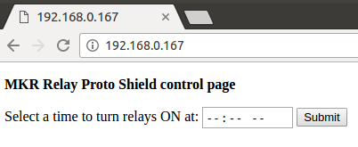
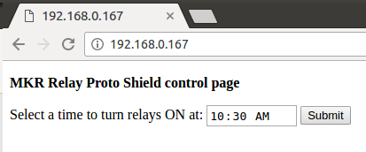
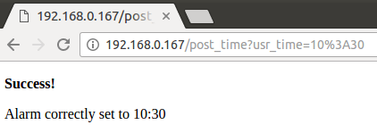

## Components and Supplies

- [Arduino MKR1000](https://store.arduino.cc/arduino-mkr1000)
- [Arduino MKR Relay Proto Shield](https://store.arduino.cc/mkr-relay-proto-shield)

## Apps and Online Services

- [Arduino Cloud Editor](https://create.arduino.cc/editor)
- [Arduino IDE](https://www.arduino.cc/en/main/software)

## About This Project

This project will show you how to drive in a programmed way the relays on a MKR Relay Proto Shield. In particular using web server hosted on the MKR1000 you will be able to set the alarm time using your browser!

### Get Started

To get started you have to:

* Put your MKR1000 board in top of your MKR Relay Proto Shield.
* Upload the code on your board.
* Open the serial monitor and copy the board's IP address.
* Open your browser and paste the IP address. You should see a page similar to this:

* Click on the -- and use the arrows to set the time:

* Click on submit!

When your time will be matched (in this example at 10:30 AM) the two outputs on your MKR Relay Protoshield will be driven HIGH for five minutes!

## Code
<iframe src='https://create.arduino.cc/editor/Arduino_Genuino/dc2cc0d4-82ff-462a-bebc-60bd622f101e/preview?embed&snippet' style='height:510px;width:100%;margin:10px 0' frameborder='0'></iframe>

## How to Use and Improve This Example

You can use this example to make your own gardening system and small automation in general! Use the MKR1000 IoT capabilities to ask for weather forecast and use them to have a smarter ON/OFF policy.