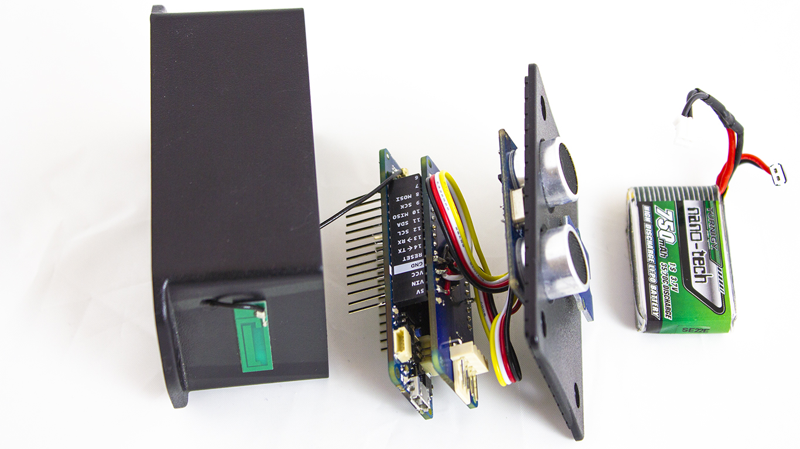
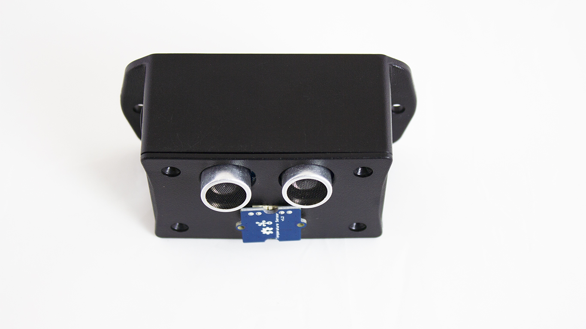
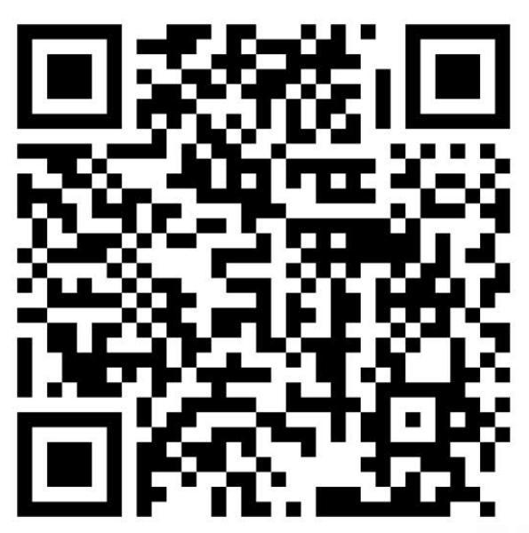
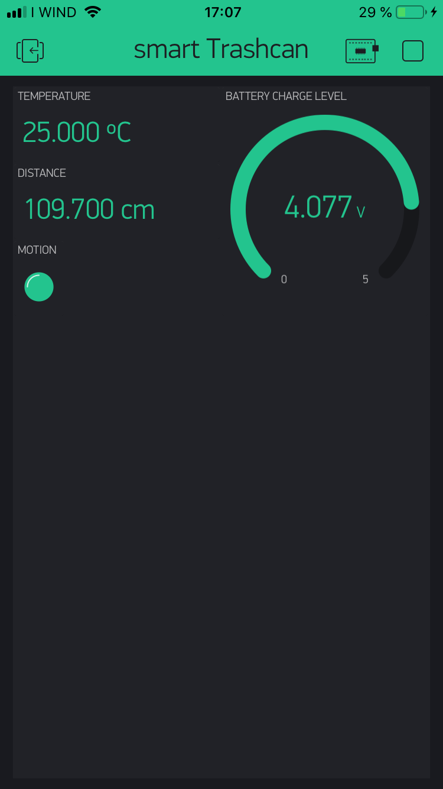

## Components and Supplies

- [Arduino MKR NB 1500](https://store.arduino.cc/arduino-mkr-nb-1500)
- [Ultrasonic Sensor - HC-SR04 (Generic)](https://www.sparkfun.com/products/13959)
- Temperature probe (Generic)

## About This Project

Dumpsters are a good case for remote monitoring. The MKR NB 1500 with its NarrowBand connection to the internet and low power mode is ideal for such an application. We have added an ultrasound distance sensor, a temperature sensor, and an IMU (Inertial Measurement Unit). 

### What You Need

The project involves an Arduino MKR NB 1500, a MKR IMU shield, an antenna, a battery pack, a smartphone with Blynk installed, a data SIM card, an ultrasound sensor, temperature sensors, and a Blynk lib available through Library Manager:

* The main component is the Arduino MKR NB 1500. This board provides the elaboration unit and the NBIot/CAT M1 connectivity.
* The MKR IMU shield features an integrated inertial motion unit module, which allows you to measure the acceleration, the position, and the rotation of the board.
* Antenna and battery pack are connected to the MKR NB 1500, and are respectively used to connect to the data network and feed the device when an alternative power supply are not available.
* The mobile phone is required for Blynk, an application that provides a widget and enables communication between the MKR NB 1500 and the smartphone.
* The NarrowBand SIM card is required for allow the connection to the NB-IoT/CAT M1 network and network operation.
* IMU shield and temperature sensor are required to measure environmental temperature and monitor the state of the trash can.
* PIN to connect to the data network.

The hardware configuration is relativey simple, involving the MKR NB 1500, IMU shield, as well as ultrasound and temperature sensors connected.




The antenna, the SIM, and the battery pack should be connected in their own connector at the top and bottom of the MKR NB 1500. 


Finish the assembly of the unit, putting everything inside the box and affixing it onto the dumpster so that the ultrasound and temperature sensors are looking into the waste space.




### How the Software Works

The software provided for the project involves a simple Blynk application to show the data received from the MKR NB board and an Arduino sketch that will include the MKR NB 1500, Blynk, and sensors libraries required to manage the communication between the board and the sensors as well as the communication with the sensors and the IMU shield.

* Blynk uses an LED as connection alive monitor and two labels display and a gauge widget to show the measurements received from the MKR NB.
* MKR IMU includes all the APIs to query the IMU shield and read the accelerometers and euler position measures.
* The Arduino sketch involves many APIs of the MKR NB and Arduino Cores library.
* Connection APIs used through NB, GPRS and NBClient classes.these are used to connect the board to the NB-IoT/CAT M1 network.
* Blynk APIs required to allow the connection between the board and the smartphone application, and the interaction with the widget used by the project.

The Blynk project is available by scanning the QR code below:



Scan this QR code from Blynk app to load the user interface for this project

### How to Use

Set up the hardware. Load the sketch onto the board. Launch Blynk application on the smartphone and load the interface scanning the QR code above.

On the smartphone, you will generate an authorization code that you must include in your sketch. This code will pair your smartphone and your board.

Personalize the sketch with your access credentials populating the **Secrets** tab on the Cloud Editor, or putting the same information in **arduino_secrets.h** if you downloaded it from the Cloud Editor and you are using the local Arduino Software (IDE).

After the sketch has been loaded onto the board, the connection sequence will start.

If the connection is successful and the link between your MKR NB 1500 and the smartphone is established, the interface on the smartphone will be active; otherwise, you should see a red warning,

To check manually the link, please touch the second icon from the top right of the interface.




The labels show the measurement sent by the board to the smartphone app. The first shows the temperature (in degrees), the second reveals the fill state, and the LED indicates if the dumpster was opened or not, and the gauge widget shows the battery charge level.

### The Sketch

The first code section is used to include the libraries required by the application. **MKRNB** entails all the NB connection functionalities; these are available through the object **NBClient, GPRS** and **NB.** The header **Blynk** imports the APIs through which the sketch is able to interact with the Blynk app. The library **MKRIMU** features the APIs required to query and retrieve the values from the IMU shield. The lines following initialize the variables required by the sensors to make the measurements:

```arduino
#define BLYNK_PRINT Serial
#include <MKRNB.h>
#include <BlynkSimpleMKRNB.h>
#include <MKRIMU.h>
  
const int trigPin = 4;
const int echoPin = 5;
  
// define variables
long duration;
int distance;
int threshold = 10;
const int numberOfMeasures = 10;
float averageDistance, averageTemp;
int measuresSum = 0;
int measuresTem = 0;
float acc = 0.0, pox = 0.0;
```

After the include and variables section, we find all the credential data required by the connection. The Blynk token **auth[]** is required to pair the sketch with your own project on Blynk and **pin** instead is used to unlock the SIM, their values are assigned by the values you put in the matching fields in the Secrets tab.

```arduino
char pin[] = SECRET_PINNUMBER;
char auth[] = SECRET_AUTH_TOKEN;
```

The following three lines initialize the objects that will be used to communicate with the data network:

```arduino
NBClient client;
GPRS gprs;
NB nbAccess;
```

**WidgetLED** initializes the object used to enable or disable the LED widget on the app. The value on bracket is the pin assigned to this object, which in this case is the **Virtual pin 1 (V7)** for the **motion LED**:

```arduino
WidgetLED led1(V7);
```

The setup section allows you to initialize all the objects used by the sketch. The Blynk instance plays a central role because it establishes the connection and initializes all structure to control the app widget on the smartphone. After the connection is established, it initializes IMU structure, through the API **begin().** After they are initialized, the pin required by the readDistance API to acquire the measure from the ultrasound sensor: 

```arduino
void setup() {
 Blynk.begin(auth, nbAccess, gprs, client , pin);
 if (!IMU.begin()) {
Serial.println("Failed to initialize IMU!");
while (1);
 }
 pinMode(trigPin, OUTPUT); // Sets the trigPin as an Output
 pinMode(echoPin, INPUT); // Sets the echoPin as an Input
 led1.off();
}
```

The next function implements the check logic for motion capturing from the IMU shield; the function polls the IMU shield to check if an acceleration and an angle variation occur. If motion is detected the LED widget on Blynk app is set to ON, otherwise it set to OFF:

```arduino
void motionCapture() {
 float x, y, z, zacc;
//available function to check if measure was sent by the IMU
 if (IMU.eulerAnglesAvailable() && IMU.accelerationAvailable()) { //check if the cover was moved
IMU.readEulerAngles(x, y, z);
IMU.readAcceleration(x, y, zacc);
if ((z > (pox + 10.0) || z < (pox - 10.0)) && (zacc > (acc + 0.15) || zacc < (acc - 0.15))) {
pox = z;
acc = zacc;
led1.on();
} else {
led1.off();
}
 } else {
led1.off();
 }
}
```

The function readDistance queries the ultrasound distance sensor to ask for a new distance measure:

```arduino
int readDistance() {
 digitalWrite(trigPin, LOW);
 delayMicroseconds(2);
 // Sets the trigPin on HIGH state for 10 micro seconds
 digitalWrite(trigPin, HIGH);
 delayMicroseconds(10);
 digitalWrite(trigPin, LOW);
 // Reads the echoPin, returns the sound wave travel time in microseconds
 duration = pulseIn(echoPin, HIGH, 50000);
 // Calculating the distance
 distance = duration * 0.034 / 2;
 // Prints the distance on the Serial Monitor
 if (duration == 0) {
distance = 500;
 }
 return distance;
}
```

The following code section enables you to read the temperature sensors connected to the analog PIN A2. After that, the measurement is acquired and converted to a temperature and returned as a float:

```arduino
float readTempSensor() {
const int R0 = 100000;
const int B = 4275;
int a = analogRead(A2);
float R = 1023.0 / a - 1.0;
R = R0 * R;
float temperatures = 1.0 / (log(R / R0) / B + 1 / 298.15) - 273.15; // convert to temperature via datasheet
return temperatures;
}
```

Last function allows you to measure the battery charge level. This uses the internal APIs to retrieve the measurement:

```arduino
float readBattery(){
const float maxADC = 1023;
const float maxVoltage = 4.2;
float battery_volts = (analogRead(ADC_BATTERY) * maxVoltage) / maxADC;
return battery_volts;
}
```

Last code section is the loop function where all the main code section of Blynk, time, and the sensors measure logic are executed. After all the measurements are complete, their values are averaged and displayed on the Blynk app by sending the data with the virtual write:

```arduino
void loop() {
 motionCapture();
 measuresSum = 0;
 measuresTem = 0;
 for (int i = 0; i < numberOfMeasures; i++) {
 measuresSum += readDistance();
 measuresTem += readTempSensor();
delay(100);
 }
 Blynk.virtualWrite(V0, ((float)measuresTem) / ((float) numberOfMeasures));
 Blynk.virtualWrite(V1, ((float)measuresSum) / ((float) numberOfMeasures));
 Blynk.virtualWrite(V2, readBattery());
}
```

## Complete Sketch

<iframe src='https://create.arduino.cc/editor/Arduino_Genuino/d4e4faa8-ea32-4338-a73b-465005c9a86c/preview?embed&snippet' style='height:510px;width:100%;margin:10px 0' frameborder='0'></iframe>
