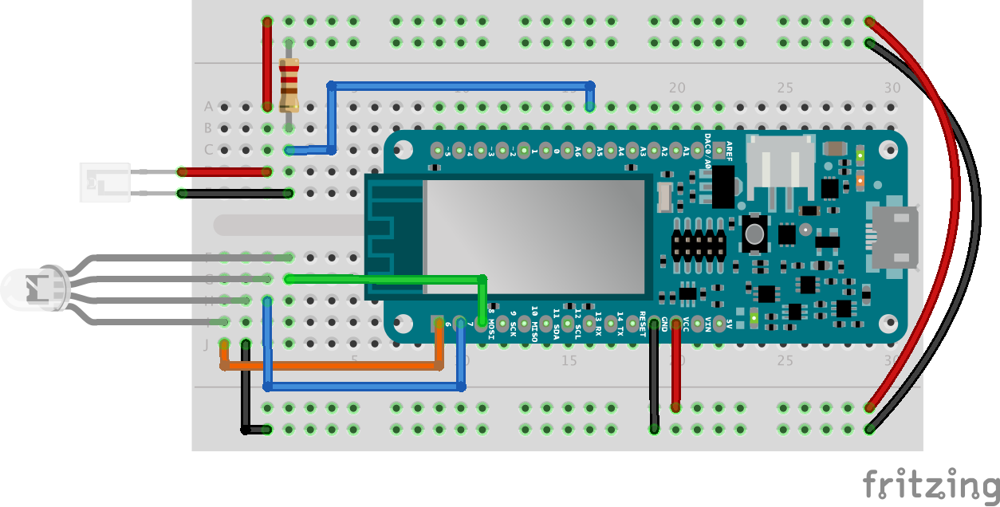

## Components and Supplies

- [Arduino MKR IoT Bundle](https://store.arduino.cc/usa/arduino-iot-mkr1000-bundle)

## About This Project

### If you had an IoT pet, what would it eat? WiFi SSIDs, of course! 

The Nerd is a wireless electronic pet that survives by collecting WiFi SSIDs along with some rest and sunlight.

In order for it to thrive, you must balance offline and online mode with light and darkness to ensure that it has a proper daily eat-sleep-Nerd routine. 

If it is out of WiFi for too long, it will communicate an SOS in Morse code using its built-in piezo speaker. The longer it is offline, the more it will beep. 


### In a Nutshell

The Nerd will wake up each half hour to scan the networks around it. If it detects new networks, it will store them and go back to sleep in low power mode (to save battery life). Otherwise it will complain by making noise with the buzzer until you either feed it or put it in the dark. 

It will also understand when it's at home by connecting to your wifi network. When at home the Nerd will be able to connect to internet and get the current time and date. 

If not fed for more than two days, it will die dramatically, making a lot of noise. 

### Components

* RGB LED
* Phototransistor
* Buzzer
* Battery
* 220 Ohm resistor

### Learning Goals

* Managing full WiFi functionalities
* Storing data in Flash Memory
* Managing time and Real Time Clock
* Managing Low Power mode

### Want to Know More? 

This tutorial is part of a series of experiments that familiarise you with the MKR1000 and IoT. All experiments can be built using the components contained in the MKR IoT Bundle. 

* [I Love You Pillow](https://create.arduino.cc/projecthub/arduino/love-you-pillow-f08931)
* [Puzzle Box](https://create.arduino.cc/projecthub/arduino/puzzlebox-c1f374)
* [Pavlov's Cat](https://create.arduino.cc/projecthub/arduino/pavlov-s-cat-7e6577)
* The Nerd
* [Plant Communicator](https://create.arduino.cc/projecthub/arduino/plant-communicator-7ea06f)

### Set up the Board 

In order to implement all the functionalities we are going to use the following libraries:

* WiFi101 // to connect to internet and scan the networks
* FlashStorage // to save values so that they don't get erased at each reboot
* RTCZero // to manage time triggered events
* ArduinoLowPower // to save battery power
* WiFiUdp // to get the time and date from internet


You can download them from the library manager as explained in [this guide.](https://www.arduino.cc/en/Guide/Libraries)

### Schematics



### The Nerd Casing

You can find the blueprint for the casing **[here!](https://hacksterio.s3.amazonaws.com/uploads/attachments/387847/thenerdcase_qxpRK4ni5M.pdf)**

### Scanning WiFi Networks

The Nerd is hungry for networks!

Scanning network is pretty easy, **just upload this example sketch** or go to *> examples > WiFi101 > ScanNetworksAdvanced*  for a more extended version.

```arduino
#include <SPI.h> 
#include <WiFi101.h> 
void setup() { 
 //Initialize serial and wait for port to open: 
 Serial.begin(9600); 
 while (!Serial) { 
   ; // wait for serial port to connect. Needed for native USB port only 
 } 
 // scan for existing networks: 
 Serial.println(); 
 Serial.println("Scanning available networks..."); 
 listNetworks(); 
} 
void loop() { 
 delay(10000); 
 // scan for existing networks: 
 Serial.println("Scanning available networks..."); 
 listNetworks(); 
} 
void listNetworks() { 
 // scan for nearby networks: 
 Serial.println("** Scan Networks **"); 
 int numSsid = WiFi.scanNetworks(); 
 if (numSsid == -1) 
 { 
   Serial.println("Couldn't get a WiFi connection"); 
   while (true); 
 } 
 // print the list of networks seen: 
 Serial.print("number of available networks: "); 
 Serial.println(numSsid); 
 // print the network number and name for each network found: 
 for (int thisNet = 0; thisNet < numSsid; thisNet++) { 
   Serial.print(thisNet + 1); 
   Serial.print(" SSID: "); 
   Serial.println(WiFi.SSID(thisNet)); 
   Serial.flush(); 
 } 
 Serial.println(); 
} 
```

### Store Values in Flash Memory 

Surely you don't want the Nerd to die each time it goes out of battery!

To avoid this behaviour we will save some variables (as the food amount) in the Flash memory so **that they can be retrieved even after the board has been turned off and turned on again.**

You can understand the basic functionalities by using :
 *example > FlashStorage > FlashStoreAndRetrieve* 

**We will save the names of the networks** so that the Nerd will eat them only once, also we will use the array in which these SSIDs are saved to count the amount of food it ate during the day.

Values saved on the Flash memory will survive a reset of the board but not the upload of a new sketch. **Each time you upload a new sketch the flash memory will be emptied as well.**

**This sketch will scan the networks and save the SSID in the flash memory.**

```arduino
#include <SPI.h> 
#include <WiFi101.h> 
#include <FlashStorage.h> 
#define MAGIC_NUMBER 0x7423  // arbitrary number to double check the saved SSID 
#define MaxNet 30  // max amount of network to be saved  
int PosToBeSaved = 0; // Variable used to navigate the array of networks 
int daily_amount_of_food = 12; // The amount of food per day needed to survive 
// Struct of variable to be saved in flash memory 
typedef struct { 
 int magic; 
 boolean valid[MaxNet]; 
 char SSIDs[MaxNet][100]; 
} Networks; 
FlashStorage(my_flash_store, Networks); 
Networks values; 
void setup() { 
 Serial.begin(115200); 
 while(!Serial); // wait until the Serial montior has be opened 
 delay(2000); 
 values = my_flash_store.read(); // Read values from flash memory 
 if (values.magic == MAGIC_NUMBER) { // If token is correct print saved networks 
   Serial.println("saved data:"); 
   Serial.println(""); 
   for (int a = 0; a < MaxNet; a++) { 
     if (values.valid[a]) { 
       Serial.println(values.SSIDs[a]); 
     } else { 
       PosToBeSaved = a; 
     } 
   } 
 } 
} 
void loop() { 
 // Temporarily save the number of networks 
 int networks_already_saved = PosToBeSaved; 
 getNetwork(); 
 if (PosToBeSaved >= daily_amount_of_food) { 
   Serial.println("Enough food for today"); 
 } 
 delay(5000); 
} 
// Feed the Nerd with networks's SSID 
void getNetwork() { 
 // scan for nearby networks: 
 Serial.println("\n*Scan Networks*\n"); 
 int numSsid = WiFi.scanNetworks(); 
 delay(1000); 
 if (numSsid == -1) 
 { 
   Serial.println("There are no WiFi networks here.."); 
 } else { 
   Serial.print("number of available networks: "); 
   Serial.println(numSsid); 
   // print the network number and name for each network found: 
   for (int thisNet = 0; thisNet < numSsid; thisNet++) { 
     Serial.print("SSID: "); 
     Serial.println(WiFi.SSID(thisNet)); 
     delay(500); 
     char* net = WiFi.SSID(thisNet); 
     bool canBeSaved = true; 
     // check if the network has already been saved 
     for (int a = 0; a < PosToBeSaved ; a++) { 
       if (values.valid[a]) { 
         if (strncmp(net, values.SSIDs[a], 100) == 0 || strnlen(net, 100) == 0) { 
           Serial.println("Not saved"); 
           canBeSaved = false; 
         } 
       } 
     } 
     // Store ssid name 
     if (canBeSaved && PosToBeSaved < MaxNet) { 
       if (strlen(net) + 1 < 100 && strlen(net) > 0) { // check if the SSID name fits 100 bytes 
         memset(values.SSIDs[PosToBeSaved], 0, sizeof(values.SSIDs[PosToBeSaved])); // set all characters to zero 
         memcpy(values.SSIDs[PosToBeSaved], net, strlen(net) + 1); // copy "net" to values.SSDs[thisNet] 
         values.valid[PosToBeSaved] = true; 
         values.magic = MAGIC_NUMBER; 
         my_flash_store.write(values); 
         Serial.println(String(values.SSIDs[PosToBeSaved]) + " saved in position " + String(PosToBeSaved)); 
         PosToBeSaved ++; 
       } 
       else { 
         Serial.println(" network skipped"); 
       } 
     } 
   } 
 } 
} 
```

Note how we defined a maximum amount of networks that can be saved, so to avoid memory space issues:

```arduino
#define MaxNet 30  
int PosToBeSaved = 0; 
```

has been used to navigate the array in which networks names are saved and to measure the amount of food already eaten.

### Managing Time

We can combine the functionalities of the Real Time Clock (RTC) with the WiFi to **get the current time and date** and then set the inner clock of the board. In this way **we can trigger time based events** in a long timeframe without using the `millis()`function which can be tricky when you have to convert milliseconds into days.

We will get the time from a **Network Time Protocol** (NTP) time server and then set the RTC with it. Note that the time received is in *epoch format*, which is the amount of seconds since January 1th 1970.

You can run the basic sketch from *example > WiFi101 > WiFiUdpNtpClient* 

**In the sketch below we are putting things together: the scan networks functionalities and the Time related ones.**

* `bool atHome = false;`is used to trigger the WiFi connection and therefore the request to the server to get the time.
* `check_home() `is used to scan all the available networks and see if one of them is the *home WiFi network.*
* `connect_WiFi()`is then called, it will connect the board to WiFi, trigger the request to the server and print the current time.
* `rtc.setEpoch(epoch + GMT); `is used to start the RTC with the current time in epoch format, modify the GMT variable to adjust the time to your current time zone.

```arduino
#include <SPI.h> 
#include <WiFi101.h> 
#include <FlashStorage.h> 
#include <RTCZero.h> 
#include <WiFiUdp.h> 
WiFiUDP udp; 
WiFiUDP Udp; 
RTCZero rtc; 
#define MAGIC_NUMBER 0x7423  // arbitrary number to double check the saved SSID 
#define MaxNet 30  // max amount of network to be saved  
const char* home_ssid = SECRET_SSID;    //  your network SSID (name) 
const char* password = SECRET_PSWD;  // your network password 
int PosToBeSaved = 0; // Variable used to navigate the array of networks 
int daily_amount_of_food = 12; // The amount of food per day needed to survive 
bool atHome = false; 
// Struct of variable to be saved in flash memory 
typedef struct {   
 int magic; 
 boolean valid[MaxNet]; 
 char SSIDs[MaxNet][100]; 
 int alive_days; 
 int last_time_feeded; 
} Networks; 
FlashStorage(my_flash_store, Networks); 
Networks values; 
void setup() { 
 Serial.begin(115200); 
 delay(2000); 
 rtc.begin(); // enable real time clock functionalities 
 values = my_flash_store.read(); // Read values from flash memory 
 if (values.magic == MAGIC_NUMBER) { // If token is correct print saved networks 
   Serial.println("saved data:"); 
   Serial.println(""); 
   for (int a = 0; a < MaxNet; a++) { 
     if (values.valid[a]) { 
       Serial.println(values.SSIDs[a]); 
     } else { 
       PosToBeSaved = a; 
     } 
   } 
 } 
} 
void loop() { 
   if(!atHome) check_home(); 
   // Temporarily save the number of networks 
   int networks_already_saved = PosToBeSaved;    
   getNetwork(); 
if (PosToBeSaved >= daily_amount_of_food) {  
  Serial.println("Enough food for today");  
}  
} 
void check_home() { 
 int numSsid = WiFi.scanNetworks(); 
 if (numSsid != -1) { 
   for (int thisNet = 0; thisNet < numSsid; thisNet++) { 
     delay(100); 
     if (strncmp(WiFi.SSID(thisNet), home_ssid, 100) == 0) { 
       Serial.println("Yay, I'm home \n"); 
       atHome = true; 
       connect_WiFi(); 
     } 
   } 
 } 
} 
void connect_WiFi() { 
 if (WiFi.status() != WL_CONNECTED) { 
   while (WiFi.begin(home_ssid, password) != WL_CONNECTED) { 
     delay(500); 
   } 
   Serial.println("WiFi connected \n"); 
   GetCurrentTime(); 
   printTime(); 
 } 
} 
// Feed the Nerd with networks's SSID 
void getNetwork() { 
 // scan for nearby networks: 
 Serial.println("*Scan Networks*"); 
 int numSsid = WiFi.scanNetworks(); 
 delay(1000); 
 if (numSsid == -1) 
 { 
   Serial.println("There are no WiFi networks here.."); 
 } else { 
   Serial.print("number of available networks: "); 
   Serial.println(numSsid); 
   // print the network number and name for each network found: 
   for (int thisNet = 0; thisNet < numSsid; thisNet++) { 
     Serial.print("SSID: "); 
     Serial.println(WiFi.SSID(thisNet)); 
     delay(500); 
     char* net = WiFi.SSID(thisNet); 
     bool canBeSaved = true; 
     // check if the network has already been saved 
     for (int a = 0; a < PosToBeSaved ; a++) {  
       if (values.valid[a]) { 
         if (strncmp(net, values.SSIDs[a], 100) == 0 || strnlen(net, 100) == 0) {  
           Serial.println("Not saved"); 
           canBeSaved = false; 
         } 
       } 
     } 
     // Store ssid name 
     if (canBeSaved && PosToBeSaved < MaxNet) {  
       if (strlen(net) + 1 < 100 && strlen(net) > 0) { // check if the SSID name fits 100 bytes 
         memset(values.SSIDs[PosToBeSaved], 0, sizeof(values.SSIDs[PosToBeSaved])); // set all characters to zero 
         memcpy(values.SSIDs[PosToBeSaved], net, strlen(net) + 1); // copy "net" to values.SSDs[thisNet] 
         values.valid[PosToBeSaved] = true; 
         values.last_time_feeded = rtc.getEpoch(); 
         values.magic = MAGIC_NUMBER; 
         my_flash_store.write(values); 
         Serial.println(String(values.SSIDs[PosToBeSaved]) + " saved in position " + String(PosToBeSaved)); 
         PosToBeSaved ++; 
       } 
       else { 
         Serial.println(" network skipped"); 
       } 
     } 
   } 
 } 
} 
/************************************************* 
 Start an UDP connection to get the time in unix, 
 then set the real time clock (rtc) 
************************************************/ 
unsigned int localPort = 2390;      // local port to listen for UDP packets 
IPAddress timeServer(129, 6, 15, 28); // time.nist.gov NTP server 
const int NTP_PACKET_SIZE = 48; // NTP time stamp is in the first 48 bytes of the message 
byte packetBuffer[ NTP_PACKET_SIZE]; //buffer to hold incoming and outgoing packets 
const int GMT = 1 * 60 * 60; //change this to adapt it to your time zone   hours*minutes*seconds 
unsigned long epoch; 
void GetCurrentTime() { 
 int numberOfTries = 0, maxTries = 6; 
 do { 
   epoch = readLinuxEpochUsingNTP(); 
   numberOfTries++; 
 } 
 while ((epoch == 0) || (numberOfTries > maxTries)); 
 if (numberOfTries > maxTries) { 
   Serial.print("NTP unreachable!!"); 
   while (1); 
 } 
 else { 
   Serial.print("Epoch received: "); 
   Serial.println(epoch); 
   rtc.setEpoch(epoch + GMT); 
   Serial.println(); 
 } 
} 
unsigned long readLinuxEpochUsingNTP() 
{ 
 Udp.begin(localPort); 
 sendNTPpacket(timeServer); // send an NTP packet to a time server 
 // wait to see if a reply is available 
 delay(1000); 
 if ( Udp.parsePacket() ) { 
   Serial.println("NTP time received"); 
   // We've received a packet, read the data from it 
   Udp.read(packetBuffer, NTP_PACKET_SIZE); // read the packet into the buffer 
   //the timestamp starts at byte 40 of the received packet and is four bytes, 
   // or two words, long. First, esxtract the two words: 
   unsigned long highWord = word(packetBuffer[40], packetBuffer[41]); 
   unsigned long lowWord = word(packetBuffer[42], packetBuffer[43]); 
   // combine the four bytes (two words) into a long integer 
   // this is NTP time (seconds since Jan 1 1900): 
   unsigned long secsSince1900 = highWord << 16 | lowWord; 
   // now convert NTP time into everyday time: 
   // Unix time starts on Jan 1 1970. In seconds, that's 2208988800: 
   const unsigned long seventyYears = 2208988800UL; 
   // subtract seventy years: 
   Udp.stop(); 
   return (secsSince1900 - seventyYears); 
 } 
 else { 
   Udp.stop(); 
   return 0; 
 } 
} 
// send an NTP request to the time server at the given address 
unsigned long sendNTPpacket(IPAddress & address) 
{ 
 // set all bytes in the buffer to 0 
 memset(packetBuffer, 0, NTP_PACKET_SIZE); 
 // Initialize values needed to form NTP request 
 // (see URL above for details on the packets) 
 packetBuffer[0] = 0b11100011;   // LI, Version, Mode 
 packetBuffer[1] = 0;     // Stratum, or type of clock 
 packetBuffer[2] = 6;     // Polling Interval 
 packetBuffer[3] = 0xEC;  // Peer Clock Precision 
 // 8 bytes of zero for Root Delay & Root Dispersion 
 packetBuffer[12]  = 49; 
 packetBuffer[13]  = 0x4E; 
 packetBuffer[14]  = 49; 
 packetBuffer[15]  = 52; 
 // all NTP fields have been given values, now 
 // you can send a packet requesting a timestamp: 
 Udp.beginPacket(address, 123); //NTP requests are to port 123 
 Udp.write(packetBuffer, NTP_PACKET_SIZE); 
 Udp.endPacket(); 
} 
void printTime() { 
 // Print date... 
 Serial.print(rtc.getDay()); 
 Serial.print(" / "); 
 Serial.print(rtc.getMonth()); 
 Serial.print(" / "); 
 Serial.print(rtc.getYear()); 
 Serial.print("\t"); 
 // ...and time 
 print2digits(rtc.getHours()); 
 Serial.print(": "); 
 print2digits(rtc.getMinutes()); 
 Serial.print(": "); 
 print2digits(rtc.getSeconds()); 
 Serial.println(""); 
} 
void print2digits(int number) { 
 if (number < 10) { 
   Serial.print("0"); 
 } 
 Serial.print(number);
```

**Implementing the current time allow us to use a simple function like this to manage the life and death of the Nerd:**

```arduino
 if(rtc.getEpoch() - values.last_time_fed >= 86400*2){ 
 // complain and eventually die :(
 } 
```

Where `86400`is the number of seconds in one day, `values.last_time_fed`is the stored value of the time in *epoch format* in which the Nerd has last been fed and `rtc.getEpoch()`return the current time in *epoch format*.

### Low Power Mode

We can use the low power mode to make our board go *to sleep.* Meaning that it will disable most of its functionalities (including WiFi) to save battery power.

Since we want the Nerd to wake up regularly, **we can easily set a timer:**

```arduino
#include "ArduinoLowPower.h" 
int sleeping_time = 5000; // 5 seconds 
bool awake = true; 
void setup() { 
 Serial.begin(9600); 
 LowPower.attachInterruptWakeup(RTC_ALARM_WAKEUP, WakeUp, CHANGE); 
 pinMode(LED_BUILTIN, OUTPUT); 
} 
void loop() { 
 if (awake) { 
   digitalWrite(LED_BUILTIN, HIGH); 
   delay(500); 
   digitalWrite(LED_BUILTIN, LOW); 
   delay(500); 
 } 
 awake = false; 
 Serial.println("going to sleep"); 
 LowPower.sleep(sleeping_time); 
} 
void WakeUp() { 
 Serial.println("awake"); 
 awake = true; 
} 
```

Note that the `WakeUp()`function is attached to an interrupt, meaning that **it cannot contain any code that includes delays.** But we can set s boolean variable so to trigger events in the loop.

## Complete Sketch

<iframe src='https://create.arduino.cc/editor/Arduino_Genuino/3d3e9029-e5d6-4c62-a217-fc398ac1ffd8/preview?embed&snippet' style='height:510px;width:100%;margin:10px 0' frameborder='0'></iframe>
