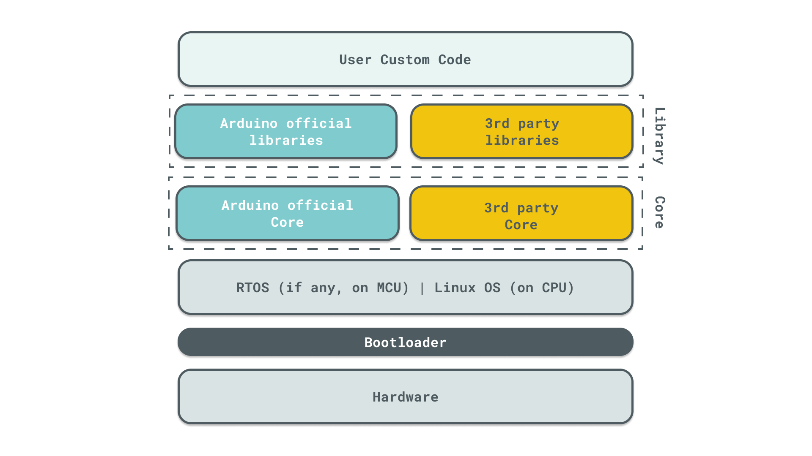

At Arduino, we place paramount importance on security when it comes to building the hardware and firmware for our physical products. Our comprehensive platform encompasses everything from hardware and firmware to development tools and cloud services. This article delves into the different facets of security concerns and outlines our approach to addressing them at each layer of our ecosystem.

## Security of hardware boards with microcontrollers

Several Arduino boards are based on a microcontroller (or MCU) architecture, and when connectivity options are provided by the board, there is usually a secondary chip taking care of connectivity aspects (e.g. Bluetooth® or Wi-Fi®).

In general, based on the different types of board, the following features might be provided:

* TLS encryption, which can be used to provide confidentiality of the information transmitted over the network
* storage of security keys and credentials using a dedicated Secure Element. This feature is available on various boards for Maker and Education purposes, and on all boards for Professional usage (e.g. Portenta series). Detailed information about the presence and type of Secure Element are provided within technical specifications of each board. The secure element is always abstracted by the libraries so it can be used seamlessly for trusted boot, for mutual authentication or for secure storage, depending on the customer’s needs.

The specific TLS implementation depends on the type of connectivity chip and in particular: 

* Boards equipped with a u-blox® NINA and Secure Element use the following strategy:
  * TLS mutual authentication is handled via hardware using the connectivity chip
  * keys are stored in the Secure Element
  * TLS encryption is handled by firmware running on the u-blox NINA chip
* Boards with Secure Element that do not use u-blox NINA connectivity use the following strategy:
  * TLS mutual authentication is handled via hardware using the Secure Element
keys are stored in the Secure Element
TLS encryption via software implementation running on primary MCU
* Boards without embedded connectivity chip or without Secure Element 
  * perform TLS encryption on the primary MCU 
  * Authentication is performed using user/secret credentials that can be either provided in the user application firmware as hardcoded, or stored on local storage (such as flash memory)

Depending on the type of application and the security level required, the user is advised to verify the above features when adopting a specific platform or board.

## Security of hardware boards with microprocessor

Some Arduino boards also come with a full microprocessor (or CPU) providing a much larger attack surface as they are capable of running a full fledged Linux® operating system. 
Arduino has a joint offer with Foundries.io to provide a secure software stack that can run on these new types of boards. This offer ensure that all supported boards are provided with:

* Remote patching, based on The Update Framework for over-the-air (OTA) updates;
* Remote update of container applications within OTA updates;
* Mutual TLS connectivity between boards and the Cloud;
* Dual OS: Non-Secure-By-Definition Linux OS runs alongside OP-TEE OS that handles sensitive data in a TEE (Trusted Execution Environment) for handling Secure Element operations;
* Signed firmware binaries: kernel modules and device tree blob signatures are verified during boot
* Rootfs is handled with OSTREE, this way is possible for the system to detect immediately unwanted rootfs modifications due to hw failures or as a result of an intrusion;
* Secure Boot Firmware

For more information about security features provided by Foundries.io please visit https://docs.foundries.io/latest/reference-manual/security/security.html#overview.

For more information about the software stack provided by Foundries.io please visit https://foundries.io/products/software-stack/.

## Security of the firmware layer

Arduino follows the **Secure by Design** principle in every stage of the software development and the **Security Principles** listed below are followed during the secure development lifecycle:

* **Defense in Depth**: Layered security mechanisms are in place to increase security as a whole; in particular, in some of the professional products, MCUboot toolkit and signed/encrypted update packages are available to the user in order to increase security by providing secure boot
* **Positive Security Model**: A ‘positive’ security model defines what is allowed and rejects everything else.
* **Least Privileges**: The principle of least privilege is required to perform every business process.
* **Avoid Security through Obscurity**: Security through obscurity alone is a weak security mechanism, however when combined with all principles it can be used as an additional layer of security.
* **Keep Security Simple**: Keeping the application’s security simple is a better option than having complex designs.
* **Assuming compromise**: The assuming compromise principle is useful to improve the detection and response capabilities in order to predict and remediate the security events before they evolve into security incidents.
* **Keep people away from data**: Usage of mechanisms, patterns and tools to reduce or eliminate the need for direct data access or manual processing data with the aim of reducing the risk of mishandling or modification and human error when handling sensitive data.

As part of the security activities, Arduino periodically performs **Secure Code Review (SCR)** and **Secure Component Analysis (SCA)** on any Core and library explicitly marked as being officially developed by Arduino.

## Shared responsibility model

To ensure the highest level of confidentiality, integrity and availability, Arduino operates under a shared security responsibility model. The shared security responsibility model identifies the distinct security responsibilities of the customer and Arduino. In this model:

* **Arduino** is responsible for the security of the libraries and code distributed with the hardware boards. Secure Code Review and third parties security audit might be conducted to further ensure that Arduino cores and libraries are free from security risks. Furthermore, Arduino is responsible for selecting state-of-the-art hardware to ensure the highest possible level of protection against tampering of security related components mounted on the boards.
* **Customers** are responsible to ensure the security of the final product they build with Arduino’s boards. Arduino recommends to pay particular attention to the following best practices:
  * **Secure Code Review**: custom source code developed by the customer and running as device firmware should be reviewed from a security standpoint before running  in production on boards to limit the possibility of security risks.
  * **Secure Component Analysis**: custom source code might contain external dependencies to third party libraries that might introduce vulnerabilities. The customer is responsible for making sure that any external third party library is safe to be used.
  * **Penetration Testing**: customers are responsible for testing the overall security of the final product developed using Arduino hardware and software.
  * **Network security**: ensure adequate segregation of boards to reduce network attack surface from remote attackers. 
  * **Physical protection**: boards should be placed in areas to ensure that unauthorized people cannot tamper with the hardware.

